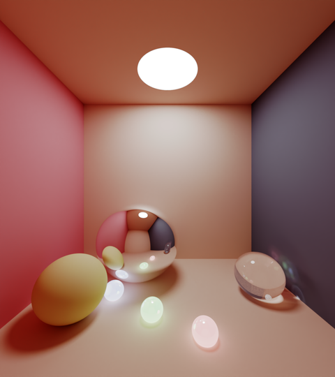

# Graphcore

---
## Monte Carlo Ray Tracing



A proof of concept Monte Carlo ray tracing application.

This uses the third party repository [light](https://github.com/mpups/light) which in turn is based on [Smallpaint](https://users.cg.tuwien.ac.at/zsolnai/gfx/smallpaint/) by Károly Zsolnai-Fehér, both of which are released under the MIT license.

### File structure

* `src/` C++ files for the Poplar application.
* `src/codelets/` IPU path tracing compute kernels.
* `src/exr/` C++ code for EXR post processing tools.
* `light/` Submodule that fetches the custom version of Smallpaint.
* `scripts/` Utility scripts.
* `CMakeLists.txt` CMake build description.
* `README.md` This file.

### How to use this demo

1. Prepare the environment.

Install the Poplar SDK following the instructions in the Getting Started guide for your IPU system. Make sure to source the `enable.sh` script for poplar.

2. Install the apt dependencies for Ubuntu 18.04 (requires admin privileges):

```bash
sudo apt install $(< required_apt_packages.txt)
```

3. Build and run the application:

```bash
git submodule update --init --recursive
mkdir build
cd build
cmake ../ -G Ninja
ninja
./ipu_trace --outfile image.png -w 960 -h 1080 --tile-width 40 --tile-height 18 --samples 1000 --samples-per-step 100 --ipus 1
```

This will render an image to a final sample count of 1000 paths per pixel (preview images are output at 100 samples per pixel intervals). For a full description of options: `./ipu_trace --help`

The output image format is determined by the extension given to the `--outfile` option (support for different formats comes directly from [OpenCV](https://opencv.org/)). In addition to the chosen output format light always saves the raw high dynamic range (HDR) output in an EXR file (e.g. image.png.exr). You can use [pfs tools](http://pfstools.sourceforge.net) to manipulate and view the EXR file (e.g. to apply tone mapping: `pfsin image.png.exr | pfstmo_reinhard05 | pfsout tone_mapped.png`).

## Running the tests

In a Python3 environment:
```
pip install -r tests/requirements.txt
pytest ./tests
```

NOTE: The test relies on Ubuntu's apt installed `convert` program and will not work with other versions such as the one bundled with oneAPI (see below).

## Distributed rendering

The script 'scripts/distributed_render.sh' shows how to utilise many IPUs to render a high quality image. This script requires the following external dependency for the final de-noising step:
* [Intel Open Image Denoiser](https://www.openimagedenoise.org/).

### Minimal instructions for a local install of Intel's renderkit (Open Image Denoiser)

Licensing details for oneAPI can be found here: [oneAPI licensing](https://software.intel.com/content/www/us/en/develop/articles/free-intel-software-developer-tools.html).
Download installer script from: https://software.intel.com/content/www/us/en/develop/tools/oneapi/rendering-toolkit/download.html

* Select Linux, Web & Local, Installer type online
* Download 17MB, 733MB required install.
* Continue as guest:
```bash
chmod +x l_RenderKit_p_2021.2.0.739.sh
sh ./l_RenderKit_p_2021.2.0.739.sh -s -a --silent --eula accept --install-dir ~/workspace/intel
```

Then activate it:
```bash
source ~/workspace/intel/setvars.sh
```

Comprehensive installation instructions can be found here: [oneAPI installation guide](https://software.intel.com/content/www/us/en/develop/documentation/installation-guide-for-intel-oneapi-toolkits-linux/top.html)

### Running the distributed render script

Because the simple scenes used here fit in the in-processor memory of a single IPU device distribution is trivial. The script performs the following steps:
* Compile a path tracer that uses two IPUs using the `--compile-only` option.
* Launch the pre-compiled graph over 8 x 2 IPU devices (16 IPUs total).
* Average the results on the host (jobs are launched with different seeds so the images they produce are independent samples).
* Tone map and de-noise the combined image on the host using third party tools.

Once you have installed all dependencies then you can run the script as follows:
```bash
source <path-to-renderkit>/intel/setvars.sh
bash scripts/distributed_render.sh final.png
```
