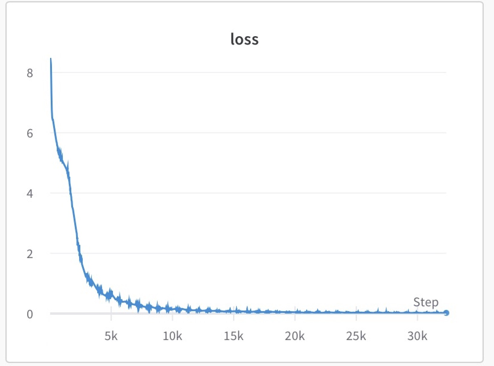
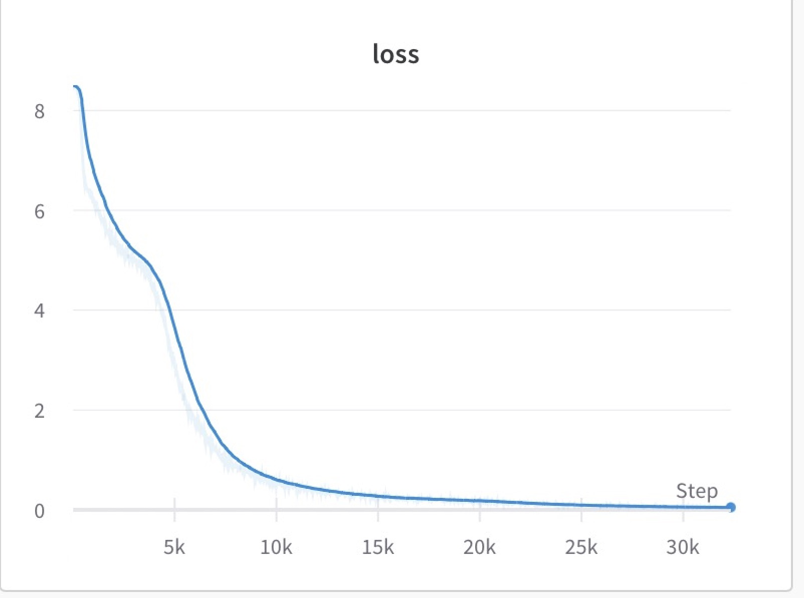

# Pytorch [Conformer](https://arxiv.org/abs/2005.08100) on IPU

## Environment setup

First, install the Poplar SDK following the instructions in the Getting Started guide for your IPU system. Make sure to source the `enable.sh` scripts for Poplar and PopART.

Then, create a virtual environment, install the required packages.

```console
virtualenv venv -p python3.6
source venv/bin/activate
pip install -r requirements.txt
```

## Project files structure

| file/folder      | description                                                                                                                                                                 |
| ---------------- | --------------------------------------------------------------------------------------------------------------------------------------------------------------------------- |
| configs/         | Folder for model configs                                                                                                                                                    |
| src/             | Source code folder                                                                                                                                                          |
| src/iterator/    | Data iterator related, Perform data set loading, encapsulation and preprocessing                                                                                            |
| src/utils/       | Utils folder contains some callable modules independent of the torch framework, including initializer and lr_scheduler、mask、pipeline_wrapper and other functional modules  |
| src/conformer.py | Main frame function of model structure setting                                                                                                                              |
| src/trainer.py   | IPU config, dataset building, and other configurations building; training and validate main workflow                                                                        |
| requirements.txt |                                                                                                                                                                             |
| prepare_data.sh  | Script for prepare the Script for prepare the data                                                                                                                          |

## Data preparation

This Open Source Mandarin Speech Corpus, AISHELL-ASR0009-OS1, is 178 hours long. It is a part of AISHELL-ASR0009, of which utterance contains 11 domains, including smart home, autonomous driving, and industrial production. The whole recording was put in quiet indoor environment, using 3 different devices at the same time: high fidelity microphone (44.1kHz, 16-bit,); Android-system mobile phone (16kHz, 16-bit), iOS-system mobile phone (16kHz, 16-bit). Audios in high fidelity were re-sampled to 16kHz to build AISHELL- ASR0009-OS1. 400 speakers from different accent areas in China were invited to participate in the recording. The manual transcription accuracy rate is above 95%, through professional speech annotation and strict quality inspection. The corpus is divided into training, validation and testing sets.
    
We use ESPnet script for data preparation, you can run the script directly, this will clone espnet and run data processing stages of egs2/aishell/

```
shell
    source prepare_data.sh
```
Please manually execute the above command first. The specific execution process is described below: First install espnet dependency package, then clone the espnet's git. Enter the ‘espnet/tools/’ directory folder, then run setup_anaconda.sh to setup and activate the virtual environment of espnet's anaconda. Enter the ‘aishell’ directory folder, then execut run.sh to generate the aishell's feature、 target and other intermediate result file data; when the file is generated, that is, step 10 in the script, exit the running script at this time.

After executing this command, the program will generate an 'espnet' folder in the current directory. This folder is a feature and label text file generated by the 'espnet' data preprocessing tool. The generation time of this folder is about 50 minutes (depending on your network speed and the performance of the machine). This folder is 103G in total. Please install it in a directory with enough storage space.

### Espnet files structure

| file/folder                                                                                 | description                                                                                                                                                          |
| ------------------------------------------------------------------------------------------- | -------------------------------------------------------------------------------------------------------------------------------------------------------------------- |
| espnet/egs2/aishell/asr1/                                                                   | data root, generated features and labels after preprocessing the aishell dataset                                                                                     |
| espnet/egs2/aishell/asr1/exp/asr_stats_raw_zh_char_sp/train/collect_feats/feats.scp         | form file, records the correspondence between the ID or name of the feature and the real path where the feature is located, generally each line represents a feature |
| espnet/egs2/aishell/asr1/exp/asr_stats_raw_zh_char_sp/train/collect_feats/feats_lengths.scp | form file， records the ID or name of the feature and the duration of its audio                                                                                     |
| espnet/egs2/aishell/asr1/dump/raw/train_sp/text                                             | Text file，records the strings label corresponding to all audio                                                                                                     |
| espnet/egs2/aishell/asr1/data/zh_token_list/char/tokens.txt                                 | Text file, records all vocabulary tokens information, and one line represents one character                                                                          |
| exp/asr_stats_raw_zh_char_sp/logdir/stats.1/train/collect_feats/data_feats/                 | main directory of the extracted features, which stores the main feature files                                                                                        |


### Prepare own data
Please make sure your dataset format is same as the aishell's format, then you should replace the data which is in 'espnet/egs2/aishell/asr1/download'.

At present, we only support the format of this type of dataset. In the future, we will expand the format of compatible dataset

# Example of training the model

If you want to execute the task of fp16 with 2 IPUs(pod2_fp16), you can refer to the following command, and the shell script is in scripts/run_fp16.sh:

```
python main.py train --trainer.log_every_n_step 10
```

If you want to execute the task of fp32 with 2 IPUs(pod2_fp32), you can refer to the following command, and the shell script is in scripts/run_fp32.sh:

```
python main.py train --trainer.log_every_n_step 10 --scheduler.warmup_steps 20000 --train_dataset.dtype 'FLOAT32' --val_dataset.dtype 'FLOAT32' --trainer.dtype 'FLOAT32'  --train_iterator.batch_size 4 --ipu_options.gradient_accumulation 12
```

If you want to execute the 'generate_data' mode of fp16 with 2 IPUs, you can refer to the following command, and the shell script is in scripts/run_generate_data.sh:

```
python main.py train --trainer.log_every_n_step 10 --train_dataset.use_generated_data true
```


## Example of training the model
If you have finished training and want to execute the task of validate, please configure the saved checkpoints after training as shown below. You can refer to the following commands:

```
python main.py train --checkpoints.save_checkpoint_path "./checkpoint" --trainer.log_every_n_step 10
```

Then the trained loss curve is shown in the table:

|      | 0     | 10     | 20    | 30    | 40    | 50    |
| ---- | ----- | ------ | ----- | ----- | ----- | ----- |
| fp16 | 8.431 | 0.3582 | 0.094 | 0.031 | 0.027 | 0.021 |
| fp32 | 8.512 | 2.214  | 0.361 | 0.189 | 0.087 | 0.047 |

The loss of float16 is shown in the figure below


The loss of float32 is shown in the figure below


# Example of validating the model

It can be validated by the following command, where the address of the model to be validated can be specified by "--checkpoints.save_checkpoint_path"
```
python main.py validate --ipu_options.gradient_accumulation 1 --checkpoints.save_checkpoint_path "./checkpoint" 

```

## Dataset caching

When you run the program for the first time, it will generate 'train_cached_data.json' and'val_cached_data.json'file in the current directory. These two files are the cache data generated when reading training data and verification data. When you execute the training code next time, if the parameters('train_dataset:feature_max_length'、'val_dataset:feature_max_length、'encoder:max_len') remain unchanged, the program will automatically read these cache files to save training time.

Note that when you modify the 'train_dataset:feature_max_length'、'val_dataset:feature_max_length、'encoder:max_len' paraments which are in 'configs/train.yaml', remember to check whether there are 'train_cached_data.json' and 'val_cached_data.json' files in the current directory. If so, delete both files, otherwise it will break down.

## Licensing

The code presented here is licensed under the Apache License Version 2.0, see the LICENSE file in this directory.

This application leverages the Kaldi-ASR framework and ESPNet.

Kaldi-ASR is licensed under Apache 2.0: https://github.com/kaldi-asr/kaldi/blob/master/COPYING

ESPNet is also licensed under Apache 2.0: https://github.com/espnet/espnet/blob/v.0.10.0/LICENSE
