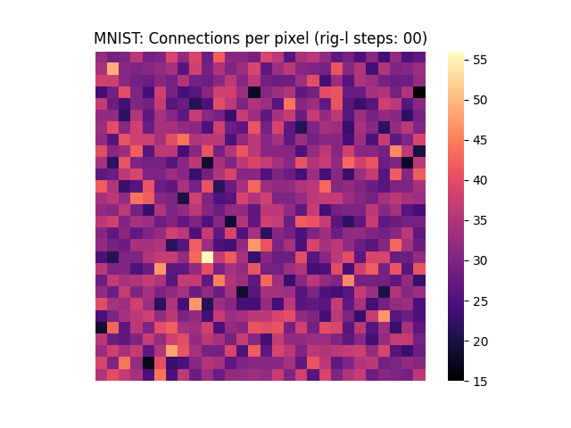

# Graphcore: Train a Sparse MNIST FC Network using Rig-L



---
## Train Sparse MNIST with two sparse FC layers

This example trains a two layer MNIST model using the Rig-L optimiser from `Rigging the Lottery: Making All Tickets Winners` ([arxiv](https://arxiv.org/abs/1911.11134)). It uses custom TensorFlow ops to access the IPU's dynamic sparsity support via the popsparse library.

1) Setup the environment as per the top level dynamic sparsity instructions: `applications/tensorflow/dynamic_sparsity/README.md`

2) Build the ipu_sparse_ops module:
```bash
make -j
PYTHONPATH=./ python ipu_sparse_ops/tools/sparse_matmul.py
```

3) Train MNIST with FC layers that are 10% and 30% dense (90% and 70% sparse):
```bash
PYTHONPATH=./ python mnist_rigl/sparse_mnist.py --densities 0.1 0.3 --records-path rigl_records
```
By default the sparsity type is unstructured (element-wise). The library also suppors block level sparsity
which gives better compute performance. To run the same experiment with block-level sparsity try:
```
PYTHONPATH=./ python mnist_rigl/sparse_mnist.py --densities 0.1 0.3 --records-path rigl_records --block-size=16 --pooling-type SUM
```
The pooling type is an extra parameter that tells Rig-L how to take a summary metric of the gradients in a block when deciding how to
grow new connections. The block pooling of gradient informatipn can be done on the IPU so also reduces the amount of dense gradient
data that needs to be returned to the host.

4) Visualise how the connectivity of the network evolved during training:
```bash
python mnist_rigl/visualise_connectivity.py --records-path rigl_records --animate
sudo apt install imagemagick
convert -delay 20 rigl_records/connectivity_*.png mnist_connections.gif
```

## Train a sparse transformer encoder layer on MNIST
Each MNIST image is of shape 28x28 which can be re-interpreted as a sequence of 28 tokens with an embedding dimension of 28 i.e. each row of pixels is a single token. The interaction between tokens in the transformer attention layer is then effectively between different rows of the image.  
The example uses Rig-L to prune-and-regrow the sparsity pattern during training.
```bash 
python sparse_transformer_rigl_mnist.py
```
To run the same experiment with block-level sparsity use:
```
python sparse_transformer_rigl_mnist.py --block-size=8 --sparsity=0.5 --pooling-type SUM
```