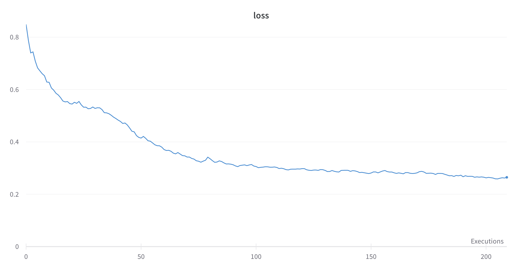
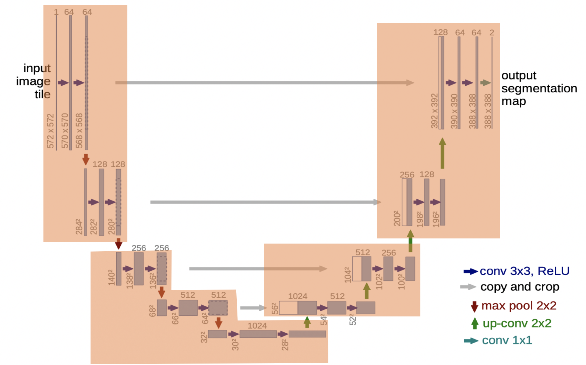

# U-Net on IPU

This example shows an implementation of U-Net in TensorFlow 2 Keras for the IPU.
More details about how to use Keras on IPU can be found in this [tutorial](https://github.com/graphcore/tutorials/tree/sdk-release-2.2/tutorials/tensorflow2/keras). The model is based on the paper ['U-Net: Convolutional Networks for Biomedical Image Segmentation'](https://arxiv.org/abs/1505.04597) by Ronneberger, Fischer and Brox (2015).

## Folder structure
- `main.py` The entry script.
- `unet.py` U-Net training, validation and inference of U-Net on CPU and IPU in Keras.
- `model.py` The U-Net model.
- `model_utils.py` Functions to construct and pipeline the model.
- `losses.py` Defines losses used in training.
- `utils.py` IPU configurations, performance callback and logging.
- `parse_args.py` Arguments parsing.
- `dataset.py` Generates the dataset from real images or random data.
- `CentralCrop_ipu.py` Demonstrates a custom operation for central crop without inplacing.
- `crop.cpp`, `crop.hpp` and `custom_crop_op.cpp` The C++ implementation of the custom crop in Poplar.
- `README.md` This file.


## Quickstart
### 1. Install the Poplar SDK
Download and install the Poplar SDK following the [Getting Started guide for your IPU system](https://docs.graphcore.ai/projects/ipu-pod-getting-started/en/latest/index.html). Source the enable.sh script to install Poplar.

### 2. Create a Python3 virtual environment containing the model requirements
Create a virtual environment and install the appropriate Graphcore TensorFlow wheel from inside the SDK directory:
```shell
virtualenv --python python3.6 unet_venv
source unet_venv/bin/activate
pip3 install -r requirements.txt
pip3 install <path to the tensorflow-2 wheel from the Poplar SDK>
```

### 3. Get the training data
We are using the training data from [ISBI Challenge 2012](http://brainiac2.mit.edu/isbi_challenge/home). The training data is a set of 30 sections from a serial section Transmission Electron Microscopy (ssTEM) data set of the Drosophila first instar larva ventral nerve cord (VNC).

The data preprocessing includes normalization and data augmentation similar to [this one](https://github.com/NVIDIA/DeepLearningExamples/blob/master/TensorFlow2/Segmentation/UNet_Medical/data_loading/data_loader.py).

## Train the model
Sample command to train the model on 4 IPUs:
```bash
python main.py --nb-ipus-per-replica 4 --micro-batch-size 1 --gradient-accumulation-count 24 --num-epochs 2100 --train --augment --learning-rate 0.0024
```

The training curve is shown below. The micro batch size is 1, gradient accumulation is set to 24, giving an effective batch size of 24 images, running for 2100 steps. The SGD optimiser is used here with momentum of 0.99 and a exponential decay learning rate schedule. The input dataset is augmented and repeated infinitely. We used
large steps per execution to train multiple epochs in one execution, which improved the performance on IPU.



The 5-fold cross validation accuracy reached 0.8917 on average with this command:
```bash
python main.py --nb-ipus-per-replica 4 --micro-batch-size 1 --gradient-accumulation-count 24 --num-epochs 2100 --train --augment --learning-rate 0.0024 --eval --kfold 5 --eval-freq 10
```

### Losses
We used the [BCE-Dice loss](https://www.kaggle.com/bigironsphere/loss-function-library-keras-pytorch) that combines the dice loss and binary crossentropy loss.

### Accuracy
The accuracy is measured by the [Dice score](https://en.wikipedia.org/wiki/S%C3%B8rensen%E2%80%93Dice_coefficient).

## Porting U-Net to the IPU
First, for any TensorFlow 2 Keras model, we need to add the following elements to execute the graph on the IPU. More details can be found in [this tutorial](https://github.com/graphcore/tutorials/tree/sdk-release-2.2/tutorials/tensorflow2/keras).

* Import the IPU TensorFlow 2 libraries that come with the Poplar SDK.
* Prepare the dataset for infererence, training and validation.
* Configure your IPU system. This sets up a single or multi-IPU device for execution.
* Create an IPU strategy. This works as a context manager: creating variables and Keras models within the scope of the `IPUStrategy` will ensure that they are placed on the IPU.
* Run the Keras model within the IPU strategy scope.

## Inference benchmarking
The inference model can fit on 1 IPU. The following command runs an inference benchmark with host generated random data on 1 IPU:
```bash
python main.py --nb-ipus-per-replica 1 --micro-batch-size 2 --steps-per-execution 400 --infer --host-generated-data --benchmark
```
By using [data-parallelism](https://docs.graphcore.ai/projects/tf-model-parallelism/en/latest/pipelining.html?highlight=replication#data-parallelism), we can improve throughput by replicating the graph over the 4 IPUs in an M2000. The following command shows this:
```bash
python main.py --nb-ipus-per-replica 1 --micro-batch-size 2 --steps-per-execution 400 --infer --host-generated-data --replicas 4 --benchmark
```

## Optimising U-Net for the IPU
We take advantage of a number of memory optimisation techniques in order to train on 512x512 sized images. These are reviewed below.

### 1. Pipelining
Model pipelining is a technique for splitting a model across multiple devices (known as model parallelism). For a simple example of how to pipeline models in Keras, take a look at the [IPU-specific Keras pipelined Model example](https://docs.graphcore.ai/projects/tensorflow-user-guide/en/latest/examples_tf2.html?highlight=pipeline#pipelined-model).

You should consider using model parallel execution if your model goes out of memory (OOM) on a single IPU, assuming that you cannot reduce your micro batch size. Some of the techniques to optimise the pipeline can be found in [Optimising the pipeline](https://docs.graphcore.ai/projects/tf-model-parallelism/en/latest/pipelining.html#optimising-the-pipeline).

To pipeline your model, you first need to decide how to split the layers of the model across the IPUs you have available. In this example, we split the model over 4 IPUs and place a stage on each IPU.
The splits are shown in the `set_pipeline_stages(model)` in `model_utils.py`. All the layers are named using the `name` parameter in `model.py`. You can call `assignment.layer.name.startswith(“NAME”)` inside the pipeline stage assignment to move to the next pipeline stage.

Finding the optimal pipeline split can be an empirical process as you find that some splits give better distribution of memory over IPUs than others. When memory allows, a good pipelining split also needs to balance compute to reduce latency. [Popvision](https://docs.graphcore.ai/projects/tf-model-parallelism/en/latest/profiler.html) is a useful tool to visualise the memory distribution and execution trace. The pipeline split of this UNet model is shown in the figure below.

### 2. Reduced precision
We train in 16 bit floating point precision (FP16) to reduce the memory needed for parameters and activations. We set the datatype using `keras.backend.set_floatx(args.dtype)`. 

If using FP16, you may find that the loss and accuracy for large images go out of the representable range of FP16. The loss evaluates the class predictions for each pixel vector individually and then averages over all pixels. The accuracy is defined as the percentage of pixels in an image that are classified correctly. For both calculations, we need to divide by the total number of pixels in the image, which can often be out of the representable range for FP16. Therefore the datatype for the loss and accuracy is explicitly set to FP32.

For more information on training with TensorFlow in FP16 on the IPU, see our tutorial [Half-Precision Training](https://github.com/graphcore/tutorials/tree/sdk-release-2.2/tutorials/tensorflow1/half_precision_training).

Partials are the results of intermediate calculations in convolution and matrix multiplication operations. By default these are kept in FP32. However, for this model we set them to FP16 using the `partialsType` option in the convolution and matmul options (`utils.py`).

### 3. Loss scaling
To mitigate against very small gradient updates that cannot be represented in FP16 (and instead underflow to become zero), we use loss scaling with a fixed value. This means that the loss is multiplied by a constant (in this case, 128) which scales the gradient updates by the same factor, pushing them into the representable range. After backpropagating, before the weight update, the gradients are correspondingly scaled by 1/128. We use the loss scaling that is native to tf.keras: `tf.keras.mixed_precision.LossScaleOptimizer()`.

### 4. Recomputation
Tensors are stored in memory (referred to as "live") as long as they are required. By default, we need to store the activations in the forward pass until they are consumed during backpropagation. In the case of pipelining, tensors can be kept live for quite a long time. We can reduce this liveness by recomputing the activations. 

Rather than storing all the activations within a pipeline stage, we retain only the activations that feed the input of the stage (called a "stash"). The other internal activations within the stage are calculated from the stashes just before they are needed in the backward pass for a given micro batch. The stash size is equivalent to the number of pipeline stages, as that reflects the number of micro batches being processed in parallel. Hence as you increase the number of stages in a pipeline, the stash overhead also increases accordingly.

Recomputation can be enabled by setting the [`allow_recompute`](https://docs.graphcore.ai/projects/tensorflow-user-guide/en/latest/api.html?highlight=allow_recompute#tensorflow.python.ipu.config.IPUConfig.allow_recompute) in `IPUConfig`. Enabling this option can reduce memory usage at the expense of extra computation. For smaller models, it can allow us to increase micro batch size and therefore efficiency. 

A demonstration of the pipeline recomputation can be found in [Recomputation](https://docs.graphcore.ai/projects/tf-model-parallelism/en/latest/pipelining.html#recomputation).

### 5. Convolution options
To modify the execution behaviour of convolutions, options can be found in the [IPU "Convolution options"](https://docs.graphcore.ai/projects/poplar-api/en/latest/poplibs_api.html#_CPPv4N6poplin13createWeightsERN6poplar5GraphERK10ConvParamsRKN6poplar12DebugContextERKN6poplar11OptionFlagsEP13PlanningCache). We adjust some of these to reduce memory usage in [`set_convolution_options`](https://docs.graphcore.ai/projects/tensorflow-user-guide/en/latest/api.html#tensorflow.python.ipu.utils.set_convolution_options):

- Change the [`availableMemoryProportion`](https://docs.graphcore.ai/projects/available-memory/en/latest/available-memory.html?). This is the proportion of IPU memory that can be used as temporary memory by a convolution or matrix multiplication. The default proportion is set to 0.6, which aims to balance execution speed against memory. To fit larger models on the IPU, a good first step is to lower the available memory proportion to force the compiler to optimise for memory use over execution speed. Less temporary memory means longer cycles to execute. It also increases always-live memory as more control code is needed to deal with the planning of the split calculations. Reducing this value too far can result in OOM. We recommend to set this value greater than 0.05.

- Change `partialsType` data type used for intermediate calculations (see Reduced Precision above).

### 6. Pipeline scheduler
There are various pipeline schedules available. They each have different benefits in terms of memory use, cycle balance across IPUs, and other available optimisations. More details can be found in [Pipeline scheduling](https://docs.graphcore.ai/projects/tf-model-parallelism/en/latest/pipelining.html?highlight=interleaved#pipeline-scheduling).
For U-Net, we use the Interleaved schedule when the model does not fit in memory with Grouped schedule. The Interleaved schedule usually uses less memory and has less buffering between stages than the default Grouped pipeline schedule.
When the model fits, the Grouped schedule gives much better throughput than the Interleaved schedule.

### 7. Internal exchange optimisation target
To further reduce the memory usage, we can also change the `internalExchangeOptimisationTarget` from default `cycles` to `memory`. "Exchange" refers to the communication phase between IPUs, which is pre-planned by the compiler during graph compilation. We can influence the planning of exchanges to optimise for memory and/or throughput. More details can be found in the list of [Engine creation options](https://docs.graphcore.ai/projects/poplar-api/en/latest/poplar_api.html?highlight=internalExchangeOptimisationTarget#_CPPv4N6poplar6EngineE). When a model can fit on IPUs, the `cycles` can achieve better speed than the `memory` and `balanced` options.

### 8. Use the `ipu.keras` Dropout instead of the `tf.keras` Dropout
We use [the `ipu.keras.layers.Dropout` layer](https://docs.graphcore.ai/projects/tensorflow-user-guide/en/latest/api.html#tensorflow.python.ipu.keras.layers.Dropout), rather than the one native to `tf.keras`. Our custom dropout is designed to use less memory by not storing the dropout mask between forward and backward passes.

### 9. Fine grained control of the Poplar options for each pipeline stage
We can control each pipeline stage using `forward_propagation_stages_poplar_options` and `backward_propagation_stages_poplar_options`. Looking at the memory report from profiling, for the stages that do not fit on the IPU, we can try to change the available memory proportion on that stage like in the `get_pipeline_stage_options` in `utils.py`. More details about this option can be found in [Profiling](https://docs.graphcore.ai/projects/tf-model-parallelism/en/latest/pipelining.html?highlight=forward_propagation_stages_poplar_options#profiling).

### 10. Offload optimizer state
Some optimisers have an optimiser state which is only accessed and modified during the weight update. The optimiser state variables do not need to be stored in the device memory during the forward and backward propagation of the model, as they are only required during the weight update. Therefore, they are streamed onto the device during the weight update and then streamed back to remote memory after they have been updated. This feature is enabled by default for pipelined models. If memory allows, disabling this option by setting `offload_weight_update_variables=False` in pipeline options can increase the throughput because no communication between remote buffers and the IPU device is needed.

### 11. Use custom op for central_crop
The bottleneck of the throughput in this UNet model is the skip connections between IPUs. The large activations calculated on the first and second IPUs are passed through the pipeline to send to the third and fourth IPUs. To reduce the cycles needed to transfer data between IPUs, we can crop the activations before sending them to concatenate on later stages. The default behaviour in the `tf.image.central_crop` is an inplace slice of the original image, which keeps the whole tensor live and takes the same memory as before the crop. We created a custom op in `CentralCrop_ipu.py` for the `central_crop` (see the Poplar code in folder `/custom_crop_op`). In this custom op, the sliced part is no longer inplace slice. The slice is copied to a new smaller tensor, hence eliminating the large input tensor. This helps to reduce the memory usage, data to transfer and, as a result, improves the throughput.
