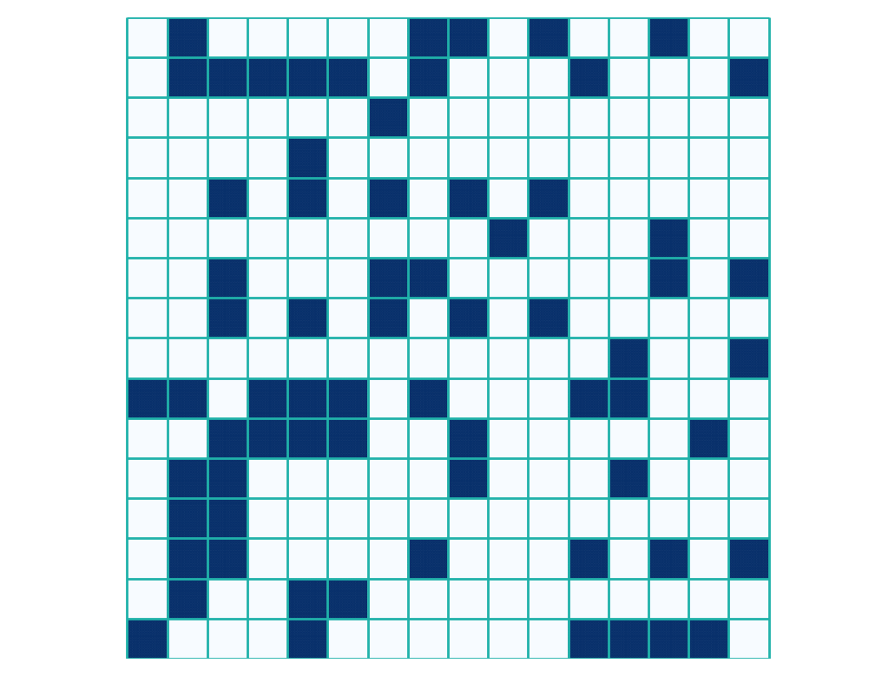
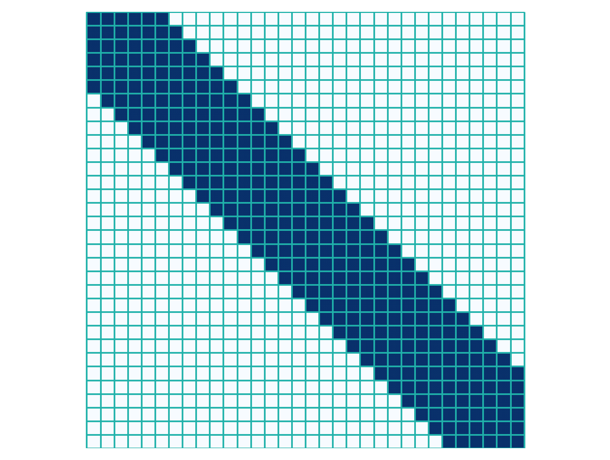

# Sparse Attention

> Copyright 2019 Graphcore Ltd.

This documents explains how one can easily define attention patterns and heads that can be used with the Popsparse/PopArt APIs. 

## Table of contents
1. [Sparse attention patterns](#Sparse-attention-patterns)
2. [Using sparse_attention_utils.py](#Using-sparse_attention_utils.py)
    1. [Converting between Popsparse/Popart and Numpy](#Converting-between-Popsparse-and-Numpy)
    2. [Constructing and plotting attention patterns](#Constructing-and-plotting-attention-patterns)
    3. [Predefined attention heads](#Predefined-attention-heads)
3. [Multi-head attention example](#Multi-head-attention-example)
4. [Demos](#Demos)

## Sparse attention patterns
A sparse attention pattern is a 2D token-level mask (0s and 1s) of seq_len by seq_len dimensions. For block-sparse attention it is required that any sub-block-sparsity be limited to the diagonal blocks. The diagonal blocks may optionally have a ZeroUpperTriangle, or ZeroLowerTriangle mask applied at the sparse-softmax level. This enables sparse causal attention patterns. All other block have to either be fully active or fully inactive (workarounds do exist).

## Using the sparse_attention_utils.py
The easiest way to get started with sparse attention in Popart is to use the tools in [sparse_attention_utils.py](sparse_attention_utils.py). These utilities are written using Numpy and Scipy's sparse API. As such, pattern generation is sparse and fast even for long 20k+ token sequences.

### Converting between Popsparse and Numpy
Any 2D array or Scipy sparse matrix (typically a token-level mask) can be converted to a Popart block-sparse matrix with a designated 2D blocksize.
```python
blocks, sparsity_mask, scipy_bsr = Convert.to_popsparse(A, blocksize2D)
```
When inspecting a sparse tensor output by a Popart session the reverse conversion may be useful
```python
out = Convert.to_np_array(numpyShape, dataBlocks, sparsity_mask, groupSizes, blockSize2D)
```
### Constructing and plotting attention patterns
The utilities currently support the following patterns:
* random_pattern : creates a random mask with block-level sparsity
* autoregressive_pattern : full causal mask across a window or sequence
* summary_window : used to create summary token columns below the diagonal

These patterns can easily be combined to create more complicated patterns using the tiling and merging utilities. 

Furthermore, use the **Patterns.plot_pattern** function to plot the pattern and check that the sparsity overlaps with the blocks such that there is no sub-block sparsity.See figures below for example plots.
### Predefined attention heads
Each heads in the utilities is characterized by a tuple of **(blocks, sparsity, scipy_bsr)**. The **blocks** is a 2D dense Numpy array representing the data blocks of the sparse array. It has shape [sum(sparsity), flattened blocksize]. The **scipy_bsr** matrix is the token-level mask in scipy sparse format.

* **Custom attention head** can be used to convert any _token-level_ pattern into a tuple representing an attention head at the _block-level_. The following example shows a random block-level mask i.e. the green lines denote block boundaries not individual tokens. The random mask was created using _Patterns.random_pattern_. Note that although the mask is defined at the token level, sub-block sparsity is not supported in the sparse-softmax. The blocks on diagonal present an exception to this rule and are allowed to have causal masking (left or right). Typically one should also check that each block row has at least one active block. To create a custom head from any token-level pattern use _Heads.from_custom_pattern_.
<p align=center>



* The **autoregressive** attention head uses an auto-regressive mask across the entire sequence. This could be used to validate against a dense implementation of causal attention. In addition to the block boundaries we also show the token grid in grey. The diagonal blocks are special in the sense that they are allowed to exhibit either ZeroUpperTriangle (seen here) or ZeroLowerTriangle sub-block sparsity patterns. The sub-block masking is applied at the softmax level.
<p align=center>


* The **dense self attention** head represents the original dense self-attention matrix (all 1s). This might be used for regression testing again existing dense implementations.
<p align=center>


* The **block gram** attention head connects each block on the diagonal to _n_ neighboring blocks to the left and right.
<p align=center>



* The **causal block gram** attention head connects each block on the diagonal to _n_ preceding neighboring blocks to the left.
<p align=center>


* The **causal windows with summaries** attention head is the main workhorse of sparse attention. It has windows of auto-regressive attention and summarization blocks that connect the different windows together.
<p align=center>


## Multi-head attention example
The most typical use case is to use multi-head attention with a variety of different heads. The [sparse_attention_utils.py](sparse_attention_utils.py) contains a function that allows us to easily concatenate individual attention heads together to create multi-head attention as follows

```python
from sparse_attention_utils import Patterns, Convert, Heads
from scipy import sparse
sequence_length = 1024
window_size = 128
blocksize2D = [16, 16]
n_windows = sequence_length//window_size
n_summary_blocks = 2
n_block_gram = 6

# Define 3 different heads
head1 = Heads.causal_windows_with_summaries(window_size, n_windows, n_summary_blocks, blocksize2D)
head2 = Heads.causal_block_gram(sequence_length, n_block_gram, blocksize2D)

# Add custom random causal head
random_pattern = Patterns.random_pattern(sequence_length, 0.2, blocksize2D)
random_pattern = Patterns.add_identity_pattern(random_pattern)
random_pattern = sparse.tril(random_pattern) # make it causal with scipy
head3 = Heads.from_custom_pattern(random_pattern, blocksize2D)

#Concatenate the heads. Here we use each head 4 times to create 12 attention heads in total
blocks, sparsity, bsr_rhs_lengths_per_2d_plane =\
        Heads.concatenate_heads([head1, head2, head3], [4, 4, 4])
```
To use the above example in Popart, the blocks are fed in as a 2D tensor (n_blocks, linear blocksize) and the sparsity and bsr_lengths are used to guide the sparse matrix multiplication. Follow the tutorials below for details.

## Demos
An introduction to block-sparse attention in Popart: [short_demo.py](short_demo.py)

An implementation which has all the building blocks needed to serve as a drop-in replacement of a dense attention module: [complete_demo.py](complete_demo.py)

