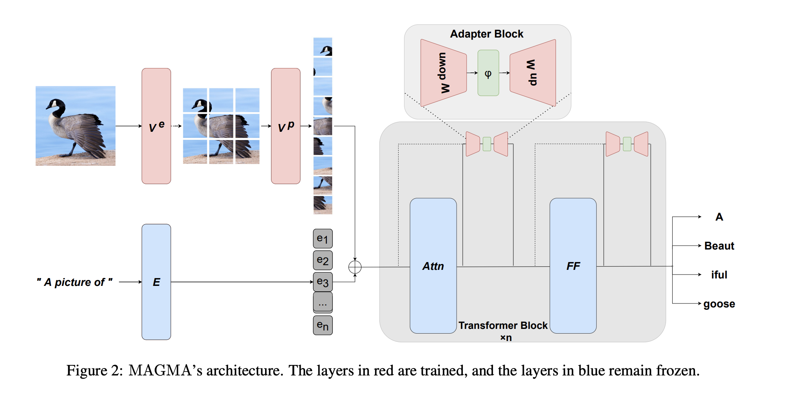

# MAGMA (Multimodal Augmentation of Generative Models through Adapter-based Finetuning)

| Framework | Domain | Model | Datasets | Tasks| Training| Inference | Reference |
|-------------|-|------|-------|-------|-------|---| --------|
| POPXL | Multimodal | Magma | N/A | Text Generation | <p style="text-align: center;"> ❌ <br> | <p style="text-align: center;">✅ <br> Min. 4 IPUs (POD4) required | [MAGMA--Multimodal Augmentation of Generative Models through Adapter-based Finetuning](https://arxiv.org/abs/2112.05253)|

MAGMA (Multimodal Augmentation of Generative Models through Adapter-based Finetuning) is a multimodal Vision-Language model developed by Aleph-Alpha and researchers from [Heidelberg University](https://www.cl.uni-heidelberg.de "Computational Linguistics at Heidelberg University"). For all the details, please refer to the [paper](https://arxiv.org/abs/2112.05253) and the [official Github repository](https://github.com/Aleph-Alpha/magma).

In general terms, MAGMA aims at obtaining a joint image-text representation, which can then be used for a variety of tasks such as image captioning, visual question answering, visual entailment, etc. You can feed the model with a textual prompt and an image and use the textual prompt to make queries about the image.

The main components of Magma are:
- A pretrained autoregressive **language model**. This component is **frozen**, it is not trained. The chosen language model is [GPT-J 6B](https://github.com/kingoflolz/mesh-transformer-jax).
- A **visual encoder** (namely, variants of ViT or ResNet) that takes an image input and produces image features. This is a **trainable** component. In the paper, several variants are discussed and compared.
- An **image prefix** that projects image features
into a sequence of embedding vectors, suitable to be inputs of the language model transformer. This is a **trainable** component.
- **Adapters** layers, which are **trainable** layers added in different layouts to the language model decoder block. In the paper, several configurations are discussed and compared.

The image below, taken from the Aleph-Alpha [paper](https://arxiv.org/abs/2112.05253), summarises the model structure.



- The inputs of the model are an image and an accompanying text.
- Text is encoded by the language model embedding **E**, obtaining text embeddings.
- In the ImagePrefix:
    - Image features are produced by the visual encoder **V<sup>e</sup>**
    - Image features are projected to the embedding dimension by a linear layer **V<sup>p</sup>**, obtaining image embeddings.
- Image embeddings and text embeddings are concatenated. Concatenation order is `(image, text)`, with the image tokens always at the beginning of the sequence. In this way, they are always attended by the text tokens (not affected by causal mask).
- The resulting sequence is fed to the language model transformer endowed with adapters.

This application implements only the model choices of the [publicly available checkpoint](https://bit.ly/aleph_alpha_magma_download). As they state in the model repo, this checkpoint is just meant to be a demo and it's not the one they use in actual applications:
- The visual encoder is CLIP modified resnet ResNet50-x16 ( implementation is available [here](https://github.com/openai/CLIP/blob/main/clip/model.py)), without the final attention pool layer.
- Adapters are only added to feed-forward blocks. In the MAGMA paper, it says that adding adapters also to the attention layers gives better results.

# Instructions summary

1. Install and enable the Poplar SDK (see Poplar SDK setup)

2. Install the system and Python requirements (see Environment setup)

3. You can pre-download MAGMA weights from [the official link](https://bit.ly/aleph_alpha_magma_download). Otherwise, they will automatically downloaded the first time you run the model. The checkpoint is about 12GiB so it will take a while.

## Poplar SDK setup
To check if your Poplar SDK has already been enabled, run:
```bash
 echo $POPLAR_SDK_ENABLED
```

If no path is provided, then follow these steps:
1. Navigate to your Poplar SDK root directory

2. Enable the Poplar SDK with:
```bash
cd poplar-<OS version>-<SDK version>-<hash>
. enable.sh
```

3. Additionally, enable PopART with:
```bash
cd popart-<OS version>-<SDK version>-<hash>
. enable.sh
```

More detailed instructions on setting up your environment are available in the [poplar quick start guide](https://docs.graphcore.ai/projects/graphcloud-poplar-quick-start/en/latest/).


## Environment setup
To prepare your environment, follow these steps:

1. Create and activate a Python3 virtual environment:
```bash
python3 -m venv <venv name>
source <venv path>/bin/activate
```

2. Install python requirements
Code works with Python 3.8 but installing Magma requires 3.9.
Therefore, you need to install requirements using the `--ignore-requires-python` option.
```bash
pip3 install -r requirements.txt --ignore-requires-python
```

## Running and benchmark
You can try the model using the `run_inference.py` script or the interactive demo in the jupyter notebook `magma_interactive.ipynb`.

Pre-made configurations are available for 500 and 1024 sequence length:
```bash
python3 run_inference.py --config magma_v1_1024
python3 run_inference.py --config magma_v1_500
```
You can change any config parameter via the corresponding CLI argument.
To avoid recompiling the model, you can specify a cache directory:
```bash
POPART_CACHE_DIR=./cache python3 run_inference.py
```
Since next token selection is done on CPU, you can change the parameters used for generation (`top_p`, `top_k`, `max_out_tokens`, `temperature`, explained in the sections below) without triggering recompilation.
Specifying a `seed` allows you to get reproducible deterministic results.

The best way to play around with the model is using the notebook `magma_interactive.ipynb`.


You can run the execution scripts `inference.py` directly to compile the model and run it on generated data for benchmarking.
```bash
python3 inference.py
```

## Inference

**Note:** Magma uses GPT-J, but in the code you can find references to GPTNeo, and this can be confusing. The model is GPT-J 6B but not taken from the official Hugging Face transformer library. Instead, they use [finetuneanon/transformer](https://github.com/finetuneanon/transformers). In this library, [GPTNeo](https://github.com/finetuneanon/transformers/tree/gpt-neo-localattention3-rp-b/src/transformers/models/gpt_neo) with the options `jax=True`, `rotary=True` and `global` attention corresponds to GPT-J.

### Input preprocessing
#### Textual input
The input text is tokenized using GPT2 tokenizer.
It is then padded up to `sequence_len - 144`, where `sequence_len` is specified in the configs and 144 is the number of image tokens generated by the image encoder.
#### Image input
The input image is resized, cropped and normalised using Magma [clip_preprocess](https://github.com/Aleph-Alpha/magma/blob/master/magma/transforms.py) function.


### Next token generation
Given an image and a text prompt, the model outputs logits for the sequence.
Logits corresponding to the last token in the sequence are used to predict the next token.
Several heuristics are supported:
- argmax: simply pick the token with the highest probability. This is a deterministic sampling method.
- top-p: probability is redistributed among the first x tokens such that the cumulative probability is greater than a threshold p. Then, next token is sampled from such distribution (categorical sampling, non deterministic).
- top-k: probability is redistributed among the K most-likely tokens. Then, next token is sampled from such distribution (categorical sampling, non deterministic).
- temperature: logits are scaled by a factor 1/T (T between 0 and 1 ) before applying the softmax. This makes the distribution more peaked for low temperature, and broader for high temperatures. A zero temperature corresponds to a deterministic choice (argmax), while sampling output becomes more random as we increase the temperature.

If you are not familiar with these concepts, this [HuggingFace article](https://huggingface.co/blog/how-to-generate) can help you visualise them.

The new token is added to the input sequence, and the process goes on until `max_out_tokens` are generated or the model outputs the `EOS` token.

### Execution scheme
The model is run using phased execution.
This means that the model is partitioned into a set of smaller graphs that are executed in series on the IPU, using remote memory to store variables and input/output tensors between calls (activations).
We recommend going through the tutorial [Phased Execution in MNIST example](https://github.com/graphcore/tutorials/tree/master/tutorials/popxl/6_phased_execution) to better understand this execution scheme.
- The first phase corresponds to the image prefix. The output of this phase produces image embeddings that are concatenated to the (tokenized) textual input
- The following phase is GPT-J embedding phase, which produces text embeddings.
- Image embeddings and text embeddings are concatenated and fed to GPT-J blocks. Each block constitutes a different phase.
- The final phase is the LM head, producing logits to be used for next token prediction.

GPT-J model makes use of tensor parallelism, spanning across 4 IPUs. More details about the implementation are available in the [GPT-J README](https://github.com/graphcore/examples/blob/master/nlp/gpt_j/popxl/README.md).

## Unit testing
- Follow environment setup steps
- Run tests with
```bash
python3 -m pytest
```
Some tests are marked as long and skipped by default.
To run all tests, use
```bash
python3 -m pytest --long-tests
```

## License
This example is licensed as per the `LICENSE` file at the root of this
repository. This example, when executed, downloads and uses a checkpoint from Aleph Alpha which is licensed under the [MIT license](https://github.com/Aleph-Alpha/magma/blob/master/LICENSE)
