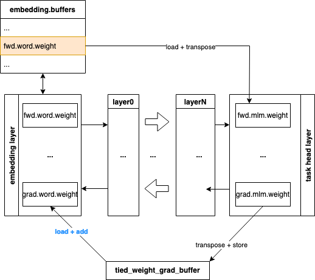

# BERT (PopXL)
Bidirectional Encoder Representations from Transformers for NLP pre-training and fine-tuning tasks (SQuAD) using the PopXL library, optimised for Graphcore's IPU.

| Framework | domain | Model | Datasets | Tasks| Training| Inference | Reference |
|-------------|-|------|-------|-------|-------|---|---|
| PopXL | NLP | BERT | WIKI-103 | Next sentence prediction, Question/Answering | ✅  | ✅ | [BERT: Pre-training of Deep Bidirectional Transformers for Language Understanding](https://arxiv.org/abs/1810.04805v2) | 


## Instructions summary

1. Install and enable the Poplar SDK (see Poplar SDK setup)

2. Install the system and Python requirements (see Environment setup)

3. Download the WIKI-103 dataset (See Dataset setup)


## Poplar SDK setup
To check if your Poplar SDK has already been enabled, run:
```bash
 echo $POPLAR_SDK_ENABLED
```

If no path is provided, then follow these steps:
1. Navigate to your Poplar SDK root directory

2. Enable the Poplar SDK with:
```bash 
cd poplar-<OS version>-<SDK version>-<hash>
. enable.sh
```

3. Additionally, enable PopArt with:
```bash 
cd popart-<OS version>-<SDK version>-<hash>
. enable.sh
```

More detailed instructions on setting up your environment are available in the [poplar quick start guide](https://docs.graphcore.ai/projects/graphcloud-poplar-quick-start/en/latest/).


## Environment setup
To prepare your environment, follow these steps:

1. Create and activate a Python3 virtual environment:
```bash
python3 -m venv <venv name>
source <venv path>/bin/activate
```

2. Navigate to the Poplar SDK root directory

3. Install the PopTorch (Pytorch) wheel:
```bash
cd <poplar sdk root dir>
pip3 install poptorch...x86_64.whl
```

4. Download and install PopXL add-ons:
```bash

```
PopXL is an experimental framework and may be subject to change in future releases.

4. Navigate to this example's root directory

5. Install the Python requirements:
```bash
make install
```


## Dataset setup
The dataset used for pretraining is WIKI-103. It can be generated from a RAW dump of Wikipedia following a five step process.

Disk space required: 143GB - Sequence length 128 (Variable), 203GB - Sequence length 512 (Variable)

```bash
.
├── wiki_000.index
├── wiki_000.tfrecord
    .
    .
    .
├── wiki_xxx.index
└── wiki_xxx.tfrecord

0 directories, XXXX files
```

### 1. Download

Use the `wikipedia_download.sh` script to download the latest Wikipedia dump, about 20GB in size.

```bash
./data/wikipedia_download.sh <chosen-path-for-dump-file>
```

Dumps are available from <https://dumps.wikimedia.org/> (and mirrors) and are licensed under CC BY-SA 3.0 and GNU Free Documentation Licenses.

### 2. Extraction

In order to create the pre-training data we need to extract the Wikipedia dump and put it in this form:

```text
<doc id = article1>
Title of article 1

Body of article 1

</doc>

<doc id = article2>
Title of article 2

Body of article 2
</doc>
```

and so on.

One of the tools that can be used to do so is WikiExtractor, <https://github.com/attardi/wikiextractor>.
Install the WikiExtractor package with:
```bash
pip3 install wikiextractor
```

In order not to encounter a `UnicodeEncodeError` at this step, you may want to run these two commands first:

```bash
export PYTHONIOENCODING=utf-8
export LC_ALL=C.UTF-8
```

You can then use the the `wikipedia_extract.sh` script to use WikiExtractor to extract the data dump.

```bash
./data/wikipedia_extract.sh <chosen-path-for-dump-file>/wikidump.xml <chosen-folder-for-extracted-files>
```

The result should be a folder containing directories named `AA`, `AB`, ...
Note that the number of directories depends on the parameters of the `wikipedia_extract.sh` script, and is not to be confused with alphabetical ordering of the wikipedia articles.
In other words you should probably not expect all of `AC`, `AD`, ... `ZX`, `ZY`, `ZZ` to be created by the script.

### 3. Pre-processing

Install nltk package with:
```bash
pip3 install nltk
```

Use the `wikipedia_preprocess.py` script to preprocess the extracted files.

```bash
python3 ./data/wikipedia_preprocess.py --input-file-path <chosen-folder-for-extracted-files> --output-file-path <chosen-folder-for-preprocessed-files>
```

### 4. Tokenization

The script `create_pretraining_data.py` can accept a glob of input files to tokenize.
However, attempting to process them all at once may result in the process being killed by the OS for consuming too much memory.
It is therefore preferable to convert the files in groups. This is handled by the `./data/wikipedia_tokenize.py` script.
At the same time, it is worth bearing in mind that `create_pretraining_data.py` shuffles the training instances across the loaded group of files, so a larger group would result in better shuffling of the samples seen by BERT during pre-training.

The tokenization depends on `tensorflow` which can be installed by:

```bash
pip3 install tensorflow
```

sequence length 128

```bash
python3 ./data/wikipedia_tokenize.py <chosen-folder-for-preprocessed-files> <chosen-folder-for-dataset-files> --sequence-length 128 --mask-tokens 20
```

sequence length 512

```bash
python3 ./data/wikipedia_tokenize.py <chosen-folder-for-preprocessed-files> <chosen-folder-for-dataset-files> --sequence-length 512 --mask-tokens 76
```

### 5. Indexing

In order to use the multi-threaded `dataloader`, `tfrecord` index files need to be generated.
First install the `tfrecord` Python package into your Python environment:

```bash
pip3 install tfrecord
```

Then go to the directory containing the pre-processed Wikipedia files and run:

```bash
for f in *.tfrecord; do python3 -m tfrecord.tools.tfrecord2idx $f `basename $f .tfrecord`.index; done
```


## Running and benchmarking

To run a tested and optimised configuration and to reproduce the performance shown on our [performance results page](https://www.graphcore.ai/performance-results), use the `examples_utils` module (installed automatically as part of the environment setup) to run one or more benchmarks. The benchmarks are provided in the `benchmarks.yml` file in this example's root directory.

For example:

```bash
python3 -m examples_utils benchmark --spec <path to benchmarks.yml file>
```

Or to run a specific benchmark in the `benchmarks.yml` file provided:

```bash
python3 -m examples_utils benchmark --spec <path to benchmarks.yml file> --benchmark <name of benchmark>
```

For more information on using the examples-utils benchmarking module, please refer to [the README](https://github.com/graphcore/examples-utils/blob/master/examples_utils/benchmarks/README.md).


## Custom training/inference and other features

### Pretraining with BERT on IPU <a name="pretrain_IPU"></a>

You can run pretraining for BERT base with the settings defined in `pretraining.yml` by using the script below. You need to provide the data files with `--input_files`.

```bash
$ python3 run_pretraining.py --input_files {path to your wikipedia data}/*.tfrecord
```

The default model size in demo pretraining is BERT base. You can change it to the BERT large with the command below.

```bash
$ python3 run_pretraining.py --config large --input_files {path to your wikipedia data}/*.tfrecord
```

You can run the scripts for benchmarking with generated data by executing the non-run scripts directly. All the scripts benchmark scripts are for BERT large by default. For instance, the following command will run benchmark for BERT large pretraining. You can change it by adding `--config`. For instance, the command below runs benchmarking for BERT base pretraining.

```bash
python3 pretraining.py --config base
```

### Fine-tuning and inference with BERT for SQuAD on IPU <a name="squad"></a>

You can run fine-tuning on SQuAD for BERT large with the settings defined in `squad_training.yml` by using the command below. It will first load a pretrained checkpoint from Hugging Face.

```bash
python3 run_squad_training.py
```

You can also run inference on the trained SQuAD model with the settings defined in `squad_inference.yml` by using the command below.

```bash
python3 run_squad_inference.py
```

This outputs the context and questions for the BERT question-and-answer model, as well as the comparison of inference results from PopXL and Hugging Face.

You can benchmark the fine-tuning and inference by executing the non-run scripts directly. All the scripts benchmark scripts are BERT large by default. You can change the model size by using `--config`. For instance, the script below will give benchmark results for fine-tuning on SQuAD with BERT base.

```bash
python3 squad_training.py --config base
```

### View the pretraining results in Weights & Biases <a name="wandb"></a>

This project supports Weights & Biases, a platform to keep track of machine learning experiments. A client for Weights & Biases will be installed by default and can be used during training by passing the `--wandb` flag. You will need to manually log in (see the [quickstart guide](https://docs.wandb.ai/quickstart)) and configure the project name with `--wandb-name`.) For more information see https://www.wandb.com/.

The training runs are logged in wandb under project `popxl-bert`. Each run has loss, learning rate and throughput logged. The version for `addons` and PopXL are also logged together with the configuration settings.

### Configure your BERT runs <a name="configs"></a>

You can find configuration options for BERT in class `BertConfig` in the file `config/config.py`. It contains configurations for these aspects:

* Models

    You can set the parameters used in the BERT model.
    - general parameters:
        1. `layers`: the number of encoder layers in the model,
        2. `hidden_size`: the hidden size of the layers,
        3. `sequence_length`: number of tokens in a sample,
        4. `eval`: to enable the model to be built for inference or validation which will disable dropout and optimisation,
        5. `dropout_prob`: the dropout probability,
        6. `precision`: to set the precision used in the model parameters, for instance, `popxl.float32` and `popxl.float16`.
        7. `seed`: the random seed used by the model and data generation.
    - parameters for `emdedding` layers: vocabulary size, `vocab_size`, and maximum number of positions to support in the embeddings, `max_positional_length`.
    - parameters for `attention` layer: the number of attention heads, `heads`.
    - parameters for MLM task `mlm`: the maximum number of masked tokens in a sequence, `mask_tokens`.

* Training

    You can configure the training options that have an impact on training.
    - `steps`: number of steps,
    - `epochs`: number of epochs,
    - `global_batch_size`: the number of samples that contribute to an optimizer step,
    - `stochastic_rounding`: a flag to enable stochastic rounding,
    - `optimizer`: an optimizer with the following settings.
        - `name`: name of the optimizer, by default, AdamW.
        - `learning_rate`: to set up the learning rate including `function` used in scheduler, `maximum` learning rate, and `warmup_proportion` to set the proportion of the warmup step,
        - `beta1`: by default 0.9,
        - `beta2`: by default 0.999,
        - `weight_decay`: weight decay factor, by default 0.0.

* Data
    - `input_files`: the path to input data files.

* Execution

    This allows you to change how to execute a BERT run on IPU.
    - `micro_batch_size`: the number of samples that contribute to a gradient accumulation step,
    - `data_parallel`: the number of model replicas to use for data parallelism,
    - `device_iterations`: the number of times the training loop is executed before relinquishing control and reporting to the host,
    - `io_tiles`: the number of tiles dedicated to streaming data,
    - `available_memory_proportion`: the available memory proportion for any op that supports this option,
    - `loss_scaling`: the scaling factor to apply to gradients, by default 1.

* Checkpoint

    You can set the path to load and save checkpoints, respectively, with `load` and `save`.

### Scale BERT on IPU <a name="scale"></a>

Here we introduce some techniques we used to scale up the BERT model on IPUs in terms of memory consumption and training speed.

### Phased Execution <a name="pe"></a>

For compute graphs that have memory requirements greater than the available on-chip memory, we can partition them into a series of smaller sub-graphs and execute them in series on the IPU, using remote buffers in Streaming Memory to store input and output tensors between calls. This is called phased execution.

In the BERT application, we demonstrate this concept on a full sized model. Recomputation and replicated tensor sharding ([RTS](https://github.com/graphcore/tutorials/tree/master/tutorials/popxl/5_remote_variables_and_rts)) are also used to improve the performance. Since most parts of the implementation of the phased execution in pretraining and fine-tuning are similar, in this README, we focus on the implementation of phased execution for pretraining in `pretraining.py`, and will show you the difference from SQuAD fine-tuning in `squad_training.py`.

Recall that we need to build an [IR in PopXL](https://docs.pages.gitlab.sourcevertex.net/docs/docs/PopART/popxl-user-guide/2.5.0/concepts.html#irs). In its main graph, we first define the input and output data streams. Then we build the computation graphs. As phased execution involves loading and offloading each partition in sequence, much use is made of remote buffers and RTS in the graph construction.

### Constructing computation graphs for each phase

First of all, we build the training graphs for each phase, represented in the class `Graphs`. A phase can include one layer or consecutive layers. The execution of a phase can be for the forward graph, gradient graph, optimizer graph or a combination of them. We need to build the graphs used in each phase before we define the phases in [Build the main computation graph](#main).

The graphs required for each phase can be represented in class `Graphs`.

* `fwd` and `grad` are respectively the forward and backward pass graphs. The `grad` graph is obtained directly by using `autodiff_with_accumulation` from the forward graph `fwd`.
* `args` has the required arguments in the forward graph and optimizer graph. The `grad_args` has the required arguments for the backward graph.
* `optim` contains the optimizer graphs for each variable.
* The `buffers` are remote buffers used to handle the loading and offloading of the activations, trainable weights, and optimizer states.
* To handle the remote load and store for the remote buffers, we also need the graphs:
    - `_fwd_load` that loads variables from `fwd` buffers and returns `_fwd_load_names`,
    - `_optim_load` that load variables from `optim` buffers and returns `_optim_load_names`,
    - `_optim_store` that stores variables to `optim` buffers.
    - `_grad_store` that stores to `grad` buffers. It is only used in pretraining BERT layer and task head layer.
* To handle collectives for replica AllGather and reduce replica for RTS variables, we also created the graphs:
    - `_fwd_all_gather` that does AllGather across replicas for forward RTS variables and returns `_fwd_all_gather_names`,
    - `_grad_reduce` that reduces across replicas for gradient RTS variables and returns `_grad_reduce_names`.

In this BERT model, there are three types of layers:

* the embedding layer,
* each BERT encoder transformer layer, and
* the task head layer.

We created the following graphs for these:

* `embeddings`, by calling the method `create_embeddings_graph` for the embedding layer. Note that, the optimizer step for embedding layer happens straight after the backward pass on the IPU, so there is no need to store the gradient in a buffer.
* `layer`, by calling the method `create_layer_graph` for each BERT encoder layer. Its buffer contains the forward tensors and gradient tensors. Since each BERT encoder layer has identical input and output data type and shape, we stack the buffers for each layer together. Hence, the number of entries in the buffers is the same as the number of encoder layers.
* `head`, by calling the method `create_task_head_graph` for the task head layer. There are some slight differences in the implementation from the above two instances.
    * Its gradient graph is combined with the forward graph by using `BertPretrainingLossAndGrad`. The calculation of gradients happens just after the forward graph calculation in the same phase. Hence, the `fwd` graph includes both the graph for the forward pass and the calculation of its gradients.
    * Tied embedding is used. The linear layer in MLM task head reuses the inputs' embedding weights. As shown in the diagram below, in the forward pass the MLM weights are loaded from the embedding layer weights buffer `embedding.buffers.fwd.word.weight`. In the backward pass, the gradient of the tied embedding weights is stored in a separate remote buffer `tied_weight_grad_buffer`.

        

For SQuAD fine-tuning, the graphs for the SQuAD task head is created in `create_squad_graph`. Its gradient graph is combined with the forward graph from `BertSquadLossAndGrad`. No tied embedding is used.

### Apply transformations on graphs

We then apply transformations to the graphs built:

* **recomputation**: to reduce memory consumption in the backward pass for embedding gradients and encoder gradients. You can transform the gradient graphs by using `popxl_addons.recompute_graph` method.

* **batch serialisation**: to avoid the frequent loading and offloading of the variables and graphs in different layers for each batch, we use batch serialisation. This repeats the same graph with different data for each partition of the model, for `steps` iterations. You can find the transformed graphs in `embeddings_batch_serialise`, `layer_batch_serialise` and `head_batch_serialise`, respectively. Each batch serialization produces the forward and gradient graphs and the activations. You can get the transformed graphs for the embedding and encoder layers by using the `popxl_addons.transforms.batch_serialisation.batch_serialise_fwd_and_grad` directly. As for the head layer that has a combined forward and gradient graph, it uses `popxl_addons.transforms.batch_serialisation.batch_serialise`.

For batch serialisation, we also need to create remote buffers to load the inputs and store outputs for each partition by using `popxl_addons.batch_serial_buffer`. In this application, we use the remote buffers `x_buffer` and `dx_buffer` respectively to handle the intermediate outputs of each partition in the forward pass and backward pass. The two buffers for this application are illustrated in the following diagram. Each row handles `config.gradient_accumulation` elements.


For instance, in `x_buffer`, row 0 stores the output of the embedding layer in forward pass. The output of each BERT encoder layer is stored from row 1 to `config.model.layers+1`. Note that the rows in the two buffers are filled up in the opposite directions.

### Build the main computation graph <a name="main"></a>

Once we initialize the required variables, we can build the main computation graph within the context of `popxl.in_sequence()`.

**Forward**

- load data from `input_streams`:
    1. learning rate to `lr`,
    2. random `seed`.
    3. masks. Note that masks are loaded and then stored in the remote buffer `mask_buffer` by using `fill_buffer_from_host`.
- Forward embedding layer phase in `embedding_fwd_phase`:
    1. load the embedding layer variables used in forward graph,
    2. propagate the seed to the following layer by using `split_random_seed`,
    3. call the embedding graph.
- Forward BERT encoder layers phases: load BERT encoder layers in a loop by using `ops.repeat`. This calls the graph once for each BERT encoder layer, in sequential order.

```python
def single_bert_layer_fwd_phase(n: popxl.Tensor, seed: popxl.Tensor):
    # Load Encoder layers
    layer_vars = layer.fwd_load(n)
    layer_vars = layer.fwd_all_gather(layer_vars)
    # Forward
    seed, layer_seed = ops.split_random_seed(seed)
    layer.fwd.bind(layer_vars).call(n, layer_seed)
    return n + 1, seed

i = popxl.constant(0, name="layer_index")
bwd_graph = ir.create_graph(single_bert_layer_fwd_phase, i, seed)
ops.repeat(bwd_graph, config.model.layers, i, seed)
```

- Forward and backward task head phase, `task_head_fwd_grad_phase`. The forward and backward graphs are combined in the same phase.
    1. load the optimizer state variables from remote buffer, forward variables from remote buffer then do an AllGather, and initialize the gradient variables.
    2. transpose the tied embedding weights to calculate the forward pass graph and the gradients.
    3. store the reduced tied embedding gradients in the remote buffer, `tied_weight_grad_buffer`.

Note that gradient clipping is used in pretraining but not in SQuAD fine-tuning. The order of applying the optimizer step is slightly different for the two. SQuAD fine-tuning does the optimizer step as soon as possible. Whereas pretraining does gradient clipping which requires the optimizer step to be *after* the global norm has been calculated for all the layers. Therefore, you can see the gradient calculation is followed immediately by `optimizer_step` and `optim_store`  in the backward phase of each layer in the `squad_training_phased`.

**Backward**

- Backward BERT encoder layers phase: repeatedly call the encoder layer's backward graph for `config.model.layers` times. Each calculation graph in `single_bert_layer_grad_phase`, calculates the gradients and the global norm. The graphs are called in the reverse order of the forward pass.

```python
def single_bert_layer_grad_phase(n: popxl.Tensor, grad_norm: popxl.TensorByRef):
    # Load layer
    layer_vars = layer.fwd_load(n)
    layer_vars = layer.fwd_all_gather(layer_vars)
    # Gradient
    grads = layer.grad_args.init_zero()
    bwd_vars = grads.copy()
    bwd_vars.update(layer_vars)
    layer.grad.bind(bwd_vars).call(n)
    # Data parallel reduce
    reduced_grads = layer.grad_reduce(grads)
    # Global Norm calculation
    global_norm_reduce(config, grad_norm, reduced_grads)
    # Store gradient
    layer.grad_store(reduced_grads, n)
    return n - 1

i = popxl.constant(config.model.layers - 1, name="layer_index")
bwd_graph = ir.create_graph(single_bert_layer_grad_phase, i, grad_norm)
ops.repeat(bwd_graph, config.model.layers, i, grad_norm)
```

- Backward embedding phase in `embedding_grad_optimizer_phase`:
    1. load the optimizer states.
    2. call the gradient graph to calculate gradients.
    3. add the gradients calculated in task head `tied_weight_grad_buffer` to the embedding weights gradients
    4. finish calculating global norm for gradient clipping.
    5. apply optimizer step and store the updated weights.

**Optimizer**

- Apply optimizer step to BERT layers by repeating the `layer_optim`.

```python
# Optimizer Step for Layers
def layer_optim(n: popxl.Tensor, lr: popxl.Tensor, grad_norm: popxl.Tensor):
    layer_vars = layer.optim_load(n)
    optimizer_step(layer.optim, layer_vars, lr, grad_norm)
    layer.optim_store(layer_vars, n)
    return n + 1

i = popxl.constant(0, name="layer_index")
optim_graph = ir.create_graph(layer_optim, i, lr, grad_norm)
ops.repeat(optim_graph, config.model.layers, i, lr, grad_norm)
```

- Apply optimizer step to task head layer.

### Execution of the session

The main graph is repeated `config.execution.device_iterations` times. A training session is then created and returned in the `pretraining_phased` method. It is run in the `main()` method.

### Data Parallel <a name="dp"></a>

Data-parallel training involves breaking the training dataset up into multiple parts, which are each consumed by a model replica. At each optimization step, the gradients are mean-reduced across all replicas so that the weight update and model state are the same across all replicas. You can find more details about how to use data parallelism with PopXL addons in [MNIST example](https://github.com/graphcore/tutorials/tree/master/tutorials/popxl/3_data_parallelism).

### Avoid recompilation: caching executables <a name="cache"></a>
When running the application, it is possible to save and load executables in a cache store. This allows the reuse of a saved executable instead of re-compiling the model when re-running identical model configurations. To enable saving and loading from the cache store, use `POPART_CACHE_DIR <relative/path/to/cache/store>` when running the application.

