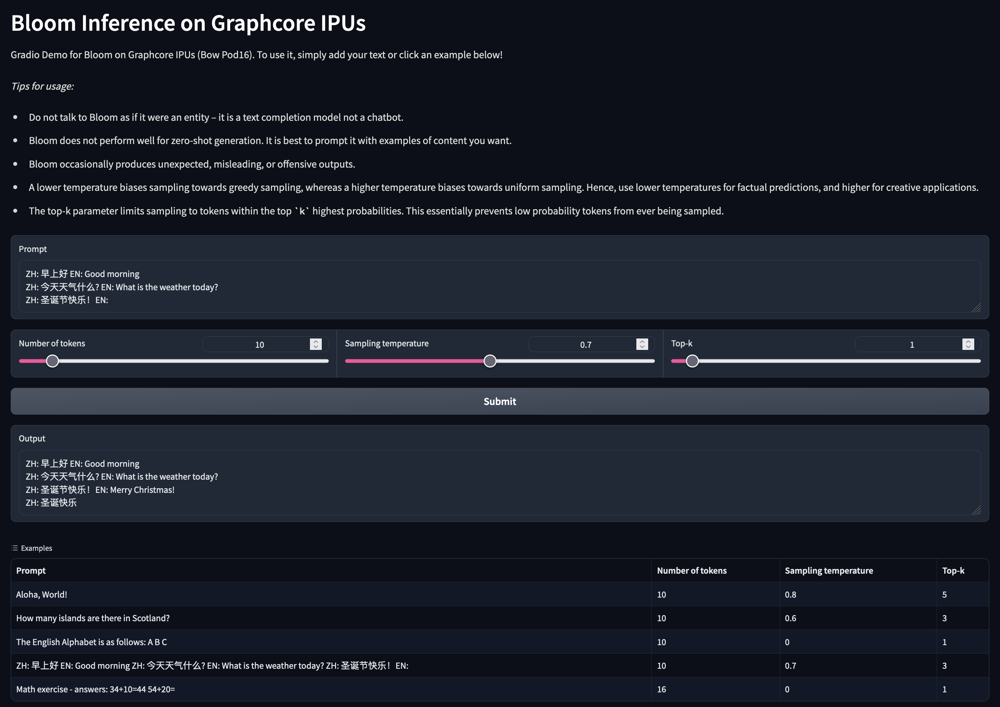

# BLOOM-176B (BigScience Large Open-science Open-access Multilingual) inference on IPUs using PopXL
This example implements the BigScience Large Open-science Open-access Multilingual (BLOOM) Language Model
for inference, optimised for Graphcore IPUs.



| Framework | domain | Model | Datasets | Tasks| Training| Inference | Reference |
|-------------|-|------|-------|-------|-------|---| --------|
| PopXL | NLP | BLOOM | ROOTS | Token-by-token prediction | <p style="text-align: center;"> ❌ <br> | <p style="text-align: center;"> ✅ <br> Min. 16 IPU (POD16) required | [arXiv](https://arxiv.org/abs/2211.05100) |

BLOOM is a 176 billion parameter open-source model – comparable in size to GPT-3 – trained for next-token prediction on the ROOTS corpus. The example can be run using one of two Python scripts: one launching a simple terminal interface and the other a Gradio front-end. A screenshot of the Gradio interface is shown above.

## Instructions summary:
Before you can run this model for inference you will need to:

1. Install and enable the Poplar SDK (see Poplar SDK setup)
2. Install the system and python requirements (see Environment setup)
3. _(Optional) Generate memory mappings (see Memory mapping)_

This example is for inference on user-provided prompts. Hence, there is no
dataset setup step.

### Poplar SDK setup
To check if your Poplar SDK has already been enabled, run:
```bash
 echo $POPLAR_SDK_ENABLED
 ```

If no path is provided, then follow these steps:
1. Navigate to your Poplar SDK root directory

2. Enable the Poplar SDK with:
```bash
cd poplar-<OS version>-<SDK version>-<hash>
. enable.sh
```

3. Additionally, enable PopART with:
```bash
cd popart-<OS version>-<SDK version>-<hash>
. enable.sh
```

More detailed instructions on setting up your environment are available in the [Poplar Quick Start guide](https://docs.graphcore.ai/projects/poplar-quick-start/).


## Environment setup
To prepare your environment, follow these steps:

1. Create and activate a Python3 virtual environment:
```bash
python3 -m venv <venv name>
source <venv path>/bin/activate
```

2. Navigate to this example's root directory

3. Install the Python requirements with:
```bash
pip3 install -r requirements.txt
```

### Memory mapping
Due to the size of the full 176 billion parameter model, it is likely attempting
to load from memory will result in running out of host memory. Hence, memory
mapped parameter tensors need to be generated before running inference. The
parameters will be loaded directly from disk into IPU.

The first step is to download the sharded checkpoint. The easiest way to do this is to run in a Python shell:
```python
from transformers import AutoModel

AutoModel.from_pretrained("bigscience/bloom", cache_dir="bloom-cache")
```
and then cancel execution once the download is complete. The HuggingFace checkpoint will be saved to `bloom-cache`.

To generate memory maps, run the following command:
```shell
python generate_memmap.py --config bloom_176B_pod16 --memmap-dir bloom-176b-memmap --shard-root /path/to/bloom-176b/shards
```

The script can be parallelised across multiple processes for a speed-up. For
example, to generate memmaps using `$n` processes:
```
seq 0 $(($n-1)) | xargs -P $n -I % -t python generate_memmap.py \
    --config bloom_176B_pod16 \
    --memmap-dir bloom-176b-memmap \
    --shard-root /path/to/bloom-176b/shards \
    --world-size $n --rank %
```

If `memmap_dir` is specified in `config/inference.yml`, then
`run_inference[_gradio].py` will instead instantiate the IPU model using memory
maps, rather than from an in-memory HuggingFace model.

## Inference

> It is highly recommended to run all inference scripts with the environmental
> variable `POPXL_CACHE_DIR` set to a directory of your choice. This will cache
> parts of the graph compilation, thus speeding up subsequent launches.

You can run BLOOM inference using one of two scripts. Both scripts will use
settings defined in `config/inference.yml`. The first script launches a CLI to
prompt BLOOM:
```shell
python run_inference.py --config bloom_176B_pod16
```

The second will launch a Gradio web interface on port 7860:
```shell
python run_inference_gradio.py --config bloom_176B_pod16
```

The full BLOOM model on 16 IPUs uses the config file `bloom_176B_pod16`. To test scripts with a smaller but less powerful model, run with the config `bloom_560M_pod16`.

On the first launch, setup will take some time. This is due to downloading
pretrained models and graph compilation. If a cache directory is set using
`POPXL_CACHE_DIR` parts of the compilation phase will be cached, speeding up
subsequent launches.

Executing `python inference.py --config bloom_176B_pod16` directly will run an
inference loop with random parameters and input data. This can be used to
measure model throughput.

## License
This example is licensed as per the `LICENSE` file at the root of this
repository. This example, when executed, downloads and uses a checkpoint from
HuggingFace which is licensed under the [Responsible AI License.](https://huggingface.co/spaces/bigscience/license)
