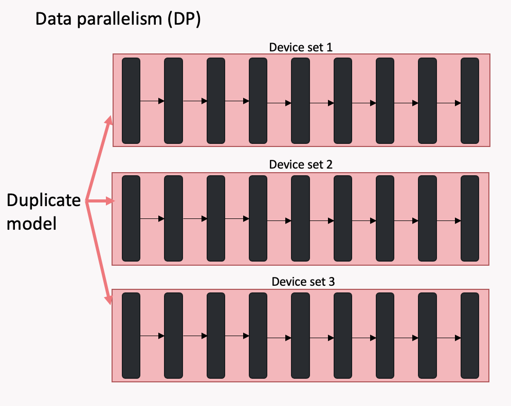
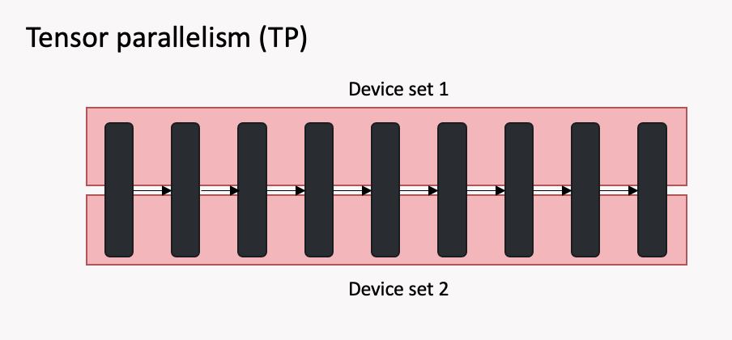
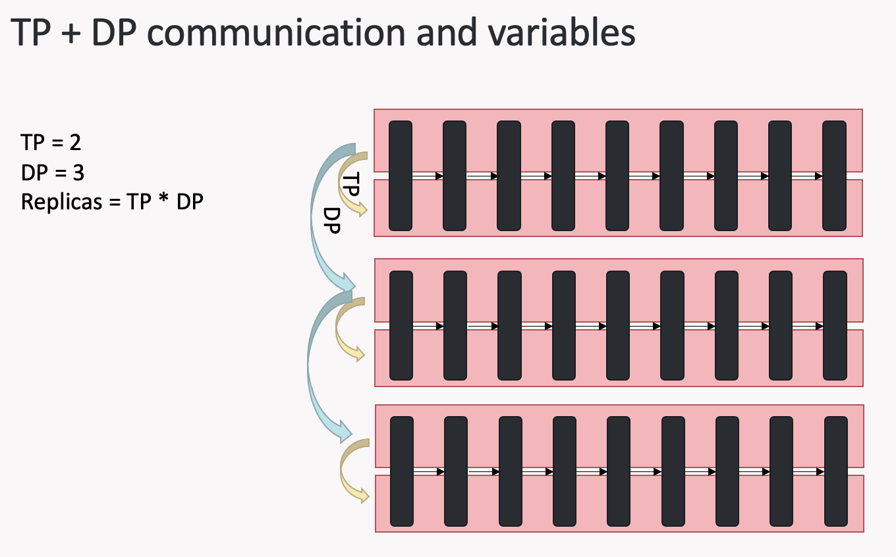
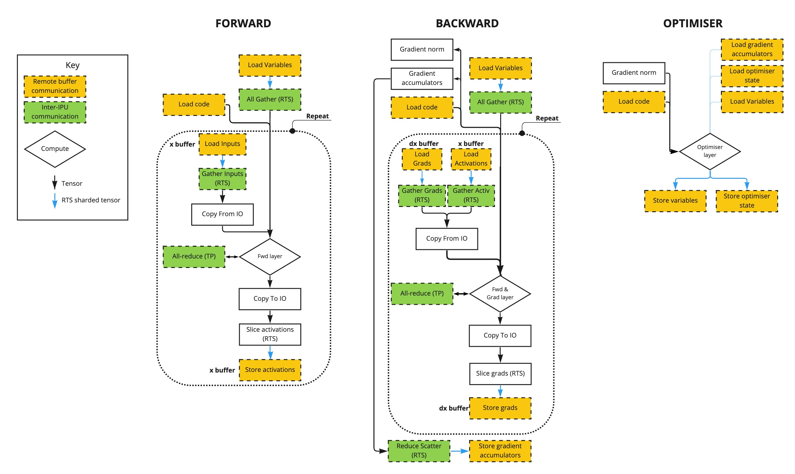

# FLAN-T5
FLAN-T5 for NLP fine-tuning and text generation, optimised for Graphcore's IPU.


| Framework | Domain | Model | Datasets | Tasks | Training | Inference |
|-----------|--------|-------|----------|-------|----------|-----------|
| PopXL | NLP | FLAN-T5 | MNLI | Textual entailment | <p style="text-align: center;">✅ <br> 64 IPUs (POD64) required  | <p style="text-align: center;">✅ <br> 64 IPU (POD64) required |


# Instructions summary

1. Install and enable the Poplar SDK (see Poplar SDK setup)

2. Install the system and Python requirements (see Environment setup)


## Poplar SDK setup
To check if your Poplar SDK has already been enabled, run:
```bash
 echo $POPLAR_SDK_ENABLED
```

If no path is provided, then follow these steps:
1. Navigate to your Poplar SDK root directory

2. Enable the Poplar SDK with:
```bash
cd poplar-<OS version>-<SDK version>-<hash>
. enable.sh
```

3. Additionally, enable PopART with:
```bash
cd popart-<OS version>-<SDK version>-<hash>
. enable.sh
```

More detailed instructions on setting up your Poplar environment are available in the [Poplar quick start guide](https://docs.graphcore.ai/projects/poplar-quick-start).


## Environment setup
To prepare your environment, follow these steps:

1. Create and activate a Python3 virtual environment:
```bash
python3 -m venv <venv name>
source <venv path>/bin/activate
```

2. Navigate to this example's root directory

3. Install the Python requirements:
```bash
pip3 install -r requirements.txt
```


## Dataset setup
This dataset is downloaded automatically when requireed by the application itself, there is no requirement to download it manually.


## Custom training

### Mnli finetuning <a name="finetuning"></a>

We present a fine-tuning example of FLAN-T5 on [mnli dataset](https://huggingface.co/datasets/glue).
Mnli dataset consists of pairs of sentences, a *premise* and a *hypothesis*.
The task is to predict the relation between the premise and the hypothesis, which can be:
- `entailment`: hypothesis follows from the premise,
- `contradiction`: hypothesis contradicts the premise,
- `neutral`: hypothesis and premise are unrelated.


The default model size for fine-tuning is FLAN-T5 XXL (11B) on POD64 (named `xxl_pod64`). You can
change it to other configurations that are available in the configuration file `config/finetuning.yml` using the `--config` CLI parameter.
In particular, you can run fine-tuning on a POD16 using the config for XL (3B):
```bash
python3 run_finetuning.py --config xl_pod16
```

When running the application, it is possible to save/load executables to/from a cache store. This allows for reusing a saved executable instead of re-compiling the model when re-running identical model configurations. To enable this, use the environment variable `POPXL_CACHE_DIR=<PATH/TO/CACHE>` when running the application:
```bash
POPXL_CACHE_DIR=<PATH/TO/CACHE> python3 run_finetuning.py
```

We finetune the model to predict the mnli class, given the hypothesis and premise. T5 has an encoder-decoder architecture, so it needs 2 input sequences: one for the encoder, and one for the decoder.
Hence, we preprocess the `mnli` training dataset by forming input prompts for the encoder with the format
```bash
mnli hypothesis: {hypothesis} premise: {premise}
```
And we provide the decoder with the corresponding label, shifted right and prepended with the `<pad>` token:
```bash
<pad>{class_label}
```
For example, encoder sequence:
```
mnli hypothesis: Your contributions were of no help with our students' education. premise: Your contribution helped make it possible for us to provide our students with a quality education.
```
decoder sequence:
```
<pad>contradiction
```

The tokenizer is the FLAN-T5 Tokenizer, which has a `vocab_size` of 32128.

Prompt sentences are tokenized and padded to the max model' sequence length of 512. Attention masks are generated accordingly.
Since the model is trained to predict the mnli class, the labels are simply the decoder input sequence shifted by one token to the left.

### Mnli validation <a name="validation"></a>
Generative inference is performed using a `greedy` heuristic: the next token is chosen based on the highest logits. No beam search or top-k/top-p techniques are employed.
We run validation on Hugging Face `mnli` `validation_mismatched` and we measure accuracy using the corresponding metric.
The validation dataset is preprocessed to obtain encoder input sentences in the prompt format
```bash
mnli hypothesis: {hypothesis} premise: {premise}
```
While the decoder input sequence is initially just the `<pad>` token.
The target labels are of course one between `entailment`, `contradiction` and `neutral`.
After tokenization, the maximum length of encoder sequences is computed.
Each sequence is right-padded to `max_len`. We ask the model to generate at most `output_len` tokens, which is set to 5 to accommodate all class labels and the `</s>` (end of sequence) token.
To increase efficiency, we perform inference of micro batches.
Note that in a micro-batch each sequence has a different padding.
Since next token logits are located at the last token in the decoder sequence, we need to provide these indices to the batch inference algorithm.

Finally, we retrieve literal labels detokenizing the predictions and we compute the accuracy comparing the result with the expected one.

To run validation using a finetuned model, run
```bash
python3 run_validation.py --load {path_to_finetuned_checkpoint}
```
This script runs validation on the full dataset, producing the resulting accuracy.


## Other features

### Benchmarking <a name="benchmarking"></a>
You can run execution scripts `inference.py` `finetuning.py` directly for benchmarking.
In that case, generated data will be used.
For instance, the command below runs the benchmarking for FLAN-T5 finetuning.
```bash
python3 finetuning.py
```

### View the pre-training results in Weights & Biases <a name="wandb"></a>
This project supports Weights & Biases, a platform to keep track of machine learning experiments. A client for Weights & Biases will be installed by default and can be used during training by passing the `--wandb` flag. You will need to manually log in (see the quickstart guide [here](https://docs.wandb.ai/quickstart)) and configure the project name with `--wandb-name`.) For more information please see https: // www.wandb.com/.

The trainings are logged in wandb under project `popxl-t5`. Each run has loss, learning rate and throughput logged. The version for `addons` and PopXL are also logged together with the configuration settings.

### Configure your FLAN-T5 runs <a name="configs"></a>

You can find configuration options for FLAN-T5 in class `T5Config` in the file `config/config.py`. It contains configurations for these aspects:

* Model

    You can set the parameters used in the FLAN-T5 model.
    - General parameters:
        1. `layers` the number of encoder and decoder layers in the model,
        2. `hidden_size` the hidden size of the layers,
        3. `d_ff` the intermediate size of the ff blocks in each encoder and decoder,
        4. `sequence_length` number of tokens in a sample,
        5. `eval` to enable the model to be built for inference or validation which will disable dropout and optimisation,
        6. `dropout_prob` the dropout probability,
        7. `precision` to set the precision used in the model parameters, for instance, `popxl.float32` and `popxl.float16`.
        8. `seed` the random seed used by the model and data generation.
    - Parameters for `embedding` layers: vocabulary size `vocab_size`.
    - Parameters for `attention` layer:
        1. `heads` the number of attention heads,
        2. `d_kv` the size of the q, k, v projections for each head, in each encoder and decoder,
        3. `relative_attention_num_buckets` number of buckets for possible distances in relative positional encoding,
        4. `relative_attention_max_distance` maximum distance represented in the relative positional encoding.

* Training

    You can configure the training options that have impact on training.
    - `steps`: number of training steps,
    - `global_batch_size`: the number of samples that contribute to an optimizer step,
    - `stochastic_rounding`: a flag to enable stochastic rounding,
    - `optimizer`: an optimizer with the following settings.
        - `name`: name of the optimizer, by default, AdamW.
        - `learning_rate`: to set up the learning rate including `maximum` learning rate, and `warmup_proportion` to set the proportion of the warmup step,
        - `beta1`: by default 0.9,
        - `beta2`: by default 0.999,
        - `weight_decay`: weight decay factor, by default 0.01,
        - `gradient_clipping`: gradient clipping threshold.

* Execution

    It allows you to change how to execute a FLAN-T5 run on IPU.
    - `micro_batch_size`: the number of samples that contribute to a gradient accumulation step,
    - `data_parallel`: the number of model replicas to use for data parallelism,
    - `tensor_parallel`: the number of IPUs used for tensor model parallel axis,
    - `device_iterations`: the number of times the training loop is executed before relinquishing control and reporting to the host,
    - `io_tiles`: the number of tiles dedicated to streaming data,
    - `available_memory_proportion`: the available memory proportion for any op that supports this option,
    - `loss_scaling`: the scaling factor to apply to gradients, by default 1.

Note that the `gradient_accumulation` factor is automatically computed from the `global_batch_size`, the `micro_batch_size` and `data_parallel`.

* Checkpoint

    You can set the path to load and save checkpoints respectively by `load` and `save`.
    ```bash
    python3 run_finetuning.py --save {path_to_your_checkpoint_file}
    ```

    ```bash
    python3 run_finetuning.py --load {path_to_your_checkpoint_file}
    ```

    ```bash
    python3 run_validation.py --load {path_to_finetuned_checkpoint}
    ```


### Scale FLAN-T5 on IPU <a name="scale"></a>
Here we introduce some techniques that were required to scale up the FLAN-T5 model for the required capacity and throughput.

### Combining data parallelism, tensor parallelism and RTS <a name="tp_dp"></a>
The model is executed using multiple IPUs to implement data parallelism and tensor parallelism via replication.

**Data parallelism** means that the same program(which can span over multiple devices) is duplicated on different sets of devices, and each copy is fed with different data. At each optimization step, the gradients are mean-reduced so that the weight update and model state are the same across all replicas. You can find more details about it in the [data parallelism tutorial](https://github.com/graphcore/examples/tree/master/tutorials/tutorials/popxl/3_data_parallelism).

<figure >

<figcaption> <em > <b > Fig 1: </b> Data parallelism. The model (which can span across multiple devices) is duplicated on several device sets. All copies have same program and same variables but are fed with different data. </em> </figcaption>
</figure>

By itself, data parallelism it's just a way to increase the throughput and provides no memory gain.
Its real benefit in terms of memory comes when combined with **replicated tensor sharding** (see the tutorial about [remote variables and RTS](https://github.com/graphcore/examples/tree/master/tutorials/tutorials/popxl/5_remote_variables_and_rts#replicated-tensor-sharding)).
Since each replica has the same variables we can shard them over the data parallel dimension, so that each replica only has
`num_elements/data_parallel` elements of the tensor.

<figcaption><em><b> Fig 2: </b> Replicated tensor sharding. </em></figcaption>
</figure>


**Tensor model parallelism** is instead a type of model parallelism: certain computations in the layers are not performed with full-size tensors, but instead with sliced versions, and each device works with different shards.


<figcaption><em><b> Fig 3: </b> Tensor model parallelism: some variables are sharded and different devices have different shards and perform sharded computations. Collectives are needed to rematerialise the same numerical result if tensor parallelism wasn't used.</em></figcaption>


Communication is required within a layer between the different devices to rematerialise the same numerical result if tensor parallelism wasn't used.

<figure>

<figcaption><em><b> Fig 4: </b> Layers' computations are sharded across multiple devices. </em></figcaption>
</figure>

In the layers implementation, you will notice the use of the `addons` custom collectives `replicated_all_reduce_identical_inputs` `replicated_all_reduce_identical_grad_inputs`.
Operations happening between these functions are sharded and give different results on each device. You can really see these collectives as opening and closing blocks for sharded computations.
- `replicated_all_reduce_identical_inputs` is an identity in the forward graph, while its corresponding gradient op is an `all_reduce`, needed to rematerialise identical tensors when backpropagating from sharded computations.
- `replicated_all_reduce_identical_grad_inputs` is an `all_reduce` in the forward graph, needed to rematerialise identical tensors when coming from sharded computations, while its corresponding gradient op is an identity.

For example, below is the implementation of a `feed_forward` layer:
```python
def build(
    self, x: popxl.Tensor, seed: Optional[popxl.Tensor] = None
) -> List[popxl.Tensor]:
    # ----- Identical computation -----
    z = replicated_all_reduce_identical_inputs(
        x, group=self.replica_grouping.transpose()
    )

    # ----- Sharded computation -----
    z = self.intermediate(z)
    z = ops.gelu(z)
    z = self.output(z)

    z = replicated_all_reduce_identical_grad_inputs(
        z, group=self.replica_grouping.transpose()
    )

    # ----- Identical computation -----

    self.bias = self.add_variable_input("bias", lambda: np.zeros(z.shape[-1]), z.dtype)
    z = z + self.bias

    if not self.config.model.eval and self.config.model.dropout_prob != 0.0:
        assert (
            seed is not None
        ), "A seed Tensor must be provided when creating a non-eval model."
        z = ops.dropout(z, seed, p=self.config.model.dropout_prob)
    return z
```
Note: the actual feed forward block used for FLAN-T5 is slightly more complicated, since it uses a [GeGLU](https://arxiv.org/abs/2002.05202) mechanism. However, the same concepts apply.

During training, these are the only tp related collectives we need, because we compute the cross entropy loss on sharded logits using `popxl_addons.ops.cross_entropy_sharded_loss`, so we don't need to materialise the full logits by gathering them.
For the embedding layer one all-reduce communication operation is required for the forwards and backwards pass (not including recomputation). For the encoder and decoder layers, four all-reduce operations are required for the forwards and backwards pass. For the language model head four all-reduce operations are required for the forwards and backwards pass .

During inference we need to gather the sharded logits to retrieve the full set of probabilities. That is done in the `generate_greedy_tp` function in `modelling/t5_lm.py`

When tensor parallelism and data parallelism are combined, it's important to understand that the `data_parallel` replication dimension is orthogonal to the `tensor_parallel` replication dimension.
The total number of IPUs required, the `replication_factor` of the `ir`, is the product between the two: our tensor parallel program spans across `tensor_parallel` IPUs, and this device set is replicated `data_parallel` times.

It should be clear from the above discussion that different communication is required for tensor parallel related collectives and data parallel related collectives. The diagram below illustrates the different device sets where communication happens.

<figure>

<figcaption><em><b> Fig 5: </b> When replication is used to implement data parallelism and tensor parallelism, communication related to the two techniques happens in different set of devices. </em></figcaption>
</figure>

PopXL's concept of `ReplicaGroup` allow us to handle all communication cases.
- The replica group of a variable represents the set of devices where the variable is the same.
- The replica group provided when a collective operation is created represents the set of devices that must communicate.

Let's call `tp=tensor_parallel` and `dp=data_parallel` and give some examples.
-  A tp-sharded variable (that is , a variable involved in sharded computations in a layer) is identical only on corresponding devices across the data parallel dimension, because in the tensor parallel dimension each device has a different shard of the variable. Hence, its replica group has a `group_size = dp` and a `stride = tp`.
-  A non-sharded variable (that is , a variable involved in identical computations in a layer) is equal on all devices. Hence, its replica group has a `group_size = dp*tp` and a `stride = 1`. This is the default replica group setting, identifying all replicas.
- In tensor parallel collectives we want to communicate along tp dimension. Hence, we use a replica group with `stride=1` and `group_size=tp`, which is the replica group transpose of the sharded variables group.
- In data parallel collectives (gradients reduction) we always want to communicate along dp dimension. Hence, the reduce group is always a replica group with `group_size=dp` and `stride=tp`.
For more details into replica groups, check the [ReplicaGrouping tutorial](https://github.com/graphcore/examples/blob/master/tutorials/tutorials/popxl/5_remote_variables_and_rts/replica_groupings.ipynb).

Now let's have a look at RTS collectives.
If a variable is equal on X devices, regardeless how they are used, that variable can be sharded across all of them.
Therefore, the replica group of a variable defines the largest replica group for RTS, used in RTS collectives (gather of variables, scatter/slicing after reduction). It follows that in tensor parallel layers, tp-sharded variables have a different rts group (the dp-group) from identical variables (all replicas).


<figcaption><em><b> Fig 6: </b> The replica group of a variable defines the largest set of devices for replicated tensor sharding. Therefore, variables that are identical on all devices (non tp-sharded) can be sharded on all replicas. Instead, tp-sharded variables are different along the tensor parallel axis and can be sharded only in the dp-group.</em></figcaption>

### Phased Execution and Batch serialisation <a name="pe"></a>
If a model requires greater memory than the available on-chip memory, we can partition it into a series of smaller graphs and execute them in series on the IPU, using remote memory to store variables and input/output tensors between calls (activations).
This is called phased execution. We recommend going through the tutorial [Phased Execution in MNIST example](https://github.com/graphcore/examples/tree/master/tutorials/tutorials/popxl/6_phased_execution).
In the FLAN-T5 application we demonstrate this concept on a full sized model.
As explained in the tutorial, **batch serialisation** is required to get the best performance from phased execution. It rearranges the gradient accumulation loop so that variables stored in remote memory are loaded just one time before the loop, while inputs are loaded inside the loop.
Hence, we apply the batch serialisation transform to our phases graphs.

### Code loading <a name="code_loading"></a>
By default, the code for each phase is always live on the IPU.
The code for each phase can instead be saved in remote memory and loaded to the IPU only when the phase needs to be executed.
Enable the `code_load` flag in the configs to use this optimisation.

### RTS on activations  <a name="activations_rts"></a>
When using phased execution, intermediate outputs (activations) need to be passed between phases.
With batch serialisation, each phase is executed N times and activations are saved in a remote buffer that stores the N outputs.
Since we are using replication to implement tensor parallelism, we can exploit the extra IPUs to shard activations, so that each replica just holds a slice of the tensor.
This saves remote memory and makes remote transfer faster, since less data has to be moved between DDR and IPUs.
After each remote load, sharded activations need to be gathered: this communication happens via IPU links.
As explained in the [RTS tutorial](https://github.com/graphcore/examples/tree/master/tutorials/tutorials/popxl/5_remote_variables_and_rts#replicated-tensor-sharding), using RTS
is a way of increasing the effective bandwidth because it performs part of the data transfer via IPU links, which have better bandwidth.

### Summary of execution scheme <a name="execution"></a>

Below is a diagram demonstrating how each layer is executed during the forward, backward and optimizer steps.


<figcaption><em><b> Fig 7: </b> Execution scheme for a layer during forward, backward and optimizer steps.
The layer is batch-serialised: computations included in the dashed repeat box are repeated for gradient accumulation times, but variables are loaded just once before the loop starts.
Since we apply RTS on the activations stored in x and dx buffers, gather and slice operations are inserted after loading and before storing from / to the buffers respectively.
TP related collectives happen during the layer execution in each gradient accumulation step.
Instead, collectives to gather variables and to reduce gradients happen only once per weight update.
The backward layer executes both forward and backward because recomputation is used.
The optimizer layer operates directly on the RTS sharded gradient accumulators, optimizer state and variables.
</em></figcaption>

#### Attention serialisation <a name="attention_serialisation"></a>
Computations in the transformers' attention layers are sequence-length dependent.
Recall that three linear projections Q, K, V are applied to obtain query, key and value vectors respectively.
- Q[batch, num_heads, seq_length, hidden_size]
- K[batch, num_heads, seq_length, hidden_size]
- V[batch, num_heads, seq_length, hidden_size]

The computation is then:

```python
attn_weights = query @ key.T  # [batch, num_heads, seq_length, seq_length]
# ... scaling and masking
attn_scores = ops.softmax(attn_weights, axis=-1)
# ... dropout
attn_output = attn_scores @ value  # [batch, num_heads, seq_length, hidden_size]
```

For big sequences these activations are big, and we need to store or recompute them during the backward phase.
To alleviate this issue, we can use attention serialisation: we take a slice of `Q` of size `f=seq_length/attention_serialisation` and serialise the calculation.
The pseudocode is :

```python
for q in split(Q):
    # q shape: [batch, num_heads, f, hidden_size]
    # key.T shape: [batch, num_heads, hidden_size, seq_length]
    attn_weights = q @ key.T  # [batch, num_heads, f, seq_length]
    # ... scaling and masking
    attn_scores = ops.softmax(attn_weights, axis=-1)
    # ... dropout
    attn_output = attn_scores @ value  # [batch, num_heads, f, hidden_size]
```

This way, intermediate tensors and activations are smaller.
To build the backward graph, we autodiff the serialised step and we apply the recomputation transform to each slice independently,
so that full activations do not need to be live at the same time.
To achieve this the autodiff `called_graph_grad_info` parameter is used.
For this technique to reach optimal performance, it should be employed with the `popxl.transforms.decompose_sum` transform.
Using this transform, gradients produced in a loop are progressively accumulated instead of being saved and then summed all at the end.
In this way, memory is saved because only the accumulated result needs to be live for the whole loop duration.

You can look at the `create_encoder_block_graph` function in `finetuning.py` and to the attention layer in `modelling/attention.py` to understand how this is implemented in practice.

### Finetuning code details <a name="code_details"></a>

#### Constructing computational graphs for each phase

First of all, we build the training graphs for each phase, represented in the class `Graphs`. A phase can include one layer or consecutive layers. The execution of a phase can be for the forward graph, gradient graph, optimizer graph or a combination of them. We need to build the graphs used in each phase before we define the phases in the [main computational graph](finetuning.py).

The graphs required for each phase can be represented in class `Graphs`.
* The `fwd` and `bwd` are respectively the forward and backward pass graphs. The `bwd` graph is obtained directly by using `autodiff_with_accumulation` from the forward graph `fwd`.
* The `facts` has the required variable factories in the forward graph and optimizer graph. The `grad_facts` has the required variable factories for the backward graph.
* The `optim` contains the optimizer graphs for each variable.
* The `buffers` are remote buffers used to handle the loading and offloading of the activations, trainable weights, and optimizer states.
* To handle the remote load and store for the remote buffers, we also need the:
    - graph `_fwd_load` that loads variables from `fwd` buffers and returns `_fwd_load_names`,
    - graph `_optim_fwd_load` that loads all forward and optimizer state from buffers,
    - graph `_optim_fwd_store` that stores all forward and optimizer state to buffers,
    - graph `_grad_store` that stores to `bwd` buffers.
* To handle collectives for replica all gather and reduce replica for RTS variables, we also created the graphs:
    - graph `_fwd_all_gather` that does AllGather across replicas for forward RTS variables and returns `_fwd_all_gather_names`,
    - graph `_grad_reduce` that reduces across replicas for gradient RTS variables and returns `_grad_reduce_names`.

We create these graphs:
* `embeddings` by calling the method `create_embeddings_graph` for the embedding layer of the encoder. Note that the optimizer step for embedding layer happens straight after the backward pass on device, so there is no need to store the gradient in a buffer.
* `decoder_embeddings` by calling the method `create_decoder_embeddings_graph` for the embedding layer of the decoder stack. Note that the embedding weights are shared between the encoder and decoder stack, so this graph only contributes to the gradients, but the optimizer step is performed only once per weight update step, by the encoder `embeddings` graph.
* `first_encoder_layer` by calling the method `create_first_encoder_layer_graph` for the first T5 encoder layer. We separate this graph from the remaining layers because of the relative position encoding's weights, which are shared among all the layers. So this graph will "own" these weights, and pass them on to the following layers. Analogously to the embeddings, only this layer will perform the optimizer step on the relative position encoding's weights, the other layers will just contribute to the gradients. Its buffer contains the forward tensors and gradient tensors.
* `encoder_block` by calling the method `create_encoder_block_graph` for each T5 encoder layer (minus the first). Its buffer contains the forward tensors and gradient tensors. Since each T5 encoder layer has identical input and output data type and shape, we stack the buffers for each layer together. Hence, the number of entries in the buffers is the same as the number of encoder layers.
* `encoder_head` by calling `create_encoder_head_graph` for the final layer norm to be applied to the output of the last encoder block.
* `first_decoder_layer` by calling the method `create_first_decoder_layer_graph` for the first T5 decoder layer. This is analogous to the `first_encoder_layer` graph.
* `decoder_block` by calling the method `create_decoder_block_graph` for each T5 decoder layer (minus the first). This is analogous to the `encoder_block` graph.
* `head` by calling the method `create_task_head_graph` for the task head layer. There are some slight differences in the implementation from the above instances.
    * Its gradient graph is combined with the forward graph by using `T5LMHeadLossAndGradTP`. The calculation of gradients happens just after the forward graph calculation, in the same phase. Hence, the `fwd` graph includes both the graph for forward pass and the calculation of its gradients.
    * Unlike the original T5, FLAN-T5 does not use of tied embeddings.


#### Apply transformations on graphs

We then apply transformations to the graphs built:
* **recomputation**: to reduce memory consumption in the backward pass for all the layers except the language model head. You can transform the gradient graphs by using the `popxl_addons.recompute_graph` method.

* **batch serialisation**: to avoid the frequent loading and offloading of the variables and graphs in different layers for each batch, we use batch serialisation. It repeats the same graph with different data for each partition of the model for `steps` times. You can find the code to get the transformed graphs in the methods called `<layer>_batch_serialise`, where `<layer>` is one of the model's layer. Each batch serialization produces the forward and gradient graphs and the activations. You can get the transformed graphs for all the layers except the head by using the `popxl_addons.transforms.batch_serialisation.batch_serialise_fwd_and_grad` directly. As for head layer that has a combined forward and gradient graph, it uses `popxl_addons.transforms.batch_serialisation.batch_serialise`.

For batch serialisation, we also need to create remote buffers to load the inputs and store outputs for each partition by using `popxl_addons.batch_serial_buffer`. In this application, we use the remote buffers `x_buffer` and `dx_buffer` respectively to handle the intermediate outputs of each partition in the forward pass and backward pass of the encoder stack. The two buffers for this application are illustrated in the following diagram. Each row handles `config.gradient_accumulation` elements. Since we use RTS over activations, these buffers are sharded.


For instance, in `x_buffer`, row 0 stores the output of the embedding layer in forward pass . The output of each T5 encoder layer is stored from row 1 to `config.model.layers+1`. Note that the rows in the two buffers are filled up in the opposite directions.

For the decoder stack, we have analogous buffers `x_dec_buffer` and `dx_dec_buffer`, which we use in the same way as the encoder stack.

T5 is an encoder-decoder architecture, which means that the final output from the encoder stack is an input to each decoder layer.
In the fwd pass, the decoder blocks simply load this input from the final row of the `x_buffer`.
However, in the bwd pass, each decoder will produce a gradient corresponding to the encoder output. Therefore we need an additional buffer: `dx_enc_buffer`, which has `config.model.layers` rows, one for each decoder layer. Just after the bwd phase of the first decoder layer, we add a step that adds together all the rows from this buffer, and saves the result in the last row of `dx_buffer`. The bwd phase of the `encoder_head` will then read from this row, and continue to propagate the gradients further.
