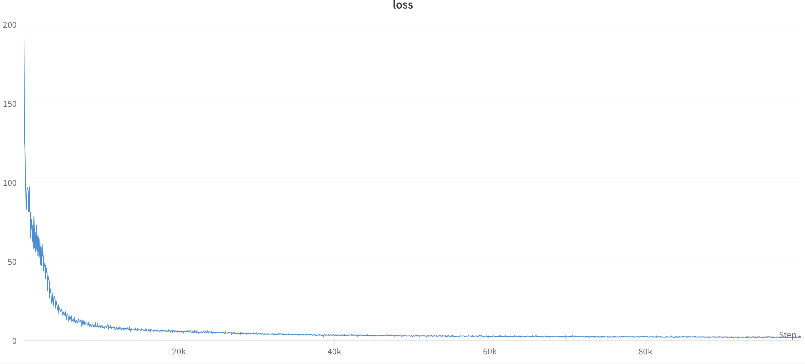

# PyTorch [Conformer](https://arxiv.org/abs/2005.08100) on IPU, this project is slightly different from the original paper, in which there are slight changes to the configuration of ipu.

## Environment setup

First, install the Poplar SDK following the instructions in the Getting Started guide for your IPU system. Make sure to source the `enable.sh` scripts for Poplar and PopART.

Then, create a virtual environment, install the required packages.

```console
virtualenv venv -p python3.6
source venv/bin/activate
make
pip install <path to the poptorch wheel from the Poplar SDK>
```

## Project files structure

| file/folder      | description                                                                                                                                                                 |
| ---------------- | --------------------------------------------------------------------------------------------------------------------------------------------------------------------------- |
| configs/         | Folder for model configs                                                                                                                                                    |
| src/             | Source code folder                                                                                                                                                          |
| src/iterator/    | Data iterator related, Perform data set loading, encapsulation and preprocessing                                                                                            |
| src/utils/       | Utils folder contains some callable modules independent of the torch framework, including initializer and lr_scheduler、mask、ipu_pipeline and other functional modules  |
| src/conformer.py | Main frame function of model structure setting                                                                                                                              |
| src/trainer.py   | IPU config, dataset building, and other configurations building; training and validate main workflow                                                                        |
| requirements.txt |                                                                                                                                                                             |

## Data preparation

This Open Source Mandarin Speech Corpus, AISHELL-ASR0009-OS1, is 178 hours long. It is a part of AISHELL-ASR0009, of which utterance contains 11 domains, including smart home, autonomous driving, and industrial production. The whole recording was put in quiet indoor environment, using 3 different devices at the same time: high fidelity microphone (44.1kHz, 16-bit,); Android-system mobile phone (16kHz, 16-bit), iOS-system mobile phone (16kHz, 16-bit). Audios in high fidelity were re-sampled to 16kHz to build AISHELL- ASR0009-OS1. 400 speakers from different accent areas in China were invited to participate in the recording. The manual transcription accuracy rate is above 95%, through professional speech annotation and strict quality inspection. The corpus is divided into training, validation and testing sets.
The link of AISHELL-ASR0009-OS1's original path is https://www.openslr.org/33/.

### Note
We use [WeNet](https://github.com/wenet-e2e/wenet) script for data preparation, you need clone the repository and run the script as below:
```
shell
    git clone https://github.com/wenet-e2e/wenet
    cd wenet/examples/aishell/s0
    bash run.sh --stage -1 --stop_stage 3 --data /path/to/aishell_dataset
    mv data /path/to/this/project
```
The data processing will take about 50 minutes (depending on your network and machine). Full datasets are ~103G, so please make sure you have enough space to store the dataset.
Note that the `/path/to/aishell_dataset` is where the raw and processed AiShell datasets are located. `/path/to/this/project` is the root path of this project.

### WeNet files structure

| file/folder                                                                                 | description                                                                                                                                                          |
| ------------------------------------------------------------------------------------------- | -------------------------------------------------------------------------------------------------------------------------------------------------------------------- |
| data/                                                                  | data root, generated features and labels after preprocessing the aishell dataset                                                                                     |
| data/{train|dev|test}/data.list        | form file, records the train data dict between the ID or name of the feature and the real path where the feature is located, generally each line represents a feature |
| data/{train|dev|test}/text                                            | Text file，records the text label corresponding to all audio                                                                                                     |
| data/{train|dev|test}/wav.scp                                            | Text file，records the audio ID and file path                                                                                                     |
| data/dict/lang_char.txt                                 | Text file, records all vocabulary tokens information and key, and one line represents one character                                                                          |
| data/train/global_cmvn                 | Text file, records the all features's cmvn information                                         |

## Running and benchmarking

To run a tested and optimised configuration and to reproduce the performance shown on our [performance results page](https://www.graphcore.ai/performance-results), please follow the setup instructions in this README to setup the environment, and then use the `examples_utils` module (installed automatically as part of the environment setup) to run one or more benchmarks. For example:

```bash
python3 -m examples_utils benchmark --spec <path to benchmarks.yml file>
```

Or to run a specific benchmark in the `benchmarks.yml` file provided:

```bash
python3 -m examples_utils benchmark --spec <path to benchmarks.yml file> --benchmark <name of benchmark>
```

For more information on using the examples-utils benchmarking module, please refer to [the README](https://github.com/graphcore/examples-utils/blob/master/examples_utils/benchmarks/README.md).

# Example of training the model

First, train the model you should go to the `wenet_conformer` directory and `make`, then it will generate a `custom_ops.so` file, and this file will be used in the training.

If you want to execute the task of Conformer-medium fp16 with 4 IPUs, you can refer to the following command, and the shell script is in scripts/run_wenet_conformer_fp16.sh:

```
python main.py train

```

If you want to execute the task of Conformer-medium fp32 with 4 IPUs, you can refer to the following command, and the shell script is in scripts/run_wenet_conformer_fp32.sh:

```
python main.py train --trainer.log_every_n_step 10 --scheduler.warmup_steps 25000 --train_dataset.dtype 'FLOAT32' --val_dataset.dtype 'FLOAT32' --trainer.dtype 'FLOAT32'  --train_iterator.batch_size 4 --ipu_options.gradient_accumulation 72
```

If you want to execute the Conformer-medium 'generate_data' mode of fp16 with 2 IPUs, you can refer to the following command, and the shell script is in scripts/run_wenet_conformer_generate.sh:

```
python main.py train --train_dataset.use_generated_data true
```

And the Conformer-medium trained loss curve(global_bs=288) is shown in the table:

|      | 0     | 40     | 80    | 120    | 180    | 200   |  240  |
| ---- | ----- | ------ | ----- | ----- | ----- | ----- |----- |
| fp16 | 206.162 | 7.195 | 4.453 | 3.386 | 2.549 | 2.176 |  2.02 |


The Conformer-medium float16 loss is shown in the figure below


In order to better reflect the advantages of IPU in large batch size, and also to show the linearity of IPU performance from POD16 to POD64, we set the running script of global_batch_size=16128 to show the performance of IPU, and the shell scripts are in "scripts/run_wenet_conformer_globalbs_16128_pod16.sh" and "scripts/run_wenet_conformer_globalbs_16128_pod64.sh".

The performance of Global_batch_size=16128 can be seen in the below:

On M2000:
    throughput=819 on POD4;
    throughput=3163 on POD16;
    throughput=11689 on POD64.

On BOW:
    throughput=1126 on POD4;
    throughput=4302 on POD16;
    throughput=15815 on POD64.


# Example of validating the model

It can be validated by the following command, where the address of the model to be validated can be specified by "--checkpoints.save_checkpoint_path"
```
python3 main.py validate --checkpoints.save_checkpoint_path "./checkpoint" --trainer.num_epochs 240  --ipu_options.device_iterations 10

```

# Example of decoding the CER of model

It can be decoded by the following command, where the address of the model to be decoded can be specified by "--checkpoints.save_checkpoint_path", and the script can be seen in the "scripts/decode.sh"
```
python3 main.py validate --checkpoints.save_checkpoint_path "./checkpoint" --trainer.num_epochs 240  --ipu_options.device_iterations 10
python3 main.py recognize --train_dataset.dtype 'FLOAT32' --val_dataset.dtype 'FLOAT32' --trainer.dtype 'FLOAT32' --ipu_options.enable_half_partials False

```
Then it will validate the validation loss of all epochs and generate a "val_loss.txt" file and an average model, then it will decode the test set and get the CER of whole dataset, finally it will generate a result file "final_cer.txt" in your model saved address("--checkpoints.save_checkpoint_path")

## Licensing

The code presented here is licensed under the Apache License Version 2.0, see the LICENSE file in this directory.

This application leverages the Kaldi-ASR framework , Espnet and WeNet.

Espnet is licensed under Apache 2.0: https://github.com/espnet/espnet/blob/v.0.10.0/LICENSE

Kaldi-ASR is licensed under Apache 2.0: https://github.com/kaldi-asr/kaldi/blob/master/COPYING

WeNet is also licensed under Apache 2.0: https://github.com/wenet-e2e/wenet/blob/main/LICENSE
