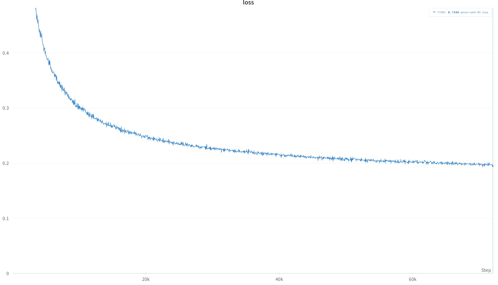

# PyTorch Fastpitch
This project is a IPU version of the [fastpitch project](https://github.com/NVIDIA/DeepLearningExamples/tree/793027c9da94eb8449ddda3f33543967269aa480/PyTorch/SpeechSynthesis/FastPitch).

### File structure

|file/folder|descriptions|
|-|------------|
|filelists|splits on ljspeech dataset|
|fastpitch/|model source codes for fastpitch|
|platform/|contains training scripts|
|scripts/|contains scripts for project preparation|
|tacotron2/|source from tacotron2 for data processing|
|waveglow/|source from waveglow. This not used for training, it is retained for further development on inference|
|ipu_config.py|IPU specific configs|
|pipeline_base_model.py|the base class for pipeline model on IPU|
|train.py|define the process of training|
|requirements.txt|-|
|extract_mels.py|data processing related|
|dataset.py|a cached dataset for better dataloading speed|
|data_functions.py|API to initialize modules|
|loss_functions.py|API to initialize modules|
|model.py|API to initialize modules|
|tests/|source for unit-testing|
|pic/loss_curve.jpeg|picture for loss curve|


### Prepare environment and dataset


Prepare environment

First, install the Poplar SDK following the instructions in the [Getting Started](https://docs.graphcore.ai/en/latest/getting-started.html) guide for your IPU system. Make sure to source the enable.sh scripts for Poplar and PopART.

Then, create a virtual environment, install the required packages.
```
virtualenv venv -p python3.6
source venv/bin/activate
pip install -r requirements.txt
```
Prepare dataset
```
bash scripts/download_dataset.sh
bash scripts/download_tacotron2.sh
bash scripts/prepare_dataset.sh
```
the preparation of the dataset may take a long time (about 10 hours) because it uses tacotron2 on CPU to do duration prediction.

## Running and benchmarking

To run a tested and optimised configuration and to reproduce the performance shown on our [performance results page](https://www.graphcore.ai/performance-results), please follow the setup instructions in this README to setup the environment, and then use the `examples_utils` module (installed automatically as part of the environment setup) to run one or more benchmarks. For example:

```python
python3 -m examples_utils benchmark --spec <path to benchmarks.yml file>
```

Or to run a specific benchmark in the `benchmarks.yml` file provided:

```python
python3 -m examples_utils benchmark --spec <path to benchmarks.yml file> --benchmark <name of benchmark>
```

For more information on using the examples-utils benchmarking module, please refer to [the README](https://github.com/graphcore/examples-utils/blob/master/examples_utils/benchmarks/README.md).

### Train

```
bash platform/FastPitch_FP32_2IPU.sh
```

### training curve



## Licensing
 
The example in this directory is licensed under the Apache License, Version 2.0. See the [LICENSE](LICENSE) file in this directory.
This license applies to the following files:
- dataset.py
- ipu_config.py
- pipeline_base_model.py
- pics/loss_curve.jpeg
- platform/FastPitch_FP32_2IPU.sh
- README.md
- tests/test_layers.py
- tests/unit_tester.py
 
The other files come from the original [FastPitch](https://github.com/NVIDIA/DeepLearningExamples/tree/793027c9da94eb8449ddda3f33543967269aa480/PyTorch/SpeechSynthesis/FastPitch) repository which is licensed under the 3-clause BSD license. The license from that repository is reproduced here as [ORIGINAL-FASTPITCH-LICENSE](ORIGINAL-FASTPITCH-LICENSE).
Some of the files in the `common/text` subdirectory are based on content from https://github.com/keithito/tacotron which is licensed under the MIT license. See the [LICENSE](common/text/LICENSE) file in that subdirectory for details.