<!-- Copyright (c) 2022 Graphcore Ltd. All rights reserved. -->
# Offline Tuple Packing for Graphs to Reduce Padding

When processing a batch of graphs in machine learning models, it is common
to combine (pack) several small graphs into one
overall graph to accelerate processing and reduce the overhead of padding.
This tutorial guides you through some data analysis on Graphs and graph packing to determine the efficient strategies for processing datasets drawn out of the OGB competition.

It was shown in "Packing: Towards 2x NLP BERT Acceleration. arXiv, jun 2021." by Matej Kosec et al. 2021 that for transformers padding can be a major part of the data and can cause a slow down of 50% and more.
As a consequence, the distribution of sizes and degrees of graphs in datasets and how much padding they require, is an important consideration.

This tutorial reproduces the results from the paper "Tuple Packing: Efficient Batching of Small Graphs in Graph Neural Networks" available on [arxiv](https://arxiv.org/abs/2209.06354).

## Analysing graph sizes

For the graph analysis, we focus on datasets in the OGB challenge that we load into PyTorch Geometric.


```python
import ogb
from ogb.graphproppred import PygGraphPropPredDataset
from torch_geometric.loader import DataLoader
from ogb.utils.mol import smiles2graph

ogb.utils.smiles2graph = smiles2graph
from ogb.lsc.pcqm4mv2_pyg import PygPCQM4Mv2Dataset
from pprint import pprint
```

    WARNING:root:The OGB package is out of date. Your version is 1.3.3, while the latest version is 1.3.4.


This first step loads those datasets ready for additional processing:


```python
ogb_data = {}


def get_training_dataloader(d_name: str) -> DataLoader:
    if d_name == "ogbg-pcqm4mv2":
        dataset = PygPCQM4Mv2Dataset(smiles2graph=smiles2graph)
    else:
        dataset = PygGraphPropPredDataset(name=d_name)

    split_idx = dataset.get_idx_split()
    train_loader = DataLoader(dataset[split_idx["train"]], batch_size=1, shuffle=False)
    return train_loader


for key in ["ogbg-molhiv", "ogbg-molpcba", "ogbg-code2", "ogbg-pcqm4mv2", "ogbg-ppa"]:
    print("loading:", key)
    ogb_data[key] = get_training_dataloader(key)
```

    loading: ogbg-molhiv
    loading: ogbg-molpcba
    loading: ogbg-code2
    loading: ogbg-pcqm4mv2
    loading: ogbg-ppa


We are interested in analysing the distribution in the number of edges and the number of nodes which is observed in the OGB small graph datasets.
For this analysis, we do not need the graphs, we can limit ourselves to 2D histograms that map a number of graphs to tuples with the number of nodes and edges to get a sense of the size distribution of the data.

Calculating the histograms can be a slow process so the results are cached to make running subsequent analysis faster.


```python
from collections import defaultdict
import pickle
from tqdm import tqdm


def get_histogram(data_loader):
    histogram = defaultdict(int)
    for item in tqdm(data_loader):
        histogram[(item.num_nodes, item.num_edges)] += 1
    return histogram


load_histogram = True
histogram_file = "histograms.pkl"

if os.path.exists(histogram_file) and load_histogram:
    # Generating the histograms takes ~30mn so we load a saved version
    # of the histograms if it has already been generated
    with open(histogram_file, "rb") as f:
        ogb_histograms = pickle.load(f)
else:
    ogb_histograms = {}
    for key in ogb_data:
        print("creating histogram:", key)
        ogb_histograms[key] = get_histogram(ogb_data[key])

# Save the histogram after processing
with open(histogram_file, "wb") as f:
    pickle.dump(ogb_histograms, f)

print("Displaying Histogram for 'ogbg-molhiv'")
print(ogb_histograms["ogbg-molhiv"])
```

    Displaying Histogram for 'ogbg-molhiv'
    defaultdict(<class 'int'>, {(24, 50): 349, (10, 18): 80, (16, 32): 335, (10, 20): 127, (26, 54): 244, (20, 42): 688, (13, 24): 92, (22, 46): 553, (42, 86): 17, (12, 26): 217, (12, 24): 268, (14, 32): 94, (9, 16): 69, (18, 38): 694, (14, 26): 144, (41, 80): 4, (15, 34): 148, (16, 36): 219, (9, 20): 15, (6, 12): 8, (33, 70): 121, (12, 22): 126, (11, 24): 100, (10, 22): 43, (29, 62): 270, (8, 14): 49, (4, 6): 8, (16, 30): 106, (19, 36): 78, (16, 34): 535, (9, 18): 87, (13, 26): 293, (14, 28): 311, (13, 30): 39, (28, 58): 196, (14, 30): 353, (18, 40): 442, (7, 14): 16, (7, 12): 19, (11, 20): 94, (6, 10): 11, (22, 42): 48, (23, 48): 395, (21, 46): 654, (66, 130): 1, (25, 52): 278, (17, 34): 346, (21, 40): 64, (17, 32): 110, (17, 36): 599, (20, 38): 85, (11, 22): 161, (22, 48): 684, (24, 52): 613, (26, 56): 452, (25, 54): 517, (3, 4): 2, (20, 40): 278, (19, 38): 267, (28, 60): 323, (30, 64): 217, (27, 58): 346, (19, 42): 555, (15, 30): 303, (21, 42): 202, (27, 56): 192, (13, 28): 252, (21, 44): 601, (25, 48): 25, (33, 64): 8, (35, 76): 145, (30, 70): 38, (51, 110): 18, (28, 56): 89, (26, 58): 352, (28, 62): 363, (31, 70): 84, (31, 66): 196, (20, 44): 647, (34, 70): 107, (48, 106): 19, (31, 68): 219, (30, 68): 108, (24, 46): 46, (23, 46): 155, (37, 72): 4, (32, 66): 111, (23, 50): 627, (19, 40): 653, (27, 60): 343, (46, 102): 39, (9, 14): 7, (12, 28): 12, (27, 52): 21, (38, 86): 47, (39, 88): 34, (56, 124): 9, (28, 54): 20, (38, 74): 6, (34, 74): 168, (29, 64): 285, (15, 28): 111, (21, 48): 254, (22, 50): 336, (34, 72): 123, (33, 72): 174, (32, 70): 216, (29, 56): 14, (60, 130): 3, (33, 68): 112, (23, 52): 341, (37, 80): 107, (38, 72): 1, (29, 60): 135, (15, 32): 463, (25, 56): 351, (53, 110): 3, (20, 46): 200, (29, 58): 65, (31, 62): 40, (58, 126): 13, (42, 90): 30, (44, 94): 33, (50, 106): 13, (58, 122): 13, (74, 154): 1, (43, 96): 30, (18, 34): 98, (33, 74): 113, (30, 66): 301, (2, 2): 2, (27, 54): 94, (61, 122): 2, (36, 70): 4, (17, 38): 307, (35, 74): 66, (40, 86): 76, (8, 16): 39, (23, 44): 37, (26, 50): 38, (50, 110): 18, (26, 52): 106, (44, 96): 23, (24, 54): 354, (45, 104): 5, (18, 36): 318, (22, 44): 181, (39, 92): 6, (47, 96): 7, (49, 100): 10, (25, 50): 101, (26, 60): 108, (46, 106): 3, (55, 116): 11, (47, 108): 9, (31, 60): 10, (31, 64): 111, (42, 88): 31, (24, 48): 126, (76, 166): 2, (29, 66): 119, (41, 88): 50, (64, 138): 4, (32, 68): 168, (30, 60): 60, (43, 94): 22, (5, 8): 3, (45, 98): 19, (34, 76): 92, (36, 80): 95, (52, 110): 17, (35, 78): 91, (12, 20): 10, (19, 44): 158, (46, 98): 25, (56, 122): 4, (54, 118): 6, (86, 186): 2, (44, 102): 6, (36, 74): 32, (45, 92): 9, (39, 86): 67, (18, 42): 70, (54, 114): 13, (35, 72): 81, (34, 68): 24, (38, 82): 85, (5, 10): 1, (36, 78): 112, (40, 88): 61, (48, 104): 14, (52, 112): 12, (36, 76): 90, (32, 62): 12, (52, 114): 15, (57, 124): 6, (47, 102): 14, (59, 124): 7, (64, 142): 2, (16, 38): 14, (53, 116): 6, (17, 40): 27, (33, 66): 17, (40, 82): 31, (39, 80): 34, (32, 64): 38, (30, 62): 107, (25, 58): 80, (43, 98): 8, (46, 104): 14, (39, 84): 75, (59, 130): 6, (62, 136): 6, (83, 180): 1, (56, 112): 3, (39, 78): 15, (37, 82): 76, (36, 72): 16, (27, 62): 128, (23, 54): 49, (40, 80): 13, (43, 92): 41, (47, 94): 4, (44, 92): 19, (63, 138): 4, (60, 132): 8, (45, 94): 14, (20, 36): 9, (38, 84): 66, (65, 144): 2, (51, 114): 6, (13, 22): 7, (16, 28): 11, (43, 90): 23, (46, 96): 9, (50, 104): 10, (33, 76): 42, (38, 80): 59, (15, 26): 16, (18, 32): 8, (53, 112): 11, (36, 84): 15, (44, 86): 3, (32, 72): 115, (42, 82): 3, (31, 72): 46, (22, 52): 45, (45, 102): 18, (28, 66): 26, (27, 64): 28, (29, 68): 33, (54, 116): 15, (56, 120): 8, (58, 124): 5, (24, 56): 84, (45, 96): 28, (53, 114): 8, (55, 118): 14, (57, 122): 16, (11, 26): 6, (57, 120): 5, (42, 94): 21, (61, 120): 1, (20, 48): 19, (43, 88): 16, (19, 46): 9, (56, 118): 10, (64, 144): 5, (65, 132): 3, (73, 148): 3, (35, 80): 43, (8, 18): 1, (30, 58): 15, (32, 76): 9, (53, 108): 1, (28, 64): 113, (42, 84): 12, (47, 92): 5, (46, 100): 15, (59, 126): 18, (48, 98): 9, (22, 40): 6, (24, 58): 11, (10, 28): 1, (38, 78): 33, (37, 74): 13, (63, 126): 1, (23, 42): 6, (67, 144): 7, (60, 126): 8, (62, 130): 6, (64, 134): 10, (63, 132): 9, (65, 140): 6, (61, 128): 4, (65, 138): 14, (53, 118): 12, (104, 216): 1, (7, 10): 3, (48, 102): 17, (41, 84): 16, (37, 78): 58, (47, 98): 10, (56, 128): 3, (49, 104): 9, (66, 140): 7, (69, 144): 2, (65, 136): 2, (58, 128): 4, (69, 148): 8, (43, 100): 11, (68, 144): 2, (73, 158): 2, (68, 146): 7, (66, 142): 2, (72, 156): 1, (64, 140): 1, (71, 154): 2, (37, 76): 37, (46, 94): 10, (87, 188): 1, (50, 112): 8, (71, 152): 4, (94, 202): 1, (36, 82): 36, (17, 30): 12, (70, 150): 2, (67, 142): 5, (60, 128): 4, (44, 100): 16, (51, 108): 10, (23, 58): 3, (21, 54): 1, (22, 56): 2, (40, 90): 42, (41, 90): 53, (56, 114): 3, (55, 122): 4, (52, 116): 9, (45, 100): 19, (39, 76): 3, (48, 94): 3, (41, 92): 22, (37, 84): 38, (70, 148): 1, (85, 170): 1, (49, 106): 7, (39, 82): 39, (48, 110): 7, (107, 222): 1, (24, 60): 5, (47, 118): 1, (45, 114): 1, (39, 90): 9, (46, 90): 1, (42, 96): 10, (25, 60): 13, (32, 74): 46, (47, 104): 20, (49, 108): 11, (35, 82): 5, (35, 68): 7, (47, 100): 9, (49, 110): 9, (48, 108): 13, (21, 50): 28, (41, 86): 28, (104, 206): 1, (44, 98): 24, (21, 38): 8, (27, 50): 5, (15, 36): 9, (38, 76): 16, (26, 62): 20, (68, 140): 1, (42, 92): 29, (38, 90): 2, (69, 150): 1, (76, 156): 1, (75, 154): 1, (61, 130): 4, (77, 164): 4, (14, 24): 6, (51, 112): 8, (44, 106): 1, (48, 114): 1, (25, 46): 7, (41, 82): 7, (17, 42): 5, (65, 130): 1, (80, 160): 2, (123, 250): 1, (138, 280): 1, (82, 164): 2, (8, 12): 4, (63, 130): 2, (71, 142): 1, (139, 278): 1, (57, 128): 3, (53, 120): 4, (67, 148): 3, (61, 136): 1, (34, 66): 11, (50, 100): 5, (53, 104): 3, (87, 186): 1, (59, 116): 2, (29, 54): 5, (60, 118): 1, (42, 98): 3, (38, 88): 13, (50, 102): 5, (63, 144): 7, (56, 110): 4, (55, 108): 3, (50, 98): 3, (52, 104): 2, (40, 78): 5, (45, 90): 3, (51, 100): 2, (57, 114): 1, (49, 94): 2, (13, 32): 2, (14, 38): 1, (43, 86): 5, (45, 88): 3, (34, 78): 57, (34, 80): 10, (47, 106): 13, (40, 84): 37, (62, 138): 3, (44, 84): 2, (102, 204): 1, (43, 102): 3, (74, 146): 3, (114, 228): 1, (88, 178): 5, (70, 146): 3, (72, 150): 2, (37, 86): 10, (96, 204): 3, (54, 122): 3, (41, 96): 2, (162, 336): 1, (69, 140): 1, (6, 8): 1, (22, 38): 1, (11, 18): 7, (10, 16): 4, (29, 52): 1, (24, 44): 3, (30, 56): 3, (54, 110): 4, (69, 152): 4, (82, 178): 1, (79, 172): 1, (81, 176): 1, (63, 128): 4, (77, 154): 4, (75, 150): 2, (83, 166): 5, (81, 164): 1, (76, 150): 3, (19, 34): 4, (90, 178): 1, (54, 120): 6, (31, 74): 4, (48, 100): 6, (52, 108): 5, (56, 116): 4, (60, 124): 1, (40, 92): 12, (91, 184): 1, (80, 162): 2, (72, 146): 1, (74, 148): 2, (87, 176): 2, (70, 136): 2, (49, 102): 16, (45, 106): 5, (48, 112): 3, (21, 56): 1, (18, 46): 1, (16, 42): 1, (15, 40): 1, (66, 144): 3, (24, 62): 2, (64, 136): 6, (80, 170): 2, (80, 176): 2, (53, 106): 3, (70, 140): 2, (62, 124): 1, (43, 84): 3, (15, 38): 5, (47, 110): 1, (33, 78): 5, (58, 118): 1, (35, 70): 12, (59, 128): 12, (62, 134): 5, (49, 98): 3, (43, 82): 1, (44, 90): 13, (59, 132): 4, (77, 158): 1, (96, 202): 1, (112, 238): 1, (53, 122): 1, (52, 120): 3, (75, 152): 1, (51, 116): 6, (49, 112): 4, (57, 132): 3, (61, 140): 2, (59, 136): 6, (65, 148): 4, (69, 156): 1, (26, 48): 6, (13, 34): 1, (12, 32): 3, (18, 44): 6, (26, 70): 1, (14, 36): 2, (16, 40): 3, (44, 88): 7, (49, 114): 1, (57, 112): 4, (54, 108): 2, (57, 116): 4, (56, 126): 5, (65, 142): 1, (67, 146): 1, (52, 118): 3, (64, 130): 1, (77, 166): 9, (85, 182): 3, (62, 126): 2, (116, 248): 1, (100, 224): 1, (104, 232): 1, (55, 120): 4, (69, 138): 1, (67, 134): 1, (50, 96): 1, (74, 158): 1, (28, 74): 1, (30, 72): 4, (63, 134): 8, (55, 124): 7, (50, 108): 7, (51, 106): 7, (67, 150): 1, (62, 132): 4, (75, 158): 2, (70, 160): 1, (20, 50): 1, (96, 224): 1, (70, 156): 2, (66, 148): 2, (82, 170): 1, (66, 134): 2, (57, 118): 3, (58, 132): 4, (37, 88): 3, (46, 92): 4, (26, 64): 1, (122, 264): 1, (72, 164): 1, (65, 146): 2, (53, 124): 3, (53, 128): 1, (72, 152): 4, (92, 198): 1, (40, 94): 2, (82, 194): 1, (65, 160): 1, (73, 176): 1, (41, 94): 9, (56, 104): 1, (106, 212): 1, (113, 226): 3, (109, 220): 2, (114, 232): 1, (118, 240): 1, (77, 170): 2, (52, 106): 3, (38, 92): 1, (71, 156): 1, (68, 158): 1, (76, 164): 1, (75, 162): 1, (29, 70): 3, (36, 86): 1, (39, 94): 1, (55, 114): 1, (69, 146): 1, (51, 102): 1, (95, 206): 5, (64, 132): 1, (92, 196): 1, (54, 112): 5, (23, 56): 2, (28, 70): 1, (69, 160): 1, (172, 376): 1, (144, 296): 2, (120, 250): 1, (24, 66): 1, (60, 138): 2, (32, 78): 1, (48, 96): 6, (121, 272): 1, (79, 176): 2, (93, 208): 1, (107, 240): 1, (139, 288): 1, (181, 384): 1, (100, 206): 1, (123, 246): 1, (86, 172): 1, (163, 336): 1, (116, 238): 1, (58, 120): 2, (90, 180): 1, (87, 174): 1, (71, 144): 1, (137, 276): 1, (118, 236): 1, (145, 290): 1, (68, 136): 2, (50, 114): 2, (67, 140): 2, (51, 104): 1, (67, 132): 1, (28, 52): 1, (49, 122): 1, (70, 152): 2, (104, 240): 1, (71, 150): 1, (57, 126): 2, (75, 156): 2, (31, 58): 1, (58, 114): 3, (28, 68): 2, (112, 248): 2, (98, 198): 1, (55, 112): 3, (61, 134): 1, (72, 154): 1, (90, 192): 1, (108, 236): 1, (118, 254): 1, (116, 246): 1, (118, 250): 1, (108, 232): 1, (105, 222): 1, (13, 36): 7, (74, 156): 1, (89, 190): 1, (96, 208): 1, (83, 176): 1, (134, 276): 1, (99, 210): 1, (14, 34): 4, (46, 108): 11, (70, 158): 1, (73, 166): 1, (58, 130): 6, (50, 124): 1, (56, 130): 1, (55, 128): 1, (73, 156): 1, (79, 168): 1, (81, 172): 1, (60, 134): 2, (80, 182): 2, (84, 190): 1, (88, 198): 1, (122, 268): 1, (92, 184): 1, (35, 66): 1, (37, 70): 1, (158, 332): 1, (149, 312): 1, (115, 238): 1, (30, 74): 2, (17, 44): 1, (35, 86): 1, (61, 132): 7, (104, 224): 1, (112, 240): 1, (74, 162): 3, (72, 168): 1, (47, 112): 1, (104, 228): 1, (88, 200): 1, (128, 296): 1, (72, 160): 1, (84, 184): 1, (144, 312): 1, (73, 152): 2, (140, 322): 2, (213, 494): 2, (205, 502): 1, (60, 136): 1, (160, 348): 1, (62, 128): 1, (83, 170): 1, (31, 76): 1, (135, 298): 1, (27, 68): 2, (33, 62): 1, (30, 76): 1, (70, 154): 2, (76, 168): 1, (75, 164): 1, (76, 160): 2, (73, 160): 7, (78, 164): 1, (161, 336): 2, (147, 308): 1, (189, 392): 1, (222, 468): 1, (88, 190): 1, (63, 136): 1, (52, 124): 2, (54, 126): 1, (45, 108): 1, (62, 140): 2, (25, 64): 2, (61, 138): 1, (11, 30): 1, (73, 162): 2, (72, 158): 2, (71, 158): 1, (68, 148): 1, (50, 120): 1, (84, 192): 1, (37, 90): 1, (76, 172): 1, (106, 214): 1, (64, 146): 3, (68, 154): 2, (140, 284): 1, (126, 254): 1, (214, 434): 1, (200, 404): 1, (131, 266): 1, (100, 202): 1, (202, 408): 1, (78, 168): 6, (62, 142): 2, (78, 170): 2, (95, 218): 1, (44, 108): 1, (22, 54): 1, (36, 88): 3, (34, 64): 1, (59, 118): 1, (66, 146): 1, (73, 164): 1, (80, 180): 1, (63, 142): 1, (34, 82): 1, (74, 160): 7, (93, 204): 3, (74, 164): 3, (75, 166): 1, (72, 162): 1, (39, 96): 1, (99, 200): 1, (127, 260): 1, (117, 240): 1, (51, 118): 2, (81, 168): 1, (83, 172): 1, (85, 184): 1, (82, 176): 1, (97, 212): 3, (101, 220): 1, (104, 230): 2, (93, 206): 2, (84, 186): 1, (95, 210): 1, (80, 172): 1, (117, 260): 3, (66, 138): 1, (90, 190): 1, (78, 166): 1, (76, 170): 1, (78, 174): 1, (68, 142): 1, (103, 216): 1, (80, 166): 1})


Let's first get some basic stats on the datasets:


```python
def get_num_samples(histogram):
    return sum([histogram[key] for key in histogram])


print("Number of graphs in each dataset:")
for key in ogb_histograms:
    print(key, get_num_samples(ogb_histograms[key]))
```

    Number of graphs in each dataset:
    ogbg-molhiv 32901
    ogbg-molpcba 350343
    ogbg-code2 407976
    ogbg-pcqm4mv2 3378606
    ogbg-ppa 78200


```python
def get_max_tuples_length(histogram):
    """Get the maximum entry size for each tuple component"""
    maximum_length = []
    for key in histogram:
        if not maximum_length:
            maximum_length = list(key)
        for index, entry in enumerate(maximum_length):
            maximum_length[index] = max(entry, key[index])
    return maximum_length


# getting  max_tuples_length
ogbg_mtl_dict = {}
for key in ogb_histograms:
    ogbg_mtl_dict[key] = get_max_tuples_length(ogb_histograms[key])
print("Maximum number of nodes and edges in each graph:")
pprint(ogbg_mtl_dict)
```

    Maximum number of nodes and edges in each graph:
    {'ogbg-code2': [36123, 36122],
     'ogbg-molhiv': [222, 502],
     'ogbg-molpcba': [313, 636],
     'ogbg-pcqm4mv2': [20, 54],
     'ogbg-ppa': [300, 36138]}


Detailed statistics on padding efficiency will be provided later in the tutorial.

For now, let's explore the distribution of number of nodes and edges in each of the datasets:


```python
import numpy as np
import matplotlib
import matplotlib.pyplot as plt
import os
from pathlib import Path

figure_directory = Path("graph_packing_tutorial")
figure_directory.mkdir(parents=True, exist_ok=True)


def visualize_2D_histogram(histogram, key, dropout=0.01):
    total_count = sum([histogram[(nodes, edges)] for nodes, edges in histogram])
    threshold = total_count * dropout / 100
    num_nodes = [
        nodes for nodes, edges in histogram if histogram[(nodes, edges)] >= threshold
    ]
    num_edges = [
        edges for nodes, edges in histogram if histogram[(nodes, edges)] >= threshold
    ]
    image = np.zeros([max(num_nodes) + 1, max(num_edges) + 1])
    exceptions = []
    for nodes, edges in histogram:
        try:
            image[nodes][edges] = histogram[(nodes, edges)]
        except IndexError:
            exceptions.append((nodes, edges, histogram[(nodes, edges)]))
    if exceptions:
        print(
            "Not visualised:", sum([i[2] for i in exceptions]) / total_count * 100, "%"
        )
    fig = plt.figure(dpi=200)
    im = plt.imshow(image, cmap=plt.cm.hot_r)
    cb = plt.colorbar(shrink=0.5)
    cb.set_label("Number of samples")
    plt.xlabel("Number of Edges")
    plt.ylabel("Number of Nodes")
    plt.title("Dataset: " + key)
    fig.savefig(figure_directory / f"{key}_dual_histogram.png", bbox_inches="tight")


for key in ogb_histograms:
    if not key == "ogbg-ppa":
        print("visualizing 2D histogram:", key)
        visualize_2D_histogram(ogb_histograms[key], key, dropout=0.01)
```

    visualizing 2D histogram: ogbg-molhiv
    Not visualised: 0.3039421294185587 %
    visualizing 2D histogram: ogbg-molpcba
    Not visualised: 0.34851559757152273 %
    visualizing 2D histogram: ogbg-code2
    Not visualised: 1.9792830950840243 %
    visualizing 2D histogram: ogbg-pcqm4mv2
    Not visualised: 0.017610813453832735 %


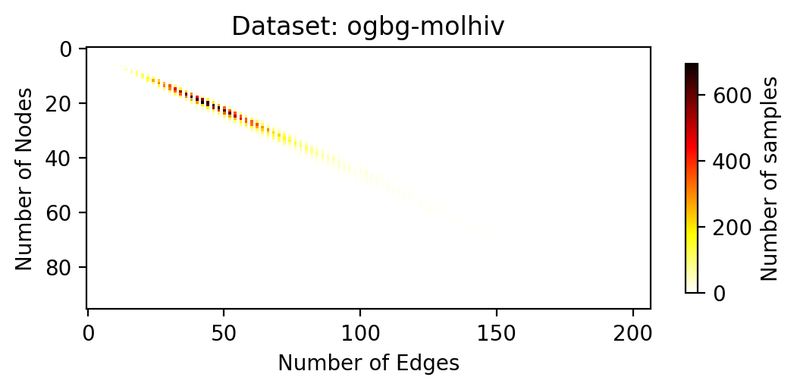


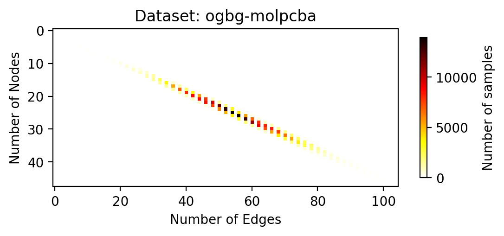


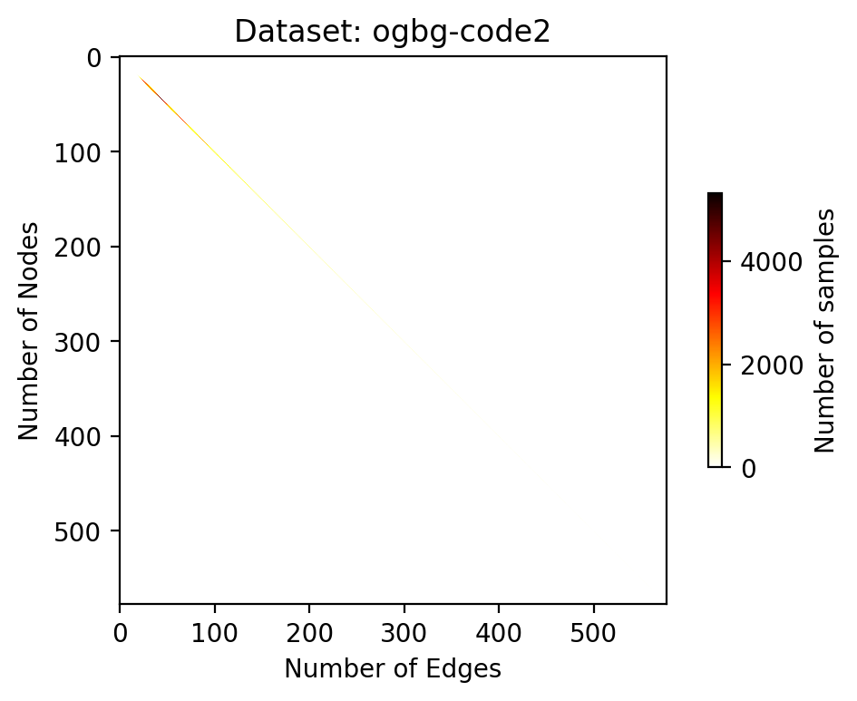


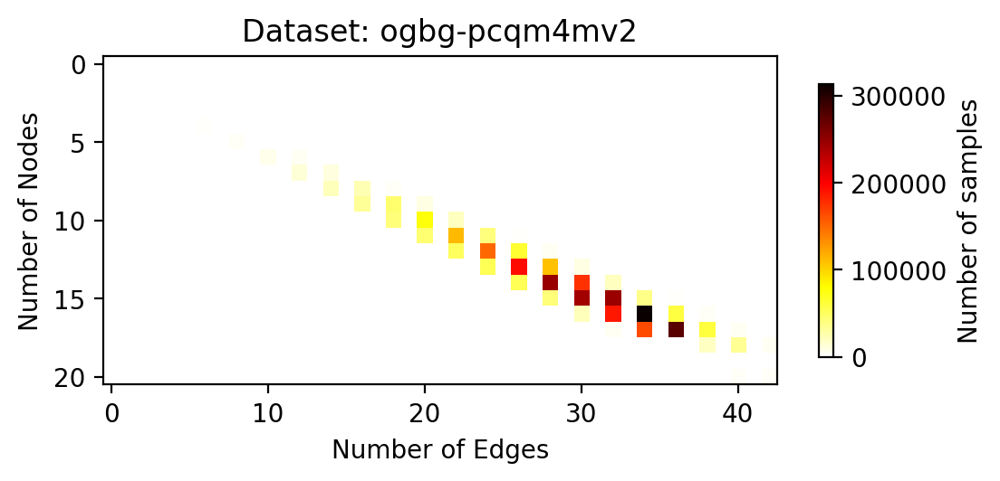


```python
def visualize_2D_histogram_builtin(histogram, key, dropout=0.01):
    """Uses plt.hist2d to do the same as the figure above"""
    total_count = sum([histogram[(nodes, edges)] for nodes, edges in histogram])
    threshold = total_count * dropout / 100
    raw_num_nodes = [nodes for nodes, edges in histogram]
    raw_num_edges = [edges for nodes, edges in histogram]
    raw_num_weights = [weights for weights in histogram.values()]
    fig = plt.figure(dpi=200)
    im = plt.hist2d(
        raw_num_edges,
        raw_num_nodes,
        weights=raw_num_weights,
        cmap=plt.cm.hot_r,
        bins=max(raw_num_nodes),
        cmin=threshold,
    )
    plt.xlabel("Number of Edges")
    plt.ylabel("Number of Nodes")
    plt.title("Dataset: " + key)
    cb = plt.colorbar(shrink=0.5)
    cb.set_label("Number of samples")
    fig.savefig(figure_directory / f"{key}_dual_histogram_v2.png", bbox_inches="tight")


for key in ogb_histograms:
    if not key == "ogbg-ppa":
        print("visualizing 2D histogram:", key)
        visualize_2D_histogram_builtin(ogb_histograms[key], key, dropout=0.01)
```

    visualizing 2D histogram: ogbg-molhiv
    visualizing 2D histogram: ogbg-molpcba
    visualizing 2D histogram: ogbg-code2
    visualizing 2D histogram: ogbg-pcqm4mv2


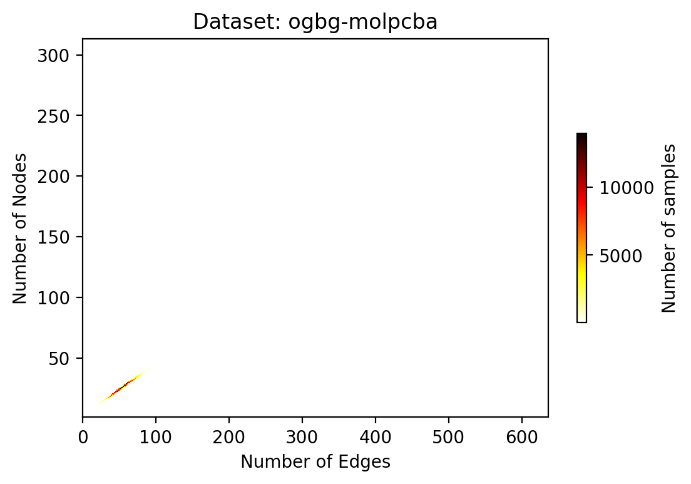


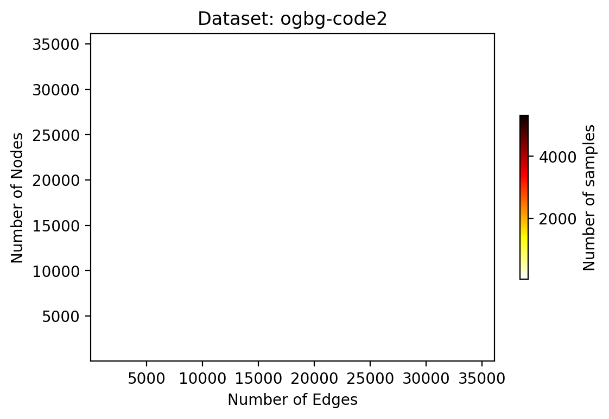


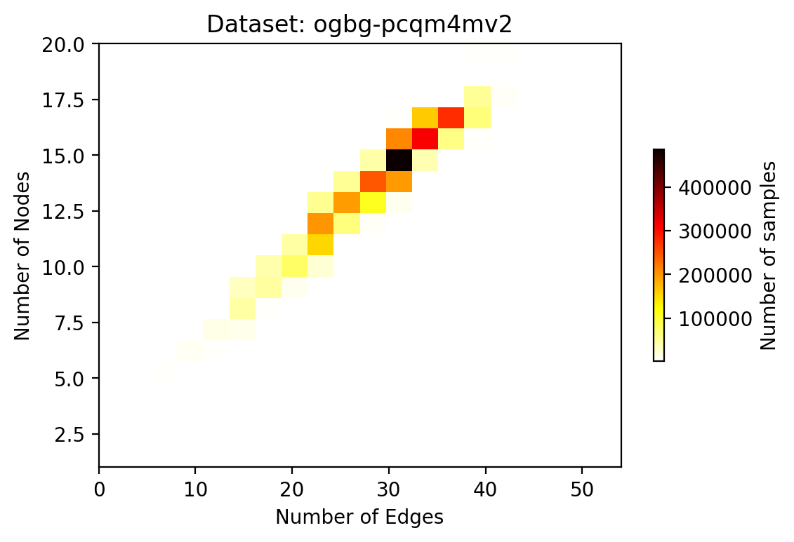


In the histograms, we focus on major bins and ignore the tails to get a better and faster visualisation.
For the `ogbg-ppa` this results in an empty image.
Feel free to explore different drop out rates and the `ogbg-ppa` dataset.
You can also explore the histograms for the number of nodes or edges.


```python
def visualize_nodes_edges_histogram(histogram, key, cumulative=False):
    num_nodes = []
    num_edges = []
    for nodes, edges in histogram:
        count = histogram[(nodes, edges)]
        num_nodes.extend([nodes] * count)
        num_edges.extend([edges] * count)

    min_num_nodes = int(min(num_nodes))
    max_num_nodes = int(max(num_edges))

    plt.hist(num_nodes, max_num_nodes - min_num_nodes + 1, cumulative=cumulative)
    plt.xlabel("Number of Nodes")
    plt.ylabel("Counts")
    plt.title("Histogram of number of graph nodes for " + key)
    plt.savefig(
        "graph_packing_tutorial"
        + os.sep
        + ("cumulative" if cumulative else "")
        + key
        + "_nodes_histogram.png",
        bbox_inches="tight",
    )
    plt.show()

    min_num_edges = int(min(num_edges))
    max_num_edges = int(max(num_edges))

    plt.hist(
        num_edges, max_num_edges - min_num_edges + 1, cumulative=cumulative
    )  # max_num_edges-min_num_edges+1)
    plt.xlabel("Number of Edges")
    plt.ylabel("Counts")
    plt.title(f"Histogram of number of edges for " + key)
    plt.savefig(
        "graph_packing_tutorial"
        + os.sep
        + ("cumulative" if cumulative else "")
        + key
        + "_edges_histogram.png",
        bbox_inches="tight",
    )
    plt.show()


for key in ogb_histograms:
    print("visualizing histograms: ", key)
    visualize_nodes_edges_histogram(ogb_histograms[key], key, cumulative=False)
```

    visualizing histograms:  ogbg-molhiv


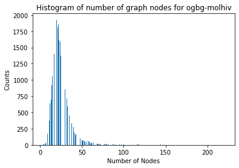


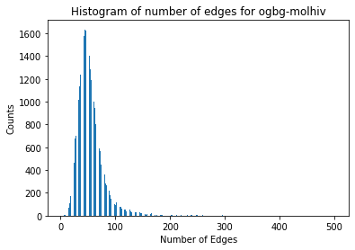


    visualizing histograms:  ogbg-molpcba


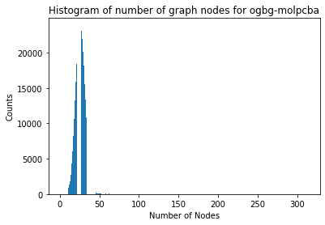


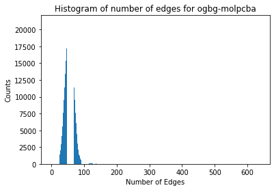


    visualizing histograms:  ogbg-code2


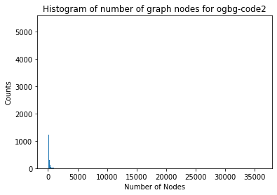


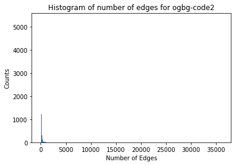


    visualizing histograms:  ogbg-pcqm4mv2


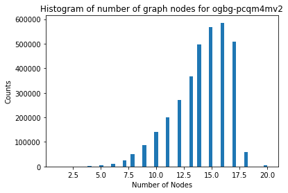


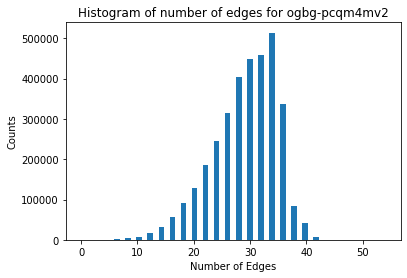


    visualizing histograms:  ogbg-ppa


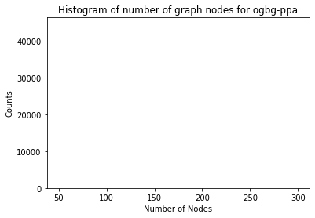


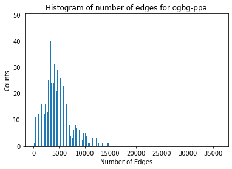


From the visualizations, it is evident that most graphs are much smaller than the largest graph in the dataset: this means that, for a batch size of 1, a major portion of the data will be padding.

For larger batch sizes, data usually gets combined which on average may lead to a better distribution, however, the size of a batch in theory can vary as much as we have variance between individual graphs. To minimise padding, it makes sense to batch graphs that result in a constant size of nodes and edges when combined.

## Tuple packing

To minimise the amount of padding needed to process a dataset we develop a heuristic which assigns a "sorting priority" to each graph and we will then assemble *packs* based on this priority.
This heuristic decides which graphs to tackle first as well as which graphs to prefer when filling empty spots:
a graph with a higher priority should be assigned to a *pack* before a graph with a lower priority.
There is a variety of possibilities for this heuristic. We provide the most intuitive ones.


```python
heuristics = {
    "prod": lambda x, y: int(x * y),
    "sum": lambda x, y: int(x + y),
    "max": lambda x, y: max(x, y),
    "min": lambda x, y: max(x, y),
    "node": lambda x, y: int(x),
    "edge": lambda x, y: int(y),
}
```

Now, we need some fast algorithm that decides which graphs to combine based on the heuristic.

Remember that the number of graphs can be large, hence, we have to operate on the histogram to get a solution fast.

Our approach is at its core to sort the histogram by the heuristic and iterate over it.
At the beginning as well if we can't find any pack, where we can add the graph and still meet the size constraints, we start a new pack with the current graph.
A pack describes which tuple sizes get combined and how many of these combinations are obtained.
For each pack, we calculate how much space is left in each component and apply the heuristic for sorting.
If multiple packs would fit a new incoming graph, we add it to the one with the smallest heuristic. This way, we get a near optimal fit.


```python
def pack_using_dlpfhp(
    histogram,
    max_tuple_length,
    max_tuples_per_pack,
    heuristic=lambda x, y: int(x * y),
    verbose=True,
):
    """Dual Longest-pack-first histogram-packing algorithm.

    Arguments:
        histogram Dict[Tuple[int, int], int]: The histogram of the dataset, it maps
            pairs of node and edge numbers to the number of graphs which match this
            specific size in the dataset.
        max_tuple_length (Tuple[int, int]): A pair that describes the maximum size of
            the container for each component that must be filled with
            packing. In this example this is a maximum number of nodes or edges.
        max_tuples_per_pack (int | Literal["max"]): This integer parameter limits how
                many tuples/graphs can be combined. If using "max", no limit on packs is
                set, which in some cases can slow down the packing algorithm drastically.
        heuristic (Callable[int, int]): A function which calculates the priority heuristic
            from the histogram key.
    """
    # heuristic assignment
    heuristic_data_list = [
        (heuristic(a, b), a, b, histogram[(a, b)]) for a, b in histogram
    ]
    heuristic_data_list.sort()
    heuristic_data_list.reverse()
    data_list = heuristic_data_list
    max_a, max_b = max_tuple_length[0], max_tuple_length[1]
    max_size = heuristic(max_a, max_b)
    if max_tuples_per_pack == "max":
        max_tuples_per_pack = min(max_tuple_length)
    # Initialize main strategy data dictionary.
    # The key indicates how much space is left.
    # The value is a list of tuples, consisting of counts and respective packs/tuples.
    tmp_strategies_per_length = defaultdict(list)
    strategies_per_length = defaultdict(list)
    for i in range(len(data_list)):  # distribute each bin of histogram
        size, len_a, len_b, n_sequences_to_bin = data_list[i]
        left_size = heuristic(max_a - len_a, max_b - len_b)
        offset = 0  # smallest possible offset for perfect fit
        while n_sequences_to_bin > 0:
            keys = [key for key in tmp_strategies_per_length if key >= size + offset]
            if not keys:
                offset = max_size + 1
            else:
                offset = min(keys) - size
            if (size + offset) in tmp_strategies_per_length:
                for i in range(len(tmp_strategies_per_length[size + offset])):
                    lens_a, lens_b, n_sequences_to_pack = tmp_strategies_per_length[
                        size + offset
                    ][i]
                    if (len_a + sum(lens_a)) <= max_a and (
                        len_b + sum(lens_b)
                    ) <= max_b:
                        tmp_strategies_per_length[size + offset].pop(i)
                        new_lens_a = lens_a.copy()
                        new_lens_a.append(len_a)
                        new_lens_b = lens_b.copy()
                        new_lens_b.append(len_b)
                        new_size = heuristic(
                            max_a - sum(new_lens_a), max_b - sum(new_lens_b)
                        )
                        new_count = min(n_sequences_to_pack, n_sequences_to_bin)
                        # adjust strategies
                        if n_sequences_to_pack > new_count:
                            tmp_strategies_per_length[size + offset].append(
                                (lens_a, lens_b, n_sequences_to_pack - new_count)
                            )
                        if not tmp_strategies_per_length[size + offset]:
                            tmp_strategies_per_length.pop(size + offset)
                        if new_size == 0 or max_tuples_per_pack == len(new_lens_a):
                            strategies_per_length[0].append(
                                (new_lens_a, new_lens_b, new_count)
                            )
                        else:
                            tmp_strategies_per_length[new_size].append(
                                (new_lens_a, new_lens_b, new_count)
                            )
                        n_sequences_to_bin -= new_count
                        offset = 0
                        break
            offset += 1
            if offset + size > max_size:
                new_size = heuristic(max_a - len_a, max_b - len_b)
                if new_size == 0 or max_tuples_per_pack == 1:
                    strategies_per_length[new_size].append(
                        ([len_a], [len_b], n_sequences_to_bin)
                    )
                else:
                    tmp_strategies_per_length[new_size].append(
                        ([len_a], [len_b], n_sequences_to_bin)
                    )
                n_sequences_to_bin = 0
                break
    # merge all strategies
    for key in tmp_strategies_per_length:
        strategies_per_length[key].extend(tmp_strategies_per_length[key])
    # flatten strategies dictionary
    strategy_set = []
    strategy_repeat_count = []
    sum_lens_a, sum_lens_b = [], []
    for key in strategies_per_length:
        for lens_a, lens_b, n_sequences_to_pack in strategies_per_length[key]:
            strategy_set.append((lens_a, lens_b))
            strategy_repeat_count.append(n_sequences_to_pack)
            sum_lens_a.append(sum(lens_a))
            sum_lens_b.append(sum(lens_b))
    if not (max_a == max(sum_lens_a) and max_b == max(sum_lens_b)):
        if verbose:
            print(
                "max discrepancy, reducing sequence length",
                max_a,
                max(sum_lens_a),
                max_b,
                max(sum_lens_b),
            )
        max_a, max_b = max(sum_lens_a), max(sum_lens_b)
    # efficiency calculation
    empty_tokens_a = int(
        sum(
            [
                count * (max_a - sum(pack_a))
                for count, (pack_a, pack_b) in zip(strategy_repeat_count, strategy_set)
            ]
        )
    )
    empty_tokens_b = int(
        sum(
            [
                count * (max_b - sum(pack_b))
                for count, (pack_a, pack_b) in zip(strategy_repeat_count, strategy_set)
            ]
        )
    )
    packs = int(sum(strategy_repeat_count))
    total_tokens_a, total_tokens_b = int(max_a * packs), int(max_b * packs)
    token_efficiency = (
        100 - empty_tokens_a / total_tokens_a * 100,
        100 - empty_tokens_b / total_tokens_b * 100,
    )
    return strategy_set, np.array(strategy_repeat_count), token_efficiency
```

Note that the code is written for tuples with two components like the number of nodes and edges but can easily be extended to more components.

The packing function calculates the "token efficiency" of the heuristic: it is the ratio of true data over the size of the padded data; larger numbers are better.

Now let's try a few heuristics to get a better picture.


```python
max_items_per_pack = 256
# other possibilities: "max", 1
heuristic = lambda x, y: int(x * y)

for key in ogb_histograms:
    # "ogbg-ppa" processing takes too long
    if key == "ogbg-ppa":
        continue
    print("----------------------------------------------------")
    print(f"Token efficiencies for '{key}' with:")
    print(f"   - maximum container sizes={ogbg_mtl_dict[key]}")
    print(f"   - max number of graphs per pack={max_items_per_pack}")
    print("  strategy, nodes, edges\n ------------------------")
    for heuristic in heuristics:
        _, _, token_efficiency = pack_using_dlpfhp(
            ogb_histograms[key],
            ogbg_mtl_dict[key],
            max_items_per_pack,
            heuristic=heuristics[heuristic],
        )
        print(f"  {heuristic}, {token_efficiency[0]:.2f}%, {token_efficiency[1]:.2f}%")
```

    ----------------------------------------------------
    Token efficiencies for 'ogbg-molhiv' with:
       - maximum container sizes=[222, 502]
       - max number of graphs per pack=256
      strategy, nodes, edges
     ------------------------
      prod, 95.56%, 90.50%
      sum, 97.52%, 92.37%
      max, 98.50%, 93.29%
      min, 98.50%, 93.29%
      node, 98.78%, 93.56%
      edge, 98.50%, 93.29%
    ----------------------------------------------------
    Token efficiencies for 'ogbg-molpcba' with:
       - maximum container sizes=[313, 636]
       - max number of graphs per pack=256
      strategy, nodes, edges
     ------------------------
      prod, 89.59%, 95.10%
      sum, 85.35%, 90.61%
      max, 92.58%, 98.28%
      min, 92.58%, 98.28%
      node, 91.51%, 97.14%
      edge, 90.64%, 96.22%
    ----------------------------------------------------
    Token efficiencies for 'ogbg-code2' with:
       - maximum container sizes=[36123, 36122]
       - max number of graphs per pack=256
      strategy, nodes, edges
     ------------------------
      prod, 45.96%, 45.60%
      sum, 45.96%, 45.60%
      max, 45.96%, 45.60%
      min, 45.96%, 45.60%
      node, 25.99%, 25.78%
      edge, 45.96%, 45.60%
    ----------------------------------------------------
    Token efficiencies for 'ogbg-pcqm4mv2' with:
       - maximum container sizes=[20, 54]
       - max number of graphs per pack=256
      strategy, nodes, edges
     ------------------------
      prod, 76.06%, 57.99%
      sum, 76.06%, 57.99%
      max, 76.06%, 57.99%
      min, 76.06%, 57.99%
      node, 75.07%, 57.23%
      edge, 76.06%, 57.99%


After comparing `max_items_per_pack=1` and `max_items_per_pack=256`, you will see that the efficiency improves drastically. You can also use the first case to get an estimate of the speedup you can achieve by combining graphs.

## Tuning the pack sizes

The number of tokens contained in each pack can be changed with the `max_tuple_length` argument.
It is an important parameter which can be tuned to improve the token efficiency of the packed dataset.
While the minimum size of the packs must be at least the size of the largest graph in the unpacked dataset, it can be made larger to allow more graphs to be assembled together for a higher token efficiency.

We will explore the effect of the `max_tuple_length` argument on the token efficiency when packing the `"ogbg-pcqm4mv2"` dataset.

For each parameter we collect the "node efficiency" and the "edge efficiency" which is the ratio of useful tokens over the total space for tokens in the packed dataset. These metrics give a measure of how much compute will be wasted on padding data.


```python
from tqdm import tqdm

dataset_to_analyse = "ogbg-pcqm4mv2"

max_nodes, max_edges = ogbg_mtl_dict[dataset_to_analyse]
histogram = ogb_histograms[dataset_to_analyse]
results = []
for pack_size_a in tqdm(range(max_nodes, 3 * max_nodes, 1)):
    for pack_size_b in range(max_edges, 3 * max_edges, 2):
        strategy_set, strategy_repeat_count, eff = pack_using_dlpfhp(
            histogram,
            max_tuple_length=[pack_size_a, pack_size_b],
            max_tuples_per_pack="max",
            heuristic=lambda x, y: x * y,
            verbose=False,
        )
        results.append(((pack_size_a, pack_size_b), eff))
```

    100%|██████████| 40/40 [00:22<00:00,  1.76it/s]


To compare our parameters we calculate the harmonic mean of the node and edge efficiencies, giving us a single metric representing the performance of a parameter combination.
Let's sort our results to find the best parameter combinations.


```python
import pandas as pd

harmonic_efficiency = [
    (2 / (1 / node_eff + 1 / edge_eff), node_eff, edge_eff, *sizes)
    for sizes, (node_eff, edge_eff) in results
]
harmonic_efficiency.sort()
harmonic_efficiency.reverse()
efficiency_df = pd.DataFrame(
    harmonic_efficiency,
    columns=[
        "harmonic_eff",
        "node_eff",
        "edge_eff",
        "node_pack_size",
        "edge_pack_size",
    ],
)
efficiency_df.set_index(keys=["node_pack_size", "edge_pack_size"], inplace=True)
efficiency_df.head()
```


<div>
<style scoped>
    .dataframe tbody tr th:only-of-type {
        vertical-align: middle;
    }

    .dataframe tbody tr th {
        vertical-align: top;
    }

    .dataframe thead th {
        text-align: right;
    }
</style>
<table border="1" class="dataframe">
  <thead>
    <tr style="text-align: right;">
      <th></th>
      <th></th>
      <th>harmonic_eff</th>
      <th>node_eff</th>
      <th>edge_eff</th>
    </tr>
    <tr>
      <th>node_pack_size</th>
      <th>edge_pack_size</th>
      <th></th>
      <th></th>
      <th></th>
    </tr>
  </thead>
  <tbody>
    <tr>
      <th rowspan="2" valign="top">30</th>
      <th>62</th>
      <td>98.792891</td>
      <td>98.990715</td>
      <td>98.595855</td>
    </tr>
    <tr>
      <th>64</th>
      <td>97.226749</td>
      <td>98.995891</td>
      <td>95.519729</td>
    </tr>
    <tr>
      <th>31</th>
      <th>62</th>
      <td>97.139032</td>
      <td>95.760512</td>
      <td>98.557821</td>
    </tr>
    <tr>
      <th>45</th>
      <th>96</th>
      <td>96.615549</td>
      <td>98.373570</td>
      <td>94.919260</td>
    </tr>
    <tr>
      <th>48</th>
      <th>100</th>
      <td>96.565057</td>
      <td>97.149356</td>
      <td>95.987746</td>
    </tr>
  </tbody>
</table>
</div>


Now let us compare to the results for the minimal value of pack size:


```python
efficiency_df.loc[[ogbg_mtl_dict[dataset_to_analyse]], :]
```


<div>
<style scoped>
    .dataframe tbody tr th:only-of-type {
        vertical-align: middle;
    }

    .dataframe tbody tr th {
        vertical-align: top;
    }

    .dataframe thead th {
        text-align: right;
    }
</style>
<table border="1" class="dataframe">
  <thead>
    <tr style="text-align: right;">
      <th></th>
      <th></th>
      <th>harmonic_eff</th>
      <th>node_eff</th>
      <th>edge_eff</th>
    </tr>
    <tr>
      <th>node_pack_size</th>
      <th>edge_pack_size</th>
      <th></th>
      <th></th>
      <th></th>
    </tr>
  </thead>
  <tbody>
    <tr>
      <th>20</th>
      <th>54</th>
      <td>65.805146</td>
      <td>76.060343</td>
      <td>57.986801</td>
    </tr>
  </tbody>
</table>
</div>


To gain a better understanding of the distribution of where efficient packing parameters cluster, let us visualize the harmonic mean of the efficiencies for all combinations of parameters.


```python
import numpy

result_image = numpy.zeros([max_edges, 2 * max_nodes])
edges = []
nodes = []

for (n, e), d in results:
    result_image[(e - max_edges) // 2][n - max_nodes] = max(
        50, 2 / (1 / d[0] + 1 / d[1])
    )
    edges.append(e)
    nodes.append(n)


fig = plt.figure(dpi=300)
extent = None
extent = np.min(edges), np.max(edges), np.max(nodes), np.min(nodes)
im = plt.imshow(result_image.T, cmap=plt.cm.hot_r, extent=extent)
cb = plt.colorbar(shrink=0.5)
cb.set_label("Harmonic Efficiency (%)")
plt.xlabel("Number of Edges")
plt.ylabel("Number of Nodes")
fig.savefig(
    "graph_packing_tutorial" + os.sep + "PCQM4Mv2_tuple_pack_performance.png",
    bbox_inches="tight",
)
```


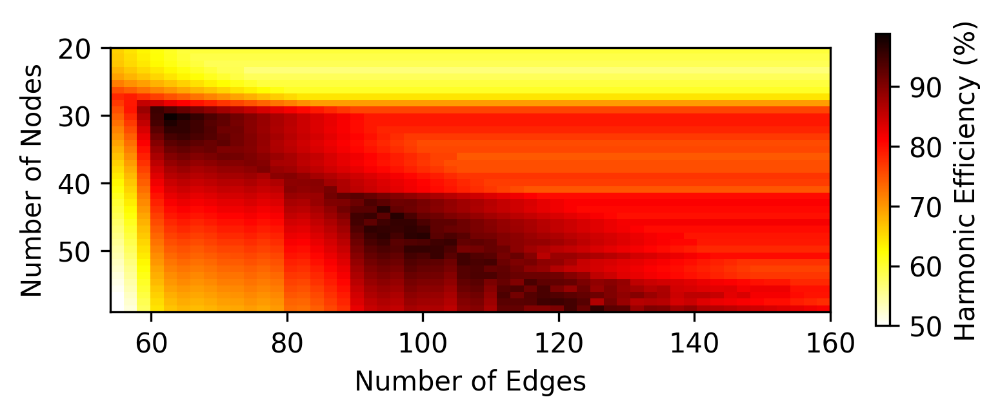


We can see that the best harmonic mean of the packing efficiency on the nodes and edges is obtained at 30 nodes and 62 edges with a value of (98.6%, 99.0%).
It is close to perfect, and much better than the 70% achieved when using the maximum sizes found in the ogbg-pcqm4mv2 dataset (20 nodes and 56 edges).
We also get good results for 45 nodes and 96 edges (94.9%, 98.4%). Having multiple efficient packing parameter combinations is useful as it lets us tradeoff some packing efficiency with compute efficiency, as bigger packs may allow us to use the IPUs more efficiently, while smaller packs can help a model fit on fewer IPUs. The good results are mostly centred close to the diagonal where there are twice as many edges as nodes.

## Conclusion

This tutorial is a companion to the paper "Tuple Packing: Efficient Batching of Small Graphs in Graph Neural Networks" available on [arxiv](https://arxiv.org/abs/2209.06354).
It worked through the calculation of efficient packs for a range of datasets in the OGB competition.
We showed how histograms can be used to efficiently calculate heuristics and assemble optimised packs of graphs for processing in GNNs.
We also analysed the importance of pack size on the efficiency of the packed dataset.

If you like this tutorial and use the code, please cite our paper.
