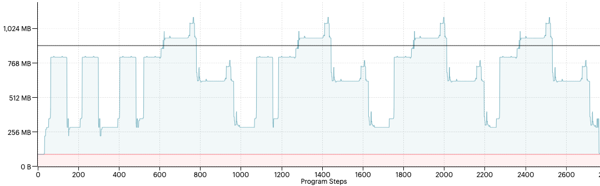
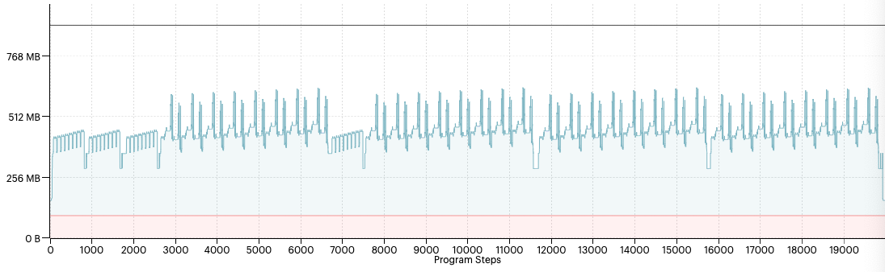

<!-- Copyright (c) 2022 Graphcore Ltd. All rights reserved. -->
# TensorFlow 2 Recomputation Checkpoints Example

## Overview

IPU TensorFlow supports Keras models using checkpointing of values to reduce live memory peaks during computation.
Adding one or more [`ipu_tensorflow_addons.keras.layers.RecomputationCheckpoint`](https://docs.graphcore.ai/projects/tensorflow-user-guide/en/latest/ipu_tensorflow_addons/api.html#ipu_tensorflow_addons.keras.layers.RecomputationCheckpoint) Keras layers into a model will allow activations to be recomputed
from checkpoints in a training graph, and can be useful where otherwise there would need to be too many live activations. See the technical note [Memory and Performance Optimisation on the IPU](https://docs.graphcore.ai/projects/memory-performance-optimisation/en/latest/common-memory-optimisations.html#recomputation-checkpoints) for more information.

For example, a recurrent layer such as an LSTM or GRU with many timesteps might have a large amount of activations live
at the start of the backwards pass. By dividing the layer into multiple smaller layers and adding checkpoints of the intermediate
states, the peak liveness of the graph can be substantially reduced. During the backward pass, activations are recomputed from the most recent
checkpoint, which can then be discarded once it has been passed.

As the checkpoints need to store the current state of the model in the forward pass there is a memory cost to adding checkpoints, which needs
to be balanced against the reduction in activation liveness. There can also be a memory cost due to increased code complexity -
for the example given here we are dividing a long LSTM into several shorter LSTMs of equal length. The fact that they are the same length allows the
compiler to use function outlining for the identical shorter LSTMs. Using different lengths could prevent function outlining
and increase the amount of code needed in memory.

## How to use this example

1) Prepare the TensorFlow 2 environment.

   Install the Poplar SDK (see the [Getting Started](https://docs.graphcore.ai/en/latest/getting-started.html) guide for your IPU system). Make sure to run the enable.sh script for Poplar and activate a Python 3 virtualenv with the tensorflow-2 and ipu_addons_tensorflow2 wheels from the Poplar SDK installed.

2) Run the graph.

    `python3 recompute_lstm.py`


## Examples

In this example an LSTM with 2048 timesteps is replaced with eight LSTMs of 256 timesteps. At the
end of each smaller LSTM the full state is stored in a ``RecomputationCheckpoint`` and used as the initial
state for the next LSTM.

By splitting the model using checkpoints the amount of live memory is reduced, allowing larger models to fit or larger
batch sizes to be used.

Without recomputation checkpoints the liveness exceeds the max memory.

```
python3 recompute_lstm.py --seq-len 2048 --checkpoints 0
```

This can be seen by viewing the Liveness Report in the PopVision Graph Analyser:




Using 7 recomputation checkpoints to divide the LSTM into 8 equal sections reduces the peak live memory.

```
python3 recompute_lstm.py --seq-len 2048 --checkpoints 7
```



## Tests

To run the tests you need to install the requirements and run pytest:

```
pip3 install -r tests/requirements.txt
python3 -m pytest
```

## Points to note

* As with other recomputation options the reduction in memory use comes at the expense of extra computation.
* Recomputation checkpoints can add to the code size of the compiled model. In the example above seven checkpoints
  were used to divide a long LSTM into eight equal sections of length 256. Code outlining then allows the code to process these
  smaller sections to be efficiently stored - if they had been of different lengths then the increase in program code size could
  outweigh the savings in live memory. For best results ensure `optimizations.enable_graph_outlining`
  is on (the default) when configuring the IPU.
* There is a trade-off in memory between the cost of storing the intermediate states and the savings made by having less
  activations live during the backward pass. The optimal number of checkpoints will vary from model to model.
* The model needs to be pipelined, with recomputation turned on, and be using the ``RecomputeAndBackpropagateInterleaved``
  mode. This can be done on a single IPU as shown in the example.
