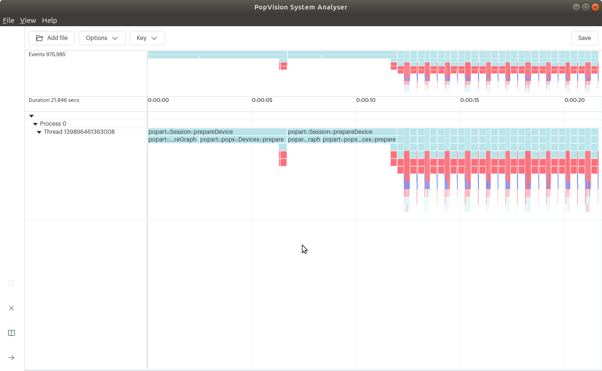
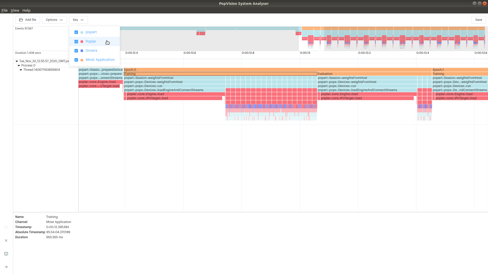

Tutorial 1: instrumenting applications
--------------------------------------

For this tutorial we are going to use a PopART MNIST example and add instrumentation that can be viewed using the PopVision System Analyser. You can download the PopVision System Analyser from the Downloads Portal: <https://downloads.graphcore.ai/>

The PopART MNIST example is in the `start_here` directory (this is a subset of the code from the `code_examples/popart/mnist` directory). Enter the `start_here` directory and follow the instructions in the README.md to install the required modules and download the data.

Once you have followed the instructions and been able to run the MNIST example we will re-run the MNIST example with instrumentation enabled. Note: A new report file will be created each time you run this command so you will need to close and open the new report each time.

    PVTI_OPTIONS='{"enable":"true"}' python3 popart_mnist.py

When this has completed you will find a pvti file in the current working directory. e.g. "Tue_Nov_24_11:59:17_2020_GMT_4532.pvti". Note: You can specify an output directory for the pvti files to be written to

    PVTI_OPTIONS='{"enable":"true", "directory": "tommyFlowers"}' python3 popart_mnist.py

Open the PopVision System Analyser and then select "Open a report" and select the pvti file generated. You may need to copy the pvti file to your local machine.

You should then see the following profile information. 

We are now going to modify the MNIST example to add instrumentation to clearly show the epochs.

Firstly, we need to import the libpvti library. 

Add the import statement at the top of `popart_mnist.py`

    import libpvti as pvti

Next we will need to create a trace channel. Add the `mnistPvtiChannel` as a global object. 

    minstPvtiChannel = pvti.createTraceChannel("Mnist Application")

We are going to use the Python `with` keyword with a Python context manager to instrument the epoch loop. Note you will need to indent the contents of the loop

    print("Running training loop.")
    for i in range(opts.epochs):
      with pvti.Tracepoint(minstPvtiChannel, f"Epoch:{i}"):
        ...

We leave it as an exercise for the reader to add instrumentation of the training & evaluation phases. When added you will see the following profile in the PopVision System Analyser. Note: You can nest the Tracepoint statements.

This is a very simple use case for adding instrumentation. The PopVision trace instrumentation library (libpvti) provides other APIs to instrument your Python and C++ code. For more information please see the <a href=https://docs.graphcore.ai/projects/graphcore-popvision-user-guide/en/latest/libpvti.html>PVTI library section in the PopVision User Guide</a>.

Copyright (c) 2020 Graphcore Ltd. All rights reserved.
