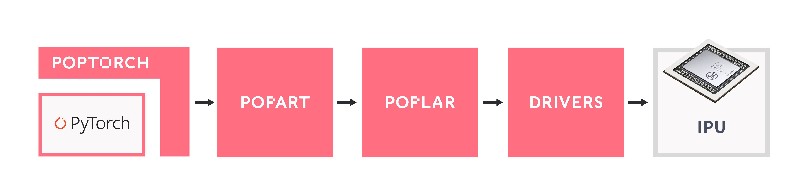
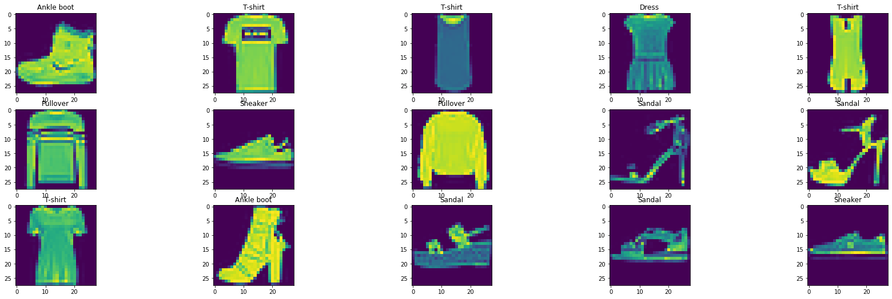
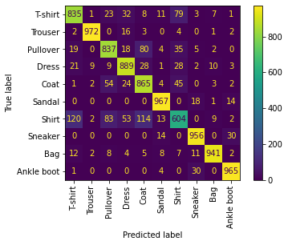

Introduction to PopTorch - running a simple model
======================================

This tutorial covers the basics of model making in PyTorch, using `torch.nn.Module`, and the specific methods to convert a PyTorch model to a PopTorch model so that it can be run on a Graphcore IPU.

Requirements:
   - an installed Poplar SDK. See the Getting Started guide for your IPU hardware for details of how to install the SDK;
   - Other Python modules: `pip install torchvision sklearn matplotlib tqdm`

Table of Contents
=================
* [What is PopTorch?](#what-is-poptorch)
* [Getting started: training a model on the IPU](#getting-started-training-a-model-on-the-ipu)
    * [Import the packages](#import-the-packages)
    * [Load the data](#load-the-data)
        * [PopTorch DataLoader](#poptorch-dataloader)
    * [Build the model](#build-the-model)
    * [Prepare training for IPUs](#prepare-training-for-ipus)
    * [Train the model](#train-the-model)
        * [Training loop](#training-loop)
        * [Save the trained model](#save-the-trained-model)
    * [Evaluate the model](#evaluate-the-model)
* [Running our model for inference on an IPU](#running-our-model-for-inference-on-an-ipu)
* [Doing more with poptorch.Options](#doing-more-with-poptorchoptions)
    * [deviceIterations](#deviceiterations)
    * [replicationFactor](#replicationfactor)
    * [randomSeed](#randomseed)
    * [useIpuModel](#useipumodel)
    * [How to set the options](#how-to-set-the-options)
* [Going further](#going-further)

# What is PopTorch?

PopTorch is a set of extensions for PyTorch to enable PyTorch models to run on Graphcore's IPU hardware.

PopTorch supports both inference and training. To run a model on the IPU you wrap your existing PyTorch model in either a PopTorch inference wrapper or a PopTorch training wrapper. You can provide further annotations to partition the model across multiple IPUs.

You can wrap individual layers in an IPU helper to designate which IPU they should go on. Using your annotations, PopTorch will use [PopART](https://docs.graphcore.ai/projects/popart-user-guide/) to parallelise the model over the given number of IPUs. Additional parallelism can be expressed via a replication factor which enables you to data-parallelise the model over more IPUs.

Under the hood PopTorch uses [TorchScript](https://pytorch.org/docs/stable/jit.html), an intermediate representation (IR) of a PyTorch model, using the `torch.jit.trace` API. That means it inherits the constraints of that API. These include:

- Inputs must be Torch tensors or tuples/lists containing Torch tensors;

- None can be used as a default value for a parameter but cannot be expliticly passed as an input value;

- Hooks and `.grad` cannot be used to inspect weights and gradients;

- `torch.jit.trace` cannot handle control flow or shape variations within the model. That is, the inputs passed at run-time cannot vary the control flow of the model or the shapes/sizes of results;

To learn more about TorchScript and JIT, you can go through this [tutorial](https://pytorch.org/tutorials/beginner/Intro_to_TorchScript_tutorial.html).

PopTorch has been designed to require few manual alterations to your models in order to run them on IPU. However, it does have some differences from native PyTorch execution. Also, not all PyTorch operations have been implemented by the backend yet. You can find the list of supported operations [here](https://docs.graphcore.ai/projects/poptorch-user-guide/en/latest/supported_ops.html).



# Getting started: training a model on the IPU

We will do the following steps in order:

1. Load the Fashion-MNIST dataset using `torchvision.datasets` and `poptorch.DataLoader`
2. Define a deep CNN  and a loss function using the `torch` API
3. Train the model on an IPU using `poptorch.trainingModel`
4. Evaluate the model on the CPU

### Import the packages

PopTorch is a separate package from PyTorch, and available in Graphcore's Poplar SDK. Both must thus be imported:


```python
import torch
import poptorch
import torchvision
import torch.nn as nn
import matplotlib.pyplot as plt
from tqdm import tqdm
```

Under the hood, PopTorch uses Graphcore's high-performance machine learning framework PopART. It is therefore necessary to enable PopART and Poplar in your environment.

>**NOTE**:
>If you forget to enable PopART in your environment, you will encounter the error `ImportError: libpopart.so: cannot open shared object file: No such file or directory` when importing `poptorch`. 
>If the error message says something like `libpopart_compiler.so: undefined symbol: _ZN6popart7Session3runERNS_7IStepIOE`, it most likely means the versions of PopART and PopTorch do not match, for example by enabling PopART with a previous SDK release's `enable.sh` script. Make sure to not mix SDK's artifacts.

### Load the data

We will use the Fashion-MNIST dataset made available by the package `torchvision`. This dataset, from [Zalando](https://github.com/zalandoresearch/fashion-mnist), can be used as a more challenging replacement to the well-known MNIST dataset.

The dataset consists of 28x28 grayscale images and labels of range \[0, 9] from 10 classes: T-shirt, trouser, pullover, dress, coat, sandal, shirt, sneaker, bag and ankle boot.

In order for the images to be usable by PyTorch, we have to convert them to `torch.Tensor` objects. To improve overall performance, we will also normalise the data. Furthermore, we will apply both operations, conversion and normalisation, to the datasets using `torchvision.transforms` and feed these ops to `torchvision.datasets`:


```python
transform = torchvision.transforms.Compose([
    torchvision.transforms.ToTensor(),
    torchvision.transforms.Normalize((0.5,), (0.5,))])

train_dataset = torchvision.datasets.FashionMNIST("./datasets/", transform=transform, download=True, train=True)
test_dataset = torchvision.datasets.FashionMNIST("./datasets/", transform=transform, download=True, train=False)
classes = ("T-shirt", "Trouser", "Pullover", "Dress", "Coat", "Sandal", "Shirt", "Sneaker", "Bag", "Ankle boot")
```

With the following method, we can visualise a sample of these images and their associated labels:


```python
plt.figure(figsize=(30, 15))
for i, (image, label) in enumerate(train_dataset):
    if i == 15:
        break
    image = (image / 2 + .5).numpy() # reverse transformation
    ax = plt.subplot(5, 5, i + 1)
    ax.set_title(classes[label])
    plt.imshow(image[0])
```
    


##### PopTorch DataLoader

We can feed batches of data into a PyTorch model by simply passing the input tensors. However, this is unlikely to be the most efficient way and can result in data loading being a bottleneck to the model, slowing down the training process. In order to make data loading easier and more efficient, there's the [`torch.utils.data.DataLoader`](https://pytorch.org/docs/stable/data.html) class, which is an iterable over a dataset and which can handle parallel data loading, a sampling strategy, shuffling, etc.

PopTorch offers an extension of this class with its [`poptorch.DataLoader`](https://docs.graphcore.ai/projects/poptorch-user-guide/en/latest/batching.html#poptorch-dataloader) class, specialised for the way the underlying PopART framework handles batching of data. We will use this class later in the tutorial, as soon as we have a model ready for training.

### Build the model

We will build a simple CNN model for a classification task. To do so, we can simply use PyTorch's API, including `torch.nn.Module`. The difference from what we're used to with pure PyTorch is the _loss computation_, which has to be part of the `forward` function. This is to ensure the loss is computed on the IPU and not on the CPU, and to give us as much flexibility as possible when designing more complex loss functions.


```python
class ClassificationModel(nn.Module):
    def __init__(self):
        super().__init__()
        self.conv1 = nn.Conv2d(1, 5, 3)
        self.pool = nn.MaxPool2d(2, 2)
        self.conv2 = nn.Conv2d(5, 12, 5)
        self.norm = nn.GroupNorm(3, 12)
        self.fc1 = nn.Linear(972, 100)
        self.relu = nn.ReLU()
        self.fc2 = nn.Linear(100, 10)
        self.log_softmax = nn.LogSoftmax(dim=0)
        self.loss = nn.CrossEntropyLoss()
        
    def forward(self, x, labels=None):
        x = self.pool(self.relu(self.conv1(x)))
        x = self.norm(self.relu(self.conv2(x)))
        x = torch.flatten(x, start_dim=1)
        x = self.relu(self.fc1(x))
        x = self.log_softmax(self.fc2(x))
        # The model is responsible for the calculation 
        # of the loss when using an IPU. We do it this way:
        if self.training: 
            return x, self.loss(x, labels)
        return x
    
model = ClassificationModel()
```

>**NOTE**: `self.training` is inherited from `torch.nn.Module` which initialises its value to `True`. Use `model.eval()` to set it to `False` and `model.train()` to switch it back to `True`.

### Prepare training for IPUs

The compilation and execution on the IPU can be controlled using `poptorch.Options`. These options are used by PopTorch's wrappers such as `poptorch.DataLoader` and `poptorch.trainingModel`.


```python
opts = poptorch.Options()
```


```python
train_dataloader = poptorch.DataLoader(opts, train_dataset, batch_size=16, shuffle=True, num_workers=20)
```

### Train the model

We will need another component in order to train our model: an optimizer. Its role is to apply the computed gradients to the model's weights to optimize (usually, minimize) the loss function using a specific algorithm. Not all PyTorch's ops are available at the moment, and for optimizers there are 4 choices already: SGD, AdamW, LAMB and RMSProp.

We will use SGD as it's a very popular algorithm and is appropriate for this classification task.


```python
optimizer = torch.optim.SGD(model.parameters(), lr=0.001, momentum=0.9)
```

We now introduce the `poptorch.trainingModel` wrapper, which will handle the training. It takes an instance of a `torch.nn.Module`, such as our custom model, an instance of `poptorch.Options` which we have instantiated previously, and an optimizer. This wrapper will trigger the compilation of our model, using TorchScript, and manage its translation to a program the IPU can run. Let's use it.


```python
poptorch_model = poptorch.trainingModel(model, options=opts, optimizer=optimizer)
```

#### Training loop

Looping through the training data, running the forward and backward passes, and updating the weights form the process we refer to as the "training loop". Graphcore's Poplar system uses several optimisations to accelerate the training loop. Central to this is the desire to minimise interactions between the device (the IPU) and the host (the CPU), allowing the training loop to run on the device independently from the host. To achieve that virtual independence, Poplar creates a _static_ computational graph and data streams which are loaded to the IPU, and then signals the IPU to get started until there's no data left or until the host sends a signal to stop the loop.


The compilation, which transforms our PyTorch model into a computational graph and our dataloader into data streams, happens at the first call of a `poptorch.trainingModel`. By default, IPUs, to which the graph will be uploaded, are selected automatically during this first call as well. The training loop can then start.

Once the loop has started, Poplar's main task is to feed the data into the streams and to signal when we are done with the loop. The last step will then be to copy the final graph, meaning the model, back to the CPU - a step that PopTorch manages itself.


```python
epochs = 30
for epoch in tqdm(range(epochs), desc="epochs"):
    total_loss = 0.0
    for data, labels in tqdm(train_dataloader, desc="batches", leave=False):
        output, loss = poptorch_model(data, labels)
        total_loss += loss
```

The model is now trained! There's no need to retrieve the weights from the device as you would do with PyTorch, doing `model.cpu()`. PopTorch has managed that step for us. We can save and evaluate the model on CPU.

#### Save the trained model

We can simply use PyTorch's API to save a model in a file, with the original instance of `ClassificationModel` and not the wrapped model.


```python
torch.save(model.state_dict(), "classifier.pth")
```

### Evaluate the model

In this step, we only need to work with our original instance of `ClassificationModel` since we'll be doing the evaluation on CPU.

First and foremost, to evaluate our model we must switch the mode our model is operating in. This step is realized as usual.


```python
model = model.eval()
```

We will use `scikit-learn`'s standard metrics for our evaluation. They usually take as inputs a list of labels and a list of predictions, in the same order. Let's make both lists.


```python
test_dataloader = torch.utils.data.DataLoader(test_dataset, batch_size=32, num_workers=10)
predictions, labels = [], []

for data, label in test_dataloader:
    predictions += model(data).data.max(dim=1).indices
    labels += label
```

A simple and widely-used performance metric for classification models is the accuracy score, which simply counts how many predictions were right. But this metric alone isn't enough. For example, it doesn't tell us how the model performs with regard to the different classes in our data. We will therefore use another popular metric: a confusion matrix, which tells how much our model confuses a class for another.


```python
from sklearn.metrics import accuracy_score, confusion_matrix, ConfusionMatrixDisplay

print(f"Eval accuracy: {100 * accuracy_score(labels, predictions):.2f}%")

cm = confusion_matrix(labels, predictions)
cm_plot = ConfusionMatrixDisplay(cm, display_labels=classes).plot(xticks_rotation='vertical')
```

    Eval accuracy: 88.31%


    

    


As you can see, although we've got an accuracy score of ~88%, the model's performance across the different classes isn't equal. Trousers are very well classified, with more than 96-97% accuracy whereas shirts are harder to classify with less than 60% accuracy, and it seems they often get confused with T-shirts, pullovers and coats. So, some work's still required here to improve your model for all the classes!

We can save this visualisation of the confusion matrix.


```python
cm_plot.figure_.savefig("confusion_matrix.png")
```

# Running our model for inference on an IPU

To deploy a trained model, one runs it in inference mode, or prediction mode. Some models, because of their complexity, require accelerators to provide inferences fast. And IPUs are blazing [fast](https://www.graphcore.ai/posts/new-graphcore-ipu-benchmarks).

It is also a good idea to use an IPU to speed up the operation when evaluating your model on a CPU is slow because the test dataset is large and/or the model is complex.

So, to run in inference mode on an IPU, we will use the `poptorch.inferenceModel` class, which has a similar API to `poptorch.trainingModel` except that it doesn't need an optimizer.


```python
poptorch_model_inf = poptorch.inferenceModel(model.eval(), options=opts)
```

>**NOTE**: another IPU must be allocated to our process. If no other IPU is available while running this script, an error will occur.

Let's focus on our evaluation again and see how few elements have changed for the same construction of our predictions and labels lists: we just have to swap `torch.utils.data.DataLoader` with `poptorch.DataLoader` and `model` with our `poptorch_model_inf` variable instead.


```python
test_dataloader = poptorch.DataLoader(opts, test_dataset, batch_size=32, num_workers=10)
predictions, labels = [], []

for data, label in test_dataloader:
    predictions += poptorch_model_inf(data).data.max(dim=1).indices
    labels += label
    
print(f"Eval accuracy on IPU: {100 * accuracy_score(labels, predictions):.2f}%")
```

# Doing more with `poptorch.Options`

This class encapsulates the options that PopTorch and PopART will use alongside our model. Some concepts, such as "batch per iteration" are specific to the functioning of the IPU, and within this class some calculations are made to reduce risks of errors and make it easier for PyTorch users to use IPUs.

The list of these options is available in the [documentation](https://docs.graphcore.ai/projects/poptorch-user-guide/en/latest/overview.html#options). Let's introduce here 4 of these options to get an idea of what they cover.

### `deviceIterations`

Remember the training loop we have discussed previously. A device iteration is one cycle of that loop, which runs entirely on the IPU (the device), and which starts with a new batch of data. This option specifies the number of batches that is prepared by the host (CPU) for the IPU. The higher this number, the less the IPU has to interact with the CPU, for example to request and wait for data, so that the IPU can loop faster. However, the user will have to wait for the IPU to go over all the iterations before getting the results back. The maximum is the total number of batches in your dataset, and the default value is 1.

### `replicationFactor`

This is the number of replicas of a model. A replica is a copy of a same model on multiple devices. We use replicas as an implementation of data parallelism, where the same model is served with several batches of data at the same time but on different devices, so that the gradients can be pooled. To achieve the same behaviour in pure PyTorch, you'd wrap your model with `torch.nn.DataParallel`, but with PopTorch, this is an option. Of course, each replica requires one IPU. So, if the `replicationFactor` is two, two IPUs are required.

### `randomSeed`

An advantage of the IPU architecture is an on-device pseudo-random number generator (PRNG). This option sets both the seed for the PRNG on the IPU and PyTorch's seed, which is usually set using `torch.manual_seed`.

### `useIpuModel`

An IPU Model is a simulation, running on a CPU, of an actual IPU. This can be helpful if you're working in an environment where no IPUs are available but still need to make progress on your code. However, the IPU Model doesn't fully support replicated graphs and its numerical results can be slightly different from what you would get with an actual IPU. You can learn more about the IPU Model and its limitations with our [documentation](https://docs.graphcore.ai/projects/poplar-user-guide/en/latest/poplar_programs.html?highlight=ipu%20model#programming-with-poplar).

### How to set the options

These options are callable, and chainable as they return the instance. One can therefore do as follows:


```python
opts = poptorch.Options().deviceIterations(20).replicationFactor(2).randomSeed(123).useIpuModel(True)
```

# Going further

Other tutorials will be made available in the future to explore more advanced features and use cases for PopTorch. Make sure you've subscribed to our [newsletter](https://www.graphcore.ai/) to stay up to date.

In the meantime, to learn more about the IPU and the lower level Poplar libraries and graph programming framework, you can go through our Poplar tutorials and read our Poplar SDK overview.