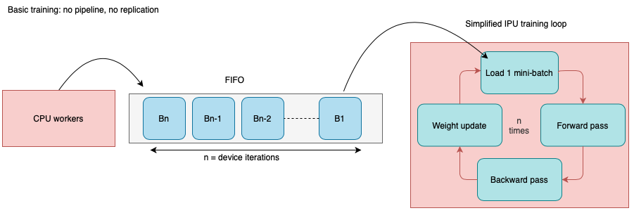
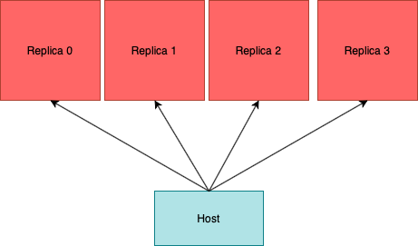

Efficient data loading with PopTorch
===============================================

This tutorial will present how PopTorch could help to efficiently load data to your model and how to avoid common sources of performance loss from the host. This will also cover the more general notion of batching on IPUs that is also relevant to other frameworks.

Requirements:
   - A Poplar SDK environment enabled  
   (see the [Getting Started](https://docs.graphcore.ai/en/latest/software.html#getting-started) guide for your IPU system)
   - The PopTorch Python library installed
   - `pip install torchvision`

Table of Contents
=================
* [PyTorch and PopTorch DataLoader](#pytorch-and-poptorch-dataloader)
* [Understanding batching with IPU](#understanding-batching-with-ipu)
    + [Device Iterations](#device-iterations)
    + [Gradient Accumulation](#gradient-accumulation)
    + [Replication](#replication)
    + [Global batch size](#global-batch-size)
    + [How many samples will then be loaded in one step ?](#how-many-samples-will-then-be-loaded-in-one-step--)
* [Hyperparameters tuning](#hyperparameters-tuning)
    + [Evaluating the asynchronous DataLoader](#evaluating-the-asynchronous-dataloader)
    + [What if the DataLoader throughput is too low?](#what-if-the-dataloader-throughput-is-too-low--)
    + [Device iterations vs global batch size](#device-iterations-vs-global-batch-size)
        - [Case of a training session](#case-of-a-training-session)
        - [Case of an inference session](#case-of-an-inference-session)
        - [Conclusion: Training and inference sessions](#Conclusion:-Training-and-inference-sessions)
* [Experiments](#experiments)
    + [Case 1: No bottleneck](#Case-1:-No-bottleneck)
    + [Case 2: Larger global batch size with replication](#Case-2:-larger-global-batch-size-with-replication)
* [Summary](#summary)

##	PyTorch and PopTorch DataLoader

If you are familiar with PyTorch you may have used [torch.utils.data.DataLoader](https://pytorch.org/docs/stable/data.html#torch.utils.data.DataLoader).

PopTorch provides [its own DataLoader](https://docs.graphcore.ai/projects/poptorch-user-guide/en/latest/batching.html#poptorch-dataloader) which is a wrapper around `torch.utils.data.DataLoader`.  
It accepts the same arguments as PyTorch's DataLoader with some extra features specific to the IPU:
- It takes a `poptorch.Options` instance to use IPU-specific features.
- It automatically computes the number of elements consumed by ([one step]((#how-many-samples-will-then-be-loaded-in-one-step--))).
- It enables asynchronous data loading.
See the [documentation](https://docs.graphcore.ai/projects/poptorch-user-guide/en/latest/batching.html#poptorch-asynchronousdataaccessor) about asynchronous mode.

Let’s load the same model as in [the introductory tutorial on PopTorch](../tut1_basics) and make a random dataset to play with the different IPU parameters.

```python
class ClassificationModel(nn.Module):
    def __init__(self):
        super().__init__()
        self.conv1 = nn.Conv2d(1, 5, 3)
        self.pool = nn.MaxPool2d(2, 2)
        self.conv2 = nn.Conv2d(5, 12, 5)
        self.norm = nn.GroupNorm(3, 12)
        self.fc1 = nn.Linear(41772, 100)
        self.relu = nn.ReLU()
        self.fc2 = nn.Linear(100, 10)
        self.log_softmax = nn.LogSoftmax(dim=0)
        self.loss = torch.nn.CrossEntropyLoss()
        
    def forward(self, x, labels=None):
        x = self.pool(self.relu(self.conv1(x)))
        x = self.norm(self.relu(self.conv2(x)))
        x = torch.flatten(x, start_dim=1)
        x = self.relu(self.fc1(x))
        x = self.log_softmax(self.fc2(x))
        if self.training: 
            return x, self.loss(x, labels)
        return x

if __name__ == '__main__':   
    model = ClassificationModel()
    training_model = poptorch.trainingModel(model, opts, torch.optim.SGD(model.parameters(), lr=0.001, momentum=0.9))

    # Create a fake dataset from random data
    features = torch.randn([10000, 1, 128, 128])
    labels = torch.empty([10000], dtype = torch.long).random_(10)
    dataset = torch.utils.data.TensorDataset(features, labels)
```

We are using larger images (128x128) to simulate a heavier data load.
This will cause the input size of the layer `fc1` to change from  `self.fc1 = nn.Linear(972, 100)` to `self.fc1 = nn.Linear(41772, 100)` 

Let’s set up a PopTorch DataLoader with asynchronous mode.
```python 
training_data = poptorch.DataLoader(opts,
                                    dataset=dataset,
                                    batch_size=16,
                                    shuffle=True,
                                    drop_last=True,
                                    num_workers=32,
                                    mode=poptorch.DataLoaderMode.Async)
```
>**Note**: executing the code within this conditional block:
>```python
>if __name__ == '__main__':
>```
>will be necessary to avoid [issues with asynchronous DataDoader](https://docs.graphcore.ai/projects/poptorch-user-guide/en/latest/batching.html#poptorch-asynchronousdataaccessor), additionally the dataset must be serializable by pickle.

The asynchronous mode of `poptorch.DataLoader` launches the data loading process on a separate process to allow for the data to be preprocessed asynchronously on the CPU to minimize CPU/IPU transfer time. This is why we prefer to use this option when the conditions described in the note above are met.


## Understanding batching with IPU

When developing a model for the IPU, you will encounter different notions of batching. Mini-batches, replica batches, global batches... This section will explain how these hyperparameters are related to the IPU and how to compute the number of samples the DataLoader is going to fetch at one step.

#### Device iterations

This diagram represents a basic execution on 1 IPU with 
***n*** device iterations and 1 mini-batch used per iteration.
  
A device iteration corresponds to one iteration of the training loop executed on the IPU, starting with data-loading and ending with a weight update.
In this simple case, when we set ***n*** `deviceIterations`, the host will prepare ***n*** mini-batches in an infeed queue so the IPU can perform efficiently ***n*** iterations.  
From the host point of view, this will correspond to a single call to the model (1 step):
```python
training_model(data, labels)
```

#### Gradient accumulation

This parameter must be used with pipelining.  
A pipelined model consists in splitting the graph into different successive computation stages.
Every stage of a pipelined model can be placed on a different IPU, they all compute specific parts of the graph with their own weights. Each stage will compute the forward and backward pass of a mini-batch.
Here we can see a 4 stage pipeline where 8 mini-batches are being processed.  
“f”: stands for forward pass.  
“b”: stands for backward pass.  
  
When we set up a pipelined execution, we overcome the cost of having multiple stages by computing several batches in parallel when the pipeline is full.

Every pipeline stage needs to update its weights when the gradients are ready. However, it would be very inefficient to update them after each mini-batch completion. The solution is the following:
After each backward pass the gradients are accumulated together for ***K*** mini-batches. Then, the accumulators are used to update the stage weights. This is gradient accumulation. This value can be set in PopTorch via the option:
`opts.Training.gradientAccumulation(K)`
In the previous part, we only had 1 mini-batch per weight update. This time we have ***K*** mini-batches per weight update.
Then, for one device iteration with pipeline we have multiplied the number of samples processed by ***K***.

More information about gradient accumulation can be found [in the PopTorch User Guide](https://docs.graphcore.ai/projects/poptorch-user-guide/en/latest/batching.html#poptorch-options-training-gradientaccumulation).


#### Replication

  
Replication describes the process of running multiple instances of the same model simultaneously on different IPUs to achieve data parallelism. A great gain can be obtained from it. If the model requires ***N*** IPUs and the replication factor is ***M***, ***N*** x ***M*** IPUs will be necessary. The gradients are calculated among all replicas with a single “all reduce”. Then, for one device iteration we have increased by ***M*** the number of mini-batches processed.
The PopTorch Dataloader will ensure that the host is sending each replica a different subset of the dataset.

#### Global batch size

Because several mini-batches can be processed by one device iteration (that is, for one weight update), we call **global batch size** this total number of samples:

***Mini-batch size (sometimes called micro-batch)***  
- The number of samples processed by one simple fwd/bwd pass.

***Replica batch size***   
- The number of samples on a single replica process before weight update  
                Replica batch size = Mini-batch size x Gradient accumulation factor

**Global batch size**  
- The number of samples used for the weight update  
                    Global batch size  = Replica batch size x Number of replicas   
                    Global batch size  = Mini-batch size x Number of replicas x Gradient accumulation factor

#### How many samples will then be loaded in one step ?
Considering you are iterating through the PopTorch DataLoader:
```python
for data, labels in training_data:
    training_model(data, labels)
```
For each step, the number of samples contained in `data` and `labels` will be:  
***N = Global batch size x Device iterations***


##	Tuning hyperparameters

### Evaluating the asynchronous DataLoader

How to make sure the DataLoader is not a bottleneck for our model throughput?
In this tutorial we made an example benchmark to answer this question:

1)	Evaluate the asynchronous DataLoader throughput without the IPU.
We just loop through the DataLoader without running the model so we can estimate its maximum throughput.
    ```python 
        t0 = time.time()
        for i, (data, labels) in enumerate(training_data):
            a, b = data, labels
        t1 = time.time()
        total_time = t1-t0
        print("total execution Time:", total_time, "s")
        print("DataLoader throughput:", (steps*device_iterations*bs*replicas)/total_time, "items/s")
    ```

2)	Evaluate the IPU throughput with synthetic data
To do so we will evaluate the model with synthetic data generated by the IPU using:
    ```python
    opts.enableSyntheticData(True)
    ```
    >Run the example code with the option `--synthetic-data` to enable it. 

There will be no data copying onto the device.
Hence, the throughput measured will give an upper bound of the performance. 

Knowing that, if the asynchronous DataLoader throughput is greater or equal to this upper bound, it will not be a bottleneck.  
Else, there is a risk that the DataLoader throughput is limiting. 

Note that this is only true if you're using an asynchronous DataLoader, the synchronous one can still slow down the overall execution as it will be run serially.

>***Note for IPU benchmarking***:
>The warmup time can be avoided by calling `training_model.compile(data, labels)` before any other call to the model. If not, the first call will include the compilation time.
>```python
>    # Warmup
>    print("Compiling + Warmup ...")
>    training_model.compile(data, labels)
>```

### What if the DataLoader throughput is too low?

You can:
- Try using the asynchronous mode of `poptorch.DataLoader`.
- Try to increase the global batch size or the number of device iterations.
- Adjust the number of workers.
- If you are using the asynchronous mode to load a small number of elements per step, you can try to set `miss_sleep_time_in_ms = 0`.

Suggestions if the performance drops at the beginning of an epoch: 
- Re-use workers by setting the DataLoader option `persistent_workers=True`.
- Make sure `load_indefinitely` is set to `True` (It is the default value).
- If the first iteration includes a very expensive operation (like opening or loading a large file) then increasing the `buffer_size` (size of the ring buffer) combined with the options above might help hide it at the cost of using more memory.
- Set the option `early_preload=True`. This means the data accessor starts loading tensors immediately once it's being built (Whereas usually it will wait for an iterator to be created: for instance, when you enter the main loop). If the DataLoader is created before the model compilation is called, the data will be ready to be used when the compilation is over. The main drawback is that more RAM will be used on host as the data accessor and the compilation will work at the same time.
> The options `miss_sleep_time_in_ms`, `early_preload`, `load_indefinitely` and `buffer_size` are specific to the AsynchronousDataAccessor. They will need to be passed to the DataLoader via the dictionary `async_options`:
> ```python
>training_data = poptorch.DataLoader(opts,
>                                   dataset=dataset,
>                                   batch_size=bs,
>                                    shuffle=True,
>                                    drop_last=True,
>                                    num_workers=num_workers,
>                                    mode=poptorch.DataLoaderMode.Async,
>                                    async_options={"early_preload":True, "miss_sleep_time_in_ms":0})
>```

### Device iterations vs global batch size

Even if we made sure the DataLoader is not a bottleneck anymore, the strategy we used for batching can be suboptimal. We must keep in mind that increasing the global batch size will improve the IPU utilisation while increasing device iteration will not.

#### Case of a training session

We have seen that the device can efficiently iterate while taking data prepared by the CPU in a queue. However, one iteration implies gradient computation and weight update on the device. The backward pass is computationally expensive. Then, for training it is recommended to prefer bigger global batch size over many device iterations in order to maximise parallelism.

#### Case of an inference session 

For inference only, there is no gradient computation and weights are frozen. In that case increasing the number of device iterations and using a smaller global batch-size should not harm.

#### Conclusion: Training and inference sessions
Finally, as a general recommendation these two parameters have to be tuned so your DataLoader can consume all the dataset in the smallest number of steps without throttling.  
We can get this number of steps just by getting the length of the DataLoader object:
```python
    # Number of steps necessary to consume the whole dataset                                  
    steps = len(training_data)
```
> For an IterableDataset, the whole dataset is not necessarily consumed. With the `drop_last` argument, elements of the dataset may be discarded. If the batch size does not properly divide the number of elements per worker, the last uncomplete batches will be discarded.

## Experiments

We invite you to try these different sets of parameters to assess their effect. We included the throughput we obtained for illustration but it may vary depending on your configuration.  
*Note: Compilation can take few minutes.*

Helpful arguments:
```bash
--synthetic-data  # Run with IPU-generated synthetic data
--replicas # Takes an integer parameter to set the number of replicas
```
### Case 1: No bottleneck

- mini-batch size: 16
- replica: 1 (no replication)
- device iterations: 50
- workers: 32

=> Global batch size:  16

DataLoader throughput: 27503 items/s  
Synthetic data throughput: 17091 items/s  
Real data throughput: 12367 items/s

In that case, if the DataLoader throughput fell below 17091, it could be limiting.
It is actually fine here.

***Why is the throughput lower with real data?***  
As mentioned previously, using synthetic data does not include the stream copies on the IPU. It also excludes the synchronisation time with the host. 


### Case 2: Larger global batch size with replication

Let’s try to get better training performances by increasing the global batch size.
We can choose to increase the replication factor so it avoids loading more data at a time on a single IPU.

- mini-batch size: 16
- replica: 4
- device iterations: 50
- workers: 32

=> Global batch size:  64

DataLoader throughput: 110492 items/s  
Synthetic data throughput: 33481 items/s  
Real data throughput: 23143 items/s  

This example gave an idea of how increasing the global batch size can improve the throughput.

# Summary
- To efficiently load your dataset to the IPU, the best practice is to use the dedicated PopTorch DataLoader.
- At one step, ***N = Global batch size x Device iterations*** samples will be loaded.
- A good way to know if the DataLoader is not a bottleneck is to compare its throughput with the model throughput on synthetic data.
- Asynchronous mode can provide better performance.
