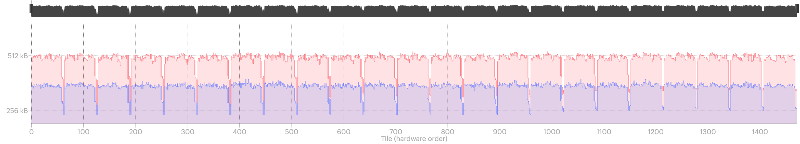

Half and mixed precision in PopTorch
====================================

This tutorial shows how to use half and mixed precision in PopTorch with the example task of training a ResNet-18 model on a single Graphcore Mk2 IPU.

If you are not familiar with PopTorch, you may need to go through this [introduction to PopTorch tutorial](../tut1_basics) first.

Requirements:
   - an installed Poplar SDK. See the Getting Started guide for your IPU hardware for details of how to install the SDK;
   - Other Python modules: `pip install torchvision tqdm`

Table of Contents
=================
* [Motives for half precision](#motives-for-half-precision)
* [Train a model in half precision](#train-a-model-in-half-precision)
    + [Import the packages](#import-the-packages)
    + [Build the model](#build-the-model)
      - [Casting a model's parameters](#casting-a-model-s-parameters)
      - [Casting a single layer's parameters](#casting-a-single-layer-s-parameters)
    + [Prepare the data](#prepare-the-data)
    + [Optimizers and loss scaling](#optimizers-and-loss-scaling)
    + [Set PopTorch's options](#set-poptorch-s-options)
      - [Stochastic rounding](#stochastic-rounding)
      - [Partials data type](#partials-data-type)
    + [Train the model](#train-the-model)
    + [Evaluate the model](#evaluate-the-model)
* [Visualise the memory footprint](#visualise-the-memory-footprint)
* [Summary](#summary)

# Motives for half precision

Data is stored in memory, and some formats to store that data require less memory than others. In a device's memory, when it comes to numerical data, we use either integers or real numbers, the latter being represented in computers using floating-point arithmetic. In this tutorial, we are going to talk about real numbers represented in 32 bits (FP32) and 16 bits (FP16), and how to use these types in PopTorch in order to reduce the memory requirements of a model and speed up its runtime.

# Train a model in half precision

## Import the packages

Among the packages we will use, there is `torchvision` from which we will be downloading a dataset and instantiate a ResNet-18 model, and `tqdm` which is a simple package to create progress bars so that we can visually monitor the progress of our training job.

```python
import torch
import poptorch
import torchvision
from torchvision import transforms
from tqdm import tqdm
```

## Build the model

Now we are going to train a new [ResNet-18](https://arxiv.org/abs/1512.03385) model provided by PyTorch's `torchvision` for a classification task. We have to wrap that model into a new child class of `torch.nn.Module` in order to include in our model a loss function so that PopTorch is able to build a computational graph for training. At the same time, we replace the last layer of the model with a `torch.nn.Linear` layer where the number of output units is the number of classes we will need.

```python
class CustomResNet18(nn.Module):
    def __init__(self, num_classes):
        super().__init__()
        # Create a pretrained RestNet-18 model
        self.resnet18 = torchvision.models.resnet18()
        # Replace the last layer with a layer with num_classes output units
        self.resnet18.fc = torch.nn.Linear(512, num_classes)
        # Add a loss function 
        self.loss = torch.nn.CrossEntropyLoss()
    
    def forward(self, x, labels=None):
        out = self.resnet18(x)
        if self.training:
            return out, self.loss(out, labels)
        return out
```

Our dataset will consist of images classified in 10 classes. We can thus instantiate our model for 10 classes:
```python
model = CustomResNet18(10)
```

### Casting a model's parameters

The default data type of the parameters of a PyTorch module is FP32 (`torch.float32`). To convert all the parameters of a model to be represented in FP16 (`torch.float16`), an operation we will call _downcasting_, we simply do:

```python
model = model.half()
```

For this tutorial, we will cast all the model's parameters to FP16.

### Casting a single layer's parameters

For bigger or more complex models, downcasting all the layers may generate numerical instabilities and cause underflows. While the PopTorch and the IPU offer features to alleviate those issues, it is still sensible for those models to cast only the parameters of certain layers and observe how it affects the overall training job. To downcast the parameters of a single layer, we select the layer by its _name_ and use `half()`:

```python
model.resnet18.conv1 = model.resnet18.conv1.half()
```

If you would like to upcast a layer instead, you can use `float()`:

```python
# Selects a BatchNorm2d layer within the first submodule within a Sequential submodule named "layer1"
model.resnet18.layer1[0].bn1 = model.resnet18.layer1[0].bn1.float()
```

>**NOTE**: One can print out a list of the components of a PyTorch model, with their names, by doing `print(model)`.

## Prepare the data

We will use the FashionMNIST dataset that we download from `torchvision`. Since the dataset consists of grey images (1 channel) but ResNet-18 has been designed for RGB images (3 channels), we will add `torchvision.transforms.Grayscale` in the transforms pipeline for our dataset, which will express an image with 1 channel into an image with  3 channels. Also, ResNet-18 has been designed for images of size 224x224 whereas the dataset's images are 28x28, therefore we will add `torchvision.transforms.Resize` to the pipeline as well. The last stage of the pipeline will have to convert the data type of the tensors representing the images to `torch.half` (equivalent to `torch.float16`) so that our input data is also in FP16. This has the advantage of reducing the bandwidth needed between the host and the IPU.

```python
transform = transforms.Compose([transforms.Grayscale(num_output_channels=3),
                                transforms.Resize(224),
                                transforms.ToTensor(),
                                transforms.Normalize((0.5,), (0.5,)),
                                transforms.ConvertImageDtype(torch.half)])
train_dataset = torchvision.datasets.FashionMNIST("./datasets/",
                                                  transform=transform, 
                                                  download=True, 
                                                  train=True)
test_dataset = torchvision.datasets.FashionMNIST("./datasets/",
                                                 transform=transform,   
                                                 download=True, 
                                                 train=False)
```

If the model has not been converted to half precision, but the input data has, then some layers of the model may be converted to use FP16. Conversely, if the input data has not been converted, but the model has, then the input tensors will be converted to FP16 on the IPU. This behaviour is the opposite of PyTorch's default behaviour.

>**NOTE**: To stop PopTorch automatically downcasting tensors and parameters, so that it preserves PyTorch's default behaviour (upcasting), use the option `opts.Precision.halfFloatCasting(poptorch.HalfFloatCastingBehavior.HalfUpcastToFloat)`.

## Optimizers and loss scaling

Loss scaling is a technique that improves the numerical stability of a model in half or mixed precision during training. It consists of scaling up the loss value right before the start of backpropagation to prevent numerical underflow of the gradients. The value of the loss scaling factor is a parameter for the optimisers in `poptorch.optim`. In this tutorial, we will set it to 1000 for an SGD optimizer:

```python
poptorch.optim.SGD(model.parameters(), lr=0.001, loss_scaling=1000)
```

If you decide to use another optimizer than `poptorch.optim.SGD` with a model in half precision, you will have to set its argument `accum_type` to `torch.float16` as well.

Also, while higher values of `loss_scaling` minimize underflows, values that are too high can also generate overflows as well as hurt convergence of the loss. The optimal value depends on the model and the training job. This is therefore a hyperparameter for you to tune.

## Set PopTorch's options

To configure some features of the IPU and to be able to use PopTorch's classes in the next sections, we will need to create an instance of `poptorch.Options` which stores the options we will be using. We covered some of the available options in the [introductory tutorial for PopTorch](https://github.com/graphcore/examples/tree/master/tutorials/pytorch/tut1_basics). 

Let's initialise our options object before we talk about the options we will use:

```python
opts = poptorch.Options()
```

>**NOTE**: This tutorial has been designed to be run on a single Mk2 IPU. If you do not have access to a Mk2 IPU, you can use the option [`useIpuModel`](https://docs.graphcore.ai/projects/poptorch-user-guide/en/latest/overview.html#poptorch.Options.useIpuModel) to run a simulation on CPU instead. You can read more on the IPU Model and its limitations [here](https://docs.graphcore.ai/projects/poplar-user-guide/en/latest/poplar_programs.html#programming-with-poplar).

### Stochastic rounding

When training in half or mixed precision, numbers multiplied by each other will need to be rounded in order to fit into memory. Stochastic rounding is the process of using a probabilistic equation for the rounding, which is here non-deterministic, so that the _expectation_ of the computed value is equal to the exact value. It is highly recommended that you enable this feature when training neural networks with FP16 weights.

With the IPU, this feature is implemented directly in the hardware and only requires you to enable it. To do so, there is the option `enableStochasticRounding` in the `Precision` namespace of `poptorch.Options`. This namespace holds other options for using mixed precision that we will talk about. To enable stochastic rounding, we do:

```python
opts.Precision.enableStochasticRounding(True)
```

With the IPU Model, this option won't change anything since stochastic rounding is implemented on the IPU.

### Partials data type

Matrix multiplications and convolutions have intermediate states we call _partials_. Those partials can be stored in FP32 or FP16. There is a memory benefit to using FP16 partials but the main benefit is that it can increase the throughput for some models without affecting accuracy. However there is a risk of increasing numerical instability if the values being multiplied are small, due to underflows. The default data type of partials is the input's data type. For this tutorial, we will prefer to keep partials in FP32 even if the inputs and the weights are stored in FP16. We use the option `setPartialsType` to do it:

```python
opts.Precision.setPartialsType(torch.float)
```

## Train the model

We can now train the model. After we have set all our options, we reuse our `poptorch.Options` instance for the training `poptorch.DataLoader` that we will be using:

```python
train_dataloader = poptorch.DataLoader(opts, 
                                       train_dataset, 
                                       batch_size=12, 
                                       shuffle=True, 
                                       num_workers=40)
```

We first make sure our model is in training mode, and then wrap it with `poptorch.trainingModel`.

```python
model.train()
poptorch_model = poptorch.trainingModel(model, 
                                        options=opts,
                                        optimizer=optimizer)
```

Let's run the training loop for 10 epochs.

```python
epochs = 10
for epoch in tqdm(range(epochs), desc="epochs"):
    total_loss = 0.0
    for data, labels in tqdm(train_dataloader, desc="batches", leave=False):
        output, loss = poptorch_model(data, labels)
        total_loss += loss
```

Our new ResNet-18 model is now trained and we can start its evaluation. 

## Evaluate the model

Some PyTorch's operations, such as CNNs, are not supported in FP16 on the CPU, so we will evaluate our fine-tuned model in mixed precision on an IPU using `poptorch.inferenceModel`. 

```python
model.eval()
poptorch_model_inf = poptorch.inferenceModel(model, options=opts)

test_dataloader = poptorch.DataLoader(opts, 
                                      test_dataset, 
                                      batch_size=32, 
                                      num_workers=40)

predictions, labels = [], []
for data, label in test_dataloader:
    predictions += poptorch_model_inf(data).data.max(dim=1).indices
    labels += label

print(f"Eval accuracy on IPU: {100 * (1 - torch.count_nonzero(torch.sub(torch.tensor(labels), torch.tensor(predictions))) / len(labels)):.2f}%")
```

We obtained an accuracy of approximately 90% on the test dataset.

# Visualise the memory footprint

We can visually compare the memory footprint on the IPU of the model trained in single (FP32) and half (FP16) precision, thanks to Graphcore's [PopVision Graph Analyser](https://docs.graphcore.ai/projects/graphcore-popvision-user-guide/en/latest/graph/graph.html). 

We generated memory reports of the same training session as covered in this tutorial for both cases: with and without downcasting the model with `model.half()`. Here is the figure of both memory footprints, where "source" is ResNet-18 trained in FP32 and "target" in FP16:



We observed a ~26% reduction in memory usage with the settings of this tutorial, including from peak to peak. The impact on the accuracy was also small, with less than 1% lost!

# Summary
- Use half and mixed precision when you need to save memory on the IPU.
- You can cast a PyTorch model or a specific layer to FP16 using:
    ```python
    # Model
    model.half()
    # Layer
    model.layer.half()
    ```
- Several features are available in PopTorch to improve the numerical stability of a model in FP16:
    - Loss scaling: `poptorch.optim.SGD(..., loss_scaling=1000)`
    - Stochastic rounding: `opts.Precision.enableStochasticRounding(True)`
    - Upcast partials data types: `opts.Precision.setPartialsType(torch.float)`
- The [PopVision Graph Analyser](https://docs.graphcore.ai/projects/graphcore-popvision-user-guide/en/latest/graph/graph.html) can be used to inspect the memory usage of a model and to help debug issues.
