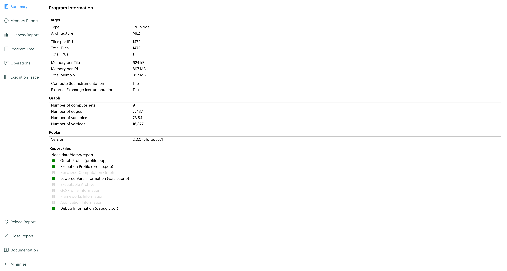
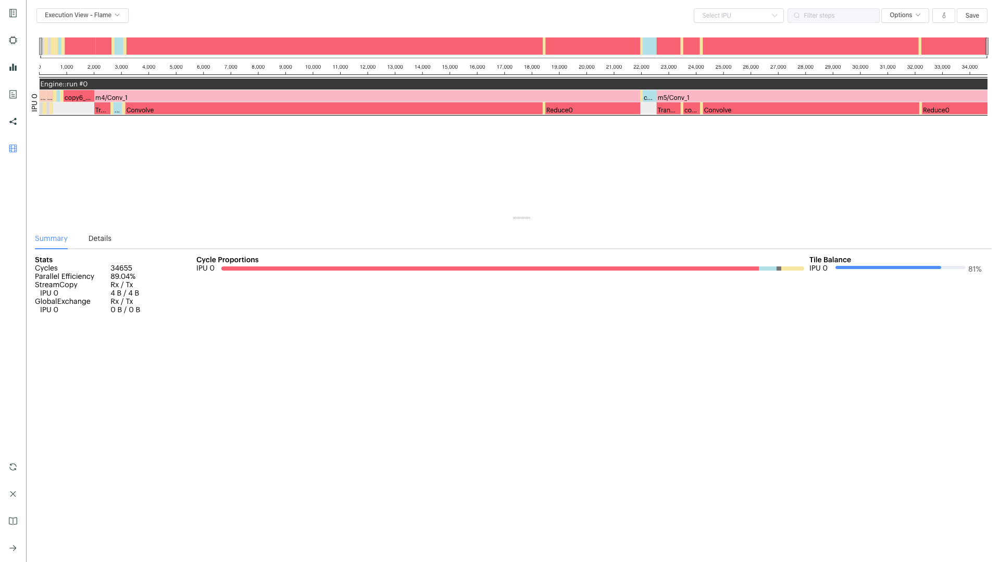
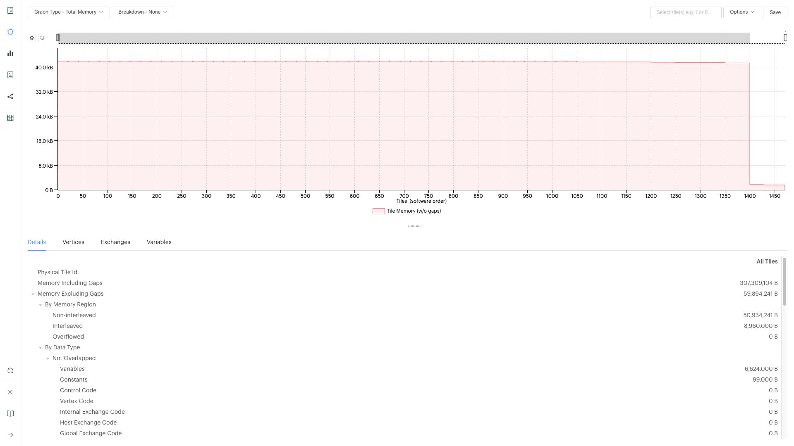
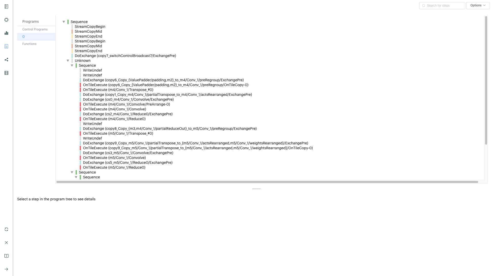
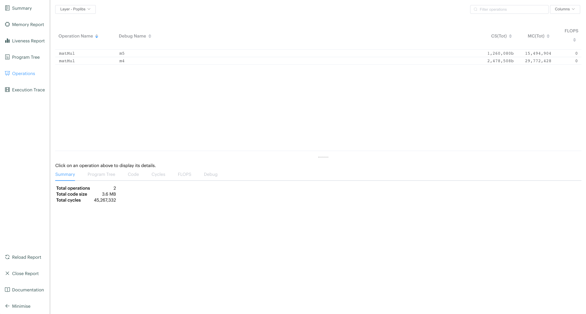

<!-- Copyright (c) 2020 Graphcore Ltd. All rights reserved. -->
# Poplar Tutorial 4: Profiling Output

In this tutorial you will:

- learn about the different methods with which we can extract profiling
    information from a Poplar program;
- learn and test each method with a given simple example program;
- see how changes to the given program reflect into the profiles;
- dive into how to use and understand the different sections of the
    PopVision Graph Analyser.

A brief [summary](#summary) and a list of additional resources are
included at the end this tutorial.

## Setup

In order to run this tutorial on the IPU you will need to have a Poplar
SDK environment enabled (see the [Getting Started Guide for your IPU
system](https://docs.graphcore.ai/en/latest/getting-started.html)).

You will also need a C++ toolchain compatible with the C++11 standard,
build commands in this tutorial use GCC.

## Profiling on the IPU

There are three ways of profiling code for the IPU:

- outputting summary profile data to the console.
- using the PopVision Analysis API to query profile information in C++ or
    Python (coverage in this tutorial is a preview).
- using the PopVision Graph Analyser tool.

The PopVision Graph Analyser provides much more detailed information, as
such this tutorial is split into 3 parts. First we try the three
different profiling methods, next we show general PopVision Graph
Analyser functionality, and finally we explore each tab of information
in the PopVision Graph Analyser.

The profiling tool is documented in the [PopVision Graph Analyser User
Guide](https://docs.graphcore.ai/projects/graph-analyser-userguide/).
This tutorial shows how to profile Poplar programs, but these techniques
are applicable to the PyTorch and TensorFlow frameworks.

Download and install the PopVision Graph Analyser from the [developer
page](https://www.graphcore.ai/developer/popvision-tools#downloads). You can download and install
the PopVision Graph Analyser on your local machine and use it to access
files on remote machines, so you do not need to download and install the
PopVision Graph Analyser on your remote machines.

It is also useful to watch the [Getting Started with PopVision
video](https://www.graphcore.ai/resources/how-to-videos) both before the
tutorial as a preview, and after to give you further things to try.

**Running on IPUModel vs IPU hardware:** As with earlier tutorials, this
tutorial uses the `IPUModel` as the default to allow you to run the
tutorial even without access to IPU hardware. There are some differences
between the `IPUModel` and IPU hardware, which will be discussed at the
point they become relevant.

Tutorial 1 provides an explanation of how to modify the tutorial code to
run on IPU hardware, but for this tutorial we provide code examples for
both - `tut4_ipu_model.cpp` and `tut4_ipu_hardware.cpp`. We'll
reference `tut4_ipu_model.cpp`, but unless noted, the instructions are
the the same for `tut4_ipu_hardware.cpp` (except the filename).

Use `tut4_profiling` as your working directory. This tutorial is not
about completing code; the aim is to understand and experiment with the
profiling options presented here.

## Profiling methods

### Command line profile summary

Open your copy of the file `tut4_profiling/tut4_ipu_model.cpp` in an
editor.

- Note the `printProfileSummary` line in the tutorial code:

    ```c++
    engine.printProfileSummary(std::cout, {{"showExecutionSteps", "true"}});
    ```

    This outputs the command line Profile Summary. Enabling the
    `showExecutionSteps` option means our profile summary will also
    contain the program execution sequence with cycle estimates for
    IPUModel, or measured cycles for IPU hardware. However, on hardware
    we must enable instrumentation otherwise cycles will not be
    recorded. Look for the `debug.instrument` engine option in
    `tut4_ipu_hardware.cpp` to see how instrumentation is enabled.

- Compile and run the program. Note that you will need the PopLibs libraries
    `poputil` and `poplin` in the command line:

    ```console
    $ g++ --std=c++11 tut4_ipu_model.cpp -lpoplar -lpopops -lpoplin -lpoputil -o tut4
    $ ./tut4
    ```

    The code already contains the `addCodelets` functions to add the
    device-side library code. See the [PopLibs
    section](https://docs.graphcore.ai/projects/poplar-user-guide/en/latest/poplibs.html#using-poplibs)
    of the Poplar and PopLibs User Guide for more information.

When the program runs it prints profiling data. You can redirect this to
a file to make it easier to study.

Take some time to review and understand the execution profile. For
example:

- Determine what percentage of the memory of the IPU is being used
- Determine the number of cycles the computation took
- Determine which steps belong to which matrix-multiply operation
- Identify how many cycles are taken by communication during the
    exchange phases

See the [Profile
Summary](https://docs.graphcore.ai/projects/poplar-user-guide/en/latest/profiler.html#profile-summary)
section of the Poplar and PopLibs User Guide for further details of the
profile summary.

### Generating profile report files

Create a report:

- (Optional) First comment out the `printProfileSummary` line in the tutorial
    code:

    ```c++
    engine.printProfileSummary(std::cout, {{"showExecutionSteps", "true"}});
    ```

    This is not needed when using the PopVision Graph Analyser, but
    doesn't conflict with it either. Generating profile report files is
    enabled by poplar engine options, which can be changed using the api
    or environment variables.

- Recompile:

    ```console
    $ g++ --std=c++11 tut4_ipu_model.cpp -lpoplar -lpopops -lpoplin -lpoputil -o tut4
    ```

- Run with the following command, setting these environment variables:

    ```console
    $ POPLAR_ENGINE_OPTIONS='{"autoReport.all":"true","autoReport.directory":"./report"}' ./tut4
    ```

    - `autoReport.all` turns on all the default profiling options.
    - `autoReport.directory` sets the output directory, relative to
        the current directory.

- You should see a new directory `report` in your current directory. It will
    contain some files (`profile.pop` and `debug.cbor`). Which files are
    created depends on which profiling options you have turned on.

Making use of these files is explained in the following sections. They
can be used with either the PopVision Analysis API or explored with the
PopVision Graph Analyser Tool.

### Using the PopVision analysis API in C++ or Python

This section explains how the PopVision analysis API (libpva) can be
used to query information from a profile file using C++ or Python. You
can find more information in the [PopVision Analysis Library (libpva)
User
Guide](https://docs.graphcore.ai/projects/libpva/en/latest/).

libpva is used to query `profile.pop` files, so copy your `profile.pop`
file created in the previous section to the `tut4_profiling/libpva`
directory and make this your working directory.

You should now see three files in your current working directory:

- `cpp_example.cpp` - Example C++ program that queries a profile.
- `profile.pop` - Example profile file.
- `python_example.py` - Example Python program that queries a
    profile.

Study the C++ and Python source files to understand how they work.
Compile the C++ program with:

```console
$ g++ --std=c++11 cpp_example.cpp -lpva -ldl -o cpp_example
```

Now you can run the C++ program with:

```console
$ ./cpp_example
```

Or you can run the Python program with:

```console
$ python3 python_example.py
```

Both programs should print the same example information similar to this:

```console
Example information from profile: Number of compute sets: 9 Number of
tiles on target: 1472 Version of Poplar used: 2.3.0 (d9e4130346)
```

You may want to modify the source files to extend this example
information.

## Using PopVision Graph Analyser - loading and viewing a report

Open the PopVision Graph Analyser application that you've downloaded
from the [developer page](https://www.graphcore.ai/developer/popvision-tools#downloads).

- Load the profile in the PopVision Graph Analyser.
    - You can either open a local copy of the `report` folder above, or open it
        remotely via ssh.
    - Launch the PopVision Graph Analyser, and click on `'Open a Report..'`.
    - Navigate to either the local or remote copy of the folder.
    - Click Open - this opens into the Summary tab, you can also open a specific
        file and it will take you straight to the corresponding tab.
- You should see the `Summary` tab:

    

- There are multiple tabs that can be opened via the icons on the left hand side
    of the trace - `Summary`, `Memory Report`, `Liveness Report`, `Program Tree`,
    `Operations Summary`, `Operations Graph`, `Computations Graph` and
    `Execution Trace`. The `Execution Trace` tab for example should look like:

    

- Click through the different tabs and mouse around to investigate some of the
    functionality. Hovering over most things gives a tool tip or a link to the
    documentation. This documentation is contained both in the the application
    itself (`Help -> Documentation` or the documentation icon, bottom left) and
    in the [PopVision Graph Analyser User Guide](https://docs.graphcore.ai/projects/graph-analyser-userguide/).
- The whole report can be reloaded by:
    - the reload icon (bottom left).
    - closing the report and re-opening it (close icon, bottom left).
    - directly opening a new file (`File -> Open New Window`).

## Using PopVision Graph Analyser - general functionality

This section of the tutorial is an introduction to the basic
functionality -the [PopVision Graph Analyser User
Guide](https://docs.graphcore.ai/projects/graph-analyser-userguide/)
gives full detailed instructions.

### Capturing IPU Reports - setting `POPLAR_ENGINE_OPTIONS`

The amount and type of profiling data captured is set with the
`POPLAR_ENGINE_OPTIONS` environment variable. The default
`POPLAR_ENGINE_OPTIONS='{"autoReport.all":"true"}'` captures all the
default profiling information apart from the serialized graph.

If you only want to collect specific aspects of the profiling data, you
can turn each one on individually:

```console
$ POPLAR_ENGINE_OPTIONS='{"autoReport.outputGraphProfile":"true"}'
```

Conversely, if you want to exclude specific aspects, you can set
`autoReport.all` to true, and individually disable them:

```console
$ POPLAR_ENGINE_OPTIONS='{"autoReport.all":"true", "autoReport.outputExecutionProfile":"false"}'
```

The environment variables can be made to persist using `export`, however
common use is to specify them on the same line as the program to be
profiled to scope them. Experiment with turning different profiling
functionality on and off. Note that the Poplar program only overwrites
those files in the folder that correspond to the functionality turned on
for that run. So it won't delete files that aren't written in that
run.

This is fully detailed in the [Capturing IPU
Reports](https://docs.graphcore.ai/projects/graph-analyser-userguide/page/capturing-ipu-reports.html)
section of the PopVision Graph Analyser documentation.

### Comparing two reports

Another useful function is the ability to compare two reports directly.
Instead of clicking `'Open a Report…'` in the main menu, simply click on
`'Compare two Reports…'`, navigate the file open windows to the two
reports and click `Compare`. For this you'll need two reports, so
modify the dimensions of one or more of the tensors, for example m1
`{900, 600} -> {1600, 700}`, m2 `{600, 300} -> {700, 300}`.

Recompile and capture a second report to a second directory:

```console
$ g++ --std=c++11 tut4_ipu_model.cpp -lpoplar -lpopops -lpoplin -lpoputil -o tut4
$ POPLAR_ENGINE_OPTIONS='{"autoReport.all":"true","autoReport.directory":"./report_2"}' ./tut4
```

Compare the original report you created and your 2nd report. Look at the
Summary, Memory and Liveness tabs to start with. The Liveness tab for
example should look like:


We will use this extra report in the next couple of sections as well.

If you face any difficulties, a full walkthrough of opening reports is
given in the [Opening
Reports](https://docs.graphcore.ai/projects/graph-analyser-userguide/page/opening-reports.html)
section of the PopVision Graph Analyser documentation.

### Profiling an out of memory program

If you are using hardware, and your program doesn't fit on the IPU
tiles, you will hit an Out Of Memory (OOM) error. This occurs during the
graph-compilation step of running your program (not during the `g++`
compilation, but when actually running your program).

The IPUModel is designed not to stop for OOM errors (it can be used for
building and running models that are OOM), so for this section we'll
assume you're using hardware.

- If we make tensor `m1` a lot bigger (and adjust `m2` to match), we can induce
    OOM:

    ```c++
    Tensor m1 = graph.addVariable(FLOAT, {9000, 7500}, "m1");
    Tensor m2 = graph.addVariable(FLOAT, {7500, 300}, "m2");
    ```

    (remember this is on hardware, so modify `tut4_ipu_hardware.cpp`).

- Recompile, and then run with a new folder for the report:

    ```console
    $ g++ --std=c++11 tut4_ipu_hardware.cpp -lpoplar -lpopops -lpoplin -lpoputil -o tut4
    $ POPLAR_ENGINE_OPTIONS='{"autoReport.all":"true","autoReport.directory":"./report_OOM"}' ./tut4
    ```

    You will see the program fail with an out of memory error:

    ```console
    terminate called after throwing an instance of 'poplar::graph_memory_allocation_error'
    what():  Out of memory: Cannot fit all variable data onto one or more tiles. Profile saved to: ./report_OOM/profile.pop
    ```

    And the folder `/report_OOM` contains a set of profile files.

Note: As of the 2.1 release of the Poplar SDK, the value of the Poplar
engine option "debug.allowOutOfMemory" is set to true by default. This
allows the compilation to finish when OOM is encountered, generating the
profile file containing the memory trace that can be analysed. It is
important to note that although a usable set of profiling files is
generated, the compilation won't succeed and execution won't happen.
This means that even if you use "autoReport.all":"true", you won't
get an execution trace. If the "debug.allowOutOfMemory" option is set
to false, then when the program execution fails with an OOM error, the
compilation will be halted, and no profile file will be created that can
be analysed.

When you open the report in `/report_OOM` with the PopVision Graph
Analyser you will see that the memory trace is complete. We could now
investigate what has caused the program to go OOM and potentially fix
it.

## Using PopVision Graph Analyser - different tabs in the application

The next part of the tutorial takes a deeper look at each tab and the
information they contain.

### Memory report

The `Memory Report` tab allows you to investigate memory utilisation
across the tiles. Open one of your reports from above, and click on the
`Memory Report` tab icon on the left.

- You should see the `Memory Report` tab:

    

    See how the Details section shows data for all tiles.

- With your mouse hovering over the graph, scroll with the mouse wheel up and
    down and see how this zooms in and out on regions of tiles.
- In the top right there is a `Select tile` box - type in a tile you are
    interested in and see how the Details section shows details on just that
    specific tile.
    - You can enter multiple tile numbers, comma separated, to compare two or
        more different tiles.
    - You can also Shift-click on the lines of the graph to achieve the same
        behaviour.
- In the top right there is also a set of options. Turn on `Include Gaps` and
    `Show Max Memory`.

    - `Show Max Memory` shows the maximum available memory per tile - if one or
        more tiles are over, it goes OOM.
    - `Include Gaps` shows the gaps in memory - some memory banks in IPU tiles
        are reserved for certain types of data. This leads to 'gaps' appearing
        in the tile memory.
    - The gaps can be enough to push you OOM, so it is useful to have both of
        these on when investigating an OOM issue.

- Compare your two reports, with `Show Max Memory` and `Include Gaps` turned on.
- Vary the tensors and the mapping - you can see the effects in the Memory tab
    of the tool.

Full details of the Memory Report are given in the [Memory
Report](https://docs.graphcore.ai/projects/graph-analyser-userguide/page/memory-report.html)
section of the PopVision Graph Analyser documentation.

### Program tree

The `Program Tree` tab allows you to visualise your compiled code. It
shows a hierarchical view of the steps in the program that is run on the
IPU. Open one of your reports from above, and click on the Program Tree
tab icon on the left.

- You should see the `Program Tree` tab:

    

- Observe the sequences of stream copies, exchanges and on-tile-executions.
- Clicking on each line in the top panel gives full details in the bottom panel
    -observe the different info given for each type.

More details on the Program Tree are given in the [Program
Tree](https://docs.graphcore.ai/projects/graph-analyser-userguide/page/program-tree.html)
section of the PopVision Graph Analyser documentation.

### Operations summary

The `Operations Summary` tab displays a table of all operations in your
model, for a software layer, showing statistics about code size, cycle
counts, FLOPs and memory use. Open one of your reports from above, and
click on the Operations tab icon on the left.

- You should see the `Operations Summary` tab:

    

- The top panel shows a table listing the operations in the currently selected
    software layer (the default layer is PopLibs) along with a default set of
    columns of information.
    - The columns displayed can be modified using the `Columns` drop-down menu
        in the top-right of the window.
- Click on one of the `matMul` Operations to show the summary for that operation
    in the bottom panel.
    - When no operation is selected this tab shows a breakdown of operations for
        the selected software.
- Click through each tab in the bottom panel (with an operation selected in the
    top panel):
    - `Summary` - data from the default table columns.
    - `Program Tree` - the program steps involved in the selected operation.
    - `Code` - a graph of the code executed for the selected operation.
    - `Cycles` - the number of cycles taken by the selected operation.
    - `FLOPS` - the number of floating point operations executed for the
        selected operation.
    - `Debug` - debug information from the selected operation.

More details on Operations and full descriptions of the functionality of
each each bottom panel tab are given in the [Operations
Summary](https://docs.graphcore.ai/projects/graph-analyser-userguide/page/operations-summary.html)
section of the PopVision Graph Analyser documentation.

### Liveness report

This gives a detailed breakdown of the state of the variables at each
step of your program. Some variables persist in memory for the entirety
of your program - these are known as 'Always Live' variables. Some
variables are allocated and deallocated as memory is reused - these are
known as 'Not Always Live' variables. While the Memory report does
track this, the Liveness report visualises it.

Open one of your reports from above, and click on the `Liveness Report`
tab icon on the left.

- You should see the `Liveness Report` tab:

    

- From the Options turn on `Include Always Live`
- Click through different time steps, noting what details are given in the
    `Always Live Variables` / `Not Always Live Variables` / `Vertices` and
    `Cycle Estimates` tabs in the bottom panel.
> Note the program steps matching up with the Program Tree.

More details on the Liveness Report are given in the [Liveness
Report](https://docs.graphcore.ai/projects/graph-analyser-userguide/page/liveness-report.html)
section of the PopVision Graph Analyser documentation.

### Execution trace

This shows how many clock cycles each step of an instrumented program
consumes. Open one of your reports from above, and click on the
`Execution Trace` tab icon on the left.

- You should see the `Execution Trace` tab:

    

- Switch the `Execution View` between `Flame` and `Flat`, and with `BSP` on and
    off.
- Observe the sync, exchange and execution code across the tiles.
- Observe how these correspond to the different operations, and in the program
    tree.
- Click on the `Summary` and `Details` tabs in the lower panel and observe the
    different information given for different operations.
- Note that all the measurements are in clock cycles not time.

More details on the Execution Trace are given in the [Execution
Trace](https://docs.graphcore.ai/projects/graph-analyser-userguide/page/execution-trace.html)
section of the PopVision Graph Analyser documentation.

## Follow-ups

Modify the tutorial code with extra operations and see the effects in
the different tabs of PopVision Graph Analyser, or try with your own
code.

## Summary

In this tutorial, we learnt how to extract useful profiling information
from any Poplar program. We first used a method that prints a summary of
information on the console, then we learnt how to generate a report by
setting an environment variable, and we extracted some information from
it using the PopVision analysis API. Finally, we explored in more
details the more convenient and easy to use tool for profiling: the
PopVision Graph Analyser. In this tutorial we profiled Poplar programs,
but using the PopVision Graph Analyser for TensorFlow and PyTorch
applications on the IPU is a case of setting the same environment
variables. This is described in more details in the [PopVision Graph
Analyser User
Guide](https://docs.graphcore.ai/projects/graph-analyser-userguide/).

In the [next tutorial](../tut5_matrix_vector/README.md) you will write
a Poplar application that performs matrix-vector multiplication.

To learn more about profiling IPU applications, check also the
[PopVision tutorials](../../popvision/), where you can discover the
PopVision System Analyser tool, the PopVision Trace Instrumentation
Library (libpvti) and learn more about the PopVision analysis API
(libpva), which has been introduced in this tutorial.

For techniques to optimise memory use and improve performance please
refer to our [memory and performance optimisation
guide](https://docs.graphcore.ai/projects/memory-performance-optimisation/en/latest/common-memory-optimisations.html).

Copyright (c) 2018 Graphcore Ltd. All rights reserved.
