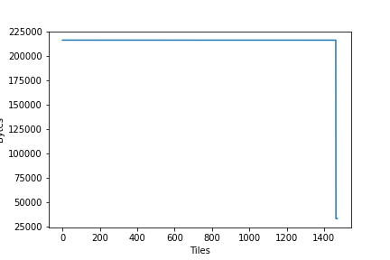

<!-- Copyright (c) 2020 Graphcore Ltd. All rights reserved. -->
<!-- THIS FILE IS AUTOGENERATED. Rerun SST after editing source file: walkthrough.py -->

# PopVision Tutorial: Accessing profiling information


In this tutorial you will learn to use the `libpva` Python module, this library
is used to analyse profiles of the programs that run on the IPU. It provides
granular information on the compute and memory exchange steps taken on each
tile of the IPU. You will learn to:

- Use the `libpva` library to access and analyse profiles from the IPU
  execution.

## How to run this tutorial

To run the Jupyter notebook version of this tutorial:

1. Enable a Poplar SDK environment (see the [Getting
  Started](https://docs.graphcore.ai/en/latest/getting-started.html) guide for
  your IPU system)
2. In the same environment, install the Jupyter notebook server:
   `python -m pip install jupyter`
3. Launch a Jupyter Server on a specific port:
   `jupyter-notebook --no-browser --port <port number>`
4. Connect via SSH to your remote machine, forwarding your chosen port:
   `ssh -NL <port number>:localhost:<port number>
   <your username>@<remote machine>`

For more details about this process, or if you need troubleshooting, see our
[guide on using IPUs from Jupyter
notebooks](../../standard_tools/using_jupyter/README.md).

## Setup

```ipython
%pip install -r requirements.txt
```

For this tutorial we are going to use a PopTorch MNIST example and capture
profile information that can be read using the PopVision Analysis Library,
which is included in the Poplar SDK package. The PopTorch MNIST example is from the
[simple_applications/pytorch/mnist](../../../simple_applications/pytorch/mnist)
directory).

We will run the MNIST example with profiling enabled:

```python
import os
import subprocess
import pva
import matplotlib
import matplotlib.pyplot as plt
from pathlib import Path
```

```python
mnist_path = "../../../simple_applications/pytorch/mnist/mnist_poptorch.py"
os.environ[
    "POPLAR_ENGINE_OPTIONS"
] = '{"autoReport.all":"true", "autoReport.directory":"mydirectory"}'
subprocess.run(["python3", mnist_path])
```

```output
CompletedProcess(args=['python3', '../../../simple_applications/pytorch/mnist/mnist_poptorch.py'], returncode=0)
```

When this has completed you will find a file called profile.pop in the training
and inference subdirectories of the current working directory.

During the execution of these commands, `inference/profile.pop` and
`training/profile.pop` files were generated. These files report the number of
cycles spent on each operation by each tile of the IPU. This rich profiling
information can be analysed both using the `libpva` Python library included in
the Poplar SDK which can be downloaded from our
[Graphcore downloads portal](https://downloads.graphcore.ai/) and the PopVision Graph Analyser which can be
found on our [developer page](https://www.graphcore.ai/developer/popvision-tools#downloads)

## Using the Python API

In this tutorial we use the `libpva` library to access profiles of the IPU, the
documentation for it can be found here:
[PopVision Analysis Python API](https://docs.graphcore.ai/projects/libpva/en/3.2.0/api-python.html).

### Loading a profile

Start Python in the directory that contains the profile.pop file you would like
to read. Loading the profile into a Python object is easily done with the
following:

```python
# Grab the most recently modified profile.pop file
working_dir = Path(".").glob("./mydirectory/training/*.pop")
report_files = [f for f in working_dir if f.is_file()]
report_files.sort(reverse=True, key=lambda a: a.stat().st_mtime)
report_path = str(report_files[0])

# Open the file

report = pva.openReport(report_path)
```

Now you can access information from the report, as shown in the following examples:

```python
print("Number of compute sets: ", report.compilation.graph.numComputeSets)
print("Number of tiles on target: ", report.compilation.target.numTiles)
print("Version of Poplar used: ", report.poplarVersion.string)
```

```output
Number of compute sets:  181
Number of tiles on target:  1472
Version of Poplar used:  3.1.0 (a027fa0bd5)
```

You can also iterate over properties such as execution steps, which each
represent the execution of a program in Poplar. In this example, we sum the
total number of cycles on IPU 0 for all execution steps:

```python
sum(step.ipus[0].cycles for step in report.execution.steps)
```

```output
1349607088
```

### Using visitors to explore the data

To analyse the compiled program, it is best to use a `ProgramVisitor` class with
the appropriate visitor functions (See [API
Documentation](https://docs.graphcore.ai/projects/libpva/en/3.2.0/api-python.html#pva.ProgramVisitor)
for a list of available methods).

A more general explanation of the ["visitor pattern" is available on
wikipedia](https://en.wikipedia.org/wiki/Visitor_pattern) along with a
[Python example](https://en.wikipedia.org/wiki/Visitor_pattern#Python_example).

For example, the following class will print the name of any `OnTileExecute`
programs that use multiple vertices:

```python
class TestVisitor(pva.ProgramVisitor):
    def visitOnTileExecute(self, onTileExecute):
        if len(onTileExecute.computeset.vertices) > 1:
            print(onTileExecute.name)
```

Now we will apply this visitor to every program so that we can see a list of
all `OnTileExecute` programs executed that use multiple vertices:

```python
v = TestVisitor()
for s in report.execution.steps:
    s.program.accept(v)
```

> **NOTE**: You may see a long list of identical names. This is due to multiple
> OnTileExecute steps having the same name, which is to be expected.

You can easily create plots of information using Python's matplotlib library.
The following example plots total memory use (including gaps) for each tile.

```python
matplotlib.use("Agg")

plt.plot([tile.memory.total.includingGaps for tile in report.compilation.tiles])
plt.xlabel("Tiles")
plt.ylabel("Bytes")
plt.savefig("MemoryByTilePlot.png")
```

Now open the newly created `MemoryByTilePlot.png` file and you should see a
plot similar to the following.



## Going further with the PopVision Graph Analyser

The profiles (`*.pop` files) generated during this tutorial can also be opened
using the PopVision Graph Analyser desktop tool, it provides a graphical
interface to explore the performance of your programs on the IPU and can enable
you to optimize the use of tile resources in your IPU application.

[The Poplar profiling tutorial](../../poplar/tut4_profiling/README.md)
provides a comprehensive example of using the Graph Analyser to profile a
simple IPU application.

You can also find videos introducing many of the features of the Poplar SDK and
the PopVision analysis tools by watching
[Graphcore's introductory videos](https://www.graphcore.ai/resources/how-to-videos).

Generated:2022-10-20T15:07 Source:walkthrough.py SDK:3.1.0-EA.1+1166 SST:0.0.9
