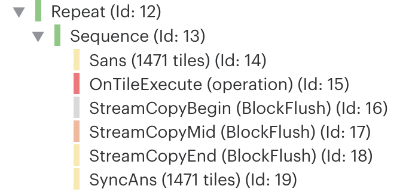

<!-- Copyright (c) 2022 Graphcore Ltd. All rights reserved. -->
# PopVision Tutorial: Lightweight Profiling

By default, the Poplar profiler adds fine-grained instrumentation that may cause excessive overhead. The new _lightweight_ profiling solves this by reducing the level of detail or only focusing on the parts of the model of your choice.

By the end of this tutorial, you will:
- Learn how to use the lightweight profiler.
- Understand how `Block` programs can identify meaningful parts of your model.
- Practice how to profile individual programs without modifying the source code.
- Learn how to profile I/O operations, including those added by the lightweight profiler.

Before starting this tutorial, if you need to practice how to write, compile, and run Poplar programs you can refer to [these Poplar tutorials](../../poplar).

## Introduction

The detailed execution profiling (controlled by the Poplar Engine option `autoReport.outputExecutionReport`) has some limitations that can become prohibitive in certain scenarios. This detailed profiling measures the cycle length of every program and records the control flow of the execution. With these two pieces of information, the host can reconstruct the execution trace once the program finishes. This has some drawbacks:
- It can consume a significant portion of the memory to keep one cycle counter per program per tile.
- The post-processing of the measurements on the host can be time consuming. This imposes a limit on the length of the execution to be profiled.
- It may be difficult to focus on high-level operations given the fine-grained instrumentation.

There is also a strict limitation: only the measurement of the last execution of a given program is preserved. Typically, this is good enough but it would generate inaccurate profiles if the execution time of a compute set depended on the input data.

Lightweight profiling is a different approach to instrumentation that solves these issues. Instead of measuring the cycle length of each individual program, the lightweight profiler can be used to only profile what interests the user. In this way, the memory consumption and post-processing time are reduced by reducing the number of units to individually instrument.

For instance, if you are only interested in a high-level perspective of how your pipelined model is performing, you could focus on the pipeline stages and only measure the beginning and end of each of them. Among other possibilities, this approach allows you to detect work imbalances among the IPUs in the pipeline with minimal overhead. Moreover, you no longer have to limit the profiling to a few iterations; you can enable this profiling throughout the whole execution. The examples in the next section elaborate on this idea.

Another feature of lightweight profiling is that it operates from the perspective of a single tile. While the detailed execution profile provides a trace for each tile in the IPU (which can be seen in full in the BSP view in the PopVision Graph Analyser), lightweight profiling only instruments one tile per IPU. By default it is tile 0 but you can change this with the Poplar Engine option `profiler.blocks.tile`. `StreamCopy` programs are an exception and are instrumented wherever they occur as we will see in a later example.

Note that the examples in this tutorial are targeting Poplar and, therefore, they should be considered as a low-level illustration of the fundamental capabilities of lightweight profiling. Frameworks like TensorFlow and PyTorch are expected to adopt this new profiling and expose convenient abstractions to the user, but this is not covered in this tutorial.

## Setup

We encourage the reader to execute the programs in the following examples and to analyse their output. Please note that this code is meant to be executed on real IPUs because the instrumentation needs to access IPU registers to measure cycles. For instructions on how to compile Poplar programs and a brief practical introduction to programming in Poplar please refer to [these Poplar tutorials](../../poplar) (when compiling, remember to also link in the _libpva_ library using `-lpva`).

## Example 1: use of the Block program

The main option to request the lightweight profiler to focus on a certain area of code is to use the `Block` program class. You can find it in [Poplar's public interface](https://docs.graphcore.ai/projects/poplar-api/en/3.2.0/poplar/Program.html).

```cpp
/** A program to scope another program.
 * This can be used together with the Poplar Engine option `profiler.blocks.filter` to
 * profile the cycle length of each execution of the scoped program.
 */
class Block : public Program {
public:
  Block(const Program &p, const DebugContext &debugContext = {});
};
```

For this example, let us first create something that resembles a pipelined model. Our simplistic pipeline has two stages and each of them contains two operations that, to simplify, will be just a single compute set with a dummy vertex that simulates approximately 3600 cycles of work. Each stage will be placed on a different IPU and the pipeline will be executed five times.

The following snippet of code creates the described structure. You can find the full source code in [example_1.cpp](./examples/example_1.cpp).

```cpp
const auto tilesPerIpu = device.getTarget().getTilesPerIPU();
auto createOperation = [&] (const std::string &name, const unsigned ipu) {
   ComputeSet op = graph.addComputeSet(name);
   VertexRef v = graph.addVertex(op, "DummyVertex");
   graph.setTileMapping(v, tilesPerIpu * ipu);
   return Execute(op, name);
};

const auto stage1 = Sequence({
      createOperation("op1", 0),
      createOperation("op2", 0)
   }, "stage1");
const auto stage2 = Sequence({
      createOperation("op1", 1),
      createOperation("op2", 1)
   }, "stage2");

Repeat loop{5, Sequence{stage1, stage2}};
```

Now we can add a `Block` program around each pipeline stage.

```cpp
const auto stage1 = Block(Sequence{
      createOperation("op1", 0),
      createOperation("op2", 0)
   }, "stage1");
const auto stage2 = Block(Sequence{
      createOperation("op1", 1),
      createOperation("op2", 1)
   }, "stage2");
```

However, Poplar will ignore these `Block` programs during compilation if you do nothing else. You must specify which blocks you are interested in by using the Poplar Engine option `profiler.blocks.filter` that accepts a regular expression. For example:

```
"profiler.blocks.filter": "stage.*"
```

This tells Poplar that you want to instrument any `Block` whose name starts with `stage`. Let us now execute the model. Note that these examples require a real IPU for execution rather than a simulated IPU because the instrumentation code needs access to the cycle counters present in the real hardware.

```cpp
OptionFlags engineOpts{
    {"profiler.blocks.filter", "stage.*"}
};
Engine engine(graph, loop, engineOpts);
engine.load(device);
engine.run();
```

Note you could also pass this flag using an environment variable. Assuming you have compiled this example into an executable named `example_1`, you could use the following command:

```
POPLAR_ENGINE_OPTIONS='{"profiler.blocks.filter": "stage.*"}' ./example_1
```

Finally we can retrieve the cycle measurements using _libpva_.

```cpp
auto report = engine.getReport();
for (unsigned ipu{}; ipu < NUM_IPUS; ++ipu) {
    const auto tile = ipu * tilesPerIpu;
    for (const auto &block : report.execution().blocks(tile)) {
        const auto from = block.cyclesFrom();
        const auto to = block.cyclesTo();
        std::cout << block.program()->name() << ": " << (to - from) << " (" << from << " - " << to << ")\n";
    }
}
```

This will print something similar to this:

```
stage1: 7236 (2157535120 - 2157542356)
stage1: 7238 (2158386380 - 2158393618)
stage1: 7236 (2158557688 - 2158564924)
stage1: 7238 (2158725674 - 2158732912)
stage1: 7240 (2158890522 - 2158897762)
stage2: 7239 (2157434837 - 2157442076)
stage2: 7236 (2158285766 - 2158293002)
stage2: 7236 (2158457072 - 2158464308)
stage2: 7238 (2158625058 - 2158632296)
stage2: 7240 (2158789906 - 2158797146)
```

Note that the first profiled stage starts after around 2.1 billion cycles rather than at 0. This is because the cycle counter starts when the executable is initially loaded in the IPU.

We can also see how long each stage takes, as expected, twice the cycles of a single operation (~3600 cycles) plus a small constant overhead that is mostly due to the instrumentation itself. Thus, we can conclude that the pipeline is well balanced and the IPUs will not waste time waiting for each other. Thanks to lightweight profiling, we have been able to easily concentrate on a specific problem without disrupting the execution of our model.

Another detail to note is that, in theory, the first execution of each stage should start at the same time but here we see differences of around 150k cycles. This is due to clocks in different IPUs being reset at slightly different times. All this overhead and deviation is negligible in real executions.

### Nested Block programs

Poplar also allows nested `Block` programs. For instance, let us wrap the individual operations of our example in a `Block`. For this, we should return a `Block` rather than an `Execute` program:
```cpp
auto createOperation = [&] (const std::string &name, const unsigned ipu) {
    ...
    //return Execute(op);
    return Block(Execute(op), name);
  };
```

This change together with the following regular expression:

```
"profiler.blocks.filter", "stage.|op2"
```

should produce some output like this:

```
stage1: 7377 (2157780318 - 2157787695)
   op2: 3623 (2157783999 - 2157787622)
stage1: 7377 (2158581702 - 2158589079)
   op2: 3623 (2158585383 - 2158589006)
stage1: 7377 (2158756290 - 2158763667)
   op2: 3623 (2158759971 - 2158763594)
stage1: 7377 (2158920840 - 2158928217)
   op2: 3623 (2158924521 - 2158928144)
stage1: 7379 (2159082604 - 2159089983)
   op2: 3623 (2159086287 - 2159089910)
stage2: 7376 (2157681193 - 2157688569)
   op2: 3623 (2157684873 - 2157688496)
stage2: 7375 (2158482248 - 2158489623)
   op2: 3623 (2158485927 - 2158489550)
stage2: 7379 (2158656838 - 2158664217)
   op2: 3623 (2158660521 - 2158664144)
stage2: 7375 (2158821386 - 2158828761)
   op2: 3623 (2158825065 - 2158828688)
stage2: 7377 (2158983150 - 2158990527)
   op2: 3623 (2158986831 - 2158990454)
```

By comparing the start and end points, we can see that the execution of each operation `op2` is contained in the execution of the corresponding stage.

## Example 2: implicit Block programs

In the previous example we have seen how to add `Block` programs to your source code to instrument meaningful parts of your model. However, sometimes modifying the source code can be inconvenient or impossible. In those cases you can ask Poplar to add implicit blocks around areas of interest. You can do this with the Poplar Engine option `profile.programs.filter` that also accepts a regular expression. During compilation, Poplar will automatically wrap any program whose name matches the regular expression with an implicit `Block` program. You can get help from PopVision Graph Analyser to visualise the programs in your model and list their names. Note you can also use this option when using high-level frameworks, though this is not fully supported and you will have to use the PopVision Graph Analyser to determine the names of the relevant programs.

For this example, we will profile a vertex whose execution time depends on the input data. Again, we use a dummy vertex with simplified logic for brevity. With this, we want to illustrate how  lightweight profiling overcomes another limitation of the detailed instrumentation: it is able to accurately measure the elapsed cycles of each individual vertex (compute set) execution.

```cpp
#include <poplar/Vertex.hpp>
using namespace poplar;

class DummyVertex : public SupervisorVertex {
  poplar::InOut<unsigned> iterations;
public:
  __attribute__((target("supervisor"))) bool compute() {
    for (unsigned i{}; i < iterations; ++i) {
      // Simulate some computation
      for (volatile int i{}; i < 100; ++i);
    }
    // Increase the number of iterations the next execution will have to do
    iterations += 1;
    return true;
  }
};
```

Next we create the variable that will be used as input and output of the vertex. Then we create and add the vertex to a compute set. Finally we connect the variable and the vertex and we execute it five times. The full source code for this example can be found in [example_2.cpp](./examples/example_2.cpp).

```cpp
Tensor vIterations = graph.addVariable(UNSIGNED_INT, {});
graph.setTileMapping(vIterations, 0);
ComputeSet cs = graph.addComputeSet("operation");
VertexRef v = graph.addVertex(cs, "DummyVertex");
graph.setTileMapping(v, 0);

graph.connect(v["iterations"], vIterations);
graph.setInitialValue(vIterations, 1);

Repeat loop{5, Execute(cs)};

OptionFlags engineOpts{
   {"profiler.programs.filter", "operation"}
};
Engine engine(graph, loop, engineOpts);
engine.load(device);
engine.run();
```

Note how this time we have not used an explicit `Block` program. Instead we have specified the name of the programs to instrument in `profiler.programs.filter` and Poplar will do the rest during compilation. This method is convenient when you want to profile individual programs rather than a whole subgraph.

After executing our simplified model we can access the report using _libpva_.

```cpp
auto report = engine.getReport();
const unsigned tile{0};
for (const auto &block : report.execution().blocks(tile)) {
    const auto cycles = block.cyclesTo() - block.cyclesFrom();
    std::cout << block.program()->name() << ": " << cycles << "\n";
}
```

The code above should print something very similar to this:

```
operation: 3905
operation: 7555
operation: 11203
operation: 14857
operation: 18505
```

As expected, each execution of the vertex increases by approximately 3600 cycles plus some negligible instrumentation overhead.

Especially when instrumenting individual programs, it is important to bear in mind that lightweight profiling instruments only one tile per IPU (tile 0 by default) as we mentioned in the introduction. Therefore, if we had picked tile 1 in this example we would not have been able to properly measure the execution time of the vertex as it was being executed in tile 0. Fortunately, this is usually not a problem when profiling high-level operations that contain multiple vertices working in most of the tiles (likely surrounded by synchronisation barriers), like the pipeline phases in the first example.

If you are interested in profiling input/output operations as well as the computation, the following example explains how to do it without the need of identifying the tiles that perform such operations.

## Example 3: I/O

In this example we see how lightweight profiling can profile data movement between the host and the IPU, that is, StreamCopy programs.

To do so, let us implement an operation that contains a single dummy vertex. Similarly to previous examples, this vertex will accept an integer as an input and simulate 3600 cycles of work. This operation is repeated in a loop and the input is streamed from the host to the IPU for each iteration. The full source code can be found in [example_3.cpp](./examples/example_3.cpp).

Just to make this example more interesting let us parallelise data movement and computation. For this purpose we will use two variables: the first one will receive input data from the host while the IPU computes over the second one. We will add an explicit `Copy` program to move the content of the first variable into the second one at the appropriate time.

```cpp
const unsigned computeTile{0};
const unsigned ioTile{100};

ComputeSet op = graph.addComputeSet("operation");
VertexRef v = graph.addVertex(op, "DummyVertex");
graph.setTileMapping(v, computeTile);

Tensor in1 = graph.addVariable(INT, {});
Tensor in2 = graph.addVariable(INT, {});
graph.setTileMapping(in1, ioTile);
graph.setTileMapping(in2, computeTile);

graph.connect(v["input"], in2);

auto inStream = graph.addHostToDeviceFIFO("in", INT, 1);

Sequence seq{
   Copy(inStream, in1),
   Repeat{4, Sequence{
      Copy(in1, in2),
      Copy(inStream, in1),
      Execute(op)
   }},
   Copy(in1, in2),
   Execute(op)
};
```

Before the loop, we ramp up the I/O pipeline by performing the first host-to-IPU copy. Then, the first operation in the loop body copies from the content of the I/O variable into the computation variable. Thanks to this, the next host-to-IPU copy can happen in parallel with the computation. After the loop we ramp down the pipeline by computing over the last bit of streamed information.

Now let us create the engine and connect the dummy callback. Note that we are enabling `debug.instrumentExternalExchange` so that `StreamCopy` programs get instrumented. As we said earlier, there is no need to tell Poplar which tiles will perform I/O (tile 100 in this example) as it will instrument those operations automatically wherever they occur. We will explain the function of the new Poplar Engine option `profiler.blocks.implicitFlush` later.

```cpp
OptionFlags engineOpts{
   {"profiler.programs.filter", "operation"},
   {"debug.instrumentExternalExchange", "true"},
   {"profiler.blocks.implicitFlush", "false"}
};
Engine engine(graph, seq, engineOpts);

// Dummy callback that sends zeroes
const int value{0};
auto callback = std::make_unique<HostToDeviceCallback>(poplar::ArrayRef<int>(&value, 1));
engine.connectStreamToCallback("in", 0, std::move(callback));
```

Finally, we run the engine and use _libpva_ to retrieve all block measurements.

```cpp
engine.load(device);
engine.run();

auto report = engine.getReport();

for (const unsigned tile : {computeTile, ioTile}) {
   for (const auto &block : report.execution().blocks(tile)) {
      const auto from = block.cyclesFrom();
      const auto to = block.cyclesTo();
      if (block.isStreamCopy()) {
         std::cout << getType(block.program());
      } else {
         std::cout << block.program()->name();
      }
      std::cout << " in tile " << << block.tile() << ": "
                << (to - from) << " (" << from << " - " << to << ")\n";
   }
}
```

The execution of this code should print something like:

```
     StreamCopyBegin in tile    0:      155 (980718300 - 980718455)
       StreamCopyMid in tile    0:     1513 (980718491 - 980720004)
       StreamCopyEnd in tile    0:       87 (980720040 - 980720127)
     StreamCopyBegin in tile    0: 35183056 (980720163 - 1015903219)
       StreamCopyMid in tile    0:     1531 (1015903255 - 1015904786)
       StreamCopyEnd in tile    0:   205246 (1015904822 - 1016110068)
           operation in tile    0:     3687 (1016283615 - 1016287302)
           operation in tile    0:     3689 (1016449921 - 1016453610)
           operation in tile    0:     3687 (1016614227 - 1016617914)
           operation in tile    0:     3689 (1016776621 - 1016780310)
           operation in tile    0:     3689 (1016935591 - 1016939280)
     StreamCopyBegin in tile  100:    88338 (1016110373 - 1016198711)
       StreamCopyMid in tile  100:     1497 (1016198747 - 1016200244)
       StreamCopyEnd in tile  100:    83096 (1016200280 - 1016283376)
     StreamCopyBegin in tile  100:    81108 (1016283527 - 1016364635)
       StreamCopyMid in tile  100:     1771 (1016364671 - 1016366442)
       StreamCopyEnd in tile  100:    83204 (1016366478 - 1016449682)
     StreamCopyBegin in tile  100:    78402 (1016449833 - 1016528235)
       StreamCopyMid in tile  100:     1501 (1016528271 - 1016529772)
       StreamCopyEnd in tile  100:    84180 (1016529808 - 1016613988)
     StreamCopyBegin in tile  100:    77330 (1016614139 - 1016691469)
       StreamCopyMid in tile  100:     1491 (1016691505 - 1016692996)
       StreamCopyEnd in tile  100:    83350 (1016693032 - 1016776382)
     StreamCopyBegin in tile  100:    77706 (1016776533 - 1016854239)
       StreamCopyMid in tile  100:     1491 (1016854275 - 1016855766)
       StreamCopyEnd in tile  100:    79556 (1016855802 - 1016935358)
```

The first two triplets of `StreamCopy` programs are those which instruct the IPU which program to start executing. They are always present at the beginning of a run and we can ignore them for this example.

Then we see five operations on tile 0 as expected. Next in the list we find the corresponding five `StreamCopy` triplets on tile 100. But let's check if I/O and computation have actually overlapped.

The first operation should have been executed in parallel with the second `StreamCopy`. In our example execution we see that the first operation started at cycle 1016283615 and finished at cycle 1016287302. In turn, the second I/O `StreamCopyBegin` started at cycle 1016283527 (before computation started) and finished at cycle 1016364635 (after computation finished). We can conclude that these two programs have been effectively executed in parallel. Note that if computation was longer it would have also overlapped the `StreamCopyMid` and `StreamCopyEnd` phases of the second triplet.

In this example we have seen how lightweight profiling can also give us information on I/O operations. In the next section we will use this capability to focus on an I/O operation implicitly added by the lightweight profiling itself. At the same time it provides insights on how this profiling works internally.

## Block flush

Previously we disabled the Poplar Engine option `profiler.blocks.implicitFlush` to simplify the example. This prevents Poplar from inserting an implicit block _flush_ in the program tree. Otherwise, Poplar will try to find a good spot where to flush the block buffer. This flush is just a StreamCopy that copies the cycle measurements from tile memory to the host. A high frequency of flushes reduces the chances of overflowing that buffer. However, Poplar must find a moment in the execution where all tiles are in sync or the flush will disrupt the parallelism of the model.

Let us change our example to focus on the flush ([example_3_a.cpp](./examples/example_3_a.cpp)):

```cpp
ComputeSet op = graph.addComputeSet("operation");
VertexRef v = graph.addVertex(op, "DummyVertex");
graph.setTileMapping(v, computeTile);

Sequence seq{
   Repeat{100, Sequence{
      Execute(op)
      }
   }
};
```

Now we have a simple operation that gets executed a hundred times. Let us execute it like this:

```cpp
OptionFlags engineOpts{
   {"profiler.programs.filter", "operation"},
   {"profiler.blocks.implicitFlush", "false"},
};
auto report = [&] () {
   Engine engine(graph, seq, engineOpts);
   engine.load(device);
   engine.run();
   return engine.getReport();
}();
```

Note that we slightly changed the way we get the _libpva_ report. In this case we make sure the engine is destroyed before we access that report. This allows us to access any pending unclosed event. We can now access the report:

```cpp
unsigned numCommonBlocks{};
unsigned numStreamCopies{};
unsigned numOverflows{};
unsigned numFlushes{};
unsigned numBlocks{};
for (const auto &block : report.execution().blocks(computeTile)) {
   if (block.isCommon()) {
      // Normal block measurements requested by the user
      ++numCommonBlocks;
   } else if (block.isOverflow()) {
      // This block represents a period of time where the
      // instrumentation buffer was full
      ++numOverflows;
   } else if (block.isBlockFlush()) {
      // This block is a StreamCopy introduced to flush the buffer
      ++numFlushes;
   } else if (block.isStreamCopy()) {
      ++numStreamCopies;
   }
   ++numBlocks;
}
std::cout << "numBlocks: " << numBlocks << "\n";
std::cout << "numCommonBlocks: " << numCommonBlocks << "\n";
std::cout << "numOverflows: " << numOverflows << "\n";
std::cout << "numFlushes: " << numFlushes << "\n";
std::cout << "numStreamCopies: " << numStreamCopies << "\n";
```

This code should output something similar to this:

```
numBlocks: 43
numCommonBlocks: 42
numOverflows: 1
numFlushes: 0
numStreamCopies: 0
```

We only get 42 blocks even though the operation was executed a hundred times. This is because the buffer in the tile's memory filled up completely and the subsequent blocks were discarded. This is why Poplar also generated an _overflow_ block. Note that this block also has a cycle length that marks the period of time during which events were dropped.

To mitigate this issue, there is an option to increase the buffer size. It is 1000B by default but the user can change it with the Poplar Engine option `profiler.blocks.bufferSize`. Another option is to allow Poplar to add an implicit flush by not setting `profiler.blocks.implicitFlush` to false. In the following cropped screenshot from PopVision Graph Analyser we can see the `StreamCopy` triplet added by Poplar which is labeled as "BlockFlush".



If we rerun with `profiler.blocks.implicitFlush` set to true (which is the default) we will be able to retrieve more blocks. Note that we also have to enable `debug.instrumentExternalExchange` to activate the instrumentation of `StreamCopy` programs, including those that flush the buffer.

The output is now:

```
numBlocks: 406
numCommonBlocks: 100
numFlushes: 300
numStreamCopies: 6
numOverflows: 0
```

We now get the 100 blocks for the operations as expected. Additionally we get 300 flush blocks that can be interpreted as 100 StreamCopy triplets that correspond to each of the block flushes that Poplar has added at the end of the loop. Note that block flushes are separately categorised even if they actually are regular `StreamCopy` programs. Finally we also get 6 `StreamCopy` programs that correspond to the two control `StreamCopy` triplets that always occur at the beginning of the run.

## Conclusion

In this tutorial we have seen how you can focus on the parts of your model you are interested in when profiling. You can easily profile high-level operations by wrapping them in `Block` programs or you can profile individual programs by specifying their names via Poplar Engine options. We have also seen how you can profile I/O operations at the same time, even if they happen in parallel with computation. We expect this lightweight approach will be adaptable enough to profile the interesting parts of models of any size and their executions of any length.

## Further reading

To delve further into the examples in this tutorial, [this _libpva_ tutorial](../libpva) may be interesting if you would like to familiarise yourself on how to programmatically access a Poplar profile. Additionally, the [PopVision Graph Analyser user guide](https://docs.graphcore.ai/projects/graph-analyser-userguide/en/3.11.2/) can take you on a visual tour of the capabilities and limitations of full profiling.
