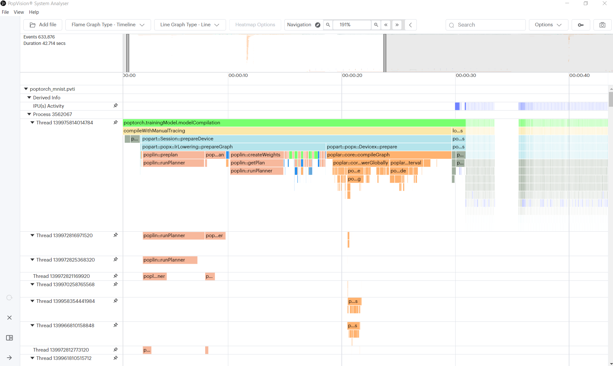
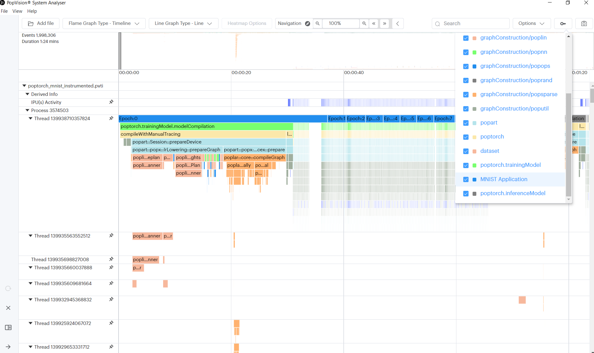
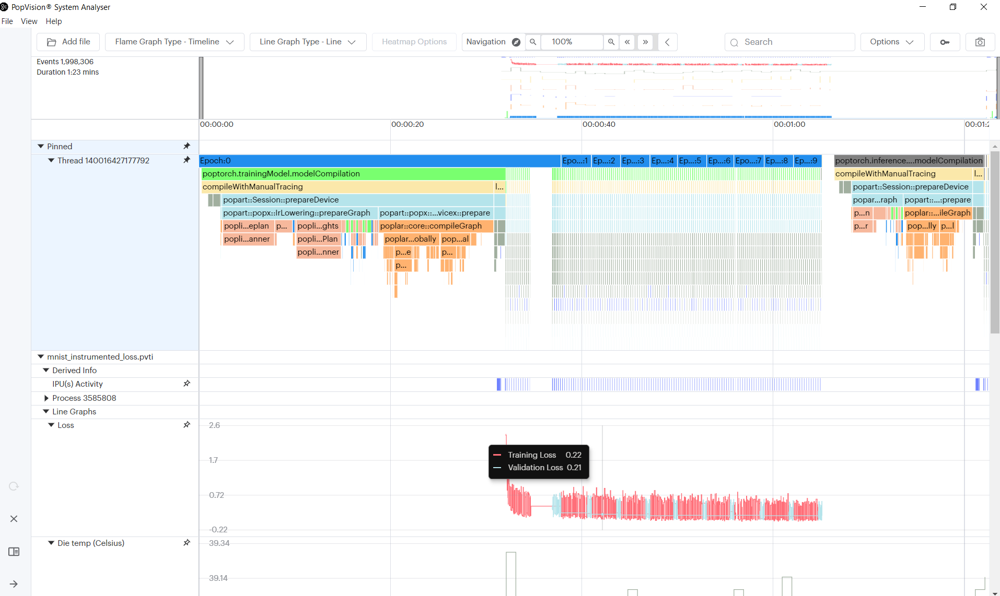
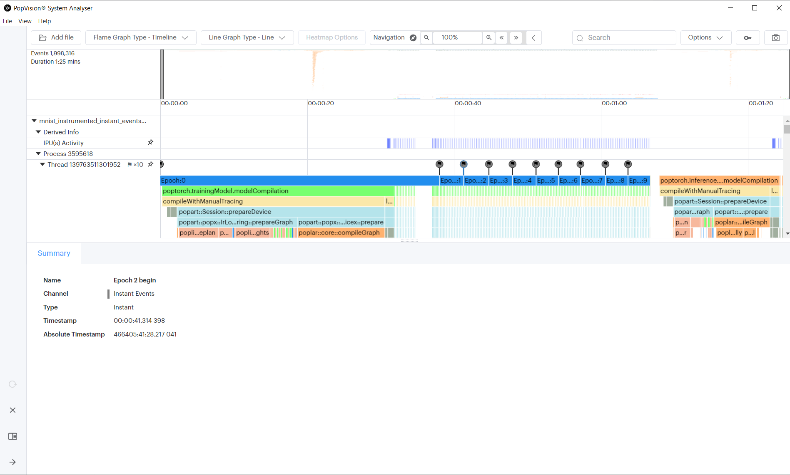
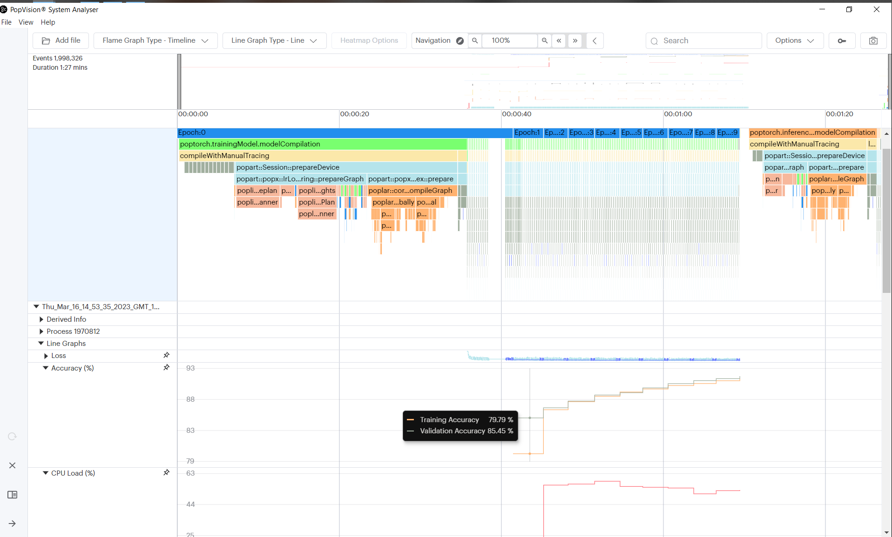

<!-- Copyright (c) 2020 Graphcore Ltd. All rights reserved. -->
<!-- THIS FILE IS AUTOGENERATED. Rerun SST after editing source file: walkthrough.py -->

# Tutorial: Instrumenting applications

In this tutorial you will learn to use:

- the [PopVision System
  Analyser](https://docs.graphcore.ai/projects/system-analyser-userguide/en/2.11.2/),
  a desktop tool for profiling the execution of IPU-targeted software on your
  host system processors;
- the [`libpvti`
  module](https://docs.graphcore.ai/projects/libpvti/en/3.2.0/index.html) in
  python which can be used to profile, time, and log information from your IPU
  applications and plot it directly in the PopVision System Analyser.

## How to run this tutorial

To run the Jupyter notebook version of this tutorial:

1. Enable a Poplar SDK environment (see the [Getting
  Started](https://docs.graphcore.ai/en/latest/getting-started.html) guide for
  your IPU system)
2. In the same environment, install the Jupyter notebook server:
   `python -m pip install jupyter`
3. Launch a Jupyter Server on a specific port:
   `jupyter-notebook --no-browser --port <port number>`
4. Connect via SSH to your remote machine, forwarding your chosen port:
   `ssh -NL <port number>:localhost:<port number>
   <your username>@<remote machine>`

For more details about this process, or if you need troubleshooting, see our
[guide on using IPUs from Jupyter
notebooks](../../standard_tools/using_jupyter/README.md).

## Introduction

The Graphcore PopVision™ System Analyser is a desktop tool for analysing the
execution of IPU-targeted software on your host system processors.
It shows an interactive timeline visualisation of the execution steps involved,
helping you to identify any bottlenecks between the CPUs and IPUs.
This is particularly useful when you are scaling models to run on multiple CPUs and IPUs.

For this tutorial we are going to use a PopART MNIST example and add
instrumentation that can be viewed using the PopVision System Analyser.
Make sure the PopVision System Analyser is installed on your local machine, it can
be downloaded from the [Downloads Portal](https://downloads.graphcore.ai/).
The PopART MNIST example is from the [simple_applications/popart/mnist](../../../simple_applications/popart/mnist)
directory).

Run the MNIST example with profiling enabled

```python
import subprocess
import os

mnist_path = "./popart_mnist.py"
os.environ["PVTI_OPTIONS"] = '{"enable":"true", "directory": "mydirectory"}'
subprocess.run(["sh", "./get_data.sh"])
output = subprocess.run(
    ["python3", mnist_path], stdout=subprocess.PIPE, stderr=subprocess.STDOUT
)
print(output.stdout.decode("utf-8"))
```

```output
Creating ONNX model.
Compiling the training graph.
Compiling the validation graph.
Running training loop.
Epoch #1
   Loss=16.2605
   Accuracy=88.88%
Epoch #2
   Loss=13.9930
   Accuracy=89.63%
Epoch #3
   Loss=13.1049
   Accuracy=89.83%
Epoch #4
   Loss=12.5232
   Accuracy=90.01%
Epoch #5
   Loss=12.1029
   Accuracy=90.12%
Epoch #6
   Loss=11.7830
   Accuracy=90.22%
Epoch #7
   Loss=11.5327
   Accuracy=90.40%
Epoch #8
   Loss=11.3332
   Accuracy=90.59%
Epoch #9
   Loss=11.1712
   Accuracy=90.65%
Epoch #10
   Loss=11.0370
   Accuracy=90.70%
```

When this has completed you will find a pvti file in the working directory,
for example "Tue_Nov_24_11:59:17_2022_GMT_4532.pvti".

> **Note**: You can specify an output directory for the pvti files to be
> written to:
>
> ```bash
> PVTI_OPTIONS='{"enable":"true", "directory": "tommyFlowers"}' python3 popart_mnist.py
> ```

Open the PopVision System Analyser and then select "Open a report" and select
the pvti file generated. You may need to copy the pvti file to your local
machine.

You should then see the following profile information.



## Profiling execution of epochs

We are now going to modify the MNIST example to add instrumentation to clearly
show the epochs. (You can find the completed tutorial in the `complete`
directory)

Firstly, we need to import the libpvti library.

Add the import statement at the top of `popart_mnist.py`:
```python
import libpvti as pvti
```

Next we will need to create a trace channel. Add the `mnistPvtiChannel` as a
global object.

```python
mnistPvtiChannel = pvti.createTraceChannel("MNIST Application")
```

We are going to use the Python `with` keyword with a Python context manager to
instrument the epoch loop.

> **Note**: You will need to indent the contents of the loop.

```python
print("Running training loop.")
for i in range(opts.epochs):
    with pvti.Tracepoint(mnistPvtiChannel, f"Epoch:{i}"):
        ...
```

Run the MNIST example again with profiling enabled

```python
output = subprocess.run(
    ["python3", mnist_path], stdout=subprocess.PIPE, stderr=subprocess.STDOUT
)
print(output.stdout.decode("utf-8"))
```

```output
Creating ONNX model.
Compiling the training graph.
Compiling the validation graph.
Running training loop.
Epoch #1
   Loss=16.2605
   Accuracy=88.88%
Epoch #2
   Loss=13.9930
   Accuracy=89.63%
Epoch #3
   Loss=13.1049
   Accuracy=89.83%
Epoch #4
   Loss=12.5232
   Accuracy=90.01%
Epoch #5
   Loss=12.1029
   Accuracy=90.12%
Epoch #6
   Loss=11.7830
   Accuracy=90.22%
Epoch #7
   Loss=11.5327
   Accuracy=90.40%
Epoch #8
   Loss=11.3332
   Accuracy=90.59%
Epoch #9
   Loss=11.1712
   Accuracy=90.65%
Epoch #10
   Loss=11.0370
   Accuracy=90.70%
```

We leave it as an exercise for the reader to add instrumentation of the
training & evaluation phases. When added you will see the following profile in
the PopVision System Analyser.

> **Note**: You can nest the Tracepoint statements.



## Logging the training and validation losses

In addition to displaying function profiling, the System Analyser can plot
numerical data captured by the `libpvti` library.

In this section, we are going to add instrumentation to our Python script to
allow the System Analyser to plot the loss reported by PopART (this is a
Poplar SDK 2.1 feature).

We have added the libpvti import in the previous section, so we need first to
create a pvti Graph object and then create series in the graph.

To create the graph we call the `pvti.Graph` constructor passing the name of
the graph:

```python
loss_graph = pvti.Graph("Loss", "")
```

Then create the series to which we will add the data:

```python
training_loss_series = loss_graph.addSeries("Training Loss")
validation_loss_series = loss_graph.addSeries("Validation Loss")
```

Finally after each call to the PopART `session.run` method we will record the
training and validation loss. We take the loss from the anchors (which is an
array) and compute the mean value:

```python
training.session.run(stepio, "Epoch " + str(i) + " training step" + str(step))

# Record the training loss
training_loss_series.add(np.mean(training.anchors[loss]).item())

...

validation.session.run(stepio, "Epoch " + str(i) + " evaluation step " + str(step))

# Record the validation loss
validation_loss_series.add(np.mean(validation.anchors[loss]).item())
```

Run the MNIST example again with profiling enabled

```python
output = subprocess.run(
    ["python3", mnist_path], stdout=subprocess.PIPE, stderr=subprocess.STDOUT
)
print(output.stdout.decode("utf-8"))
```

```output
Creating ONNX model.
Compiling the training graph.
Compiling the validation graph.
Running training loop.
Epoch #1
   Loss=16.2605
   Accuracy=88.88%
Epoch #2
   Loss=13.9930
   Accuracy=89.63%
Epoch #3
   Loss=13.1049
   Accuracy=89.83%
Epoch #4
   Loss=12.5232
   Accuracy=90.01%
Epoch #5
   Loss=12.1029
   Accuracy=90.12%
Epoch #6
   Loss=11.7830
   Accuracy=90.22%
Epoch #7
   Loss=11.5327
   Accuracy=90.40%
Epoch #8
   Loss=11.3332
   Accuracy=90.59%
Epoch #9
   Loss=11.1712
   Accuracy=90.65%
Epoch #10
   Loss=11.0370
   Accuracy=90.70%
```

When we view the resulting pvti report in the System Analyser (you may need to
scroll to the bottom of the page) it will show the loss graph looking something
like this:



> **Note**: The option to `merge all charts` has been enabled to combine all
> threads into a single row, to make it easier to align the flame graph with
> the line graph.

## Generating and profiling instant events

You can get insight into when particular sequences in the host code are executed by adding 'instant events'. This feature can be used to log events that occur during the execution of the application, such as  receiving a message, errors/warnings or a change in a parameter such as epoch or learning rate.

For these purposes you may use 'instant events', which are like checkpoints. This feature adds trace points corresponding to a single point in time rather than a block.

For example, we are going to log the epoch number each time a new epoch begins, by using instant events:

```python
print("Running training loop.")
mnistInstantEventsChannel = pvti.createTraceChannel("Instant Events")
for i in range(opts.epochs):
    pvti.Tracepoint.event(mnistInstantEventsChannel, f"Epoch {i} begin")
    ...
```

Run the MNIST example again with profiling enabled

```python
output = subprocess.run(
    ["python3", mnist_path], stdout=subprocess.PIPE, stderr=subprocess.STDOUT
)
print(output.stdout.decode("utf-8"))
```

```output
Creating ONNX model.
Compiling the training graph.
Compiling the validation graph.
Running training loop.
Epoch #1
   Loss=16.2605
   Accuracy=88.88%
Epoch #2
   Loss=13.9930
   Accuracy=89.63%
Epoch #3
   Loss=13.1049
   Accuracy=89.83%
Epoch #4
   Loss=12.5232
   Accuracy=90.01%
Epoch #5
   Loss=12.1029
   Accuracy=90.12%
Epoch #6
   Loss=11.7830
   Accuracy=90.22%
Epoch #7
   Loss=11.5327
   Accuracy=90.40%
Epoch #8
   Loss=11.3332
   Accuracy=90.59%
Epoch #9
   Loss=11.1712
   Accuracy=90.65%
Epoch #10
   Loss=11.0370
   Accuracy=90.70%
```

You can use an existing trace channel to capture instant events, but we are using a separate one for the purposes of this tutorial.

When added you will see the following profile in the PopVision System Analyser. Instant events are represented by flags at the top of the profile:



## Going further

We leave it as an exercise for the reader to add additional instrumentation.
The completed example also calculates accuracy of the model, and CPU load using
the `psutil` library, and plots both of them.



This is a very simple use case for adding instrumentation. The PopVision trace
instrumentation library (libpvti) provides other functions, classes & methods
to instrument your Python and C++ code. For more information please see the
[PVTI library documentation](https://docs.graphcore.ai/projects/libpvti/en/3.2.0/index.html).

Generated:2022-12-02T16:18 Source:walkthrough.py SDK:3.1.0-EA.1+1166 SST:0.0.9
