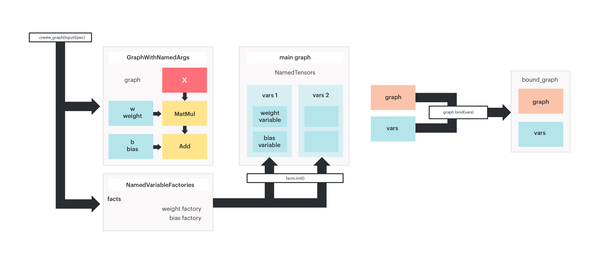

<!-- Copyright (c) 2022 Graphcore Ltd. All rights reserved. -->
<!-- THIS FILE IS AUTOGENERATED. Rerun SST after editing source file: mnist.py -->

# PopXL and popxl.addons

## Introduction

As an alternative to using the ONNX builder to create models, PopXL is an
experimental PopART Python module which allows users to hand-craft arbitrary
computational graphs, control execution schemes, and optimise the Poplar
executable. This provides greater flexibility than is possible using the
standard PopART API.

It gives precise control of program size and runtime performance in a high level
language (Python). It is useful for large models, as it gives low-level control
of:

- Subgraph inlining/outlining for optimising program size
- Data parallelism for improving throughput
- Remote Variables for streaming/storing data remotely to optimise memory
  requirements of the model

Familiarity with the basic [PopXL
concepts](https://docs.graphcore.ai/projects/popxl/en/3.3.0/concepts.html#concepts)
will be helpful, but not essential:

- Intermediate representation
  ([IR](https://docs.graphcore.ai/projects/popxl/en/3.3.0/concepts.html#irs))
- Tensors (variable, constant and intermediate)
- [Graphs](https://docs.graphcore.ai/projects/popxl/en/3.3.0/concepts.html#graphs)
  (main and subgraph)
- Input and output streams
- Sessions

popxl.addons includes common usage patterns of PopXL. It simplifies the process
of building and training a model while keeping control of execution and
optimisation strategies.

Once you've finished this tutorial, you will:

- Be familiar with `addons` basic concepts and understand relations between them:
  - `Module`
  - `NamedTensors`
  - `VariableFactory` and `NamedVariableFactories`
  - `GraphWithNamedArgs`
  - `BoundGraph`
  - Transforms
- Understand what **outlining** is and write an outlined model.
- Use `addons` `autodiff` transform to obtain the backward graph for your model.
- Write a simple training + test program, copying trained weights from the
  training session to the test session.

## Requirements

1. Install a Poplar SDK (version 2.6 or later) and source the enable.sh scripts
   for both PopART and Poplar as described in the [Getting Started
   guide](https://docs.graphcore.ai/en/latest/getting-started.html) for your IPU
   system.
2. Install system dependencies: `apt-get install -y $(< required_apt_packages.txt)`
3. Create a Python virtual environment: `python3 -m venv <virtual_env>`.
4. Activate the virtual environment: `. <virtual_env>/bin/activate`.
5. Update `pip`: `pip3 install --upgrade pip`
6. Install requirements `pip3 install -r requirements.txt` (this will also
   install popxl.addons).

```bash
python3 -m venv virtual_env
. virtual_env/bin/activate
pip3 install --upgrade pip
pip3 install -r requirements.txt
```

To run the Jupyter notebook version of this tutorial:

1. Install a Poplar SDK (version 2.6 or later) and source the enable.sh scripts
   for both PopART and Poplar as described in the [Getting Started
   guide](https://docs.graphcore.ai/en/latest/getting-started.html) for your IPU
   system
2. Create a virtual environment
3. In the same virtual environment, install the Jupyter notebook server: `python
   -m pip install jupyter`
4. Launch a Jupyter Server on a specific port: `jupyter-notebook --no-browser
   --port <port number>`. Be sure to be in the virtual environment.
5. Connect via SSH to your remote machine, forwarding your chosen port: `ssh -NL
   <port number>:localhost:<port number> <your username>@<remote machine>`

For more details about this process, or if you need troubleshooting, see our
[guide on using IPUs from Jupyter
notebooks](../../standard_tools/using_jupyter/README.md).

If using VS Code, Intellisense can help you understand the tutorial code. It
will show function and class descriptions when hovering over their names and
lets you easily jump to their definitions. Consult the [VSCode setup
guide](../VSCodeSetup.md) to use Intellisense for this tutorial.

## Basic concepts

The following are basic concepts of popxl.addons:

- `Module`: a module is the base class to build layers and models. It is similar
  to a PyTorch Module or a Keras Layer. It allows you to create a **graph** with
  **state**, which means with internal parameters (such as weights). Graphs can
  be called from multiple places in parent graphs, which reduces code
  duplication.
- `NamedTensors` : a `DotTree` collection of `popxl.Tensor`, which is basically
  a dictionary between names and tensors. `DotTree` are used in `addons` for all
  collections of named objects. They are very useful to group objects in
  namespaces.
- `VariableFactory` and `NamedVariableFactories` (a `DotTree` collection of
  factories): factories are used to delay variable instantiation to the main
  graph.
- `GraphWithNamedArgs`: it is a container of a `popxl.Graph` and `NamedTensors`.
  `NamedTensors` are the graph named inputs. When a `GraphWithNamedArgs` is
  created with `Module.create_graph()`, factories for each of the input tensors
  are instantiated as well.
- `transforms` are functions that directly modify the graph, generating a new
  one. An example is the `addons.autodiff` transform, which, given a graph,
  produces the corresponding backward graph.
- `BoundGraph`: it is a container of a `popxl.Graph` and a `TensorMap` of bound
  Tensor inputs, which are automatically provided as inputs when the graph is
  called.

The figure below shows how these concepts are related in a typical popxl.addons
workflow:


**Figure 1:** Workflow in popxl.addons.

## A simple example

### Imports

First let's import all the packages we are going to need, including `popxl` and
`popxl_addons`:

```python
from tqdm import tqdm
import torchvision
import torch
import numpy as np
from typing import Mapping, Optional
from functools import partial

np.random.seed(42)

import popxl.ops as ops
import popxl_addons as addons
import popxl
```

### Defining a Linear Module

Below is an example of a linear layer implemented by subclassing
`addons.Module`:

```python
class Linear(addons.Module):
    def __init__(self, out_features: int, bias: bool = True):
        super().__init__()
        self.out_features = out_features
        self.bias = bias

    def build(self, x: popxl.Tensor) -> popxl.Tensor:
        # add a state variable to the module
        w = self.add_variable_input(
            "weight",
            partial(np.random.normal, 0, 0.02, (x.shape[-1], self.out_features)),
            x.dtype,
        )
        y = x @ w
        if self.bias:
            # add a state variable to the module
            b = self.add_variable_input("bias", partial(np.zeros, y.shape[-1]), x.dtype)
            y = y + b

        return y
```

Each Module needs to implement a `build` method. Here you actually define the
graph,  specifying inputs, operations and outputs (the return values).

Inputs are added in two different ways:

- **named inputs** (the parameters of the model, its state) are added via the
  `add_variable_input` method (`w` and `b` above).
- All tensor arguments of the `build` method (`x` in the example above) become
  inputs of the graph.

PopXL variables (the parameters of the model) can only live in the main graph
which means state tensor variables cannot be instantiated directly in the
subgraph; their creation needs to take place in the main graph. The
`add_variable_input` method creates a named local placeholder (a local tensor)
and a corresponding `VariableFactory`. As we will see below, the factory is used
to instantiate a variable in the main graph and then bind it to the named input
in the subgraph.

### Creating a graph from a Module

Before we construct any graphs we need to define a `popxl.Ir` instance which
will hold the main graph. This will represent your fully compiled program.

```python
ir = popxl.Ir(replication=1)
```

Inside the IR main graph we construct the `Linear` graph as follows:

```python
with ir.main_graph:
    # create a variable factory and a graph from the module
    facts, linear_graph = Linear(32).create_graph(
        popxl.TensorSpec((2, 4), popxl.float32)
    )
    print("factories: \n", facts)
    print("\n graph: \n", linear_graph.print_schedule())

    # since we are in the main graph, we can instantiate variables using the factories
    variables = facts.init()
    print("\n variables: \n", variables)

    # and bind our graph to these variables that live in the main graph.
    bound_graph = linear_graph.bind(variables)

    # the bound graph can be called providing only unnamed inputs x
    input_data = np.asarray(np.random.rand(2, 4)).astype(np.float32)
    input_tensor = popxl.variable(input_data, name="x")

    out = bound_graph.call(input_tensor)
```

```output
factories:
 {'weight': <popxl_addons.variable_factory.VariableFactory object at 0x7feaf5cb1160>, 'bias': <popxl_addons.variable_factory.VariableFactory object at 0x7fe851acee10>}

 graph:
 Graph : Linear_subgraph(0)
  (%1, weight=%2, bias=%3) -> (%5) {
    MatMul.100 (%1 [(2, 4) float32], %2 [(4, 32) float32]) -> (%4 [(2, 32) float32])
    Add.101 (%4 [(2, 32) float32], %3 [(32,) float32]) -> (%5 [(2, 32) float32])
  }

 variables:
 {'bias': Tensor[bias popxl.dtypes.float32 (32,)], 'weight': Tensor[weight popxl.dtypes.float32 (4, 32)]}
```

The `create_graph` method requires a `TensorSpec` object or a `Tensor` object
for each of the unnamed inputs (`x`) and returns a `GraphWithNamedArgs` and
`NamedVariableFactories` for the named inputs.

The `GraphWithNamedArgs` gathers together a `popxl.Graph` and tensors
(`GraphWithNamedArgs.args`) which correspond to the named inputs we added
earlier with `add_variable_input` when we defined the Linear Module.

Also, the `NamedVariableFactories` collection contains a factory for each of
those tensors. Instantiating a variable in the main graph is optional, provided
you feed these inputs at the call site. for example `linear_graph.call(x,w,b)`

Once you have instantiated variables using these factories, you can bind the
graph to them using `bound_graph = linear_graph.bind(variables)`.

The resulting `BoundGraph` is effectively a graph with an internal state, which
can be called from the main graph with:

```python
outputs = bound_graph.call(x)
```

Finally, we specify the properties of the IR and create a session object to run
it.

```python
ir.num_host_transfers = 1

# Create a session to run your IR
session = popxl.Session(ir, "ipu_hw")

# Run the program
with session:
    session.run()
```

### Summary and concepts in practice

In summary, the basic steps needed to build and run a model in popxl.addons are
the following:

1. Subclass `addons.Module` to create your layers and models in an
   object-oriented fashion.
2. Initialise an IR as ``ir`` which represents your full compiled program.
3. In the `ir.main_graph()` context, generate the computational graph and the
   variable factories associated with your module with the `Module`
   `create_graph` method.
4. In the `ir.main_graph()` context, instantiate actual variables with the
   `NamedVariableFactory` `init` method.
5. In the `ir.main_graph()` context, bind the computational graph to the
   variables using the `bind` method of `GraphWithNamedArgs`.
6. In the `ir.main_graph()` context,  call the bound graph providing only the
   inputs.
7. Specify the properties of the IR and create a `popxl.Session` to run your IR.
8. Run the program.

### Multiple bound graphs

The same subgraph can be bound to different sets of parameters, resulting in
different bound graphs. You can think to a bound graph as a container of a graph
object and a set of variables. Two different bound graphs can reference to the
same graph, but have different variables.

```python
ir = popxl.Ir()
with ir.main_graph:
    facts, linear_graph = Linear(32).create_graph(
        popxl.TensorSpec((2, 4), popxl.float32)
    )

    variables1 = facts.init()
    variables2 = facts.init()

    # the same subgraph can be bound to different variables,
    # generating distinct bound graph objects.
    bound_graph1 = linear_graph.bind(variables1)
    bound_graph2 = linear_graph.bind(variables2)

    print("\n two different bound graphs: \n", bound_graph1, bound_graph2)

    input_data = np.asarray(np.random.rand(2, 4)).astype(np.float32)
    input_tensor = popxl.variable(input_data, name="x")

    out = bound_graph1.call(input_tensor)
```

```output

 two different bound graphs:
 <popxl_addons.graph.BoundGraph object at 0x7fe851b717b8> <popxl_addons.graph.BoundGraph object at 0x7fe851c3b4a8>
```

Both bound graphs refer to the same computational graph, hence code is reused on
the IPU.

What actually happens is that `bound_graph1.call` becomes a call operation in
the main graph with the following arguments:

```python
call(graph, x, inputs_dict=variables_dict1)
```

where `variables_dict1` is a dictionary between the local tensors in the graph
and the corresponding variables in the main graph, created using the factories.

Calling `bound_graph2`, which is the same graph but bound to different
parameters, results in:

```python
call(graph, x, inputs_dict=variables_dict2)
```



**Figure 2:** The `module.create_graph` method generates a graph and named
variable factories. Calling `.init()` on the variable factories instantiates
actual variable tensors in the main graph. The same subgraph can be bound to
different sets of variables, generating different bound graphs.

## Nested Modules and Outlining

Outlining is the opposite of inlining:

- Inlining, which is generally the default behaviour on the IPU means that if a
  module is used more than once in a model, then a copy will be made of the code
  on the IPU for each use. This has the effect of better performance, because we
  remove some of the  overhead of calling out to a function, but will use more
  always-live memory due to code duplication.
- Outlining, conversely requires some explicit PopXL code. Code will only exist
  once on each IPU and could be called from multiple parent models. This has the
  effect of reducing total memory requirements at the expense of some
  performance.

Further information on graph outlining can be found in our [memory performance
optimisation
guide](https://docs.graphcore.ai/projects/memory-performance-optimisation/en/3.3.0/common-memory-optimisations.html#graph-outlining).

These concepts becomes important when we start building more complicated models
using the
[`Module`](https://docs.graphcore.ai/projects/popxl/en/3.3.0/api.html#modules)
api, combining and nesting several modules. To see why, let's build a simple
linear model using several `Linear` layers.

```python
class Net(addons.Module):
    def __init__(self, cache: Optional[addons.GraphCache] = None):
        super().__init__(cache=cache)
        self.fc1 = Linear(512)
        self.fc2 = Linear(512)
        self.fc3 = Linear(512)
        self.fc4 = Linear(10)

    def build(self, x: popxl.Tensor):
        x = x.reshape((-1, 28 * 28))
        x = ops.gelu(self.fc1(x))
        x = ops.gelu(self.fc2(x))
        x = ops.gelu(self.fc3(x))
        x = self.fc4(x)
        return x


ir = popxl.Ir()
main = ir.main_graph
with main:
    facts, net_graph = Net().create_graph(popxl.TensorSpec((28, 28), popxl.float32))
    print(facts.to_dict().keys())
    print("\n", net_graph.print_schedule())
```

```output
dict_keys(['fc1.weight', 'fc1.bias', 'fc2.weight', 'fc2.bias', 'fc3.weight', 'fc3.bias', 'fc4.weight', 'fc4.bias'])

 Graph : Net_subgraph(0)
  (%1, fc1.weight=%2, fc1.bias=%3, fc2.weight=%4, fc2.bias=%5, fc3.weight=%6, fc3.bias=%7, fc4.weight=%8, fc4.bias=%9) -> (%21) {
    Reshape.100 (%1 [(28, 28) float32]) -> (%10 [(1, 784) float32])
    MatMul.101 (%10 [(1, 784) float32], %2 [(784, 512) float32]) -> (%11 [(1, 512) float32])
    Add.102 (%11 [(1, 512) float32], %3 [(512,) float32]) -> (%12 [(1, 512) float32])
    Gelu.103 (%12 [(1, 512) float32]) -> (%13 [(1, 512) float32])
    MatMul.104 (%13 [(1, 512) float32], %4 [(512, 512) float32]) -> (%14 [(1, 512) float32])
    Add.105 (%14 [(1, 512) float32], %5 [(512,) float32]) -> (%15 [(1, 512) float32])
    Gelu.106 (%15 [(1, 512) float32]) -> (%16 [(1, 512) float32])
    MatMul.107 (%16 [(1, 512) float32], %6 [(512, 512) float32]) -> (%17 [(1, 512) float32])
    Add.108 (%17 [(1, 512) float32], %7 [(512,) float32]) -> (%18 [(1, 512) float32])
    Gelu.109 (%18 [(1, 512) float32]) -> (%19 [(1, 512) float32])
    MatMul.110 (%19 [(1, 512) float32], %8 [(512, 10) float32]) -> (%20 [(1, 10) float32])
    Add.111 (%20 [(1, 10) float32], %9 [(10,) float32]) -> (%21 [(1, 10) float32])
  }
```

You can see from the output of `print_schedule()` that nested modules lead to
**inlined** code: the nodes are repeated for each layer, even if they are
identical. For example here `fc2` and `fc3` have the exact same graph. If you
want to achieve better code reuse you can manually **outline** the graph by
explicitly inserting call operations.

To implement outlining using the `Module` class, you need to:

- Create the graph you want to outline with `factories, shared_graph =
  module.create_graph()`.
- Generate different named input tensors (different local placeholders) for each
  layer. To do this, you can use the `module.add_variable_inputs(name,
  factories)` method. Every time you call this function, you create distinct
  **local** tensors. Moreover, you add factories for these tensors.
- Bind the graph to each set of local tensors, obtaining a different
  `BoundGraph` for each layer.
- Add call operations to the bound graphs.

When you call `factories.init()` in the main context you generate variables for
all the local tensors. When you finally bind the graph, the local tensors are
bound to the main variables. Since the `shared_graph` is bound to the local
tensors, it is effectively bound to them too.

Below is an outlined version of the network. You can see in the graph that the
`fc2` and `fc3` blocks have been replaced by `call` operations.

```python
class NetOutlined(addons.Module):
    def __init__(self, cache: Optional[addons.GraphCache] = None):
        super().__init__(cache=cache)
        # first and last layer are not reused
        self.fc1 = Linear(512)
        self.fc4 = Linear(10)

    def build(self, x: popxl.Tensor):
        x = x.reshape((-1, 28 * 28))
        x = ops.gelu(self.fc1(x))

        # create a single subgraph to be used both for fc2 and fc3
        # create variable factories and subgraph
        facts, subgraph = Linear(512).create_graph(x)
        # generate specific named inputs for fc2
        named_tensors_0 = self.add_variable_inputs("fc2", facts)
        # fc2 is a bound graph using the shared, single subgraph and custom params
        fc2 = subgraph.bind(named_tensors_0)
        # generate specific named inputs for fc3
        named_tensors_1 = self.add_variable_inputs("fc3", facts)
        # fc3 is a bound graph using the shared, single subgraph and custom params
        fc3 = subgraph.bind(named_tensors_1)

        (x,) = fc2.call(x)
        x = ops.gelu(x)
        (x,) = fc3.call(x)
        x = ops.gelu(x)

        x = self.fc4(x)
        return x


ir = popxl.Ir()
with ir.main_graph:
    args, net_graph = NetOutlined().create_graph(
        popxl.TensorSpec((28, 28), popxl.float32)
    )
    print(args.to_dict().keys())
    print("\n", net_graph.print_schedule())
```

```output
dict_keys(['fc1.weight', 'fc1.bias', 'fc4.weight', 'fc4.bias', 'fc2.weight', 'fc2.bias', 'fc3.weight', 'fc3.bias'])

 Graph : NetOutlined_subgraph(0)
  (%1, fc1.weight=%2, fc1.bias=%3, fc2.weight=%4, fc2.bias=%5, fc3.weight=%6, fc3.bias=%7, fc4.weight=%8, fc4.bias=%9) -> (%19) {
    Reshape.100 (%1 [(28, 28) float32]) -> (%10 [(1, 784) float32])
    MatMul.101 (%10 [(1, 784) float32], %2 [(784, 512) float32]) -> (%11 [(1, 512) float32])
    Add.102 (%11 [(1, 512) float32], %3 [(512,) float32]) -> (%12 [(1, 512) float32])
    Gelu.103 (%12 [(1, 512) float32]) -> (%13 [(1, 512) float32])
    Call.106(Linear_subgraph(1)) (%13 [(1, 512) float32], %4 [(512, 512) float32], %5 [(512,) float32]) -> (%14 [(1, 512) float32])
    Gelu.107 (%14 [(1, 512) float32]) -> (%15 [(1, 512) float32])
    Call.108(Linear_subgraph(1)) (%15 [(1, 512) float32], %6 [(512, 512) float32], %7 [(512,) float32]) -> (%16 [(1, 512) float32])
    Gelu.109 (%16 [(1, 512) float32]) -> (%17 [(1, 512) float32])
    MatMul.110 (%17 [(1, 512) float32], %8 [(512, 10) float32]) -> (%18 [(1, 10) float32])
    Add.111 (%18 [(1, 10) float32], %9 [(10,) float32]) -> (%19 [(1, 10) float32])
  }
```

### DotTree example

The following code block is a simple example to help you get familiar with the
`DotTree` syntax used by popxl.addons.

```python
ir = popxl.Ir(replication=1)

with ir.main_graph:
    facts, linear_graph = Linear(32).create_graph(
        popxl.TensorSpec((2, 4), popxl.float32)
    )
    variables = facts.init()
    variables2 = facts.init()

    print("----- DotTree functionalities -----\n")
    collection = addons.NamedTensors()  # empty collection
    collection.insert("layer1", variables)  # add a new key with the insert method
    collection.insert("layer2", variables2)
    print(
        "A nested collection: the nested structure appear from the dot structure of names"
    )
    print(collection, "\n")  # nested structure
    print("Each leaf can be accessed with dot syntax: collection.layer1")
    print(
        collection.layer1
    )  # each leaf node in the tree can be accessed with dot syntax
    collection_dict = collection.to_dict()  # convert the collection to dictionary

    nt = addons.NamedTensors.from_dict(
        {"x": input_tensor}
    )  # create the collection from a dictionary
    nt_b = addons.NamedTensors.from_dict({"b": variables.bias})
    nt.update(
        nt_b
    )  # update the collection with another collection, keys should not repeat
    # print("\n",nt)

    names = ["new_bias_name", "new_weight_name"]
    nt_from_lists = addons.NamedTensors.pack(
        names, variables.tensors
    )  # create the collection from a list
    names, tensors = nt_from_lists.unpack()
    # print("\n",nt_from_lists)

    print("\n")

    # ----- NamedTensors specific -----
    print("----- NamedTensors -----\n")
    print(collection.named_tensors, "\n")  # same as to_dict, specific of NamedTensors
    print("Get only tensors, sorted by name")
    print(collection.tensors)  # returns tensors, sorted by names
```

```output
----- DotTree functionalities -----

A nested collection: the nested structure appear from the dot structure of names
{'layer1.bias': Tensor[bias popxl.dtypes.float32 (32,)], 'layer1.weight': Tensor[weight popxl.dtypes.float32 (4, 32)], 'layer2.bias': Tensor[bias__t0 popxl.dtypes.float32 (32,)], 'layer2.weight': Tensor[weight__t1 popxl.dtypes.float32 (4, 32)]}

Each leaf can be accessed with dot syntax: collection.layer1
{'bias': Tensor[bias popxl.dtypes.float32 (32,)], 'weight': Tensor[weight popxl.dtypes.float32 (4, 32)]}


----- NamedTensors -----

{'layer1.bias': Tensor[bias popxl.dtypes.float32 (32,)], 'layer1.weight': Tensor[weight popxl.dtypes.float32 (4, 32)], 'layer2.bias': Tensor[bias__t0 popxl.dtypes.float32 (32,)], 'layer2.weight': Tensor[weight__t1 popxl.dtypes.float32 (4, 32)]}

Get only tensors, sorted by name
(Tensor[bias popxl.dtypes.float32 (32,)], Tensor[bias__t0 popxl.dtypes.float32 (32,)], Tensor[weight popxl.dtypes.float32 (4, 32)], Tensor[weight__t1 popxl.dtypes.float32 (4, 32)])
```

You can experiment with the above code to explore the api before going through
the full MNIST program.

## MNIST

### Load dataset

We are now ready to build the full program to train and validate a linear model
on the MNIST dataset.

First of all, we need to load the dataset. We are going to use a PyTorch
DataLoader. Data is normalised using the mean and std deviation of the dataset.

```python
def get_mnist_data(test_batch_size: int, batch_size: int):
    training_data = torch.utils.data.DataLoader(
        torchvision.datasets.MNIST(
            "~/.torch/datasets",
            train=True,
            download=True,
            transform=torchvision.transforms.Compose(
                [
                    torchvision.transforms.ToTensor(),
                    # mean and std computed on the training set.
                    torchvision.transforms.Normalize((0.1307,), (0.3081,)),
                ]
            ),
        ),
        batch_size=batch_size,
        shuffle=True,
        drop_last=True,
    )

    validation_data = torch.utils.data.DataLoader(
        torchvision.datasets.MNIST(
            "~/.torch/datasets",
            train=False,
            download=True,
            transform=torchvision.transforms.Compose(
                [
                    torchvision.transforms.ToTensor(),
                    torchvision.transforms.Normalize((0.1307,), (0.3081,)),
                ]
            ),
        ),
        batch_size=test_batch_size,
        shuffle=True,
        drop_last=True,
    )

    return training_data, validation_data
```

### Defining the Training step

Now that we have a dataset and a model we are ready to construct the training
program.

First of all let's define a function to build the training program.

```python
def train_program(batch_size, device, learning_rate):
    ir = popxl.Ir(replication=1)

    with ir.main_graph:
        # Create input streams from host to device
        img_stream = popxl.h2d_stream((batch_size, 28, 28), popxl.float32, "image")
        img_t = ops.host_load(img_stream)  # load data
        label_stream = popxl.h2d_stream((batch_size,), popxl.int32, "labels")
        labels = ops.host_load(label_stream, "labels")

        # Create forward graph
        facts, fwd_graph = Net().create_graph(img_t)
        # Create backward graph via autodiff transform
        bwd_graph = addons.autodiff(fwd_graph)

        # Initialise variables (weights)
        variables = facts.init()

        # Call the forward graph with call_with_info because we want to retrieve
        # information from the call site
        fwd_info = fwd_graph.bind(variables).call_with_info(img_t)
        x = fwd_info.outputs[0]  # forward output

        # Compute loss and starting gradient for backpropagation
        loss, dx = addons.ops.cross_entropy_with_grad(x, labels)

        # Setup a stream to retrieve loss values from the host
        loss_stream = popxl.d2h_stream(loss.shape, loss.dtype, "loss")
        ops.host_store(loss_stream, loss)

        # retrieve activations from the forward graph
        activations = bwd_graph.grad_graph_info.inputs_dict(fwd_info)
        # call the backward graph providing the starting value for backpropagation and activations
        bwd_info = bwd_graph.call_with_info(dx, args=activations)

        # Optimiser: get a mapping between forward tensors and corresponding
        # gradients and use it to update each tensor
        grads_dict = bwd_graph.grad_graph_info.fwd_parent_ins_to_grad_parent_outs(
            fwd_info, bwd_info
        )
        for t in variables.tensors:
            ops.scaled_add_(t, grads_dict[t], b=-learning_rate)

    ir.num_host_transfers = 1
    return popxl.Session(ir, device), [img_stream, label_stream], variables, loss_stream
```

We need to specify the `replication_factor` for the IR before constructing the
program, because some operations need to know the number of IPUs involved.

Inside the main graph context of the IR, we construct
[streams](https://docs.graphcore.ai/projects/popxl/en/3.3.0/op.html#data-input-and-output)
to transfer input data from the host to the device (`popxl.h2d_stream`) and we
load data to the device (`popxl.host_load`).

Then, we create two graphs: one for the forward pass and one for the backward
pass. The latter can be obtained from the forward graph applying a
**transform**, which is a way of making changes at the graph level. The
`addons.autodiff` transform is the one we need. It is basically
[popxl.autodiff](https://docs.graphcore.ai/projects/popxl/en/3.3.0/transforms.html#autodiff)
with some additional patterns.

We instantiate the weights of the network (`variables = facts.init()`), bind the
forward graph to these variables and make the call to the forward graph. We use
`call_with_info` because we want to be able to retrieve the activations from the
forward graph and pass them to the backward graph (see
[calling-a-subgraph](https://docs.graphcore.ai/projects/popxl/en/3.3.0/graph.html#calling-a-subgraph))

The `cross_entropy_with_grad` operation returns the loss tensor and the gradient
to start backpropagation, which is 1 (dl/dl) unless you specify the additional
argument `loss_scaling`.

We create an output stream from the device to the host in order to retrieve loss
values.

We call the backward graph and retrieve a dictionary mapping each tensor in the
forward graph to its corresponding gradient in the backward graph with
`fwd_parent_ins_to_grad_parent_outs`. This dictionary can then be used by the
optimiser to update the weights of the model.

Finally, we setup the properties for `ir`, specifying `num_host_transfers`, and
we return a `popxl.Session` so that we can execute our program.

Now we are ready to construct the model using the following hyper-parameters:

```python
train_batch_size = 8
test_batch_size = 80
device = "ipu_hw"
learning_rate = 0.05
epochs = 1

training_data, test_data = get_mnist_data(test_batch_size, train_batch_size)

train_session, train_input_streams, train_variables, loss_stream = train_program(
    train_batch_size, device, learning_rate
)
```

And train it as follows:

```python
num_batches = len(training_data)
with train_session:
    for epoch in range(1, epochs + 1):
        print(f"Epoch {epoch}/{epochs}")
        bar = tqdm(training_data, total=num_batches)
        for data, labels in bar:
            inputs: Mapping[popxl.HostToDeviceStream, np.ndarray] = dict(
                zip(train_input_streams, [data.squeeze().float(), labels.int()])
            )
            loss = train_session.run(inputs)[loss_stream]
            bar.set_description(f"Loss:{loss:0.4f}")
```

```output
Epoch 1/1
Loss:0.0270: 100%|██████████| 7500/7500 [00:24<00:00, 306.92it/s]
```

After training we retrieve the trained weights to use them during inference and test the accuracy of the model.
To do that, we need to get the data stored in the tensor on the device with `get_tensors_data`.

```python
train_vars_to_data = train_session.get_tensors_data(train_variables.tensors)
```

### Validation

To test our model we need to create an inference-only program and run it on the test dataset.

```python
def test_program(test_batch_size, device):
    ir = popxl.Ir(replication=1)

    with ir.main_graph:
        # Inputs
        in_stream = popxl.h2d_stream((test_batch_size, 28, 28), popxl.float32, "image")
        in_t = ops.host_load(in_stream)

        # Create graphs
        facts, graph = Net().create_graph(in_t)

        # Initialise variables
        variables = facts.init()

        # Forward
        (outputs,) = graph.bind(variables).call(in_t)
        out_stream = popxl.d2h_stream(outputs.shape, outputs.dtype, "outputs")
        ops.host_store(out_stream, outputs)

    ir.num_host_transfers = 1
    return popxl.Session(ir, device), [in_stream], variables, out_stream
```

Again, we initialise the IR.
Then, we define the input stream, the graph and the factories for the variables.
We instantiate the variables and bind the graph to them, obtaining our bound graph.
Finally, we call the model. Since this time we do not need to retrieve
information from the call site, we can simply use `call` instead of
`call_with_info`.
We store the output in an output stream for later use.

We now call the function to create the test program and initialise the session:

```python
test_session, test_input_streams, test_variables, out_stream = test_program(
    test_batch_size, device
)
```

Before we run, we need to initialise the model variables with the weights we
trained earlier.

To do that, once the test_session is created we can call
`test_session.write_variables_data`. This function requires a dictionary `
tensor_to_be_written : tensor_data_to_write `.
It makes a call to `test_session.write_variable_data(tensor,tensor_data)` for
each tensor in the dictionary and then makes a single host to device transfer at
the end to send all data in one go.
In our case, `tensor_to_be_written` needs to be the `test_session` variables,
and `tensor_data_to_write` needs to be the tensor values, given as numpy arrays.

We already have a dictionary between `train_session` variables and their values,
the `train_weights_data_dict` retrieved with `train_session.get_tensor_data`.

We need a dictionary between the `test_session` variables and the
`train_session` variables, so that we can create the required `test_variables :
test_variables_data` dictionary.

Provided test and training variables have the same names, we can use the
`DotTree.to_mapping` function to create this mapping. Given two DotTrees, for
common keys this function creates a dictionary of their values. So,
`train_variables.to_mapping(test_variables)` returns a dictionary `popxl.Tensor
: popxl.Tensor`, where each key-value pair is made of a train variable and the
test variable with the same name.

With these two dictionaries, we can finally build the required `test_variables :
test_variables_data` dictionary.

Earlier we saved the trained weights to `train_vars_to_data`.

```python
# dictionary { train_session variables : test_session variables }
train_vars_to_test_vars = train_variables.to_mapping(test_variables)

# Create a dictionary { test_session variables : tensor data (numpy) }
test_vars_to_data = {
    test_var: train_vars_to_data[train_var].copy()
    for train_var, test_var in train_vars_to_test_vars.items()
}
```

We call `.copy` on each tensor because `get_tensors_data` returns a memory view
of the data. This may become invalid if the session is invalidated (or it may
change if we do something else later).

```python
# Copy trained weights to the program, with a single host to device transfer
test_session.write_variables_data(test_vars_to_data)

# check that weights have been copied correctly
test_vars_to_data_after_write = test_session.get_tensors_data(test_variables.tensors)
for test_var, array in test_vars_to_data_after_write.items():
    assert (array == test_vars_to_data[test_var]).all()
```

Finally, we can run the model and evaluate accuracy from the predictions of the
model.
The predictions do not need to be normalized.

```python
def accuracy(predictions: np.ndarray, labels: np.ndarray):
    ind = np.argmax(predictions, axis=-1).flatten()
    labels = labels.detach().numpy().flatten()
    return np.mean(ind == labels) * 100.0


num_batches = len(test_data)
sum_acc = 0.0
with test_session:
    for data, labels in tqdm(test_data, total=num_batches):
        inputs: Mapping[popxl.HostToDeviceStream, np.ndarray] = dict(
            zip(test_input_streams, [data.squeeze().float(), labels.int()])
        )
        output = test_session.run(inputs)
        sum_acc += accuracy(output[out_stream], labels)

test_set_accuracy = sum_acc / len(test_data)
print(f"Accuracy on test set: {test_set_accuracy:0.2f}%")
```

```output
100%|██████████| 125/125 [00:01<00:00, 95.71it/s]Accuracy on test set: 96.16%
```

## Conclusion

In this tutorial we explored the new PopXL API. We achieved the following:

- built a simple Linear model (by subclassing `addons.Module`) and ran it.
- created a multi-layer model with subgraphs and explored outlining. Outlining
  reduces program size by compiling subgraphs as callable functions rather than
  inlined code. We constructed subgraphs using `create_graph()` and bound them
  explicitly to make 2 layers of a network.
- explored the DotTree syntax which is useful for accessing elements of the
  model and creating connections.
- built and trained a full MNIST model. The gradients were calculated with the
  `addons.autodiff` transform applied to the forward computational graph.

We will re-use the `addons.Module` class, in another tutorial, when we make a
[custom optimiser](../2_custom_optimiser).

To try out more features in PopXL [look at our other
tutorials](../../README.md).

You can also read our [PopXL User
Guide](https://docs.graphcore.ai/projects/popxl/en/3.3.0/) for more
information.

As the PopXL API is still experimental, we would love to hear your feedback on
it
([support@graphcore.ai](mailto:support@graphcore.ai?subject=PopXL%20Feedback)).
Your input could help drive its future direction.

Generated:2022-07-22T13:03 Source:mnist.py SDK:2.6.0+1074 SST:0.0.7
