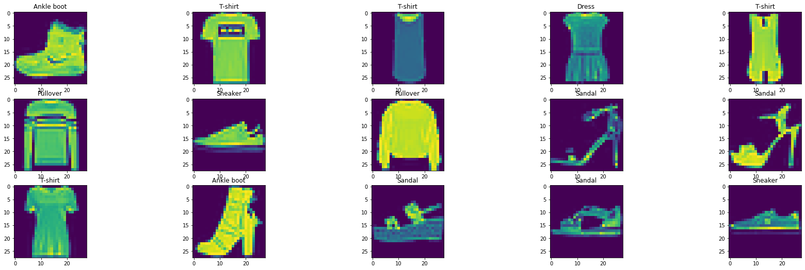
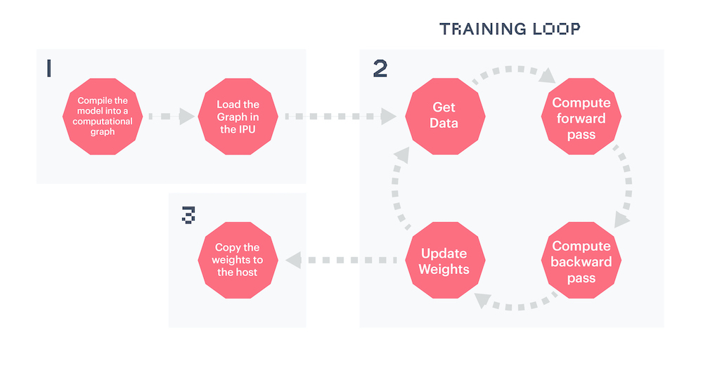
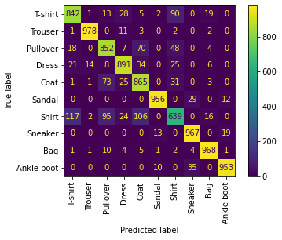
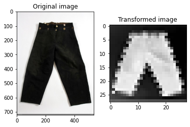

<!-- Copyright (c) 2020 Graphcore Ltd. All rights reserved. -->
<!-- THIS FILE IS AUTOGENERATED. Rerun SST after editing source file: walkthrough.py -->

# Introduction to PopTorch - running a simple model

This tutorial covers the basics of model making in PyTorch, using
`torch.nn.Module`, and the specific methods to convert a PyTorch model to
a PopTorch model so that it can be run on a Graphcore IPU.

To run the Python version of this tutorial:

1. Download and install the Poplar SDK. Run the `enable.sh` scripts for Poplar and PopART as described in the [Getting
  Started](https://docs.graphcore.ai/en/latest/getting-started.html) guide for your IPU system.
2. For repeatability we recommend that you create and activate a Python virtual environment. You can do this with:
   a. create a virtual environment in the directory `venv`: `virtualenv -p python3 venv`;
   b. activate it: `source venv/bin/activate`.
3. Install the Python packages that this tutorial needs with `python -m pip install -r requirements.txt`.

To run the Jupyter notebook version of this tutorial:

1. Enable a Poplar SDK environment (see the [Getting
  Started](https://docs.graphcore.ai/en/latest/getting-started.html) guide for
  your IPU system)
2. In the same environment, install the Jupyter notebook server:
   `python -m pip install jupyter`
3. Launch a Jupyter Server on a specific port:
   `jupyter-notebook --no-browser --port <port number>`
4. Connect via SSH to your remote machine, forwarding your chosen port:
   `ssh -NL <port number>:localhost:<port number>
   <your username>@<remote machine>`

For more details about this process, or if you need troubleshooting, see our
[guide on using IPUs from Jupyter
notebooks](../../standard_tools/using_jupyter/README.md).

## What is PopTorch?

PopTorch is a set of extensions for PyTorch to enable PyTorch models to run
on Graphcore's IPU hardware.

PopTorch supports both inference and training. To run a model on the IPU you
wrap your existing PyTorch model in either a PopTorch inference wrapper or
a PopTorch training wrapper. You can provide further annotations to partition
the model across multiple IPUs.

You can wrap individual layers in an IPU helper to designate which IPU they
should go on. Using your annotations, PopTorch will use
[PopART](https://docs.graphcore.ai/projects/popart-user-guide) to parallelise
the model over the given number of IPUs. Additional parallelism
can be expressed via a replication factor which enables you to
data-parallelise the model over more IPUs.

Under the hood PopTorch uses
[TorchScript](https://pytorch.org/docs/stable/jit.html), an intermediate
representation (IR) of a PyTorch model, using the `torch.jit.trace` API. That
means it inherits the constraints of that API. These include:

- Inputs must be Torch tensors or tuples/lists containing Torch tensors
- `None` can be used as a default value for a parameter but cannot be explicitly
  passed as an input value
- Hooks and `.grad` cannot be used to inspect weights and gradients
- `torch.jit.trace` cannot handle control flow or shape variations within the
  model. That is, the inputs passed at run-time cannot vary the control flow of
  the model or the shapes/sizes of results.

To learn more about TorchScript and JIT, you can go through the [Introduction
to TorchScript tutorial](https://pytorch.org/tutorials/beginner/Intro_to_TorchScript_tutorial.html).

PopTorch has been designed to require only a few manual changes to your models
in order to run them on the IPU. However, it does have some differences from
native PyTorch execution and not all PyTorch operations have been
implemented in the backend yet. You can find the list of supported operations in the
[here](https://docs.graphcore.ai/projects/poptorch-user-guide/en/3.2.0/supported_ops.html).


## Getting started: training a model on the IPU

We will do the following steps in order:

1. Load the Fashion-MNIST dataset using `torchvision.datasets` and
   `poptorch.DataLoader`.
2. Define a deep CNN  and a loss function using the `torch` API.
3. Train the model on an IPU using `poptorch.trainingModel`.
4. Evaluate the model on the IPU.

### Import the packages

PopTorch is a separate package from PyTorch, and available
in Graphcore's Poplar SDK. Both must thus be imported:

```python
import torch
import poptorch
import torchvision
import torch.nn as nn
import matplotlib.pyplot as plt
from tqdm import tqdm

# Set torch random seed for reproducibility
torch.manual_seed(42)
```

Under the hood, PopTorch uses Graphcore's high-performance
machine learning framework PopART. It is therefore necessary
to enable PopART and Poplar in your environment.

> **NOTE**:
>
> If you forget to enable PopART, you will encounter the following error when
> importing: `poptorch`: `ImportError: libpopart.so: cannot open shared object
> file: No such file or directory`
>
> If the error message says something like: `libpopart_compiler.so: undefined
> symbol: _ZN6popart7Session3runERNS_7IStepIOE`, it most likely means the
> versions of PopART and PopTorch do not match, for example because
> you have sourced the PopART `enable.sh` script for a different SDK version to
> that of PopTorch. Ensure that you use the same version of the SDK for PopTorch
> and PopART.

### Load the data

We will use the Fashion-MNIST dataset made available by the package
`torchvision`. This dataset, from
[Zalando](https://github.com/zalandoresearch/fashion-mnist), can be used as a
more challenging replacement to the well-known MNIST dataset.

The dataset consists of 28x28 grayscale images and labels of range `[0, 9]`
from 10 classes: T-shirt, trouser, pullover, dress, coat, sandal, shirt,
sneaker, bag and ankle boot.

In order for the images to be usable by PyTorch, we have to convert them to
`torch.Tensor` objects. Also, data normalisation improves overall
performance. We will apply both operations, conversion and normalisation, to
the datasets using `torchvision.transforms` and feed these ops to
`torchvision.datasets`:

```python
transform = torchvision.transforms.Compose(
    [
        torchvision.transforms.ToTensor(),
        torchvision.transforms.Normalize((0.5,), (0.5,)),
    ]
)

train_dataset = torchvision.datasets.FashionMNIST(
    "~/.torch/datasets", transform=transform, download=True, train=True
)

test_dataset = torchvision.datasets.FashionMNIST(
    "~/.torch/datasets", transform=transform, download=True, train=False
)

classes = (
    "T-shirt",
    "Trouser",
    "Pullover",
    "Dress",
    "Coat",
    "Sandal",
    "Shirt",
    "Sneaker",
    "Bag",
    "Ankle boot",
)
```

With the following method, we can visualise and save a sample of these images
and their associated labels:

```python
plt.figure(figsize=(30, 15))
for i, (image, label) in enumerate(train_dataset):
    if i == 15:
        break
    image = (image / 2 + 0.5).numpy()  # reverse transformation
    ax = plt.subplot(5, 5, i + 1)
    ax.set_title(classes[label])
    plt.imshow(image[0])

plt.savefig("sample_images.png")
```



#### PopTorch DataLoader

We can feed batches of data into a PyTorch model by simply passing the input
tensors. However, this is unlikely to be efficient and can
result in data loading being a bottleneck to the model, slowing down the
training process. In order to make data loading easier and more efficient,
there's the
[`torch.utils.data.DataLoader`](https://pytorch.org/docs/stable/data.html)
class, which is an `iterable` over a dataset and which can handle parallel data
loading, a sampling strategy, shuffling, etc.

PopTorch offers an extension of this class with its
[`poptorch.DataLoader`](https://docs.graphcore.ai/projects/poptorch-user-guide/en/3.2.0/batching.html#poptorch-dataloader)
class, specialised for the way the underlying PopART framework handles
batching of data. We will use this class later in the tutorial, as soon as we
have a model ready for training.

### Build the model

We will build a simple CNN model for a classification task. To do so, we can
simply use PyTorch's API, including `torch.nn.Module`. The difference from
what we're used to with pure PyTorch is the _loss computation_, which has to
be part of the `forward` function. This is to ensure the loss is computed on
the IPU and not on the CPU, and to give us as much flexibility as possible
when designing more complex loss functions.

```python
class ClassificationModel(nn.Module):
    def __init__(self):
        super().__init__()
        self.conv1 = nn.Conv2d(1, 5, 3)
        self.pool = nn.MaxPool2d(2, 2)
        self.conv2 = nn.Conv2d(5, 12, 5)
        self.norm = nn.GroupNorm(3, 12)
        self.fc1 = nn.Linear(972, 100)
        self.relu = nn.ReLU()
        self.fc2 = nn.Linear(100, 10)
        self.log_softmax = nn.LogSoftmax(dim=1)
        self.loss = nn.NLLLoss()

    def forward(self, x, labels=None):
        x = self.pool(self.relu(self.conv1(x)))
        x = self.norm(self.relu(self.conv2(x)))
        x = torch.flatten(x, start_dim=1)
        x = self.relu(self.fc1(x))
        x = self.log_softmax(self.fc2(x))
        # The model is responsible for the calculation
        # of the loss when using an IPU. We do it this way:
        if self.training:
            return x, self.loss(x, labels)
        return x


model = ClassificationModel()
model.train()
```

```output
ClassificationModel(
  (conv1): Conv2d(1, 5, kernel_size=(3, 3), stride=(1, 1))
  (pool): MaxPool2d(kernel_size=2, stride=2, padding=0, dilation=1, ceil_mode=False)
  (conv2): Conv2d(5, 12, kernel_size=(5, 5), stride=(1, 1))
  (norm): GroupNorm(3, 12, eps=1e-05, affine=True)
  (fc1): Linear(in_features=972, out_features=100, bias=True)
  (relu): ReLU()
  (fc2): Linear(in_features=100, out_features=10, bias=True)
  (log_softmax): LogSoftmax(dim=1)
  (loss): NLLLoss()
)
```

> **NOTE**: `self.training` is inherited from `torch.nn.Module` which
> initialises its value to `True`. Use `model.eval()` to set it to `False` and
> `model.train()` to switch it back to `True`.

### Prepare training for IPUs

The compilation and execution on the IPU can be controlled using
`poptorch.Options`. These options are used by PopTorch's wrappers such as
`poptorch.DataLoader` and `poptorch.trainingModel`.

```python
opts = poptorch.Options()

train_dataloader = poptorch.DataLoader(
    opts, train_dataset, batch_size=16, shuffle=True, num_workers=20
)
```

### Train the model

We will need another component in order to train our model: an optimiser.
Its role is to apply the computed gradients to the model's weights to optimize
(usually, minimize) the loss function using a specific algorithm. PopTorch
currently provides classes which inherit from multiple native PyTorch
optimisation functions: SGD, Adam, AdamW, LAMB and RMSprop. These optimisers
provide several advantages over native PyTorch versions. They embed constant
attributes to save performance and memory, and allow you to specify additional
parameters such as loss/velocity scaling.

We will use
[SGD](https://docs.graphcore.ai/projects/poptorch-user-guide/en/3.2.0/reference.html#poptorch.optim.SGD)
as it's a very popular algorithm and is appropriate for this classification
task.

```python
optimizer = poptorch.optim.SGD(model.parameters(), lr=0.001, momentum=0.9)
```

We now introduce the `poptorch.trainingModel` wrapper, which will handle the
training. It takes an instance of `torch.nn.Module`, such as our custom
model, an instance of `poptorch.Options` which we have instantiated
previously, and an optimizer. This wrapper will trigger the compilation of
our model, using TorchScript, and manage its translation to a program the
IPU can run. Let's use it.

```python
poptorch_model = poptorch.trainingModel(model, options=opts, optimizer=optimizer)
```

#### Training loop

Looping through the training data, running the forward and backward passes,
and updating the weights constitute the process we refer to as the "training
loop". Graphcore's Poplar graph program framework uses several optimisations to accelerate the
training loop. Central to this is the desire to minimise interactions between
the device (the IPU) and the host (the CPU), allowing the training loop to
run on the device independently from the host. To achieve that virtual
independence, Poplar creates a _static_ computational graph and data streams
which are loaded to the IPU, and then signals the IPU to get started until
there's no data left or until the host sends a signal to stop the loop.



The compilation, which transforms our PyTorch model into a computational
graph and our dataloader into data streams, happens at the first call of a
`poptorch.trainingModel`. The IPUs to which the graph will be uploaded are
selected automatically during this first call, by default. The training loop
can then start.

Once the loop has started, Poplar's main task is to feed the data into the
streams and to signal when we are done with the loop. The last step will then
be to copy the final graph, meaning the model, back to the CPU - a step that
PopTorch manages itself.

```python
epochs = 5
for epoch in tqdm(range(epochs), desc="epochs"):
    total_loss = 0.0
    for data, labels in tqdm(train_dataloader, desc="batches", leave=False):
        output, loss = poptorch_model(data, labels)
        total_loss += loss
```

The model is now trained! There's no need to retrieve the weights from the
device as you would by calling `model.cpu()` with PyTorch. PopTorch has
managed that step for us. We can now save and evaluate the model.

#### Use the same IPU for training and inference

After the model has been attached to the IPU and compiled after the first call
to the PopTorch model, it can be detached from the device. This allows PopTorch
to use a single device for training and inference (described below), rather
than using 2 IPUs (one for training and one for inference) when the device
is not detached. When using a POD system, detaching from the device will
be necessary when using a non-reconfigurable partition.

```python
poptorch_model.detachFromDevice()
```

#### Save the trained model

We can simply use PyTorch's API to save a model in a `.pth` file, with the original
instance of `ClassificationModel` and not the wrapped model.

Do not hesitate to experiment with different models: the model provided in this
tutorial is saved in the `static` folder if you need it.

```python
torch.save(model.state_dict(), "classifier.pth")
```

### Evaluate the model

The model can be evaluated on a CPU but it is a good idea to use the IPU -
since [IPUs are blazing
fast](https://www.graphcore.ai/posts/new-graphcore-ipu-benchmarks)!

Evaluating your model on a CPU is slow if the test dataset is large and/or the
model is complex.

Since we have detached our model from its training device, the device is now
free again and we can use it for the evaluation stage.

The steps taken below to define the model for evaluation essentially allow it
to run in inference mode. Therefore, you can follow the same steps to use the
model to make predictions once it has been deployed.

```python
model = model.eval()
```

To evaluate the model on the IPU, we will use the `poptorch.inferenceModel`
class, which has a similar API to `poptorch.trainingModel` except that it
doesn't need an optimizer, allowing evaluation of the model without calculating
gradients.

```python
poptorch_model_inf = poptorch.inferenceModel(model, options=opts)
```

Then we can instantiate a new PopTorch `Dataloader` object as before in order to
efficiently batch our test dataset.

```python
test_dataloader = poptorch.DataLoader(opts, test_dataset, batch_size=32, num_workers=10)
```

This short loop over the test dataset is effectively all that is needed to
run the model and generate some predictions. When running the model in
inference mode, we can stop here and use the predictions as needed.

For evaluation, we can use the standard classification metrics from `scikit-learn`
to understand how well our model is performing. This usually takes a list
of labels and a list of predictions as the input, both in the same order.
Let's make both lists, and run our model in inference mode.

```python
predictions, labels = [], []
for data, label in test_dataloader:
    predictions += poptorch_model_inf(data).data.max(dim=1).indices
    labels += label
```

Release IPU resources again:

```python
poptorch_model_inf.detachFromDevice()
```

A simple and widely-used performance metric for classification models is the
accuracy score, which simply counts how many predictions were right. But this
metric alone isn't enough. For example, it doesn't tell us how the model
performs with regard to the different classes in our data. We will therefore
use another popular metric: a confusion matrix, which indicates how much our
model confuses one class for another.

```python
from sklearn.metrics import accuracy_score, confusion_matrix, ConfusionMatrixDisplay

print(f"Eval accuracy: {100 * accuracy_score(labels, predictions):.2f}%")
cm = confusion_matrix(labels, predictions)
cm_plot = ConfusionMatrixDisplay(cm, display_labels=classes).plot(
    xticks_rotation="vertical"
)
```

```output
Eval accuracy: 89.25%
```



As you can see, although we've got an accuracy score of ~89%, the model's
performance across the different classes isn't equal. Trousers are very well
classified, with more than 96-97% accuracy whereas shirts are harder to
classify with less than 60% accuracy, and it seems they often get confused
with T-shirts, pullovers and coats. So, some work is still required here to
improve your model for all the classes!

We can save this visualisation of the confusion matrix. Don't hesitate to
experiment: you can then compare your confusion matrix with the
[visualisation provided in the `static` folder](static/confusion_matrix.png).

```python
cm_plot.figure_.savefig("confusion_matrix.png")
```

## Using the model on our own images to get predictions

Now that we have a trained model which has also been validated, we can now use
the model on arbitrary images which are not part of the FashionMNIST dataset. In
this section we will use an image downloaded from the internet and predict the
class of it.

### Running our model on the IPU

We can then instantiate our model and load its `state_dict` which we [saved
earlier](#save-the-trained-model). We need to make sure that the model is then set to evaluation
mode. We can then wrap our model with the PopTorch inference model which will
let us run it on the IPU.

```python
model = ClassificationModel()
model.load_state_dict(torch.load("classifier.pth"))
model.eval()

poptorch_model = poptorch.inferenceModel(model, options=poptorch.Options())
```

Next we can load our image into our Python program. To do this we will use the
Python Imaging Library (PIL) by supplying our image as a path. To get our image
ready for evaluation, we need to make sure that the image is in the same
'format' as the images which were in the FashionMNIST dataset. This means that
we need to resize our image to 28x28 pixels and make it grayscale.

Note: We can download images on a remote machine using wget:
`wget "https://bit.ly/3uKBBDS" -O ./images/trousers.jpg`

> Image attribution: Elisabeth Eriksson / Nordiska museet, CC BY 4.0
> <https://creativecommons.org/licenses/by/4.0>, via Wikimedia Commons

```python
from PIL import Image, ImageOps

img = Image.open("images/trousers.jpg").resize((28, 28))
img = ImageOps.grayscale(img)
```

Another factor we have to consider is that all of the images in the FashionMNIST
dataset have a black background. This means that if our image's background is
light, then the model will incorrectly classify the image (another limitation
due to our simple model). We can get around this by checking the pixel value in
one corner of the image and if it's light, then invert the whole image.
Afterwards we can transform our image into a tensor which can be fed into the
model.

```python
if img.getpixel((1, 1)) > 200:
    img = ImageOps.invert(img)

transform = torchvision.transforms.Compose(
    [
        torchvision.transforms.ToTensor(),
        torchvision.transforms.Normalize((0.5,), (0.5,)),
    ]
)

img_tensor = transform(img)
```

We can visualise our original image before and after the transformations:

```python
f, ax = plt.subplots(1, 2)
ax[0].imshow(Image.open("images/trousers.jpg"))
ax[0].set_title("Original image")
img_transform = torchvision.transforms.ToPILImage()
ax[1].imshow((img_transform(img_tensor)).convert("RGBA"))
ax[1].set_title("Transformed image")

plt.savefig("image_before_after.png")
```



The model expects a four-dimensional tensor with the dimensions corresponding
respectively to: batch size, number of colour channels, and the height and width
of the image. Since we have a single image represented as a three-dimensional
tensor, we expand it to include a batch dimension using the `unsqueeze` function.

The output from the model will be a tensor consisting of 10 values (one for
each class). The highest value within the tensor will be the piece of clothing
which the model predicts our image to be.

```python
img_tensor = img_tensor.unsqueeze(0)

output = poptorch_model(img_tensor)
print(output)
```

```output
Graph compilation: 100%|██████████| 100/100 [00:09<00:00]
tensor([[-4.4716, -0.9097, -3.2780, -5.8899, -3.4709, -1.4561, -1.8613, -6.6171,
         -2.1167, -5.5265]])
```

Now we interpret the output and print the name of the class.

```python
prediction_idx = int(output.argmax())

poptorch_model.detachFromDevice()

print("IPU predicted class:", classes[prediction_idx])
```

```output
IPU predicted class: Trouser
```

### Running our model on the CPU

If you wanted to use the model on a different machine, perhaps not the IPU, then
you can import the classification model and the tuple of classes from earlier.
This would mean that you can run the prediction without having to import
PopTorch at all and we would just need the `.pth` model file.

```python
model = ClassificationModel()
model.load_state_dict(torch.load("classifier.pth"))
model.eval()
```

```python
output = model(img_tensor)
print("CPU predicted class:", classes[int(output.argmax())])
```

```output
CPU predicted class: Trouser
```

### Limitations with our model

Due to the small size of the training dataset and low complexity of the
model, there are many limitations with our model. The examples need to be
carefully selected to match the distribution of the training dataset, otherwise
our model may classify incorrectly.

The following need to be considered when choosing images for classification:
- The orientation of the piece of clothing must be horizontal,
- The background of the image must be a solid colour,
- The piece of clothing is photographed on its own; it cannot be worn by a person.

## Doing more with `poptorch.Options`

This class encapsulates the options that PopTorch and PopART will use
alongside our model. Some concepts, such as "batch per iteration" are
specific to the functioning of the IPU, and within this class some
calculations are made to reduce risks of errors and make it easier for
PyTorch users to use IPUs.

The list of these options is available in the
[documentation](https://docs.graphcore.ai/projects/poptorch-user-guide/en/3.2.0/overview.html#options).
We introduce here four of these options so you get an idea of what they cover.

### `deviceIterations`

Remember the [training loop](#training-loop) we have discussed previously. A device iteration
is one cycle of that loop, which runs entirely on the IPU (the device), and
which starts with a new batch of data. This option specifies the number of
batches that is prepared by the host (CPU) for the IPU. The higher this
number, the less the IPU has to interact with the CPU, for example to request
and wait for data, so that the IPU can loop faster. However, the user will
have to wait for the IPU to complete all iterations before getting the
results back. The maximum number of iterations is the total number of batches in your dataset, and
the default value is 1.

### `replicationFactor`

This is the number of replicas of a model. A replica is a copy of the same
model on multiple devices. We use replicas as an implementation of data
parallelism, where the same model is served with several batches of data at the
same time but on different devices, so that the gradients can be pooled. To
achieve the same behaviour in pure PyTorch, you'd wrap your model with
`torch.nn.DataParallel`, but with PopTorch, this is an option. Of course, each
replica requires one IPU. So, if the `replicationFactor` is two, two IPUs are
required.

### `randomSeed`

An advantage of the IPU architecture is an on-device pseudo-random number
generator (PRNG). This option sets both the seed for the PRNG on the IPU
and PyTorch's seed, which is usually set using `torch.manual_seed`.

### `useIpuModel`

An IPU Model is a simulation, running on a CPU, of an actual IPU. This can be
helpful if you're working in an environment where no IPUs are available but
still need to make progress on your code. However, the IPU Model doesn't
fully support replicated graphs and its numerical results can be slightly
different from what you would get with an actual IPU. You can learn more
about the IPU Model and its limitations with our
[documentation](https://docs.graphcore.ai/projects/poplar-user-guide/en/3.2.0/poplar_programs.html?highlight=ipu%20model#programming-with-poplar).

## How to set the options

These options are callable, and can be chained as they return the instance. One
can therefore do the following:

```python
opts = (
    poptorch.Options()
    .deviceIterations(20)
    .replicationFactor(2)
    .randomSeed(123)
    .useIpuModel(True)
)
```

## Summary
In this tutorial, we started learning about PopTorch and how to use it to create and train
a model which we then be used for inference. We used Torchvision to load the
FashionMNIST dataset, a more complex alternative to the well-known MNIST
dataset. We created a classification model and trained it on a training subset
of our dataset by feeding the images into our model using the PopTorch
`DataLoader` class. After training, we evaluated our model using the testing dataset to
measure a metric for our model. Lastly, we used the trained model
to predict the class of clothing for our own images, which the model had never
seen before. When submitting our own images for classification, we needed to make
sure that we were aware of the limitations of our model.

### Next steps:
To continue learning about PopTorch and how to use it to run your models on the
IPU, look at our tutorials on [efficient data
loading](../efficient_data_loading), [pipelining your model in
PopTorch](../pipelining) and [fine-tuning a BERT model to run on the
IPU](../finetuning_bert).

Generated:2022-09-27T15:24 Source:walkthrough.py SDK:3.0.0+1145 SST:0.0.8
