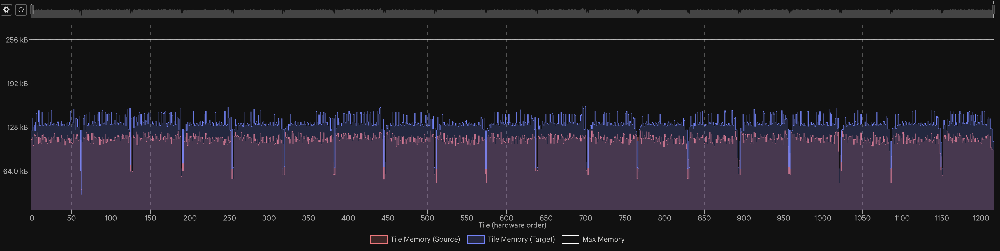

<!-- Copyright (c) 2021 Graphcore Ltd. All rights reserved. -->
<!-- THIS FILE IS AUTOGENERATED. Rerun SST after editing source file: walkthrough.py -->

# Half and mixed precision in PopTorch

This tutorial shows how to use half and mixed precision in PopTorch with the
example task of training a simple CNN model on a single Graphcore IPU (Mk1 or
Mk2).

Before starting this tutorial, we recommend that you read through our
[tutorial on the basics of PyTorch on the IPU](../basics) and our
[MNIST starting tutorial](../../../simple_applications/pytorch/mnist/).

Requirements:

- A Poplar SDK environment enabled (see the [Getting
  Started](https://docs.graphcore.ai/en/latest/getting-started.html) guide for
  your IPU system)
- Other Python modules: `python -m pip install -r requirements.txt`

To run the Jupyter notebook version of this tutorial:

1. Enable a Poplar SDK environment and install required packages with
   `python -m pip install -r requirements.txt`;
2. In the same environment, install the Jupyter notebook server:
   `python -m pip install jupyter`;
3. Launch a Jupyter Server on a specific port:
   `jupyter-notebook --no-browser --port <port number>`;
4. Connect via SSH to your remote machine, forwarding your chosen port:
   `ssh -NL <port number>:localhost:<port number>
   <your username>@<remote machine>`.

For more details about this process, or if you need troubleshooting, see our
[guide on using IPUs from Jupyter
notebooks](../../standard_tools/using_jupyter/README.md).

## General

### Motives for half precision

Data is stored in memory, and some formats to store that data require less
memory than others. In a device's memory, when it comes to numerical data,
we use either integers or real numbers. Real numbers are represented by one
of several floating point formats, which vary in how many bits they use to
represent each number. Using more bits allows for greater precision and a
wider range of representable numbers, whereas using fewer bits allows for
faster calculations and reduces memory and power usage.

In deep learning applications, where less precise calculations are acceptable
and throughput is critical, using a lower precision format can provide
substantial gains in performance.

The Graphcore IPU provides native support for two floating-point formats:

- IEEE single-precision, which uses 32 bits for each number (FP32)
- IEEE half-precision, which uses 16 bits for each number (FP16)

Some applications which use FP16 do all calculations in FP16, whereas others
use a mix of FP16 and FP32. The latter approach is known as *mixed precision*.

In this tutorial, we are going to talk about real numbers represented
in FP32 and FP16, and how to use these data types (dtypes) in PopTorch in
order to reduce the memory requirements of a model.

### Numerical stability

Numeric stability refers to how a model's performance is affected by the use
of a lower-precision dtype. We say an operation is "numerically unstable" in
FP16 if running it in this dtype causes the model to have worse accuracy
compared to running the operation in FP32. Two techniques that can be used to
increase the numerical stability of a model are loss scaling and stochastic
rounding.

#### Loss scaling

A numerical issue that can occur when training a model in half-precision is
that the gradients can underflow. This can be difficult to debug because the
model will simply appear to not be training, and can be especially damaging
because any gradients which underflow will propagate a value of 0 backwards
to other gradient calculations.

The standard solution to this is known as *loss scaling*, which consists of
scaling up the loss value right before the start of backpropagation to prevent
numerical underflow of the gradients. Instructions on how to use loss scaling
will be discussed later in this tutorial.

#### Stochastic rounding

When training in half or mixed precision, numbers multiplied by each other
will need to be rounded in order to fit into the floating point format used.
Stochastic rounding is the process of using a probabilistic equation for the
rounding. Instead of always rounding to the nearest representable number, we
round up or down with a probability such that the expected value after
rounding is equal to the value before rounding. Since the expected value of
an addition after rounding is equal to the exact result of the addition, the
expected value of a sum is also its exact value.

This means that on average, the values of the parameters of a network will be
close to the values they would have had if a higher-precision format had been
used. The added bonus of using stochastic rounding is that the parameters can
be stored in FP16, which means the parameters can be stored using half as much
memory. This can be especially helpful when training with small batch sizes,
where the memory used to store the parameters is proportionally greater than
the memory used to store parameters when training with large batch sizes.

It is highly recommended that you enable this feature when training neural
networks with FP16 weights. The instructions to enable it in PopTorch are
presented later in this tutorial.

## Train a model in half precision

### Import the packages

```python
import torch
import torch.nn as nn
import torchvision
import torchvision.transforms as transforms
import poptorch
from tqdm import tqdm
```

### Build the model

We use the same model as in [the other tutorials on PopTorch](../).
Just like in the [tutorial on efficient data loading](../efficient_data_loading), we are
using larger images (128x128) to simulate a heavier data load. This will make
the difference in memory between FP32 and FP16 meaningful enough to showcase
in this tutorial.

```python
class CustomModel(nn.Module):
    def __init__(self):
        super().__init__()
        self.conv1 = nn.Conv2d(1, 5, 3)
        self.pool = nn.MaxPool2d(2, 2)
        self.conv2 = nn.Conv2d(5, 12, 5)
        self.norm = nn.GroupNorm(3, 12)
        self.fc1 = nn.Linear(41772, 100)
        self.relu = nn.ReLU()
        self.fc2 = nn.Linear(100, 10)
        self.log_softmax = nn.LogSoftmax(dim=0)
        self.loss = nn.NLLLoss()

    def forward(self, x, labels=None):
        x = self.pool(self.relu(self.conv1(x)))
        x = self.norm(self.relu(self.conv2(x)))
        x = torch.flatten(x, start_dim=1)
        x = self.relu(self.fc1(x))
        x = self.log_softmax(self.fc2(x))
        # The model is responsible for the calculation
        # of the loss when using an IPU. We do it this way:
        if self.training:
            return x, self.loss(x, labels)
        return x
```

> **NOTE**: The model inherits `self.training` from `torch.nn.Module` which
> initialises its value to True. Use `model.eval()` to set it to False and
> `model.train()` to switch it back to True.

### Choose parameters

> **NOTE**: If you wish to modify these parameters for educational purposes,
> make sure you re-run all the cells below this one, including this entire cell
> as well:

```python
# Cast the model parameters and data to FP16
execution_half = True

# Cast the accumulation of gradients values types of the optimiser to FP16
optimizer_half = True

# Use stochastic rounding
stochastic_rounding = True

# Set partials data type to FP16
partials_half = False
```

#### Casting a model's parameters

The default data type of the parameters of a PyTorch module is FP32
(`torch.float32`). To convert all the parameters of a model to be represented
in FP16 (`torch.float16`), an operation we will call *downcasting*, we simply
do:

```python
model = CustomModel()

if execution_half:
    model = model.half()
```

For this tutorial, we will cast all the model's parameters to FP16.

#### Casting a single layer's parameters

For bigger or more complex models, downcasting all the layers may generate
numerical instabilities and cause underflows. While the PopTorch and the IPU
offer features to alleviate those issues, it is still sensible for those
models to cast only the parameters of certain layers and observe how it
affects the overall training job. To downcast the parameters of a single
layer, we select the layer by its *name* and use `half()`:

```python
model.conv1 = model.conv1.half()
```

If you would like to upcast a layer instead, you can use `model.conv1.float()`.

> **NOTE**: One can print out a list of the components of a PyTorch model,
> with their names, by doing `print(model)`.

### Prepare the data

We will use the FashionMNIST dataset that we download from `torchvision`. The
last stage of the pipeline will have to convert the data type of the tensors
representing the images to `torch.half` (equivalent to `torch.float16`) so that
our input data is also in FP16. This has the advantage of reducing the
bandwidth needed between the host and the IPU.

```python
transform_list = [
    transforms.Resize(128),
    transforms.ToTensor(),
    transforms.Normalize((0.5,), (0.5,)),
]
if execution_half:
    transform_list.append(transforms.ConvertImageDtype(torch.half))

transform = transforms.Compose(transform_list)
```

Pull the datasets if they are not available locally:

```python
train_dataset = torchvision.datasets.FashionMNIST(
    "~/.torch/datasets", transform=transform, download=True, train=True
)
test_dataset = torchvision.datasets.FashionMNIST(
    "~/.torch/datasets", transform=transform, download=True, train=False
)
```

### Optimizers and loss scaling

The value of the loss scaling factor can be passed as a parameter to the
optimisers in `poptorch.optim`. In this tutorial, we will set it to `1024` for
an AdamW optimizer. For all optimisers (except `poptorch.optim.SGD`),
using a model in FP16 requires the argument `accum_type` to be set to
`torch.float16` as well:

```python
accum, loss_scaling = (torch.float16, 1024) if optimizer_half else (torch.float32, None)

optimizer = poptorch.optim.AdamW(
    params=model.parameters(), lr=0.001, accum_type=accum, loss_scaling=loss_scaling
)
```

While higher values of `loss_scaling` minimize underflows, values that are
too high can also generate overflows as well as hurt convergence of the loss.
The optimal value depends on the model and the training job. This is therefore
a hyperparameter for you to tune.

### Set PopTorch's options

To configure some features of the IPU and to be able to use PopTorch's classes
in the next sections, we will need to create an instance of `poptorch.Options`
which stores the options we will be using. We covered some of the available
options in the: [introductory tutorial for
PopTorch](../basics).

Let's initialise our options object before we talk about the options we will
use:

```python
opts = poptorch.Options()
```

> **NOTE**: This tutorial has been designed to be run on a single IPU.
> If you do not have access to an IPU, you can use the option
> [`useIpuModel`](https://docs.graphcore.ai/projects/poptorch-user-guide/en/latest/overview.html#poptorch.Options.useIpuModel)
> to run a simulation on CPU instead. You can read more on the IPU Model and
> its limitations
> [here](https://docs.graphcore.ai/projects/poplar-user-guide/en/latest/poplar_programs.html#programming-with-poplar).

#### Stochastic rounding on IPU

With the IPU, stochastic rounding is implemented directly in the hardware and
only requires you to enable it. To do so, there is the option
`enableStochasticRounding` in the `Precision` namespace of `poptorch.Options`.
This namespace holds other options for using mixed precision that we will talk
about. To enable stochastic rounding, we do:

```python
if stochastic_rounding:
    opts.Precision.enableStochasticRounding(True)
```

With the IPU Model, this option won't change anything since stochastic
rounding is implemented on the IPU.

#### Partials data type

Matrix multiplications and convolutions have intermediate states we
call *partials*. Those partials can be stored in FP32 or FP16. There is
a memory benefit to using FP16 partials but the main benefit is that it can
increase the throughput for some models without affecting accuracy. However
there is a risk of increasing numerical instability if the values being
multiplied are small, due to underflows. The default data type of partials is
the input's data type (FP16). For this tutorial, we set partials to FP32 just
to showcase how it can be done. We use the option `setPartialsType` to do it:

```python
if partials_half:
    opts.Precision.setPartialsType(torch.half)
else:
    opts.Precision.setPartialsType(torch.float)
```

Further information on the Partials Type setting can be found in our [memory and
performance optimisation
guide](https://docs.graphcore.ai/projects/memory-performance-optimisation/en/latest/common-memory-optimisations.html#partials-type).

### Train the model

We can now train the model. After we have set all our options, we reuse
our `poptorch.Options` instance for the training `poptorch.DataLoader`
that we will be using:

```python
train_dataloader = poptorch.DataLoader(
    opts, train_dataset, batch_size=12, shuffle=True, num_workers=40
)
```

We first make sure our model is in training mode, and then wrap it
with `poptorch.trainingModel`:

```python
model.train()  # Switch the model to training mode
poptorch_model = poptorch.trainingModel(model, options=opts, optimizer=optimizer)
```

Let's run the training loop for 10 epochs:

```python
epochs = 10
for epoch in tqdm(range(epochs), desc="epochs"):
    total_loss = 0.0
    for data, labels in tqdm(train_dataloader, desc="batches", leave=False):
        output, loss = poptorch_model(data, labels)
        total_loss += loss
```

... and release IPU resources:

```python
poptorch_model.detachFromDevice()
```

Our new model is now trained and we can start its evaluation.

### Evaluate the model

Some PyTorch's operations, such as CNNs, are not supported in FP16 on the CPU,
so we will evaluate our fine-tuned model in mixed precision on an IPU
using `poptorch.inferenceModel`:

```python
model.eval()  # Switch the model to inference mode
poptorch_model_inf = poptorch.inferenceModel(model, options=opts)
test_dataloader = poptorch.DataLoader(opts, test_dataset, batch_size=32, num_workers=40)
```

Run inference on the labelled data:

```python
predictions, labels = [], []
for data, label in test_dataloader:
    predictions += poptorch_model_inf(data).data.float().max(dim=1).indices
    labels += label
```

Release resources:

```python
poptorch_model_inf.detachFromDevice()
```

We obtained an accuracy of approximately 84% on the test dataset.

```python
print(
    f"""Eval accuracy on IPU: {100 *
                (1 - torch.count_nonzero(torch.sub(torch.tensor(labels),
                torch.tensor(predictions))) / len(labels)):.2f}%"""
)
```

## Visualise the memory footprint

We can visually compare the memory footprint on the IPU of the model trained
in FP16 and FP32, thanks to Graphcore's [PopVision Graph
Analyser](https://docs.graphcore.ai/projects/graph-analyser-userguide/).

We generated memory reports of the same training session as covered in this
tutorial for both cases: with and without downcasting the model with
`model.half()`. Here is the figure of both memory footprints, where "source"
and "target" represent the model trained in FP16 and FP32 respectively:



We observed a ~26% reduction in memory usage with the settings of this
tutorial, including from peak to peak. The impact on the accuracy was also
small, with less than 1% lost!

## Debug floating-point exceptions

Floating-point issues can be difficult to debug because the model will simply
appear to not be training without specific information about what went wrong.
For more detailed information on the issue we set
`debug.floatPointOpException` to true in the environment variable
`POPLAR_ENGINE_OPTIONS`. To set this, you can add the following before
the command you use to run your model:

```python
POPLAR_ENGINE_OPTIONS = '{"debug.floatPointOpException": "true"}'
```

## Summary

- Use half and mixed precision when you need to save memory on the IPU;
- You can cast a PyTorch model or a specific layer to FP16 using:

    ```python
    # Model
    model.half()
    # Layer
    model.layer.half()
    ```

- Several features are available in PopTorch to improve the numerical stability
  of a model in FP16:

  - Loss scaling: `poptorch.optim.SGD(..., loss_scaling=1000)`;
  - Stochastic rounding: `opts.Precision.enableStochasticRounding(True)`;
  - Upcast partials data types: `opts.Precision.setPartialsType(torch.float)`

- The [PopVision Graph
  Analyser](https://docs.graphcore.ai/projects/graph-analyser-userguide/)
  can be used to inspect the memory usage of a model and to help debug issues.

Generated:2022-11-22T13:37 Source:walkthrough.py SDK:3.1.0-EA.1+1183 SST:0.0.9
