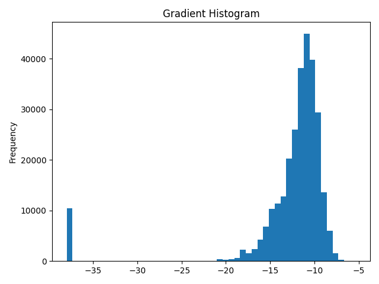

<!-- Copyright (c) 2021 Graphcore Ltd. All rights reserved. -->
# Observing Tensors in PopTorch

In PyTorch, you will often want to observe the values of tensors within your
model - tensors that aren't outputs of the model. To do this in PopTorch, you
need to anchor these additional tensors. Anchoring means that the tensor is
copied from the IPU into the host's local memory. This allows you to view and
manipulate the copies of tensors.

This tutorial shows how to anchor tensors to observe them.

Before starting this tutorial, we recommend that you read through our
[tutorial on the basics of PyTorch on the IPU](../basics) and our
[MNIST starting tutorial](../../../simple_applications/pytorch/mnist/).

Requirements:

- an installed Poplar SDK. See the [Getting Started
  guide](https://docs.graphcore.ai/en/latest/getting-started.html) for your IPU
  §system for details of how to install the SDK;
- Other Python modules: `pip install -r requirements.txt`;
- An IPU: This tutorial has been designed to be run on a single IPU. If you do
  not have access to an IPU, you can use the option
  [`useIpuModel`](https://docs.graphcore.ai/projects/poptorch-user-guide/en/latest/overview.html#poptorch.Options.useIpuModel)
  to run a simulation on CPU instead. You can read more on the IPU Model and
  its limitations in the
  [Poplar User Guide](https://docs.graphcore.ai/projects/poplar-user-guide/en/latest/poplar_programs.html#programming-with-poplar).

## Table of Contents

- [General](#general)
- [File structure](#File-structure)
- [Method 1 Print tensor](#Method-1-Print-tensor)
- [Method 2 Direct anchoring](#Method-2-Direct-anchoring)
- [Anchor modes](#Anchor-modes)
- [Gradient histogram example](#Gradient-histogram-example)
  - [Import the packages](#Import-packages)
  - [Build the model](#Build-the-model)
  - [Assigning assorted parameters](#Assigning-assorted-parameters)
  - [Set PopTorch options](#Set-PopTorch-options)
  - [Setting up the data loader](#Setting-up-the-data-loader)
  - [Initialising the PopTorch model](#Initialising-the-PopTorch-model)
  - [Printing out the tensor names](#Printing-out-the-tensor-names)
  - [Anchoring the tensors](#Anchoring-the-tensors)
  - [Training the model](#Training-the-model)
  - [Retrieving the tensors](#Retrieving-the-tensors)
  - [Building the histogram](#Building-the-histogram)

## General

The IPU stores tensors in memory on the chip. Because of this, tensors cannot
be observed directly: to be observed, a tensor needs to be copied back to the
host's local memory. Anchoring a tensor is how we tell the program that we want
it copied back.

Why would you want to observe a tensor? There are three main reasons:

1. Checking the accuracy of your model by returning its output;
2. Debugging your model via inspecting the intermediate tensors;
3. Calculating summary statistics to analyse a model.

There are two ways to anchor a tensor:

- `ipu_print_tensor`: This is a PopTorch method to automatically anchor and
  print a tensor (and its corresponding gradient, if it exists);
- Direct anchoring: This is a series of steps to anchor the tensor to a
  variable.

You can also use the PopTorch option anchor modes to control how much of the
tensor you want to return.

## File structure

- `anchor_tensor_example.py` Code example for anchoring tensors directly to
  generate a gradient histogram;
- `datasets` Folder containing MNIST dataset for the example;
- `requirements.txt` File containing the requirements for the example;
- `static` Folder containing a picture of the gradient histogram created by the
  example;
- `README.md` This file.

## Method 1: print tensor

PopTorch has a separate method to print tensors, this being
`ipu_print_tensor()`. This is because when a PopTorch model is created via
tracing the PyTorch model, no print statements will be translated over.

In order to print the tensor out, during the `forward` method of your model,
you call the `poptorch.ipu_print_tensor()` method and pass in the relevant
tensor. This method will return the tensor that was passed to it.

From then on, you will need to use the tensor returned by
`poptorch.ipu_print_tensor()` in place of the original one. If the returned
value is not used in the remainder of the model, it will be optimised out,
which means that the tensor will not be printed out.

Here is a small example demonstrating the use of the method in a small PyTorch
model.

```python
class BasicLinearModel(torch.nn.Module):
    def __init__(self):
        super().__init__()
        self.linear = nn.Linear(10, 2)

    def forward(self, x):
        x = self.linear(x)
        # The print statement returns the input tensor and it is important to
        # use this
        # Naming the variable x_returned is for demonstration purposes only
        x_returned = poptorch.ipu_print_tensor(x)
        return x_returned
```

> **NOTE**: If the tensor has a gradient, the tensor will be printed out in the
> forward pass and its corresponding gradient will be printed out in the
> backward pass.

<!-- Ensure these two block-quoted regions aren't merged -->

> **IMPORTANT**: To prevent the print operation from being removed by the graph
> optimizer, you must use the return value of `ipu_print_tensor()`.

Additional documentation can be found in the [PopTorch User
Guide](https://docs.graphcore.ai/projects/poptorch-user-guide/en/latest/overview.html#poptorch-ipu-print-tensor)

## Method 2: direct anchoring

> **IMPORTANT**: Tensor names are not stored in pre-compiled and cached
> executables, so make sure `POPTORCH_CACHE_DIR` and
> `enableExecutableCaching()` are not set.

PopTorch also allows you to inspect arbitrary tensors in both inference and
training models by anchoring them directly and assigning the copy to a variable
of your choosing.

> **NOTE**: We are providing raw access to all tensors in the model and plan to
> simplify this in future SDK releases.

First we define our inputs and compile our model:

```python
input = torch.rand(10, 10)
label = torch.rand(10, 10)
model = Model()
model.train()  # Switch the model to training mode
# Models are initialised in training mode by default, so the line above will
# have no effect. Its purpose is to show how the mode can be set explicitly.
poptorch_model = poptorch.trainingModel(model)
poptorch_model(input, label)  # compiling the model
```

There are 3 steps to take:

1. Find the tensor name. Numerous tensors are generated during model
  compilation and in order to inspect a tensor's value, you first need the
  tensor's name.

    - You can retrieve a complete list of the tensors by using the method
      `getTensorNames()`;
    - This method must be called after the model is compiled.

    ```python
    tensor_names = poptorch_model.getTensorNames()
    print(tensor_names)
    ```

2. Create an anchor. This is to tell the model compiler that we expect this
   tensor to be copied from the IPU.

    - The anchor is created by calling the `anchorTensor()` PopTorch method;
    - You must pass in two mandatory string variables: the user-defined name for
      the anchor and the name of the chosen tensor;
    - See [PopTorch API documentation](https://docs.graphcore.ai/projects/poptorch-user-guide/en/latest/reference.html#poptorch.Options.anchorTensor)
      for the optional variables `anchor_mode` and `anchor_return_period` or
      refer to the next section.

    ```python
    opts = poptorch.Options()
    opts.anchorTensor("grad_bias", "Gradient___model.fc2.bias")
    opts.anchorTensor("update_weight", "UpdatedVar___model.fc2.weight")

    poptorch_model = poptorch.trainingModel(model, opts)
    poptorch_model(input, label)
    ```

3. Retrieve the anchored tensor. The anchored tensors will be updated after
   every model invocation, you need to retrieve the tensor and assign it to a
   variable.

    - The anchored tensor is retrieved by calling the `getAnchoredTensor()`
      method and assigning its output to a variable.
    - The anchor is identified by the user-defined name that was passed to
      `anchorTensor()`.

    ```python
    grad = poptorch_model.getAnchoredTensor("grad_bias")
    update = poptorch_model.getAnchoredTensor("update_weight")
    ```

> **NOTE**: Debug logs (using environmental variables `POPTORCH_LOG_LEVEL` or
> `POPART_LOG_LEVEL`) can also be used to find the names of tensors of
> interest.

Additional documentation can be found in the [PopTorch User
Guide](https://docs.graphcore.ai/projects/poptorch-user-guide/en/latest/debugging.html)

## Anchor modes

Anchor mode is a PopTorch option that allows the user to toggle between
returning different portions of an anchored tensor. By default, the output
tensor (or a portion of it) is anchored and returned every time the model is
run.

There are two ways to change this option, depending on whether it is the output
tensor (that is already anchored) or an additional tensor which you have
anchored yourself.

There are currently 4 different anchor modes:

- `All`: Returns a result for every batch;
- `Sum`: Returns the sum of all the batches;
- `Final`: Returns only the last batch results;
- `EveryN`: Returns every N batches and requires an additional parameter
  `anchor_return_period`.

For the output tensor, you can change this option by calling the method
`outputMode()` on the PopTorch options and passing in the relevant
`poptorch.OutputMode` and any additional parameters.

Here is how you can set the anchor mode for the output tensor:

```python
opts = poptorch.Options()
opts.outputMode(poptorch.OutputMode.Sum)
# or
opts.outputMode(poptorch.OutputMode.EveryN, 10)
```

The training model by default has the mode `Final`, as you usually only need
some samples to visualize the model's learning and it is more efficient to only
return the last batch.

The inference model by default has the mode `All` as normally you want all the
output in order to accurately understand the model performance.

For any other tensor, you can change this option by passing in 2 optional
variables `anchor_mode` and `anchor_return_period` to the method
`anchorTensor()`. An example is shown below:

 ```python
opts = poptorch.Options()
opts.anchorTensor('grad_bias', 'Gradient___model.fc2.bias', anchor_mode=poptorch.OutputMode.Sum)
opts.anchorTensor('update_weight', 'UpdatedVar___model.fc2.weight', anchor_mode=poptorch.OutputMode.EveryN, anchor_return_period=10)
```

Additional documentation can be found in the [PopTorch User
Guide](https://docs.graphcore.ai/projects/poptorch-user-guide/en/latest/batching.html#poptorch-options-training-anchorreturntype)

## Gradient histogram example

You can also run the example code file `anchor_tensor_example.py` via the
command below.

```bash
python3 anchor_tensor_example.py
```

This example shows how to compute gradient histograms using tensor anchoring.
A graph will be saved as `GradientHistogram.png` in the current folder. You can
compare this with the histogram provided in the `static` folder:



### Import packages

```python
import torch
import torchvision
import torch.nn as nn
import poptorch

from tqdm import tqdm
import matplotlib.pyplot as plt
```

### Build the model

We build a relatively simple linear model.

```python
class BasicLinearModel(nn.Module):
    def __init__(self):
        super().__init__()
        self.fc1 = nn.Linear(784, 320)
        self.fc2 = nn.Linear(320, 100)
        self.fc3 = nn.Linear(100, 10)
        self.log_softmax = nn.LogSoftmax(dim=0)
        self.loss = nn.NLLLoss()
        self.relu = nn.ReLU()

    def forward(self, x, labels=None):
        x = torch.flatten(x, start_dim=1)
        x = self.relu(self.fc1(x))
        x = self.relu(self.fc2(x))
        x = self.log_softmax(self.fc3(x))
        if self.training:
            return x, self.loss(x, labels)
        return x
```

### Assigning assorted parameters

We then assign a few parameters which are reused, such as:

- `batch_size_train` the training batch size
- `pictureName` the name of the gradient histogram picture

```python
batch_size_train = 1000
pictureName = "GradientHistogram.png"
```

### Set PopTorch options

To configure some features of the IPU and to be able to use PopTorch's classes
in the next sections, we will need to create an instance of `poptorch.Options`
which stores the options we will be using. We covered some of the available
options in the previous tutorials. We will be adding to this later after we
choose the tensors we want to anchor.

```python
opts = poptorch.Options()
```

### Setting up the data loader

We will use the MNIST dataset that we download from `torchvision`.

```python
transform = torchvision.transforms.Compose(
    [
        torchvision.transforms.ToTensor(),
        torchvision.transforms.Normalize((0.5,), (0.5,)),
    ]
)
train_data = torchvision.datasets.MNIST(
    "~/.torch/datasets", transform=transform, download=True, train=True
)
train_loader = poptorch.DataLoader(
    opts, train_data, batch_size=batch_size_train, shuffle=True
)
```

### Initialising the PopTorch model

Here we initialise the PyTorch model and optimizer and then create the
PopTorch training model.

```python
model = BasicLinearModel()
model.train()  # Switch the model to training mode
# Models are initialised in training mode by default, so the line above will
# have no effect. Its purpose is to show how the mode can be set explicitly.
optimizer = poptorch.optim.SGD(model.parameters(), lr=0.01)
poptorch_model = poptorch.trainingModel(model, options=opts, optimizer=optimizer)
```

### Printing out the tensor names

We then compile the PopTorch model ahead of time so that we can call the
`getTensorNames()` method.

```python
poptorch_model.compile(
    torch.zeros(batch_size_train, 1, 28, 28), torch.zeros(batch_size_train).long()
)
print("tensor names:", poptorch_model.getTensorNames())
```

### Anchoring the tensors

Now that we have seen all named tensors, we can pick the tensors we want to
anchor. We will anchor them using `opts.anchorTensor()`. Since we are updating
the options that will be passed to our `trainingModel`, we need to add
`opts.anchorTensor()` *before* the call to `poptorch.trainingModel`.

Here, we will do it right after the PopTorch options have been initialised.

```python
tensors = [
    "Gradient___model.fc1.weight",
    "Gradient___model.fc3.weight",
    "Gradient___model.fc2.bias",
    "Gradient___model.fc1.bias",
    "Gradient___model.fc3.bias",
    "Gradient___model.fc2.weight",
]
for t in tensors:
    opts.anchorTensor(t, t)
```

### Training the model

We can now train the model. We will only be training for one epoch as we aren't
interested in a fully trained model. We are only interested in the gradients
for our histogram.

```python
total_loss = 0.0
predictions = []
for data, labels in tqdm(train_loader, desc="batches", leave=False):
    output, loss = poptorch_model(data, labels)
    total_loss += loss
    predictions += output
print(f"Loss: {total_loss.item():.4f}")
```

### Retrieving the tensors

We want to get the anchored tensors, flatten them into a 1D array, then stack
them together as only the values matter.

```python
gradient = []
for t in tensors:
    gradient += poptorch_model.getAnchoredTensor(t).flatten()
gradient = torch.stack(gradient).abs()
```

Since we are going to generate a histogram from our gradients, we want to
ignore their sign. To make the histogram more readable, we will log (in base 2)
all of our gradients, except gradients that are equal to 0 (as the result would
be undefined).

After we've done this, gradients that are equal to 1 will be represented as 0
on our histogram. In order to distinguish them from gradients that are actually
0, we can take all gradients equal to 0 and assign them a value that is smaller
than the minimal gradient.

```python
idx = gradient != 0
gradient[idx] = torch.log2(gradient[idx])
gradient[~idx] = torch.min(gradient) - 2
gradient_data = gradient.numpy()
```

### Building the histogram

Now that we have our gradient data processed, we can pass it to the
`matplotlib` histogram and plot it! We can inspect the histogram to check the
distribution of gradients, in order to see if there is any underflowing or
overflowing of gradients.

```python
fig, axs = plt.subplots(tight_layout=True)
axs.hist(gradient_data, bins=50)
axs.set(title="Gradient Histogram", ylabel="Frequency")
plt.savefig(pictureName)
print(f"Saved histogram to ./{pictureName}")
```
