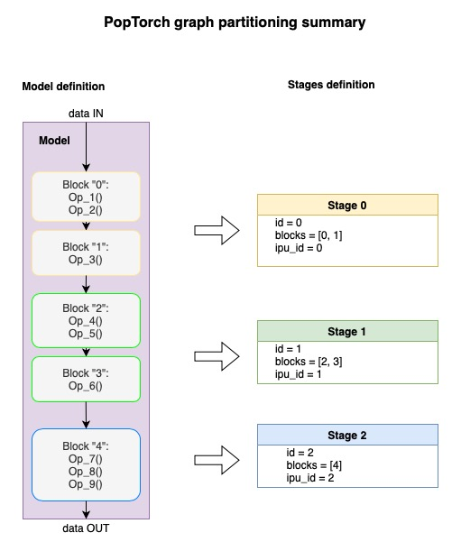
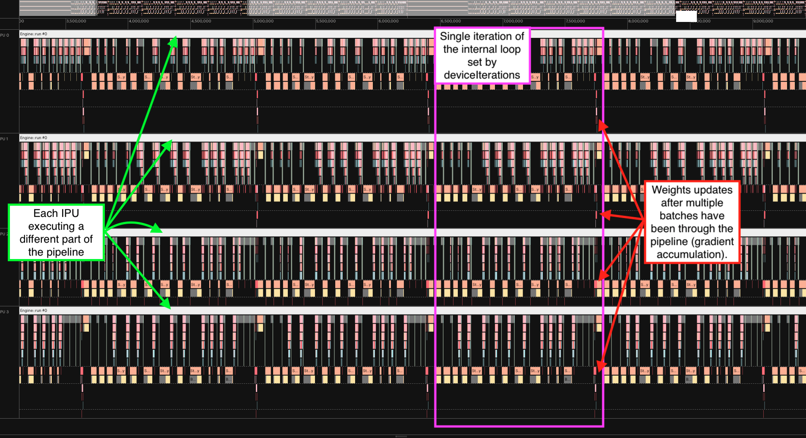
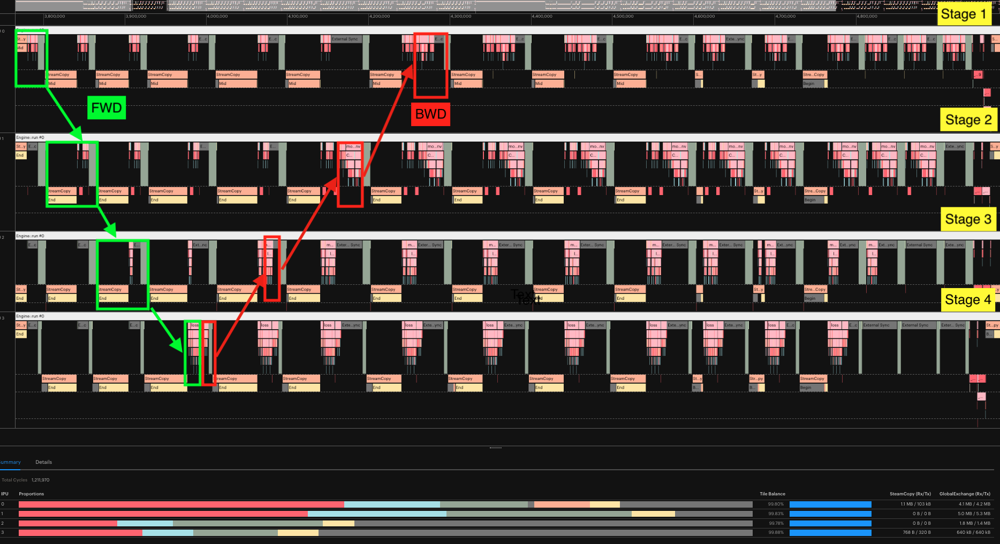

<!-- Copyright (c) 2022 Graphcore Ltd. All rights reserved. -->
<!-- THIS FILE IS AUTOGENERATED. Rerun SST after editing source file: walkthrough.py -->

# PopTorch Parallel Execution Using Pipelining

This PopTorch tutorial demonstrates how to train and test a neural network
on the MNIST dataset by splitting the model over several IPUs and using pipelining
to make efficient use of all the available IPUs.
Pipelining is the recommended strategy
when a model is too large to fit into the memory of a single IPU.
Pipelining can be used by training and inference models.
You will see both scenarios applied to the [MNIST simple application](../../../simple_applications/pytorch/mnist).

There are two parts: a Jupyter notebook and a Python script. The notebook works through how you use the pipelining API to define pipelines in PopTorch. The `mnist_pipeline.py` script shows the effect of hyper-parameters on a pipelined model's execution schedule when the model is run on the IPU.
In this tutorial you will:

- Use the PopTorch pipelining API to execute a model over multiple IPUs in parallel.
- Partition a model into blocks (`poptorch.Block`) and group them into pipeline stages (`poptorch.Stage`).
- Learn how gradient accumulation and device iteration hyperparameters impact performance.
- Debug a multi-IPU model using a sharded execution schedule (`poptorch.ShardedExecution`).
- Learn how to offload the optimiser tensors to save memory on device.
- Use the [Popvision Graph Analyser](https://docs.graphcore.ai/projects/graph-analyser-userguide/en/3.11.2/introduction.html) to look at execution profiles and understand how pipelining impacts the scheduling of a model across IPUs.

If you are unfamiliar with PopTorch, you may want to check out [our tutorial introducing PopTorch](../basics)
and learn how to convert a model from PyTorch to PopTorch to make it run on a Graphcore IPU.
Additionally, some knowledge of data loading in poptorch and batching on IPU is helpful, these topics are covered in [our tutorial on efficient data loading](../efficient_data_loading).

## File structure

- `mnist_pipeline.py` The main example script.
- `walkthrough.ipynb` The Jupyter notebook for this tutorial.
- `README.md` The markdown version of this tutorial.
- `walkthrough.py` The tutorial annotated script (for notebook generation only).
- `walkthrough_code_only.py` The tutorial code only (for notebook generation only).
- `requirements.txt` The packages to be installed in order to run the code.
- `tests/` The unit tests for `mnist_pipeline.py`.

Requirements:
- Python 3 installed (we recommend to create a virtual environment).
- A Poplar SDK environment enabled
   (see the [Getting Started](https://docs.graphcore.ai/en/latest/getting-started.html) guide for your IPU system)
- Python packages installed with `python3 -m pip install -r requirements.txt`

To run the Jupyter notebook:

1. Enable a Python3 virtual environment and install the required packages with `python3 -m pip install -r requirements.txt`
2. Source the enable scripts for both Poplar and PopART (see the [Getting Started](https://docs.graphcore.ai/en/latest/getting-started.html) guide for your IPU system)
3. In the same virtual environment, install the Jupyter notebook server: `python3 -m pip install jupyter`
4. Launch the Jupyter server on a specific port: `jupyter-notebook --no-browser --port <port number>`
5. Connect via SSH to your remote machine, forwarding your chosen port:
`ssh -NL <port number>:localhost:<port number> <your username>@<remote machine>`

For more details about this process, or if you need troubleshooting, see our [guide on using IPUs from Jupyter notebooks](../../standard_tools/using_jupyter/README.md).

>**Note**: In the Python script of this tutorial `mnist_pipeline.py`, the main function is executed under the scope:
>
>```python
>if __name__ == '__main__':
>```
>
> This is necessary to avoid [issues with asynchronous DataLoader](https://docs.graphcore.ai/projects/poptorch-user-guide/en/3.2.0/batching.html#poptorch-asynchronousdataaccessor).
> Implications of the asynchronous data loader are covered in [our tutorial on efficient data loading](../efficient_data_loading)

## Introduction to pipelined execution

PopTorch provides the pipelining API to split a model over several IPUs and parallelise its execution.
This is the recommended strategy when a model does not fit into the memory of a single IPU.
To pipeline a model:

- the model must be partitioned into multiple stages;
- the pipelined execution strategy must be selected, it will coordinate how the different stages are executed.
This process is an example of [model parallelism](https://huggingface.co/docs/transformers/parallelism).

A pipeline stage groups several consecutive layers of the full model to be executed on the same IPU.
Each stage is placed on an IPU, when training, stages contain both the code for the forward and the backward passes.
Activations corresponding to a batch of data will pass through all the stages during the forward pass, before going back through the stages in reverse order during the backward pass.
By placing the stages on different IPUs, and by feeding enough mini-batches,
all the stages will process a batch of data concurrently after a "ramp-up" period.


The figure above illustrates the start of a pipelined training on 4 IPUs.
Each block represents a batch of data being processed (numbered from 1 to 8).
Blocks are marked with `F` when the IPU is executing the forward pass and `B` when it
is executing the backward pass. We can see that after nine steps, the pipeline reaches a point
where all the IPUs are used at the same time.
In general, a pipeline reaches steady state and full utilisation after `2N+1` steps where `N` is the number of IPUs.
For each stage, forward and backward passes are always executed on the same IPU.

Beyond pipelined execution, other execution strategies are available which offer different performance and memory tradeoffs,
these are beyond the scope of this tutorial but are covered in the [multi-IPU execution strategies section](https://docs.graphcore.ai/projects/poptorch-user-guide/en/3.2.0/overview.html#multi-ipu-execution-strategies) of the PopTorch documentation.

For this tutorial, we need to import the following packages.

```python
import os
import json
import argparse
from pkgutil import get_data
import sys
from tqdm import tqdm
import torch
import torch.nn as nn
import torchvision
import poptorch
```

## Setting hyperparameters

We are going to use the following hyperparameters.
Let's set their default values.

```python
learning_rate = 0.001
epochs = 3
batch_size = 40
test_batch_size = 8
training_iterations = 10
gradient_accumulation = 10
inference_iterations = 100
```

## Preparing the data

We need to get the MNIST dataset for training or inference.
MNIST contains 70,000 images of handwritten digits: 60,000 for training and
10,000 for testing. The images are grayscale with a resolution of 28x28 pixels.
Two data loaders are employed to load training and testing data sets
separately:
the `train` argument is set to `True` for training, and `False`
for testing. Furthermore, training and inference can load the data
using a specific batch size.
`torchvision.transforms.ToTensor()` converts the image into numbers,
representing the brightness of their color between 0 and 255, separately in
red, green and blue images.
`torchvision.transforms.Normalize()`
normalizes the tensor using the statistics from the MNIST dataset.

```python
train_dataset = torchvision.datasets.MNIST(
    "mnist_data/",
    train=True,
    download=True,
    transform=torchvision.transforms.Compose(
        [
            torchvision.transforms.ToTensor(),
            torchvision.transforms.Normalize((0.1307,), (0.3081,)),
        ]
    ),
)

test_dataset = torchvision.datasets.MNIST(
    "mnist_data/",
    train=False,
    download=True,
    transform=torchvision.transforms.Compose(
        [
            torchvision.transforms.ToTensor(),
            torchvision.transforms.Normalize((0.1307,), (0.3081,)),
        ]
    ),
)
```

[poptorch.DataLoader](https://docs.graphcore.ai/projects/poptorch-user-guide/en/3.2.0/pytorch_to_poptorch.html#preparing-your-data)
is used to efficiently load data batches to IPU.
More information about the use of `poptorch.Dataloader`
can be found in the [PopTorch tutorial on efficient data loading](../efficient_data_loading).
`poptorch.DataLoaderMode.Async` is the preferred mode as it can
utilize several CPU threads to accelerate data processing. This can reduce
the host and IPU communication time.
The datasets will be downloaded, shuffled and transformed.
A `poptorch.Options()` instance contains a set of default hyperparameters and options for the IPU.
This is used both by the model and the PopTorch DataLoader.
We change the default value of `deviceIterations`: 10 for training and 100 for inference.
For training with pipelined execution, we also set `gradientAccumulation` to 10 (described in [Pipelined execution section](#pipelined-execution-parallel)).
With these settings, both data loaders will pick 100 mini-batches of data per step.

```python
train_opts = poptorch.Options()
train_opts.deviceIterations(training_iterations)
train_opts.Training.gradientAccumulation(gradient_accumulation)

training_data = poptorch.DataLoader(
    train_opts,
    train_dataset,
    batch_size=batch_size,
    shuffle=True,
    mode=poptorch.DataLoaderMode.Async,
    num_workers=16,
)

test_data = poptorch.DataLoader(
    poptorch.Options().deviceIterations(inference_iterations),
    test_dataset,
    batch_size=test_batch_size,
    shuffle=True,
    drop_last=True,
    mode=poptorch.DataLoaderMode.Async,
    num_workers=16,
)
```

## Model definition

A model needs to be created for the neural network to train on MNIST data.
We start by defining a Module class
called `ConvLayer` that is a basic convolution block for our model. It contains
`Conv2D`, `MaxPool2d` and `ReLU` operations.

```python
class ConvLayer(nn.Module):
    def __init__(self, in_channels, num_filters, kernel_size, pool_size):
        super().__init__()
        self.conv = nn.Conv2d(in_channels, num_filters, kernel_size=kernel_size)
        self.pool = nn.MaxPool2d(kernel_size=pool_size)
        self.relu = nn.ReLU()

    def forward(self, x):
        x = self.conv(x)
        x = self.pool(x)
        x = self.relu(x)
        return x
```

To use pipelined execution we must split our model using [block annotations](https://docs.graphcore.ai/projects/poptorch-user-guide/en/3.2.0/overview.html#annotations).
To provide flexibility, PopTorch lets us split our model into blocks and we can decide later how to group these blocks into
multiple stages to place them on different IPUs.

### Annotation for model partitioning

To prepare a model for pipelining, we need to partition the computational graph into multiple `blocks`.
They will be used later to build the `stages` that will be
executed on different IPUs. The picture below illustrates this process.



As described in the [User Guide](https://docs.graphcore.ai/projects/poptorch-user-guide/en/3.2.0/overview.html#model-partitioning-using-blocks),
there are three ways to define blocks:

- using the [poptorch.Block](https://docs.graphcore.ai/projects/poptorch-user-guide/en/3.2.0/reference.html#poptorch.Block) scope;
- using the [poptorch.BlockFunction](https://docs.graphcore.ai/projects/poptorch-user-guide/en/3.2.0/reference.html#poptorch.BlockFunction) decorator on the forward method of a `Module`;
- wrapping layers with
[poptorch.BeginBlock](https://docs.graphcore.ai/projects/poptorch-user-guide/en/3.2.0/reference.html#poptorch.BeginBlock).

You can use a combination of these three annotation options.
In this tutorial we will use the `poptorch.Block` scope.

To do this, we modify the `forward` function of the `Network` class, wrapping each layer
under the scope of a `poptorch.Block` with a name: `B1`, `B2`, `B3` and `B4`.

We define a model called `Network`. It defines four layers using
`ConvLayer`, `Linear` and `ReLU`, where `ConvLayer` was created above.

```python
class Network(nn.Module):
    def __init__(self):
        super().__init__()
        self.layer1 = ConvLayer(1, 10, 5, 2)
        self.layer2 = ConvLayer(10, 20, 5, 2)
        self.layer3 = nn.Linear(320, 256)
        self.layer3_act = nn.ReLU()
        self.layer4 = nn.Linear(256, 10)

    def forward(self, x):
        with poptorch.Block("B1"):
            x = self.layer1(x)
        with poptorch.Block("B2"):
            x = self.layer2(x)
        with poptorch.Block("B3"):
            x = x.view(-1, 320)
            x = self.layer3_act(self.layer3(x))
        with poptorch.Block("B4"):
            x = self.layer4(x)
        return x


model = Network()
```

#### Defining the training model

Since the loss function is only needed for training,
we create a Module class called `TraingModelWithLoss` to
integrate the model and the loss function which is
`CrossEntropyLoss` in this example.
We add the loss to the same block as the last layer of the model.
In the `forward` function of `TrainingModelWithLoss` below,
the loss is annotated with `poptorch.Block` of `B4`.

```python
class TrainingModelWithLoss(torch.nn.Module):
    def __init__(self, model):
        super().__init__()
        self.model = model
        self.loss = torch.nn.CrossEntropyLoss()

    def forward(self, args, labels=None):
        output = self.model(args)
        if labels is None:
            return output
        with poptorch.Block("B4"):
            loss = self.loss(output, labels)
        return output, loss
```

The training model is called with an instance of
`TrainingModelWithLoss`, model options, and the [AdamW optimiser](https://docs.graphcore.ai/projects/poptorch-user-guide/en/3.2.0/reference.html#poptorch.optim.AdamW).
The next section of this tutorial will explain how to set the model options for pipelining.

```python
def get_training_model(opts, model):
    """Wrap a model with the loss and the optimiser into a poptorch.trainingModel"""
    model_with_loss = TrainingModelWithLoss(model)
    training_model = poptorch.trainingModel(
        model_with_loss,
        opts,
        optimizer=poptorch.optim.AdamW(model.parameters(), lr=learning_rate),
    )
    return training_model
```

## Execution strategies

Now that we have split the model into blocks, we are ready to define stages and place them onto specific IPUs.
Then we will apply an execution strategy which will schedule the stages on the IPUs.
We will consider two execution strategies:

- [poptorch.PipelinedExecution](https://docs.graphcore.ai/projects/poptorch-user-guide/en/3.2.0/reference.html#poptorch.PipelinedExecution)
for efficient parallel utilisation;
- and [poptorch.ShardedExecution](https://docs.graphcore.ai/projects/poptorch-user-guide/en/3.2.0/reference.html#poptorch.ShardedExecution) for debugging multi-IPU models.

Note: This tutorial does not cover `poptorch.PhasedExecution` strategy, which is the third one available.

The chosen strategy will be set in the model options, which are initialized by
`poptorch.Options`.

```python
train_opts = poptorch.Options()
```

### Pipelined execution (parallel)

#### Assigning blocks to stages and IPUs

The blocks defined earlier now need to be assembled into stages and passed to the
[poptorch.PipelinedExecution](https://docs.graphcore.ai/projects/poptorch-user-guide/en/3.2.0/reference.html#poptorch.PipelinedExecution)
strategy object.
This object defines a pipeline which enables parallel execution.

A stage is created by instantiating a `poptorch.Stage` object and giving it one or more block names.
These stages are then placed on specific IPUs identified by indices from 0 to 3.
In this example, we set 4 stages with `poptorch.PipelinedExecution` to have one stage per IPU.

```python
pipelined_strategy = poptorch.PipelinedExecution(
    poptorch.Stage("B1").ipu(0),
    poptorch.Stage("B2").ipu(1),
    poptorch.Stage("B3").ipu(2),
    poptorch.Stage("B4").ipu(3),
)
```

Next, we set pipelining as the execution strategy in our training options.

```python
train_opts.setExecutionStrategy(pipelined_strategy)
```

```output
replication_factor=1Options(, broadcast_buffers=TrueOptions(, device_iterations=1Options(, log_dir='.'Options(, auto_round_num_ipus=FalseOptions(, anchored_tensors={}Options(, output_mode=4Options(, output_return_period=1Options(, connection_type=0Options(, sync_pattern=0Options(, available_memory_proportion={}Distributed=_DistributedOptions(num_distributed_processes=1, distributed_process_id=0, ipuof_configs={}, _gcd_mappings={}, _warnings={}, _warnings_disabled=set(), _is_frozen=False), , Jit=_JitOptions(trace_model=False, _warnings={}, _warnings_disabled=set(), _is_frozen=False), , Precision=_PrecisionOptions(autocast_enabled=True, autocast_policy=<poptorch.autocasting.Policy object at 0x7f5b69496780>, autocast_policy_dict={'fp16': ['addbmm', 'addmm', 'addmv', 'addr', 'baddbmm', 'bmm', 'at', 'conv1d', 'conv2d', 'conv3d', 'conv_tbc', 'conv_transpose1d', 'conv_transpose2d', 'conv_transpose3d', 'convolution', 'matmul', 'mm', 'mv'], 'fp32': [], 'promote': ['addcdiv', 'addcmul', 'atan2', 'bilinear', 'cat', 'cross', 'dot', 'equal', 'index_put', 'stack', 'at'], 'demote': []}, half_float_casting=<HalfFloatCastingBehavior.Default: 2>, _popart_options=_PopartOptions(instrumentWithHardwareCycleCounter=False, rearrangeAnchorsOnHost=False), _warnings={}, _warnings_disabled=set(), _is_frozen=False), , TensorLocations=_TensorLocationOptions(, _warnings={}, _warnings_disabled=set(), _is_frozen=False), , Training=_TrainingOptions(gradient_accumulation=1, accumulation_and_replication_reduction_type=<ReductionType.Mean: 1>, meanAccumulationAndReplicationReductionStrategy=<MeanReductionStrategy.Post: 1>, _popart_options=_PopartOptions(instrumentWithHardwareCycleCounter=False, rearrangeAnchorsOnHost=False), _warnings={}, _warnings_disabled=set(), _is_frozen=False), , _Popart=_PopartOptions(instrumentWithHardwareCycleCounter=False, rearrangeAnchorsOnHost=False))
```

Note: Since IPUs are all set *in order* from 0 to 3, this shorter notation can also be used to, both, set the execution strategy and place the stages on the IPUs:

```python
train_opts.setExecutionStrategy(poptorch.PipelinedExecution("B1", "B2", "B3", "B4"))
```

Instead of naming blocks, we could have placed them directly on specific IPUs by using the `ipu_id` argument in the `poptorch.Block` context manager.
In that case PopTorch supports auto-staging which will automatically define one stage per block, placing each block on the specified IPU.
`PipelinedExecution` and [AutoStage](https://docs.graphcore.ai/projects/poptorch-user-guide/en/3.2.0/overview.html#poptorch-autostage) are enabled by default in models which contain `poptorch.Block` contexts, decorators or `poptorch.BeginBlock` layers.
Explicitly setting stages, as done in this tutorial, is required when `ipu_id` is not set.

#### Setting gradient accumulation and device iterations

Parallelisation during pipelined execution requires both the
[deviceIterations](https://docs.graphcore.ai/projects/poptorch-user-guide/en/3.2.0/batching.html#poptorch-options-deviceiterations) and [gradientAccumulation](https://docs.graphcore.ai/projects/poptorch-user-guide/en/3.2.0/batching.html#poptorch-options-training-gradientaccumulation)
hyper-parameters to be set.

- `gradientAccumulation` is used to push multiple mini-batches through the pipeline
allowing IPUs to run multiple stages in parallel.
During the backward pass, the gradients are accumulated over
several mini-batches. The model parameters are only updated once the number of consecutive mini-batches set by
`opts.Training.gradientAccumulation()` have been processed; their gradients are averaged.
- `deviceIterations` defines the number of times the device should run over the data before returning to the user. This is equivalent to running the IPU in a loop over that specified number of iterations, with new mini-batches of data each time.
However, increasing `deviceIterations` improves efficiency by reducing the number of interactions between the host CPU and the IPU.

As a result, from the CPU point of view, the number of images used by a single call to the model will be equal to: `batch-size` * `gradientAccumulation` *`deviceIterations`.
The implications of these parameters on I/O efficiency and data batching are covered in detail in the [tutorial on efficient data loading in PopTorch](../efficient_data_loading).

```python
train_opts.deviceIterations(training_iterations)
train_opts.Training.gradientAccumulation(gradient_accumulation)
```

```output
_TrainingOptions(gradient_accumulation=10, accumulation_and_replication_reduction_type=<ReductionType.Mean: 1>, meanAccumulationAndReplicationReductionStrategy=<MeanReductionStrategy.Post: 1>, _popart_options=_PopartOptions(instrumentWithHardwareCycleCounter=False, rearrangeAnchorsOnHost=False), _warnings={}, _warnings_disabled=set(), _is_frozen=False)
```

The following execution profile illustrates how these parameters affect the computation on IPUs.



To generate your own profile, call the example script `mnist_pipeline.py` with
the `--profile` argument, you will find complete usage instructions for this
script [at the end of the tutorial](#how-to-run-the-example-script).
This option will generate `profile.pop` files which can be opened with the
[Popvision Graph Analyser](https://docs.graphcore.ai/projects/graph-analyser-userguide/en/3.11.2/user-guide.html).

The execution report below illustrates the pipeline for 10 mini-batches
on 4 IPUs. We can see the 4 stages, each on a different IPU.
We highlighted the progression of the first batch:

- Green for the forward pass.
- Red for the backward pass.
We see that after a few mini-batches, the stages are computing a forward pass
directly followed by a backward pass.



Depending on your model and your performance target, you may need to balance
the pipeline stages in terms of the amount of computation and the amount of
memory demanded.

### Efficient model partitioning (advanced)

In order to make efficient use of multiple IPUs using pipelining, we consider the position of the start and end of each stage.
We must have in mind that these partitions will be placed and executed on different IPUs and the way we split our model will directly impact the memory and performance on each stage.
The following trade-offs must be considered:

- Stages must fit in memory considering both live and not always live memory. [The PopVision Liveness report](https://docs.graphcore.ai/projects/graph-analyser-userguide/en/3.11.2/user-guide.html#viewing-a-liveness-report-image27) can help determine which Ops and tensors consume the most memory.
- Stages must have similar execution times to avoid IPUs standing idle while another IPU completes its computation.
The execution time of the longest stage determines the duration of one step. The [PopVision execution trace](https://docs.graphcore.ai/projects/graph-analyser-userguide/en/3.11.2/user-guide.html#viewing-an-execution-trace-image32) can be used to identify imbalanced stages.
- Inter-IPU communication is slower than memory access within a single IPU and should be minimised.

To achieve more efficient pipelines, you may want to have more `poptorch.Block` annotations to allow finer control of the partitioning.
At the `Stage` level, you can reorganize which blocks are assigned to each stage using the following format:

```python
pipelined_strategy = poptorch.PipelinedExecution(
    poptorch.Stage("B1", "B2").ipu(0), poptorch.Stage("B3", "B4").ipu(1)
)
```

This format places two blocks into two stages onto two IPUs instead of the four used earlier in the tutorial.

More information on splitting models for pipelining are available in the
[memory and performance optimisation guide](https://docs.graphcore.ai/projects/memory-performance-optimisation/en/3.2.0/optimising-performance.html#pipeline-execution-scheme), and
the [TensorFlow pipelining technical note](https://docs.graphcore.ai/projects/tf-model-parallelism/en/3.2.0/index.html).

### Sharded execution (sequential)

The [poptorch.ShardedExecution](https://docs.graphcore.ai/projects/poptorch-user-guide/en/3.2.0/reference.html#poptorch.ShardedExecution) option defines sequential execution.
Unlike the pipelining mode, only one batch can be processed at a time so it is not a form of model parallelism.

`ShardedExecution` can be useful for processing a single sample or
debugging. Overall it has low efficiency since only one IPU is used at a time.

In this example, 4 stages are specified to run sequentially on 4 IPUs.

```python
sharded_strategy = poptorch.ShardedExecution(
    poptorch.Stage("B1").ipu(0),
    poptorch.Stage("B2").ipu(1),
    poptorch.Stage("B3").ipu(2),
    poptorch.Stage("B4").ipu(3),
)
```

## Saving memory by offloading to remote buffers (advanced)

To fit a memory intensive model on IPUs, variables can be offloaded to the host to reduce the live memory.
Activations, weights, the accumulator
and the optimiser can either stay on the IPU or be copied to the host.
It is most efficient to keep them on the IPU but has higher memory
requirements. For larger models, offloading some variables
to the host memory can accommodate other variables on device memory, but it will also
increase the computation time of the weight update as more time is
spent communicating with the host.
In this code example, you can see how to set the storage on the device or host
memory. We kept the default activations, weights, and accumulator on the device,
while storing optimiser states to the host memory
using [poptorch.Option.TensorLocations](https://docs.graphcore.ai/projects/poptorch-user-guide/en/3.2.0/reference.html#poptorch.options._TensorLocationOptions).
The `AdamW` optimiser is used in this tutorial and its optimiser state variables
do not need to be stored in the device memory during the forward and backward
propagation of the model.
These variables are only required during the weight update and so they are
streamed onto the device during the weight update and then streamed back to
the host memory after they have been updated.

```python
train_opts.TensorLocations.setOptimizerLocation(
    poptorch.TensorLocationSettings().useOnChipStorage(False)
)
```

```output
_TensorLocationOptions(location_optimizer={'onChip': 0}, _warnings={}, _warnings_disabled=set(), _is_frozen=False)
```

## Training the model

Once we have the training model, we run the training on the MNIST dataset,
prepared in the first step.
There are two nested `for` loops to traverse epochs and batches respectively.
After calling `training_model()`, predictions and losses are returned.
The accuracy and the mean of losses are calculated and displayed.

```python
def train(training_model, training_data):
    nr_steps = len(training_data)
    for epoch in range(1, epochs + 1):
        print(f"Epoch {epoch}/{epochs}")
        bar = tqdm(training_data, total=nr_steps)
        for data, labels in bar:
            preds, losses = training_model(data, labels)
            mean_loss = torch.mean(losses).item()
            acc = accuracy(preds, labels)
            bar.set_description(f"Loss:{mean_loss:0.4f} | Accuracy:{acc:0.2f}%")
```

The `accuracy()` function calculates the percentage of
the correct predictions for labels.

```python
def accuracy(predictions, labels):
    _, ind = torch.max(predictions, 1)
    labels = labels[-predictions.size()[0] :]
    accuracy = torch.sum(torch.eq(ind, labels)).item() / labels.size()[0] * 100.0
    return accuracy
```

When we call `training_model()`, the outputs are not returned for every
mini-batch by default. This results in incomplete evaluation and inaccurate
training accuracy. This behaviour can be changed by modifying
[outputMode](https://docs.graphcore.ai/projects/poptorch-user-guide/en/3.2.0/reference.html#poptorch.OutputMode)
in `poptorch.Options()`. For performance reasons, PopTorch uses
`OutputMode.Final` by default. It only returns the final batch loss and
predictions to the host machine. We can set this to `OutputMode.All` to be able
to present the full information in this tutorial. In that case, `preds` and
`losses` will be lists containing the results for the 100 mini-batches passed to
the pipeline. However, this has an impact on the speed of training, due to the
overhead of transferring more data to the host machine.

```python
# Warning: impacts performance
train_opts.outputMode(poptorch.OutputMode.All)
```

```output
replication_factor=1Options(, broadcast_buffers=TrueOptions(, device_iterations=10Options(, log_dir='.'Options(, auto_round_num_ipus=FalseOptions(, anchored_tensors={}Options(, output_mode=2Options(, output_return_period=1Options(, connection_type=0Options(, sync_pattern=0Options(, available_memory_proportion={}Distributed=_DistributedOptions(num_distributed_processes=1, distributed_process_id=0, ipuof_configs={}, _gcd_mappings={}, _warnings={}, _warnings_disabled=set(), _is_frozen=False), , Jit=_JitOptions(trace_model=False, _warnings={}, _warnings_disabled=set(), _is_frozen=False), , Precision=_PrecisionOptions(autocast_enabled=True, autocast_policy=<poptorch.autocasting.Policy object at 0x7f5b69496780>, autocast_policy_dict={'fp16': ['addbmm', 'addmm', 'addmv', 'addr', 'baddbmm', 'bmm', 'at', 'conv1d', 'conv2d', 'conv3d', 'conv_tbc', 'conv_transpose1d', 'conv_transpose2d', 'conv_transpose3d', 'convolution', 'matmul', 'mm', 'mv'], 'fp32': [], 'promote': ['addcdiv', 'addcmul', 'atan2', 'bilinear', 'cat', 'cross', 'dot', 'equal', 'index_put', 'stack', 'at'], 'demote': []}, half_float_casting=<HalfFloatCastingBehavior.Default: 2>, _popart_options=_PopartOptions(instrumentWithHardwareCycleCounter=False, rearrangeAnchorsOnHost=False), _warnings={}, _warnings_disabled=set(), _is_frozen=False), , TensorLocations=_TensorLocationOptions(location_optimizer={'onChip': 0}, _warnings={}, _warnings_disabled=set(), _is_frozen=False), , Training=_TrainingOptions(gradient_accumulation=10, accumulation_and_replication_reduction_type=<ReductionType.Mean: 1>, meanAccumulationAndReplicationReductionStrategy=<MeanReductionStrategy.Post: 1>, _popart_options=_PopartOptions(instrumentWithHardwareCycleCounter=False, rearrangeAnchorsOnHost=False), _warnings={}, _warnings_disabled=set(), _is_frozen=False), , _Popart=_PopartOptions(instrumentWithHardwareCycleCounter=False, rearrangeAnchorsOnHost=False))
```

We are ready to start training!

```python
training_model = get_training_model(train_opts, model)
train(training_model, training_data)
```

```output
Epoch 1/3
Graph compilation: 100%|██████████| 100/100 [01:31<00:00]
Loss:0.1422 | Accuracy:95.78%: 100%|██████████| 15/15 [01:37<00:00,  6.49s/it]
Epoch 2/3
Loss:0.0909 | Accuracy:97.10%: 100%|██████████| 15/15 [00:00<00:00, 15.04it/s]
Epoch 3/3
Loss:0.0707 | Accuracy:97.80%: 100%|██████████| 15/15 [00:01<00:00, 14.89it/s]
```

## Inference

Let's define our test function.

```python
def test(inference_model, test_data):
    nr_steps = len(test_data)
    sum_acc = 0.0
    for data, labels in tqdm(test_data, total=nr_steps):
        output = inference_model(data)
        sum_acc += accuracy(output, labels)
    print(f"Accuracy on test set: {sum_acc / len(test_data):0.2f}%")
```

After training, we test it using the inference model.
Since weights in `model.parameters()` will be copied implicitly,
the inference model takes the parameters from the trained model.
We will also reuse the PopTorch options from the training model except we will disable gradient accumulation since we are not training.
The inference batch-size was set to 8. To improve performance, we increase `device_iterations` to 100, which pushes more mini-batches into the inference pipeline.

```python
inf_options = train_opts.clone()
inf_options.Training.gradientAccumulation(1)
inf_options.deviceIterations(inference_iterations)
inference_model = poptorch.inferenceModel(model, inf_options)
```

Finally, run the inference.

```python
test(inference_model, test_data)
```

```output
Graph compilation: 100%|██████████| 100/100 [00:35<00:00]
100%|██████████| 12/12 [00:40<00:00,  3.37s/it]Accuracy on test set: 98.41%
```

## How to run the example script

1. Prepare the environment.

    Install the Poplar SDK following the instructions in the [Getting Started](https://docs.graphcore.ai/en/latest/getting-started.html) guide for your IPU system.
Make sure to run the `enable.sh` scripts for both Poplar and PopART and activate a Python virtual environment with PopTorch installed.

    Then install the package requirements:

``
python3 -m pip install -r requirements.txt
``

2. Run the program. Note that the PopTorch Python API only supports Python 3.
Data will be automatically downloaded using Torchvision utils.

``
python3 mnist_pipeline.py
``

The program has a few command-line options:

- `-h` Show usage information.
- `--batch-size` Sets the mini-batch size for training. Default: 40.
- `--device-iterations`  Number of device iterations for training. Default: 10.
- `--test-batch-size` Sets the batch size for inference. Default: 8.
- `--epochs` Number of epochs to train for. Default: 3.
- `--learning-rate` Learning rate of the optimiser. Default (tuned for AdamW): 0.001.
- `--profile` Enable profiling.
- `--profile-dir` Select a directory to save the profile (default: ./profile).
- `--profile-dir` Select a directory to save the profile. Default: ./profile.
- `--strategy` Sets the execution strategy (pipelined, sharded). Default: pipelined.
- `--debug` Prints out the debug logging while running.
- `--offload-optimiser` Set this option to offload the optimiser state.

Among these input arguments, `--strategy` and `--offload-optimiser`
are associated with the execution methods.

3. Some example command lines using different command-line options:

```sh
python3 mnist_pipeline.py --learning-rate 0.002 --debug --epochs 5

python3 mnist_pipeline.py --profile --profile-dir pipeline_profile

python3 mnist_pipeline.py --strategy sharded --profile --profile-dir sharding_profile

python3 mnist_pipeline.py --offload-optimiser
```

## Conclusion

In this tutorial we achieved model parallelism on multiple IPUs with the PopTorch pipelining API.
The model was partitioned to define the pipeline stages. Then, the pipelined execution strategy was set in the `poptorch.Options()` object.
We generated profiles and used the Popvision Graph Analyser to visualise the execution trace and the memory use on IPUs.
The graph profiles help to identify imbalances between stages.
This information is key to choosing a model partitioning that will reduce the time IPUs spend idle before synchronisation.
Additionally, memory use on the IPU was reduced at the expense of execution time by offloading optimiser-specific tensors to the host.
This trade-off is worth considering if you need to fit memory intensive models on the IPU.

To continue your journey with the Graphcore IPU you may want to look at the
Graphcore [examples
repository](https://github.com/graphcore/examples/tree/v2.6.0) which contains
implementations of standard deep learning models optimised for the IPU. You will
find, amongst others: [convolutional neural
networks](https://github.com/graphcore/examples/tree/v2.6.0/vision/cnns),
[BERT](https://github.com/graphcore/examples/tree/v2.6.0/nlp/bert/pytorch),
[mini
DALL-E](https://github.com/graphcore/examples/tree/v2.6.0/multimodal/mini_dalle/pytorch),
and [ViT](https://github.com/graphcore/examples/tree/v2.6.0/vision/vit/pytorch)
models.

If you are looking to port and optimise your own model, the
[memory and performance optimisation guide](https://docs.graphcore.ai/projects/memory-performance-optimisation/en/3.2.0/index.html)
will help you make the most of the hardware.
Finally the
[TensorFlow pipelining tech note](https://docs.graphcore.ai/projects/tf-model-parallelism/en/3.2.0/pipelining.html#optimising-the-pipeline)
contains additional information on the core concepts required to optimise your pipelined model.

Generated:2022-09-27T15:33 Source:walkthrough.py SDK:3.0.0+1145 SST:0.0.8
