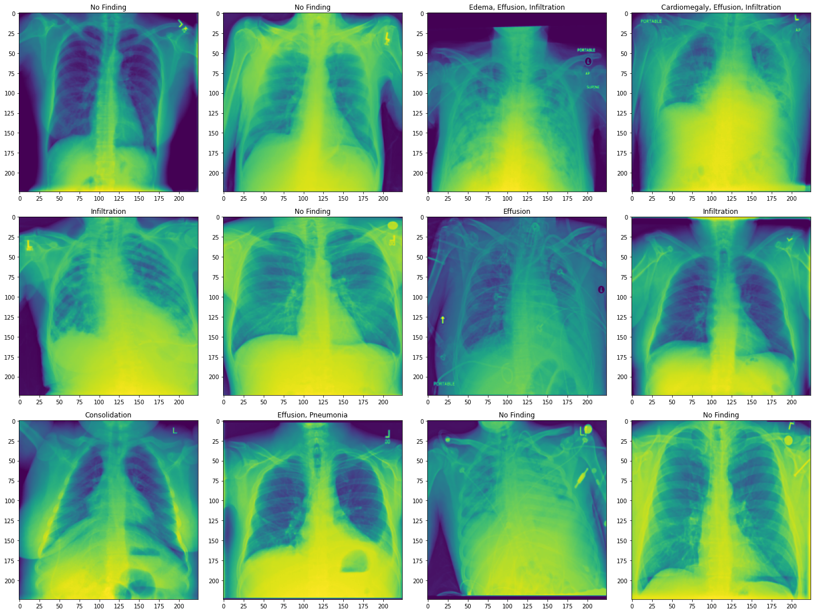
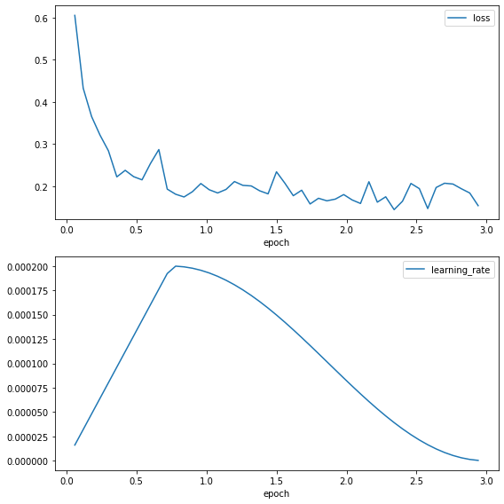

<!-- Copyright (c) 2022 Graphcore Ltd. All rights reserved. -->
<!-- THIS FILE IS AUTOGENERATED. Rerun SST after editing source file: walkthrough.py -->

# Training a Hugging Face model on the IPU using a local dataset

This PyTorch tutorial will show you how to reuse a Hugging Face model and train it on the IPU using a local dataset.
Specifically, we will be fine-tuning a Vision Transformer (ViT) model to detect multiple diseases from chest X-rays. As an X-ray image can have multiple diseases we will be training a multi-label classification model.
We will use [Graphcore's Optimum interface](https://github.com/huggingface/optimum-graphcore) to the [Hugging Face Transformers library](https://huggingface.co/docs/transformers/index) to run an existing model on the IPU.
We will be using the [google/vit-base-patch16-224-in21k checkpoint](https://huggingface.co/google/vit-base-patch16-224-in21k) pretrained on ImageNet, fine-tuning it on the NIH Chest X-ray Dataset.

In this tutorial, you will learn how to:
- Repurpose one of the examples from the [Graphcore organisation page on Hugging Face](https://huggingface.co/Graphcore) to fit your use case.
- Preprocess a dataset to fit it to an existing model.
- Use the Graphcore model cards found on the [Graphcore organisation page on Hugging Face](https://huggingface.co/Graphcore) and reuse checkpoints and config files released by Graphcore.
- Maximise IPU utilisation for your specific machine by overriding runtime parameters in the `IPUconfig` object made available in the model cards.

If this is your first time using IPUs, read the [IPU Programmer's Guide](https://docs.graphcore.ai/projects/ipu-programmers-guide/en/3.2.0/) to learn the basic concepts.
To run your own PyTorch model on the IPU see the [PyTorch basics tutorial](../basics), or to see all existing Graphcore models available from Hugging Face go to the [Graphcore organisation page](https://huggingface.co/Graphcore).

## How to run this tutorial

### Getting the dataset

This tutorial uses the NIH Chest X-ray Dataset downloaded from <http://nihcc.app.box.com/v/ChestXray-NIHCC>. Download the `/images` directory and unpack all images. You can use `bash` to extract the files:
```for f in images*.tar.gz; do tar xfz "$f"; done```.

Also download the `Data_Entry_2017_v2020.csv` file, which contains the labels. By default the tutorial expects the `/images` folder and `csv` file to be in the folder `chest-xray-nihcc`.

### Environment

Requirements:

- A Poplar SDK environment enabled (see the [Getting
 Started](https://docs.graphcore.ai/en/latest/getting-started.html) guide for
 your IPU system)
- Python packages installed with `python -m pip install -r requirements.txt`

To run the Python version of this tutorial:

1. Download and install the Poplar SDK. Run the `enable.sh` scripts for Poplar and PopART as described in the [Getting
  Started](https://docs.graphcore.ai/en/latest/getting-started.html) guide for your IPU system.
2. For repeatability we recommend that you create and activate a Python virtual environment. You can do this with:
   a. create a virtual environment in the directory `venv`: `virtualenv -p python3 venv`;
   b. activate it: `source venv/bin/activate`.
3. Install the Python packages that this tutorial needs with `python -m pip install -r requirements.txt`.

To run the Jupyter notebook version of this tutorial:

1. Enable a Poplar SDK environment (see the [Getting
  Started](https://docs.graphcore.ai/en/latest/getting-started.html) guide for
  your IPU system)
2. In the same environment, install the Jupyter notebook server:
   `python -m pip install jupyter`
3. Launch a Jupyter Server on a specific port:
   `jupyter-notebook --no-browser --port <port number>`
4. Connect via SSH to your remote machine, forwarding your chosen port:
   `ssh -NL <port number>:localhost:<port number>
   <your username>@<remote machine>`

For more details about this process, or if you need troubleshooting, see our
[guide on using IPUs from Jupyter
notebooks](../../standard_tools/using_jupyter/README.md).

## Graphcore Hugging Face models

Hugging Face provides convenient access to pre-trained transformer models.
The partnership between Hugging Face and Graphcore allows us to run these models on the IPU.

Hugging Face models ported to the IPU can be found on the [Graphcore organisation page on Hugging Face](https://huggingface.co/Graphcore).
This tutorial uses the [Vision Transformer model](https://github.com/huggingface/optimum-graphcore/tree/main/examples/image-classification) fine-tuned using the NIH Chest X-ray Dataset, as an example to show how Hugging Face models can be trained with a local dataset on the IPU.

### Utility imports

We start by importing the utilities that will be used
later in the tutorial:

```python
import torch
import os
import shutil
import numpy as np
import pandas as pd
import contextlib
import io
from pathlib import Path
from scipy.special import softmax
import json
import matplotlib.pyplot as plt

import optimum.graphcore as optimum_graphcore
from torchvision import transforms
import transformers
import datasets

# The `chest-xray-nihcc` directory is assumed to be in the pwd, but may be overridden by the environment variable `DATASET_DIR`
dataset_rootdir = Path(os.environ.get("DATASET_DIR", ".")) / "chest-xray-nihcc"
```

## Preparing the NIH Chest X-ray Dataset

For this tutorial, we are using the NIH Chest X-ray dataset, which contains radiological examinations for the diagnosis of lung diseases.
The examinations consist of square, grayscale, X-ray images of 224 pixels with corresponding metadata: Finding Labels, Follow-up #,Patient ID, Patient Age, Patient Gender, View Position, OriginalImage[Width Height] and OriginalImagePixelSpacing[x y].

We defined the locations of the downloaded images and the file with the labels to be downloaded in [Getting the dataset](#getting-the-dataset).

```python
# Path to the extracted "images" directory
images_dir = dataset_rootdir / "images"

# Path to Data_Entry_2017_v2020.csv
label_file = dataset_rootdir / "Data_Entry_2017_v2020.csv"
```

### Preparing the labels

We are going to train the Graphcore Optimum ViT model to predict the disease (defined by "Finding Label") from the  images.
"Finding Label" can be any number of 14 diseases or a "No Finding" label, which indicates that no disease was detected.
To be compatible with the `datasets` Hugging Face library, the text labels need to be transformed to N-hot encoded arrays representing the multiple labels which are needed to classify each image.
An N-hot encoded array represents the labels as a list of booleans, true if the label corresponds to the image and false if not.

First we identify the unique labels in the dataset:

```python
data = pd.read_csv(label_file)

# Converts the format of each label in the dataframe from "LabelA|LabelB|LabelC"
# into ["LabelA", "LabelB", "LabelC"], concatenates the
# lists together and removes duplicate labels
unique_labels = np.unique(
    data["Finding Labels"].str.split("|").aggregate(np.concatenate)
).tolist()

print(f"Dataset contains the following labels:\n{unique_labels}")
```

```output
Dataset contains the following labels:
['Atelectasis', 'Cardiomegaly', 'Consolidation', 'Edema', 'Effusion', 'Emphysema', 'Fibrosis', 'Hernia', 'Infiltration', 'Mass', 'No Finding', 'Nodule', 'Pleural_Thickening', 'Pneumonia', 'Pneumothorax']
```

Now we transform the labels into N-hot encoded arrays:

```python
label_index = {v: i for i, v in enumerate(unique_labels)}


def string_to_N_hot(string: str):
    true_index = [label_index[cl] for cl in string.split("|")]
    label = np.zeros((len(unique_labels),), dtype=float)
    label[true_index] = 1
    return label


data["labels"] = data["Finding Labels"].apply(string_to_N_hot)
```

When loading data using the `datasets.load_dataset` function, labels can be provided either by having folders for each of the labels (see ["ImageFolder" documentation](https://huggingface.co/docs/datasets/v2.3.2/en/image_process#imagefolder)) or by having a `metadata.jsonl` file ((see ["ImageFolder with metadata" documentation](https://huggingface.co/docs/datasets/v2.3.2/en/image_process#imagefolder-with-metadata))). As the images in this dataset can have multiple labels, we have chosen to use a `metadata.jsonl` file.
We write the image file names and their associated labels to the `metadata.jsonl` file.

```python
metadata_file = images_dir / "metadata.jsonl"
if not metadata_file.is_file():
    data[["Image Index", "labels"]].rename(
        columns={"Image Index": "file_name"}
    ).to_json(images_dir / "metadata.jsonl", orient="records", lines=True)
```

### Create the dataset

We are now ready to create the PyTorch dataset and split it into training and validation sets.
This step converts the dataset to the [Arrow file format](https://arrow.apache.org) which allows data to be loaded quickly during training and validation ([about Arrow and Hugging Face](https://huggingface.co/docs/datasets/v2.3.2/en/about_arrow)).
Because the entire dataset is being loaded and pre-processed it can take a few minutes.

```python
train_val_split = 0.05
dataset = datasets.load_dataset(
    "imagefolder",
    data_dir=images_dir,
)

split = dataset["train"].train_test_split(train_val_split)
dataset["train"] = split["train"]
dataset["validation"] = split["test"]
```

We are going to import the Vision Transformer(ViT) model from
the checkpoint `google/vit-base-patch16-224-in21k`.
The checkpoint is a standard model hosted by Hugging Face and is not managed by Graphcore.

```python
model_name_or_path = "google/vit-base-patch16-224-in21k"
```

To fine-tune a pre-trained model, the new dataset must have the same properties as the original dataset used for pre-training.
In Hugging Face, the original dataset information is provided in a config file loaded using the `AutoFeatureExtractor`.
For this model, the X-ray images are resized to the correct resolution (224x224), converted from grayscale to RGB, and normalized across the RGB channels with a mean (0.5, 0.5, 0.5) and a standard deviation (0.5, 0.5, 0.5).

```python
feature_extractor = transformers.AutoFeatureExtractor.from_pretrained(
    model_name_or_path
)


class XRayTransform:
    """
    Transforms for pre-processing XRay data across a batch.
    """

    def __init__(self):
        self.transforms = transforms.Compose(
            [
                transforms.Lambda(lambda pil_img: pil_img.convert("RGB")),
                transforms.Resize(feature_extractor.size),
                transforms.ToTensor(),
                transforms.Normalize(
                    mean=feature_extractor.image_mean, std=feature_extractor.image_std
                ),
                transforms.ConvertImageDtype(dtype=torch.float16),
            ]
        )

    def __call__(self, example_batch):
        example_batch["pixel_values"] = [
            self.transforms(pil_img) for pil_img in example_batch["image"]
        ]
        return example_batch


# Set the training transforms
dataset["train"].set_transform(XRayTransform())
# Set the validation transforms
dataset["validation"].set_transform(XRayTransform())
```

For the model to run efficiently images need to be batched. To do this, we define a `batch_sampler` function which returns batches of images and labels in a dictionary.

```python
def batch_sampler(examples):
    pixel_values = torch.stack([example["pixel_values"] for example in examples])
    labels = torch.tensor([example["labels"] for example in examples])
    return {"pixel_values": pixel_values, "labels": labels}
```

### Visualising the dataset
To examine the dataset we display the first 10 rows of the metadata.

```python
print(data.head(10))
```

Let's also plot some images from the validation set with their associated labels.

```python
fig = plt.figure(figsize=(20, 15))

unique_labels = np.array(unique_labels)

convert_image_to_float = transforms.ConvertImageDtype(dtype=torch.float32)
for i, data_dict in enumerate(dataset["validation"]):
    if i == 12:
        break
    image = data_dict["pixel_values"]
    # Convert image to format supported by imshow
    image = convert_image_to_float(image)
    label = data_dict["labels"]
    ax = plt.subplot(3, 4, i + 1)
    ax.set_title(", ".join(unique_labels[np.argwhere(label).flatten()]))
    plt.imshow(image[0])  # Plot only the first channel as they are all identical

fig.tight_layout()
```



The images are chest X-rays with labels of lung diseases the patient was diagnosed with. Here, we show the transformed images. Our dataset is now ready to be used.

## Preparing the model

To train a model on the IPU we need to import it from Hugging Face and define a trainer using the `IPUTrainer` class.
The `IPUTrainer` class takes the same arguments as the Hugging Face model along with an `IPUConfig` object which specifies the behaviour for compilation and execution on the IPU.

Now we import the ViT model from Hugging Face.

```python
model = transformers.AutoModelForImageClassification.from_pretrained(
    model_name_or_path, num_labels=len(unique_labels)
)
```

```output
Some weights of the model checkpoint at google/vit-base-patch16-224-in21k were not used when initializing ViTForImageClassification: ['pooler.dense.bias', 'pooler.dense.weight']
- This IS expected if you are initializing ViTForImageClassification from the checkpoint of a model trained on another task or with another architecture (for example initializing a BertForSequenceClassification model from a BertForPreTraining model).
- This IS NOT expected if you are initializing ViTForImageClassification from the checkpoint of a model that you expect to be exactly identical (initializing a BertForSequenceClassification model from a BertForSequenceClassification model).
Some weights of ViTForImageClassification were not initialized from the model checkpoint at google/vit-base-patch16-224-in21k and are newly initialized: ['classifier.bias', 'classifier.weight']
You should probably TRAIN this model on a down-stream task to be able to use it for predictions and inference.
```

To use this model on the IPU we need to load the IPU configuration, `IPUConfig`, which gives control to all the parameters specific to Graphcore IPUs.
Existing IPU configs can be found at : https://huggingface.co/Graphcore
We are going to use `Graphcore/vit-base-ipu`.

```python
ipu_config = optimum_graphcore.IPUConfig.from_pretrained("Graphcore/vit-base-ipu")
```

Let's set our training hyperparameters using `IPUTrainingArguments`.
This subclasses the Hugging Face `TrainingArguments` class, adding parameters specific to the IPU and its execution characteristics.

```python
training_args = optimum_graphcore.IPUTrainingArguments(
    output_dir="./results",
    overwrite_output_dir=True,
    per_device_train_batch_size=1,
    per_device_eval_batch_size=1,
    dataloader_num_workers=8,
    dataloader_drop_last=True,
    num_train_epochs=3,
    seed=1337,
    logging_steps=50,
    save_steps=1000,
    remove_unused_columns=False,
    warmup_ratio=0.25,
    lr_scheduler_type="cosine",
    learning_rate=2e-4,
    ignore_data_skip=True,
)
```

Performance of multi-label classification models can be assessed using the area under the  ROC (receiver operating characteristic) curve (AUC_ROC). The AUC_ROC represents the ability of the model to separate the different diseases. A score of 0.5 means that it is
50% likely to get the correct disease and a score of 1 means that it is able to perfectly separate the diseases.
To add this metric to our model evaluation we define a `compute_metrics` function and load the metric from the `datasets` package.
The `compute_metrics` function takes the labels predicted by the ViT model and computes the area under the ROC curve.
The `compute metrics` function takes an `EvalPrediction` object (a named tuple with a predictions and `label_ids` field), and has to return a dictionary string to float.

```python
metric_auc = datasets.load_metric("roc_auc", "multilabel")


def compute_metrics(p):
    preds = np.argmax(p.predictions, axis=1)

    pred_scores = softmax(p.predictions.astype("float32"), axis=1)
    auc = metric_auc.compute(
        prediction_scores=pred_scores, references=p.label_ids, multi_class="ovo"
    )["roc_auc"]
    return {"roc_auc": auc}
```

To train the model, we define a trainer using the `IPUTrainer` class which takes care of compiling the model to run on IPUs, and of performing training and evaluation.
The `IPUTrainer` class works just like the Hugging Face `Trainer` class, but takes the additional `ipu_config` argument.

```python
trainer = optimum_graphcore.IPUTrainer(
    model=model,
    ipu_config=ipu_config,
    args=training_args,
    train_dataset=dataset["train"],
    eval_dataset=dataset["validation"],
    compute_metrics=compute_metrics,
    tokenizer=feature_extractor,
    data_collator=batch_sampler,
)
```

```output
Setting replicated_tensor_sharding to False when replication_factor=1
---------- Device Allocation -----------
Embedding  --> IPU 0
Encoder 0  --> IPU 0
Encoder 1  --> IPU 0
Encoder 2  --> IPU 0
Encoder 3  --> IPU 1
Encoder 4  --> IPU 1
Encoder 5  --> IPU 1
Encoder 6  --> IPU 2
Encoder 7  --> IPU 2
Encoder 8  --> IPU 2
Encoder 9  --> IPU 3
Encoder 10 --> IPU 3
Encoder 11 --> IPU 3
Head       --> IPU 3
---------------------------------------
```

## Run the training

To accelerate training we will load the last checkpoint if it exists.

```python
last_checkpoint = None
if os.path.isdir(training_args.output_dir) and not training_args.overwrite_output_dir:
    last_checkpoint = transformers.trainer_utils.get_last_checkpoint(
        training_args.output_dir
    )
```

Now we are ready to train.

```python
# Capture the command line output for plotting loss and learning rate
output = io.StringIO()

with contextlib.redirect_stdout(output):
    trainer.train(resume_from_checkpoint=last_checkpoint)

# Visualise a fragment of the raw output
print(output.getvalue()[:500])
print("...")
print(output.getvalue()[-500:])
```

```output
Compiling Model...
Graph compilation: 100%|██████████| 100/100 [00:14<00:00]
Compiled/Loaded model in 31.030112855136395 secs
***** Running training *****
  Num examples = 106514
  Num Epochs = 3
  Instantaneous batch size per device = 1
  Device Iterations = 1
  Replication Factor = 1
  Gradient Accumulation steps = 128
  Total train batch size (w. parallel, distributed & accumulation) = 128
  Total optimization steps = 2496
 40%|████      | 1000/2496 [06:53<10:09,  2.46it/s]Saving model checkpoint to ./results/checkpoint-1000
---------- Device Allocation -----------
Embedding  --> IPU 0
Encoder 0  --> IPU 0
Encoder 1  --> IPU 0
Encoder 2  --> IPU 0
Encoder 3  --> IPU 1
Encoder 4  --> IPU 1
Encoder 5  --> IPU 1
Encoder 6  --> IPU 2
Encoder 7  --> IPU 2
Encoder 8  --> IPU 2
Encoder 9  --> IPU 3
Encoder 10 --> IPU 3
Encoder 11 --> IPU 3
Head       --> IPU 3
---------------------------------------
Configuration saved in ./results/checkpoint-1000/ipu_config.json
 80%|████████  | 2000/2496 [13:50<03:19,  2.49it/s]Saving model checkpoint to ./results/checkpoint-2000
---------- Device Allocation -----------
Embedding  --> IPU 0
Encoder 0  --> IPU 0
Encoder 1  --> IPU 0
Encoder 2  --> IPU 0
Encoder 3  --> IPU 1
Encoder 4  --> IPU 1
Encoder 5  --> IPU 1
Encoder 6  --> IPU 2
Encoder 7  --> IPU 2
Encoder 8  --> IPU 2
Encoder 9  --> IPU 3
Encoder 10 --> IPU 3
Encoder 11 --> IPU 3
Head       --> IPU 3
---------------------------------------
Configuration saved in ./results/checkpoint-2000/ipu_config.json
100%|██████████| 2496/2496 [17:18<00:00,  2.51it/s]

Training completed. Do not forget to share your model on huggingface.co/models =)


100%|██████████| 2496/2496 [17:18<00:00,  2.40it/s]{'loss': 0.605, 'learning_rate': 1.602564102564103e-05, 'epoch': 0.06}
{'loss': 0.4326, 'learning_rate': 3.205128205128206e-05, 'epoch': 0.12}
{'loss': 0.3654, 'learning_rate': 4.8076923076923084e-05, 'epoch': 0.18}
{'loss': 0.3215, 'learning_rate': 6.410256410256412e-05, 'epoch': 0.24}
{'loss': 0.2844, 'learning_rate': 8.012820512820514e-05, 'epoch': 0.3}
{'loss': 0.2226, 'learning_rate': 9.615384615384617e-05, 'epoch': 0.36}
{'loss': 0.2381, 'learning_rate': 0.00011217948717948718, 'epoch': 0.
...
 0.2075, 'learning_rate': 8.401392014073405e-06, 'epoch': 2.7}
{'loss': 0.2056, 'learning_rate': 5.361064379673464e-06, 'epoch': 2.76}
{'loss': 0.1945, 'learning_rate': 2.9866889774481044e-06, 'epoch': 2.82}
{'loss': 0.1844, 'learning_rate': 1.2949737362087156e-06, 'epoch': 2.88}
{'loss': 0.1544, 'learning_rate': 2.978228636022262e-07, 'epoch': 2.94}
{'train_runtime': 1038.1587, 'train_samples_per_second': 307.745, 'train_steps_per_second': 2.404, 'train_loss': 0.2123262148637038, 'epoch': 3.0}
```

### Plotting convergence

Now that we have completed training we can format and plot the trainer output to evaluate the training behaviour.

```python
# Put the trainer logs in a data frame
values = []
for line in output.getvalue().split("\n"):
    if len(line) > 3 and line[:3] == "{'l":
        values.append(json.loads(line.replace("'", '"')))
training_records = pd.DataFrame(values)
training_records.tail(5)
```

We plot the training loss and the learning rate.

```python
fig, axs = plt.subplots(2, 1)
training_records.plot(x="epoch", y="loss", ax=axs[0])
training_records.plot(x="epoch", y="learning_rate", ax=axs[1])
fig.set_size_inches(8, 8)
fig.tight_layout()
```



The loss curve shows a rapid reduction in the loss at the start of training before stabilising around 0.1, showing that the model is learning.
The learning rate increases through the warm-up of 25% of the training period, before following a cosine decay.

## Run the evaluation
Now that we have trained the model we can evaluate its ability to predict the labels of unseen data using the validation dataset.

```python
metrics = trainer.evaluate()
trainer.log_metrics("eval", metrics)
trainer.save_metrics("eval", metrics)
```

```output
Compiling Model...
Graph compilation: 100%|██████████| 100/100 [00:05<00:00]
Compiled/Loaded model in 18.375397488474846 secs
***** Running Evaluation *****
  Num examples = 5606
  Batch size = 4
100%|██████████| 1401/1401 [00:20<00:00, 68.96it/s]***** eval metrics *****
  epoch                   =        3.0
  eval_loss               =     0.1785
  eval_roc_auc            =     0.7916
  eval_runtime            = 0:00:21.34
  eval_samples_per_second =    262.512
  eval_steps_per_second   =     65.628
```

The metrics show the validation AUC_ROC score the tutorial achieves after 3 epochs.

There are several directions to explore to improve the accuracy of the model including longer training. The validation performance might also be improved through changing optimisers, learning rate, learning rate schedule, loss scaling or using auto-loss scaling.

## Conclusion

In this tutorial we have shown how to train a Hugging Face model on the IPU using a local dataset.
To do this, we:
- loaded the local dataset using the Hugging Face `datasets` package,
- defined transforms to ensure the dataset was compatible with the model,
- defined the `IPUTrainer` class to allow the model to run on the IPU,
- ran the model.

The dataset required preprocessing before being compatible with the `datasets` package.
We needed to encode the labels as N-hot arrays to make them compatible with the `load_dataset` function.
To improve the training of the model, device parameters were loaded and customised in the `IPUConfig` object and hyperparameters were tuned in the `IPUTrainer` class.

You are now ready to use Graphcore and Hugging Face models for your own application.
To see all the Hugging Face models available for the IPU, see the [Graphcore organisation page](https://huggingface.co/Graphcore) and for more information about
how models are run please consult the [Hugging Face documentation](https://huggingface.co/docs) and the [Graphcore Optimum Library](https://github.com/huggingface/optimum-graphcore).
For information on how to optimise models for the IPU see the [Memory and Performance Optimisation Guide](https://docs.graphcore.ai/projects/memory-performance-optimisation/).
Graphcore also provides reference implementations of model architectures for many applications in the [Graphcore examples repository](https://github.com/graphcore/examples) and in the [Graphcore Model Garden](https://www.graphcore.ai/resources/model-garden).

Generated:2022-09-08T15:05 Source:walkthrough.py SDK:3.1.0-EA.1+1118 SST:0.0.8
