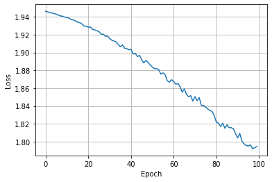

<!-- THIS FILE IS AUTOGENERATED. Rerun SST after editing source file: 2_a_worked_example.py -->

# An end to end example using PyTorch Geometric on IPUs

Graph Neural Networks (GNNs) are models designed to derive insights from unstructured data that can be represented as graphs.
They are used to address a wide variety of scientific and industrial problems: their application to chemistry and biology has unlocked
a new era of drug discovery, while their use to analyse product and customer interactions is improving recommender systems.

GNNs are ideal to run on Graphcore IPUs, due to IPU architectural characteristics such as very large amounts of on-chip SRAM,
which makes message passing operations typical of GNN workloads much faster than other processor types. For more details about why IPUs
are extremely capable at running GNN workloads please check out our [blog post](https://www.graphcore.ai/posts/what-gnns-are-great-at-and-why-graphcore-ipus-are-great-at-gnns) on this topic.
The advantages of running GNNs on IPUs compared to other processor types can be seen in our [benchmarks](../benchmarks).

This tutorial will get you started training and running inference on your first GNN model on IPUs.
We will go through the following steps required to run a PyTorch Geometric model on IPU, detailing the journey of running GNNs on the IPU:
 * Loading a PyTorch Geometric dataset
 * Using a [PopTorch Geometric](https://docs.graphcore.ai/projects/poptorch-geometric-user-guide/) dataloader to achieve fixed size outputs
 * Creating a model
 * Adjusting the model to satisfy PopTorch requirements
 * Start training on the IPU
 * Run inference on the IPU

The specific task we will cover is to classify the nodes of the PyTorch Geometric [Cora citation network dataset](https://pytorch-geometric.readthedocs.io/en/latest/modules/datasets.html#torch_geometric.datasets.Planetoid);

While this tutorial will cover enough of the basics of GNNs, PyTorch Geometric and PopTorch
for you to start developing and porting your GNN applications to the IPU;
the following resources can be used to complement your understanding of:

- PopTorch : [Introduction to PopTorch - running a simple model](https://github.com/graphcore/examples/tree/master/tutorials/tutorials/pytorch/basics);
- GNNs : [A Gentle Introduction to Graph Neural Networks](https://distill.pub/2021/gnn-intro/)
- PyTorch Geometric (PyG): [Official notebooks examples and tutorials](https://pytorch-geometric.readthedocs.io/en/latest/notes/colabs.html)

## Running on Paperspace

The Paperspace environment lets you run this notebook with no set up. To improve your experience we preload datasets and pre-install packages, this can take a few minutes, if you experience errors immediately after starting a session please try restarting the kernel before contacting support. If a problem persists or you want to give us feedback on the content of this notebook, please reach out to through our community of developers using our [slack channel](https://www.graphcore.ai/join-community) or raise a [GitHub issue](https://github.com/graphcore/examples).

Requirements:

* Python packages installed with `pip install -r ../requirements.txt`

```bash
pip install -r ../requirements.txt
```

And for compatibility with the Paperspace environment variables we will do the following:

```python
import os

executable_cache_dir = (
    os.getenv("POPLAR_EXECUTABLE_CACHE_DIR", "/tmp/exe_cache/")
    + "/pyg-a-worked-example"
)
dataset_directory = os.getenv("DATASETS_DIR", "data")
```

Now we are ready to start!

## Loading a PyTorch Geometric dataset

PyTorch Geometric provides simple access to many of the datasets used in literature for GNNs.
The full list of datasets is available in the [project's documentation](https://pytorch-geometric.readthedocs.io/en/latest/modules/datasets.html#torch-geometric-datasets).

For this tutorial we will use the `Cora` citation network dataset within the `Planetoid` benchmark suite to train our first GNN and run it on the IPU for the task of node classification.
The `Cora` dataset features a single graph where nodes represent documents and edges represent citation links. Let's load the dataset and take a look at some of its features.

```python
from torch_geometric.datasets import Planetoid
import torch_geometric.transforms as T

transform = T.Compose([T.NormalizeFeatures(), T.AddSelfLoops()])

dataset = Planetoid(root=dataset_directory, name="Cora", transform=transform)
data = dataset[0]  # Access the citation graph as Data object

print(f"Dataset: {dataset}: ")
print(f"Number of graphs: {len(dataset)}: ")
print(f"Number of features: {dataset.num_features}: ")
print(f"Number of classes: {dataset.num_classes}: ")

print(data)

print(f"{data.num_nodes = }")
print(f"{data.num_edges = }")
```

```output
Downloading https://github.com/kimiyoung/planetoid/raw/master/data/ind.cora.x
Downloading https://github.com/kimiyoung/planetoid/raw/master/data/ind.cora.tx
Downloading https://github.com/kimiyoung/planetoid/raw/master/data/ind.cora.allx
Downloading https://github.com/kimiyoung/planetoid/raw/master/data/ind.cora.y
Downloading https://github.com/kimiyoung/planetoid/raw/master/data/ind.cora.ty
Downloading https://github.com/kimiyoung/planetoid/raw/master/data/ind.cora.ally
Downloading https://github.com/kimiyoung/planetoid/raw/master/data/ind.cora.graph
Downloading https://github.com/kimiyoung/planetoid/raw/master/data/ind.cora.test.index
Dataset: Cora():
Number of graphs: 1:
Number of features: 1433:
Number of classes: 7:
Data(x=[2708, 1433], edge_index=[2, 13264], y=[2708], train_mask=[2708], val_mask=[2708], test_mask=[2708])
data.num_nodes = 2708
data.num_edges = 13264
Processing...
Done!
```

Graphs in PyTorch Geometric are stored in `Data` objects which provide an expressive string representation (see above), and a neat interface for accessing properties of the graph, for example its number of nodes and edges.
The `edge_index` property describes the graph connectivity, while `x` represents the node features (1433-dim feature vector for each node) and `y` represents the node labels (each node is associated to one class).
It's also worth noting the mask properties which denotes against which nodes to train/validate/test as we already know their community assignment.
PyTorch Geometric datasets support transforms for pre-processing datasets on CPU before passing them to the model. In addition to using transforms for data augmentation they can also be useful to apply data processing which does not have learnable parameters and is not supported on the IPU.

You may notice that in the code block above we made use of two transforms:
- `NormalizeFeatures()` to row-normalize the input feature vector;
- `AddSelfLoops()` to add self-loops to the dataset. Self-loops are edges which connect a node to itself and facilitate the communication of the node's feature across layers. Implementing self-loops corresponds to filling in the diagonal of the adjacency matrix.

Now we have the dataset loaded we can use a dataloader to efficiently load our data onto the IPU, in the next section we will see how to do that.

## Using a dataloader

There are a number of reasons why you may want to use a dataloader to load your dataset into your model. When you are using IPUs, the main reasons to use a dataloader are:
 * to achieve the most efficient loading performance;
 * to enable using particular PopTorch features such as replication and gradient accumulation;
 * to achieve fixed size batches required for the IPU.

[PopTorch Geometric](https://docs.graphcore.ai/projects/poptorch-geometric-user-guide/), the IPU-specific PyTorch Geometric library, provides a wrapper for the PopTorch dataloader, making it easy to get performant PyTorch Geometric models running on the IPU. As we only have a single item in our dataset we do not need to worry about making our batches fixed size so we can use the most basic of PopTorch Geometric's dataloaders.

```python
from poptorch_geometric.dataloader import DataLoader

dataloader = DataLoader(dataset, batch_size=1)
```

Our dataloader is now ready to go. Let's move on to creating a model.

## Creating a model

Let's remind ourselves of the task to inform the model we want to create. We want to classify the nodes of the Cora citation network dataset. Let's take a look at some important GNN features to help us construct our model.

### Message passing layers in PyTorch Geometric

GNNs rely on message passing schemes to perform neighbourhood aggregation of node and edge features, explained in more detail in [PyTorch Geometric white paper](https://arxiv.org/abs/1903.02428).
This scheme aggregates features along the structure of the graph and it calculates updated feature vectors for each node and edge.
MLP Layers with learnable parameters can be introduced in the calculation:

- During the message passing: features of a neighbouring node and a connecting edge may be processed through a dense layer to calculate a message;
- After aggregation: the combined messages are processed through neural layers to learn new derived features.

An important property of neighbourhood aggregation schemes is that they are "permutation invariant": the order in which nodes or edges appear in the arrays does not affect them.

PyTorch Geometric offers a large number of message passing layers which aggregate node and edge features. The full list is available in the [convolutional layers](https://pytorch-geometric.readthedocs.io/en/latest/modules/nn.html#convolutional-layers) section of the PyTorch Geometric documentation.

Let's take a look at the support convolutional layers:

```python
from torch_geometric import nn

# List all the layers which are a subclass of the MessagePassing layer
attrs = []
for attr in dir(nn):
    try:
        if issubclass(getattr(nn, attr), nn.MessagePassing):
            attrs.append(attr)
    except:
        pass
print(attrs)
```

```output
['AGNNConv', 'APPNP', 'ARMAConv', 'CGConv', 'ChebConv', 'ClusterGCNConv', 'DNAConv', 'DynamicEdgeConv', 'EGConv', 'EdgeConv', 'FAConv', 'FastRGCNConv', 'FeaStConv', 'FiLMConv', 'FusedGATConv', 'GATConv', 'GATv2Conv', 'GCN2Conv', 'GCNConv', 'GENConv', 'GINConv', 'GINEConv', 'GMMConv', 'GatedGraphConv', 'GeneralConv', 'GraphConv', 'GravNetConv', 'HANConv', 'HEATConv', 'HGTConv', 'HypergraphConv', 'LEConv', 'LGConv', 'LabelPropagation', 'MFConv', 'MessagePassing', 'NNConv', 'PANConv', 'PDNConv', 'PNAConv', 'PPFConv', 'PointGNNConv', 'PointNetConv', 'PointTransformerConv', 'RGATConv', 'RGCNConv', 'ResGatedGraphConv', 'SAGEConv', 'SGConv', 'SSGConv', 'SignedConv', 'SimpleConv', 'SplineConv', 'SuperGATConv', 'TAGConv', 'TransformerConv', 'WLConvContinuous']
```

For our task, a simple `GCNConv` layer will suffice. As we have added the self-loops to the dataset as a transform we can turn them off in the layer. Turning off the self-loops in the layer is also a change we must make to ensure our compiled graph for the IPU is static.

```python
from torch_geometric.nn import GCNConv

conv = GCNConv(16, 16, add_self_loops=False)
```

Now we know about message passing, let's construct a model with these layers.

### Using the GCNConv layer in a model

We are now ready to write a small GNN model to process the Cora dataset using the `GCNConv` layer provided by PyTorch Geometric. We do this in the normal way with two small changes:
 * PopTorch requires the loss function to be part of the model, so we will move that in to the end of the forward pass.
 * Set the labels of the masked nodes to `-100` so they are ignored in the loss function.

```python
import torch
from torch_geometric.nn import GCNConv
import torch.nn.functional as F


class GCN(torch.nn.Module):
    def __init__(self, in_channels: int, out_channels: int):
        super(GCN, self).__init__()
        self.conv1 = GCNConv(in_channels, 16, add_self_loops=False)
        self.conv2 = GCNConv(16, out_channels, add_self_loops=False)

    def forward(self, x, edge_index, y=None, train_mask=None):
        x = self.conv1(x, edge_index).relu()
        x = F.dropout(x, training=self.training)
        x = self.conv2(x, edge_index).relu()
        x = F.log_softmax(x, dim=1)

        if self.training:
            y = torch.where(train_mask, y, -100)
            loss = F.nll_loss(x, y)
            return x, loss
        return x
```

The number of in channels for our model is the size of the input features. The number of out channels is the number of classes in our dataset.

```python
print(f"{dataset.num_node_features = }")
print(f"{dataset.num_classes = }")
```

```output
dataset.num_node_features = 1433
dataset.num_classes = 7
```

Now we have described our model, let's initialise it.

```python
in_channels = dataset.num_node_features
out_channels = dataset.num_classes

model = GCN(in_channels, out_channels)
model.train()
```

```output
GCN(
  (conv1): GCNConv(1433, 16)
  (conv2): GCNConv(16, 7)
)
```

Our model is ready for training, we will learn how to do that in the next section.

## Training our model

We are now in the position to begin training our model. To make this model ready for training on the IPU we will wrap the model in PopTorch functionality. We do the following:
 * Use a PopTorch optimizer for better speed and memory performance on the IPU. `Adam` is a suitable optimizer for our task, so we can create the optimizer in the typical way.
 * Wrap the model in `poptorch.trainingModel`;
 * Use PopTorch options to make use of PopTorch and IPU features, here we only set a directory to save and load our compiled executable from. Take a look at the [PopTorch documentation](https://docs.graphcore.ai/projects/poptorch-user-guide/en/latest/reference.html?highlight=options#poptorch.Options) for some of the other features you could use.

```python
import poptorch

optimizer = poptorch.optim.Adam(model.parameters(), lr=0.001)
poptorch_options = poptorch.Options().enableExecutableCaching(executable_cache_dir)
poptorch_model = poptorch.trainingModel(model, poptorch_options, optimizer=optimizer)
```

We can then set up the training loop in a familiar way. The key things to note is, because we moved the loss function inside the model, we do not need to define the loss calculation, the backward pass or the optimizer step. PopTorch handles this all for us.

Let's set up the training loop and run some epochs.

```python
from tqdm import tqdm

losses = []

for epoch in tqdm(range(100)):
    bar = tqdm(dataloader)
    for data in bar:
        _, loss = poptorch_model(
            data.x, data.edge_index, y=data.y, train_mask=data.train_mask
        )
        bar.set_description(f"Epoch {epoch} loss: {loss:0.6f}")
        losses.append(loss)
```

```output
  0%|          | 0/100 [00:00<?, ?it/
                                                   
                                                       
                                                       
                                                       
                                                        
                                                        
                                                        
                                                        
                                                        
                                                        
                                                        
                                                        
                                                        
                                                        
                                                        
                                                        
                                                        
                                                        
                                                        
                                                        
                                                        
                                                        
                                                        
                                                        
                                                        
                                                        
                                                        
                                                        
                                                        
                                                        
                                                        
                                                        
                                                        
                                                        
                                                        
                                                        
                                                        
Graph compilation: 100%|██████████| 100/100 [00:33<00:00]
Epoch 0 loss: 1.946164: 100%|██████████| 1/1 [00:36<00:00, 36.43s/it]
Epoch 1 loss: 1.945527: 100%|██████████| 1/1 [00:00<00:00, 37.55it/s]
Epoch 2 loss: 1.944751: 100%|██████████| 1/1 [00:00<00:00, 50.16it/s]
Epoch 3 loss: 1.944203: 100%|██████████| 1/1 [00:00<00:00, 91.59it/s]
Epoch 4 loss: 1.943569: 100%|██████████| 1/1 [00:00<00:00, 94.64it/s]
Epoch 5 loss: 1.942977: 100%|██████████| 1/1 [00:00<00:00, 70.08it/s]
Epoch 6 loss: 1.941814: 100%|██████████| 1/1 [00:00<00:00, 73.54it/s]
Epoch 7 loss: 1.940866: 100%|██████████| 1/1 [00:00<00:00, 73.55it/s]
Epoch 8 loss: 1.940690: 100%|██████████| 1/1 [00:00<00:00, 86.77it/s]
Epoch 9 loss: 1.939616: 100%|██████████| 1/1 [00:00<00:00, 84.97it/s]
Epoch 10 loss: 1.939281: 100%|██████████| 1/1 [00:00<00:00, 83.29it/s]
Epoch 11 loss: 1.938514: 100%|██████████| 1/1 [00:00<00:00, 88.54it/s]
Epoch 12 loss: 1.936690: 100%|██████████| 1/1 [00:00<00:00, 88.80it/s]
Epoch 13 loss: 1.936615: 100%|██████████| 1/1 [00:00<00:00, 92.46it/s]
Epoch 14 loss: 1.935333: 100%|██████████| 1/1 [00:00<00:00, 92.34it/s]
Epoch 15 loss: 1.933921: 100%|██████████| 1/1 [00:00<00:00, 90.43it/s]
Epoch 16 loss: 1.933416: 100%|██████████| 1/1 [00:00<00:00, 45.51it/s]
Epoch 17 loss: 1.932073: 100%|██████████| 1/1 [00:00<00:00, 95.17it/s]
Epoch 18 loss: 1.929610: 100%|██████████| 1/1 [00:00<00:00, 98.91it/s]
Epoch 19 loss: 1.929479: 100%|██████████| 1/1 [00:00<00:00, 73.21it/s]
Epoch 20 loss: 1.928257: 100%|██████████| 1/1 [00:00<00:00, 79.44it/s]
Epoch 21 loss: 1.928551: 100%|██████████| 1/1 [00:00<00:00, 72.94it/s]
Epoch 22 loss: 1.925761: 100%|██████████| 1/1 [00:00<00:00, 74.73it/s]
Epoch 23 loss: 1.925388: 100%|██████████| 1/1 [00:00<00:00, 69.26it/s]
Epoch 24 loss: 1.924373: 100%|██████████| 1/1 [00:00<00:00, 89.07it/s]
Epoch 25 loss: 1.923393: 100%|██████████| 1/1 [00:00<00:00, 65.74it/s]
Epoch 26 loss: 1.920474: 100%|██████████| 1/1 [00:00<00:00, 90.22it/s]
Epoch 27 loss: 1.920494: 100%|██████████| 1/1 [00:00<00:00, 93.87it/s]
Epoch 28 loss: 1.918224: 100%|██████████| 1/1 [00:00<00:00, 68.59it/s]
Epoch 29 loss: 1.918460: 100%|██████████| 1/1 [00:00<00:00, 93.35it/s]
Epoch 30 loss: 1.915628: 100%|██████████| 1/1 [00:00<00:00, 94.10it/s]
Epoch 31 loss: 1.913783: 100%|██████████| 1/1 [00:00<00:00, 93.52it/s]
Epoch 32 loss: 1.912802: 100%|██████████| 1/1 [00:00<00:00, 90.75it/s]
Epoch 33 loss: 1.912059: 100%|██████████| 1/1 [00:00<00:00, 94.86it/s]
Epoch 34 loss: 1.909030: 100%|██████████| 1/1 [00:00<00:00, 69.30it/s]
Epoch 35 loss: 1.906407: 100%|██████████| 1/1 [00:00<00:00, 90.19it/s]
Epoch 36 loss: 1.908455: 100%|██████████| 1/1 [00:00<00:00, 98.58it/s]
Epoch 37 loss: 1.904825: 100%|██████████| 1/1 [00:00<00:00, 88.28it/s]
Epoch 38 loss: 1.904342: 100%|██████████| 1/1 [00:00<00:00, 66.33it/s]
Epoch 39 loss: 1.903011: 100%|██████████| 1/1 [00:00<00:00, 64.13it/s]
Epoch 40 loss: 1.903550: 100%|██████████| 1/1 [00:00<00:00, 77.63it/s]
Epoch 41 loss: 1.898236: 100%|██████████| 1/1 [00:00<00:00, 88.85it/s]
Epoch 42 loss: 1.899009: 100%|██████████| 1/1 [00:00<00:00, 89.42it/s]
Epoch 43 loss: 1.895440: 100%|██████████| 1/1 [00:00<00:00, 87.45it/s]
Epoch 44 loss: 1.896649: 100%|██████████| 1/1 [00:00<00:00, 91.66it/s]
Epoch 45 loss: 1.892075: 100%|██████████| 1/1 [00:00<00:00, 83.59it/s]
Epoch 46 loss: 1.888240: 100%|██████████| 1/1 [00:00<00:00, 90.76it/s]
Epoch 47 loss: 1.891120: 100%|██████████| 1/1 [00:00<00:00, 92.96it/s]
Epoch 48 loss: 1.888920: 100%|██████████| 1/1 [00:00<00:00, 82.55it/s]
Epoch 49 loss: 1.886054: 100%|██████████| 1/1 [00:00<00:00, 78.81it/s]
Epoch 50 loss: 1.883678: 100%|██████████| 1/1 [00:00<00:00, 101.24it/s]
Epoch 51 loss: 1.881929: 100%|██████████| 1/1 [00:00<00:00, 84.34it/s]
Epoch 52 loss: 1.881969: 100%|██████████| 1/1 [00:00<00:00, 86.99it/s]
Epoch 53 loss: 1.880925: 100%|██████████| 1/1 [00:00<00:00, 99.87it/s]
Epoch 54 loss: 1.875821: 100%|██████████| 1/1 [00:00<00:00, 91.18it/s]
Epoch 55 loss: 1.877143: 100%|██████████| 1/1 [00:00<00:00, 82.23it/s]
Epoch 56 loss: 1.875280: 100%|██████████| 1/1 [00:00<00:00, 94.87it/s]
Epoch 57 loss: 1.868470: 100%|██████████| 1/1 [00:00<00:00, 93.02it/s]
Epoch 58 loss: 1.866715: 100%|██████████| 1/1 [00:00<00:00, 92.02it/s]
Epoch 59 loss: 1.869565: 100%|██████████| 1/1 [00:00<00:00, 89.83it/s]
Epoch 60 loss: 1.867559: 100%|██████████| 1/1 [00:00<00:00, 97.29it/s]
Epoch 61 loss: 1.864390: 100%|██████████| 1/1 [00:00<00:00, 82.01it/s]
Epoch 62 loss: 1.865294: 100%|██████████| 1/1 [00:00<00:00, 88.98it/s]
Epoch 63 loss: 1.861669: 100%|██████████| 1/1 [00:00<00:00, 76.44it/s]
Epoch 64 loss: 1.855516: 100%|██████████| 1/1 [00:00<00:00, 81.27it/s]
Epoch 65 loss: 1.859115: 100%|██████████| 1/1 [00:00<00:00, 80.53it/s]
Epoch 66 loss: 1.853173: 100%|██████████| 1/1 [00:00<00:00, 86.19it/s]
Epoch 67 loss: 1.850373: 100%|██████████| 1/1 [00:00<00:00, 84.19it/s]
Epoch 68 loss: 1.851604: 100%|██████████| 1/1 [00:00<00:00, 90.21it/s]
Epoch 69 loss: 1.845417: 100%|██████████| 1/1 [00:00<00:00, 92.97it/s]
Epoch 70 loss: 1.850459: 100%|██████████| 1/1 [00:00<00:00, 104.56it/s]
Epoch 71 loss: 1.845934: 100%|██████████| 1/1 [00:00<00:00, 77.11it/s]
Epoch 72 loss: 1.849367: 100%|██████████| 1/1 [00:00<00:00, 100.88it/s]
Epoch 73 loss: 1.840643: 100%|██████████| 1/1 [00:00<00:00, 94.81it/s]
Epoch 74 loss: 1.840695: 100%|██████████| 1/1 [00:00<00:00, 89.51it/s]
Epoch 75 loss: 1.838883: 100%|██████████| 1/1 [00:00<00:00, 86.92it/s]
Epoch 76 loss: 1.836593: 100%|██████████| 1/1 [00:00<00:00, 91.32it/s]
Epoch 77 loss: 1.835002: 100%|██████████| 1/1 [00:00<00:00, 91.63it/s]
Epoch 78 loss: 1.833980: 100%|██████████| 1/1 [00:00<00:00, 100.21it/s]
Epoch 79 loss: 1.829446: 100%|██████████| 1/1 [00:00<00:00, 97.51it/s]
Epoch 80 loss: 1.821951: 100%|██████████| 1/1 [00:00<00:00, 101.46it/s]
Epoch 81 loss: 1.820692: 100%|██████████| 1/1 [00:00<00:00, 42.54it/s]
Epoch 82 loss: 1.817008: 100%|██████████| 1/1 [00:00<00:00, 92.86it/s]
Epoch 83 loss: 1.820893: 100%|██████████| 1/1 [00:00<00:00, 64.20it/s]
Epoch 84 loss: 1.815083: 100%|██████████| 1/1 [00:00<00:00, 99.02it/s]
Epoch 85 loss: 1.819052: 100%|██████████| 1/1 [00:00<00:00, 91.14it/s]
Epoch 86 loss: 1.815782: 100%|██████████| 1/1 [00:00<00:00, 87.29it/s]
Epoch 87 loss: 1.815703: 100%|██████████| 1/1 [00:00<00:00, 94.75it/s]
Epoch 88 loss: 1.814480: 100%|██████████| 1/1 [00:00<00:00, 73.06it/s]
Epoch 89 loss: 1.809218: 100%|██████████| 1/1 [00:00<00:00, 92.38it/s]
Epoch 90 loss: 1.804150: 100%|██████████| 1/1 [00:00<00:00, 79.88it/s]
Epoch 91 loss: 1.809273: 100%|██████████| 1/1 [00:00<00:00, 83.77it/s]
Epoch 92 loss: 1.800736: 100%|██████████| 1/1 [00:00<00:00, 59.30it/s]
Epoch 93 loss: 1.797655: 100%|██████████| 1/1 [00:00<00:00, 86.35it/s]
Epoch 94 loss: 1.795659: 100%|██████████| 1/1 [00:00<00:00, 85.02it/s]
Epoch 95 loss: 1.795268: 100%|██████████| 1/1 [00:00<00:00, 85.65it/s]
Epoch 96 loss: 1.796474: 100%|██████████| 1/1 [00:00<00:00, 64.01it/s]
Epoch 97 loss: 1.792278: 100%|██████████| 1/1 [00:00<00:00, 84.66it/s]
Epoch 98 loss: 1.793260: 100%|██████████| 1/1 [00:00<00:00, 89.35it/s]
Epoch 99 loss: 1.794681: 100%|██████████| 1/1 [00:00<00:00, 93.65it/s]

100%|██████████| 100/100 [00:37<00:00,  2.63it/s]
```

Our loss is decreasing nicely! We can now detach our training model from the IPU.

```python
poptorch_model.detachFromDevice()
```

And let's visualise the loss per epoch.

```python
import matplotlib.pyplot as plt

fig, ax = plt.subplots()
ax.plot(list(range(len(losses))), losses)
ax.set_xlabel("Epoch")
ax.set_ylabel("Loss")
plt.grid(True)
```



Looks like our model hasn't converged yet, feel free to increase the number of epochs and attempt to reach full convergence.

Now we have trained the model, let's see how it does on our validation and test sets.

## Running inference on the trained model

Once training is complete, it is typical to test its performance on the validation and test datasets, we will see how to do that in this section.

For inference, we wrap set the model to evaluation mode and wrap in `poptorch.inferenceModel`.

```python
model.eval()
poptorch_inf_model = poptorch.inferenceModel(model, options=poptorch_options)
```

We can use this model in inference as normal. In the following we get the single large graph of data and feed it into the inference model, get the result, finally detaching our model from the IPU.

```python
data = next(iter(dataset))
logits = poptorch_inf_model(data.x, data.edge_index)
poptorch_inf_model.detachFromDevice()
```

```output
/nethome/adams/venvs/3.3.0+1361-EA.2/3.3.0+1361_poptorch/lib/python3.8/site-packages/torch/nn/modules/module.py:1802: UserWarning: Positional args are being deprecated, use kwargs instead. Refer to https://pytorch.org/docs/master/generated/torch.nn.Module.html#torch.nn.Module.state_dict for details.
  warnings.warn(
Graph compilation: 100%|██████████| 100/100 [00:14<00:00]
```

We get the logits back with which we can calculate the accuracy of our model. First we will convert our logits to predictions. As this is a classification task with 7 possible classes, we find the position where the logits are the largest, this is the predicted class for that particular node.

```python
pred = logits.argmax(dim=1)
pred
```

```output
tensor([3, 4, 4,  ..., 3, 3, 3])
```

Now we can calculate how many of these predictions are correct. We use `val_mask` for this to ensure we are only taking the accuracy of the nodes we care about, the ones in the validation dataset.

```python
correct_results = pred[data.val_mask] == data.y[data.val_mask]
accuracy = int(correct_results.sum()) / int(data.val_mask.sum())
print(f"Validation accuracy: {accuracy:.2%}")
```

```output
Validation accuracy: 71.20%
```

And we do the same with the test dataset, using the `test_mask`.

```python
correct_results = pred[data.test_mask] == data.y[data.test_mask]
accuracy = int(correct_results.sum()) / int(data.test_mask.sum())
print(f"Test accuracy: {accuracy:.2%}")
```

```output
Test accuracy: 71.20%
```

Here we did the accuracy calculation on the CPU. We could equally have placed the functionality in our model and let the IPU do the work. Why not try to make a change to return the accuracy from the IPU instead of calculating on the CPU?

As our model hadn't fully converged our accuracy could be improved. Try adjusting the hyperparameters using the validation accuracy and see what test accuracy you can achieve.

## Conclusion

In this tutorial we saw an end to end example of running a GNN on IPUs for a particular task.

We built a simple GNN model based on the the `GCNConv` layer provided by the PyTorch Geometric library, trained it with PopTorch and predicted the `Cora` dataset node features.

A more in-depth overview of the data handling techniques needed for other types of graph problems can be found in the following links:

- If you are interested in "small graph" problems of the type found in healthcare and chemistry, we recommend you check out the tutorials 3 and 4 on [Small Graph Batching with Padding](../3_small_graph_batching_with_padding/3_small_graph_batching_with_padding.ipynb) and [Small Graph Batching with Packing](../4_small_graph_batching_with_packing/4_small_graph_batching_with_packing.ipynb).
- If you are looking to apply GNNs to larger graphs, similar to those found in online advertising, shopping and social networks, we recommend you to jump to our [Cluster CGN example](../../../../gnn/cluster_gcn/pytorch_geometric/node_classification_with_cluster_gcn.ipynb), which showcases how to train it for node classification using sampling.

Generated:2023-05-23T13:30 Source:2_a_worked_example.py SDK:3.3.0-EA.2+1361 SST:0.0.10
