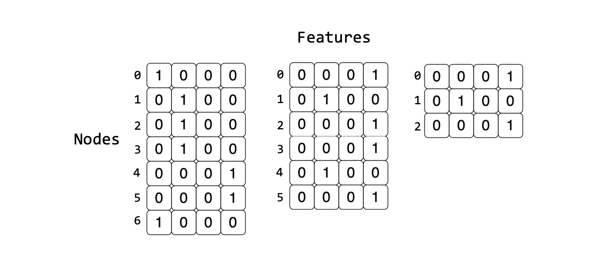
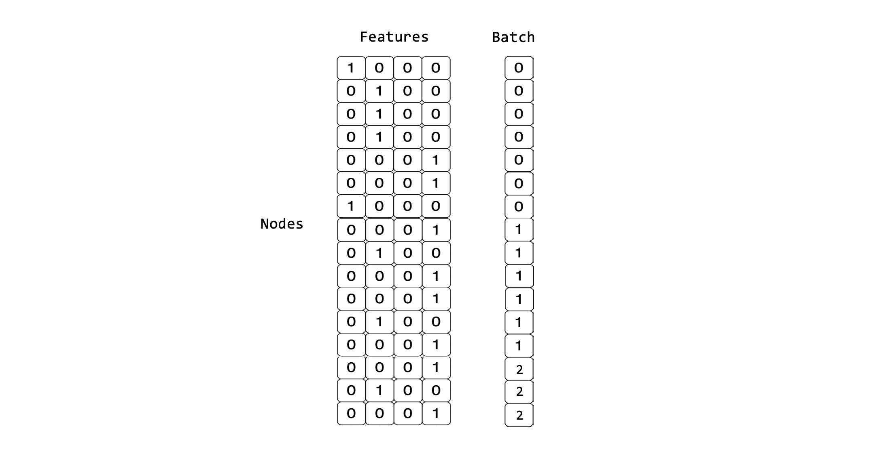
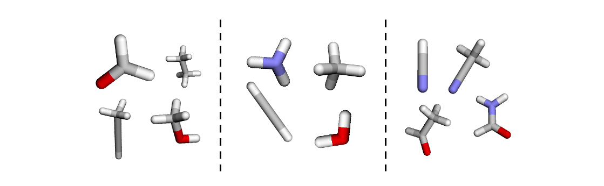
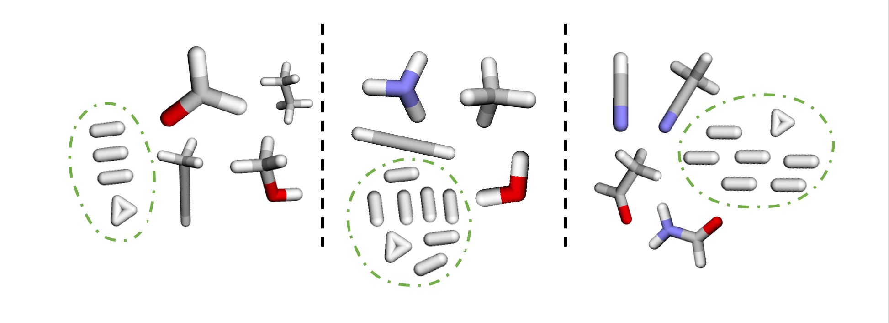
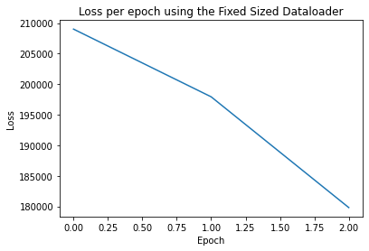

<!-- THIS FILE IS AUTOGENERATED. Rerun SST after editing source file: 3_small_graph_batching_with_padding.py -->

# Small graph batching on IPUs using padding

Batching is an essential procedure to scale the training of a deep learning model to large quantities of data. This process results in the creation of mini-batches of data, where each mini-batch is a collection of samples that can be processed in a single iteration of the training algorithm.
The number of samples grouped in a mini-batch is commonly referred to as 'batch size'.

Small graph datasets, which are common in molecular science, contain a varying number of nodes and edges per graph. Large graph datasets are often sampled or clustered which results in differently sized graphs.
IPUs can only run a statically compiled model - in other words the size of the tensors used are known at compile time. This means that the sizes of our input samples must be  constant over iterations, rather than dynamically sized as most graph datasets are.
There are different strategies to obtain fixed size inputs: in this tutorial we will focus on basic approaches suitable to datasets made up of many small graphs. More advanced techniques applicable to such datasets will be discussed in the [Small Graph Batching with Packing](../4_small_graph_batching_with_packing/4_small_graph_batching_with_packing.ipynb) tutorial.

If you are interested in a large graph use case, have a look at our [Cluster CGN example](../../../../gnn/cluster_gcn/pytorch_geometric/node_classification_with_cluster_gcn.ipynb).

In this tutorial, you will learn how to:

- batch small graphs to accelerate training for GNN models,
- obtain fixed size input compatible with IPU usage using a fixed size dataloader to batch the input graphs and then pad the resulting mini-batches,
- mask out the added padded items in some operations to ensure that the functionality using the fixed size inputs is not adversely affecting the outcome, so we correctly calculate the loss function on the relevant subgraphs,
- use PopTorch to transform and prepare our model for distributed training and inference on IPUs.

> This tutorial expects you to have familiarity with GNNs, PopTorch, the PyTorch Geometric library and to understand the IPU's requirement for fixed sized tensors. If this is not the case you may want to go through our introductory tutorials [At a glance](../1_at_a_glance/1_at_a_glance.ipynb) and [A worked example](../2_a_worked_example2_a_worked_example.ipynb).
> For additional resources on PopTorch please consult the relative [User Guide](https://docs.graphcore.ai/projects/poptorch-user-guide/en/latest/index.html) and [Examples](https://docs.graphcore.ai/en/latest/examples.html#pytorch).

## Running on Paperspace

The Paperspace environment lets you run this notebook with no set up. To improve your experience we preload datasets and pre-install packages, this can take a few minutes, if you experience errors immediately after starting a session please try restarting the kernel before contacting support. If a problem persists or you want to give us feedback on the content of this notebook, please reach out to through our community of developers using our [slack channel](https://www.graphcore.ai/join-community) or raise a [GitHub issue](https://github.com/graphcore/examples).

Requirements:

* Python packages installed with `pip install -r ../requirements.txt`

```bash
pip install -r ../requirements.txt
```

And for compatibility with the Paperspace environment variables we will do the following:

```python
import os

executable_cache_dir = (
    os.getenv("POPLAR_EXECUTABLE_CACHE_DIR", "/tmp/exe_cache/") + "/pyg-padding"
)
dataset_directory = os.getenv("DATASETS_DIR", "data")
```

Now we are ready to start!

## Introduction to small graph structures and the QM9 Dataset

A subset of GNN models focus on how to classify and predict properties related to molecules and chemical compounds.
These models have many applications within healthcare and chemistry which aim to use graph representations to solve problems within this space.
In this tutorial, we accelerate training of these models by batching in order to effectively use the IPU's processing power.

## QM9 dataset in PyTorch Geometric

The PyTorch Geometric (PyG) package comes bundled with a range of datasets, which we can easily pull and use to experiment with different GNN models. We are going to use the QM9 dataset, a small-graphs dataset which contains 130831 molecules represented as graphs, each with different structures and physical properties.
Each molecule is represented as an undirected graph, where its atoms are the nodes of the graphs and the edges connect atoms that are within a given cutoff radius to each other.
We can inspect a molecule within the dataset, represented as an instance of a [torch_geometric.data.Data](https://pytorch-geometric.readthedocs.io/en/latest/modules/data.html#torch_geometric.data.Data) object:

```python
from torch_geometric.datasets import QM9

dataset = QM9(root=dataset_directory)
print(dataset)
print(dataset[2])
```

```output
Downloading https://data.pyg.org/datasets/qm9_v3.zip
Extracting data/raw/qm9_v3.zip
Processing...
Using a pre-processed version of the dataset. Please install 'rdkit' to alternatively process the raw data.
QM9(130831)
Data(x=[3, 11], edge_index=[2, 4], edge_attr=[4, 4], y=[1, 19], pos=[3, 3], idx=[1], name='gdb_3', z=[3])
Done!
```

Each molecule contains the following properties:

* `z` contains the atomic number for each atom in the molecule. For a molecule with `n` atoms (therefore `n` nodes), the nuclear charges $Z= (Z_1, Z_2, ..., Z_n)$ are stored as a vector of integers of length `num_atoms`
* `pos`  is a tensor of real numbers of size `[num_atoms, 3]` which contains the 3D structure of the molecule
* `x` contains properties of each atom of size `[num_atoms,11]` as all the nodes in each graph have 11 node features defined. These include measurements such as heat capacity, free energy, internal energy and so on.
* `edge_index` contains information relating to how the atoms in each molecule are connected as an adjacency list with size `[2,num_edges]`
* `y` contains the 19 regression targets. The HOMO-LUMO energy gap is stored in the 4th column so can be accessed by slicing this tensor using y[:,4]. This information will be useful later on in this tutorial when we will use the QM9 dataset to train our model to predict the HOMO-LUMO energy gap.

You can see in the code below that we use the py3Dmol package to visualise the 3D structure of a group of molecules for more insights on our data.

```python
import ipywidgets
import py3Dmol
from ipywidgets import interact
from periodictable import elements


def MolTo3DView(
    mol, loader_on, size=(300, 300), style="stick", surface=False, opacity=0.5
):
    """Draw molecule in 3D

    Args:
    ----
        mol: rdMol, molecule to show
        size: tuple(int, int), canvas size
        style: str, type of drawing molecule
               style can be 'line', 'stick', 'sphere', 'carton'
        surface, bool, display SAS
        opacity, float, opacity of surface, range 0.0-1.0
    Return:
    ----
        viewer: py3Dmol.view, a class for constructing embedded 3Dmol.js views in ipython notebooks.
    """

    assert style in ("line", "stick", "sphere", "carton")
    viewer = py3Dmol.view(width=size[0], height=size[1])
    viewer.addModel(mol, "mol")
    viewer.setStyle({style: {}})
    if surface:
        viewer.addSurface(py3Dmol.SAS, {"opacity": opacity})
    viewer.zoomTo()
    return viewer
```

We need to provide the simple `xyz` format to the `py3Dmo.view` function:

```python
def molecule_converter(datum):
    num_atoms = int(datum.z.numel())
    xyz = f"{num_atoms}\n\n"
    for i in range(num_atoms):
        sym = elements[datum.z[i].item()].symbol
        r = datum.pos[i, :].tolist()
        line = [sym] + [f"{i: 0.08f}" for i in r]
        line = "\t".join(line)
        xyz += f"{line}\n"
    return xyz


def conf_viewer(idx):
    mol = smi[idx]
    return MolTo3DView(mol, loader_on=True, size=(300, 300)).show()


bs = 12
data_chunk = dataset[0:bs]
smi = [molecule_converter(i) for i in data_chunk]
interact(conf_viewer, idx=ipywidgets.IntSlider(min=0, max=bs - 1, step=1))
```

```output
interactive(children=(IntSlider(value=0, description='idx', max=11), Output()), _dom_classes=('widget-interact…
```

```output
<function __main__.conf_viewer(idx)>
```

The code above allows us to view a subset of graphs in the dataset and interact with the data. By moving the slider we can see that each of the graphs has a different number of nodes and edges, and different physical properties, as shown by the variety of colours of the atoms (nodes) of each molecule.

In the next section, we will dive deeper in how to batch together these molecules.

## Mini-batching in PyTorch Geometric


Due to the dynamic shape of graphs, batching by concatenation is inefficient since most graphs do not share the same number of nodes or edges.
Consider the following set of tensors representing a single graph. When compared to the other tensors representing the other graphs in the dataset you will find that each graph has a different number of nodes but the same number of features. This means that they can not be concatenated along the features' dimension to the mismatch of shapes.



The [PyTorch Geometric Dataloader](https://pytorch-geometric.readthedocs.io/en/latest/modules/loader.html#torch_geometric.loader.DataLoader) achieves mini-batching by stacking the adjacency matrices in a diagonal fashion, and by concatenating node and edge features in the node dimension. This creates a larger graph consisting of disconnected subgraphs. More details can be found in the [Advanced Mini-Batching](https://pytorch-geometric.readthedocs.io/en/latest/notes/batching.html) PyTorch Geometric documentation.
The dataloader will also generate a  `batch` vector which is used later during training. The `batch` vector assigns each feature in the mini-batch to its respective subgraph. This vector is represented as `Batch` in the figure below.



Using the QM9 dataset and the PyTorch Geometric Dataloader, we can inspect the first few mini-batches created by stacking samples into larger batched graphs. In this example, we will use `batch_size=4`, hence stacking 4 samples in a mini-batch.

```python
from torch_geometric.data import Data
from torch_geometric.loader import DataLoader

loader = DataLoader(dataset, batch_size=4)
it = iter(loader)
next(it), next(it), next(it)
```

```output
(DataBatch(x=[16, 11], edge_index=[2, 24], edge_attr=[24, 4], y=[4, 19], pos=[16, 3], idx=[4], name=[4], z=[16], batch=[16], ptr=[5]),
 DataBatch(x=[21, 11], edge_index=[2, 34], edge_attr=[34, 4], y=[4, 19], pos=[21, 3], idx=[4], name=[4], z=[21], batch=[21], ptr=[5]),
 DataBatch(x=[26, 11], edge_index=[2, 44], edge_attr=[44, 4], y=[4, 19], pos=[26, 3], idx=[4], name=[4], z=[26], batch=[26], ptr=[5]))
```

This visualisation shows how 4 molecules per mini-batch are now grouped together to be considered a larger graph made up of subgraphs:



As we can see through our visualisation, and through inspecting the first few mini-batches of our dataloader, each mini-batch has a different shape.

```python
for i, batch in zip(range(3), loader):
    print(f"Mini-batch {i} has an x tensor of shape: {batch.x.shape}")
```

```output
Mini-batch 0 has an x tensor of shape: torch.Size([16, 11])
Mini-batch 1 has an x tensor of shape: torch.Size([21, 11])
Mini-batch 2 has an x tensor of shape: torch.Size([26, 11])
```

The variable size of the input tensors in each mini-batch is incompatible with using IPUs because they require static compilation of the computational graph. We must therefore pad each mini-batch to create statically shaped inputs

## Using the fixed size data loader in PopTorch Geometric

To process a dataset on the IPU, each mini-batch of graphs needs to have relative tensors of the same size.
To achieve that, each mini-batch must be padded to a fixed size, hiding the dynamic shape of the underlying data from the IPU.
There are multiple ways to achieve fixed tensor sizes which trade-off implementation complexity with padding efficiency.
For this tutorial we will demonstrate the usage of the `FixedSizeDataLoader` class available in [PopTorch Geometric](https://docs.graphcore.ai/projects/poptorch-geometric-user-guide/), the IPU-specific PyTorch Geometric library.

### Batching using FixedSizeDataLoader in PopTorch Geometric

`FixedSizeDataLoader` can be used to create an IPU-optimised dataloader from non-fixed shape samples by padding the samples to create fixed size mini-batches.
This dataloader creates a fixed batch sampler with `batch_size` graphs in each mini-batch. The `num_nodes` and `num_edges` optional arguments allow you to set the total number of nodes and edges in a batch, respectively, to make the batch fixed size and therefore suitable for the IPU.
Using `Summary` we can find the maximum number of nodes and edges across the samples.

These maximum values will be used later when creating dummy nodes for padding using our dataloader.

```python
from torch_geometric.data.summary import Summary

dataset_summary = Summary.from_dataset(dataset)
print(dataset_summary)
max_number_of_nodes = int(dataset_summary.num_nodes.max)
max_number_of_edges = int(dataset_summary.num_edges.max)
print(f"Max number of nodes in the dataset is: {max_number_of_nodes}")
print(f"Max number of edges in the dataset is: {max_number_of_edges}")
```

```output
100%|██████████| 130831/130831 [00:20<00:00, 6299.71it/s]
QM9 (#graphs=130831):
+------------+----------+----------+
|            |   #nodes |   #edges |
|------------+----------+----------|
| mean       |     18   |     37.3 |
| std        |      2.9 |      6.3 |
| min        |      3   |      4   |
| quantile25 |     16   |     34   |
| median     |     18   |     38   |
| quantile75 |     20   |     42   |
| max        |     29   |     56   |
+------------+----------+----------+
Max number of nodes in the dataset is: 29
Max number of edges in the dataset is: 56
```

A naive approach to decide the `num_nodes` and `num_edges` values to pass to `FixedSizeDataLoader` is to multiply each by our chosen `batch_size`. This strategy ensures that a mini-batch made up of graphs of the largest size in the dataset can still fit when batched together.

```python
batch_size = 128
max_num_nodes_per_batch = max_number_of_nodes * batch_size
max_num_edges_per_batch = max_number_of_edges * batch_size
print(f"{max_num_nodes_per_batch = }")
print(f"{max_num_edges_per_batch = }")
```

```output
max_num_nodes_per_batch = 3712
max_num_edges_per_batch = 7168
```

We can pad our mini-batches by creating a new 'null' graph made of dummy nodes and edges that ensures each mini-batch has a fixed size for execution on the IPU.

The null graph will have `num_nodes` - $sum(N_i)$ nodes, and `num_edges` - $sum(E_i)$ edges, where $N$ is the number of nodes and $E$ is the number of edges for each subgraph $i$ in the mini-batch.

Since $sum(N_i)$ and $sum(E_i)$ will be different depending on the size of the molecules in each batch, each null graph will be the size of the remaining number of nodes and edges required to fill to the maximum values set.

We also need to make sure that `edge_index` has a fixed size, so it needs padding too. As this entity represents the graph connectivity we need to be careful to avoid connecting the dummy edges to the real subgraphs' nodes.
So we connect the dummy edges to the null graph instead, specifically adding them as a self-loop on one of its nodes.

The null graph is visualised by the nodes in the green circle which have been added to the visualisation below.



We can achieve all this by using the PopTorch Geometric `FizedSizeDataLoader` with the numbers of nodes and edges we have calculated which will make the batches produced by the data loader up to these specified sizes.

```python
from poptorch_geometric import FixedSizeDataLoader, FixedSizeOptions

ipu_dataloader = FixedSizeDataLoader(
    dataset,
    batch_size=batch_size,
    fixed_size_options=FixedSizeOptions(
        num_nodes=max_num_nodes_per_batch,
        num_edges=max_num_edges_per_batch,
        num_graphs=batch_size,
    ),
)
```

And take a look at the batch it produces:

```python
sample = next(iter(ipu_dataloader))
print(sample)
print("Shape of y:", sample.y.shape)
```

```output
DataBatch(x=[3712, 11], edge_index=[2, 7168], edge_attr=[7168, 4], y=[128, 19], pos=[3712, 3], batch=[3712], edges_mask=[7168], graphs_mask=[128], idx=[128], nodes_mask=[3712], ptr=[129], z=[3712], num_nodes=3712, num_edges=7168)
Shape of y: torch.Size([128, 19])
```

As you can see from the output of each sample, we now have `batch_size` subgraphs in each mini-batch, with sizes corresponding to our calculated maximum number of nodes and edges in a batch.

Here we have gone through the theory of what it means for batches to be padded to fixed size. We can also let PopTorch Geometric handle many of these steps for us, creating the data loader as follows:

```python
ipu_dataloader = FixedSizeDataLoader(dataset, batch_size=batch_size)
```

```output
100%|██████████| 130831/130831 [00:03<00:00, 37511.35it/s]
```

In this case, the number of nodes and edges to pad to will be gathered from the dataset automatically, in much the same way as the steps we have followed above.

Now that we have our data loader, let's see how we train a model using it.

### Training on the IPU using the Fixed Sized Dataloader in PopTorch Geometric

Our aim is to train a model on the IPU with the QM9 dataset to predict the HOMO-LUMO energy gap. To do so, we will use a classic GCN operator.

GNNs rely on a message passing scheme which aggregates connected nodes. Information is not propagated across disconnected subgraphs in each mini-batch as the operation is only executed along connected nodes.
The pooling layers perform a final aggregation of the node embeddings, which enables us to flatten the subgraphs to a single value in order to calculate the loss.
The 'batch' variable is used here to allow us to aggregate the appropriate node embeddings for each subgraph, processing each subgraph as linearly separable samples.

```python
import torch
import torch.nn.functional as F
from torch.nn import Linear
from torch_geometric.nn import GCNConv, global_mean_pool


class GcnForBatching(torch.nn.Module):
    def __init__(self, hidden_channels, batch_size):
        super(GcnForBatching, self).__init__()
        torch.manual_seed(1234)
        self.conv = GCNConv(dataset.num_features, hidden_channels, add_self_loops=False)
        self.lin = Linear(hidden_channels, dataset.num_classes)
        self.batch_size = batch_size  # includes the padding graph

    def forward(self, x, edge_index, y, batch):
        # 1. Obtain node embeddings
        x = self.conv(x, edge_index).relu()
        # 2. Pooling layer
        x = global_mean_pool(x, batch, size=self.batch_size)
        # 3. Apply a final classifier
        x = F.dropout(x, p=0.5, training=self.training)
        x = self.lin(x)

        if self.training:
            return F.mse_loss(
                x[: (self.batch_size - 1)], y[: (self.batch_size - 1)]
            )  # mask out the null graph from the loss
        return x
```

During the pooling step, we reduce the number of dimensions of each of the subgraphs down to (`batch_size`,`1`) which denotes the number of subgraphs per mini-batch (including the null graph) and the regression value per subgraph.

So when we calculate the loss in this instance, we must mask out the last sample from the mini-batch which is the null graph. This ensures that we only include the valid subgraphs when calculating the loss value which will be used to adjust the weights during backpropagation.

Now that we have put together our model using PyTorch Geometric, we can use PopTorch to enable model training on the IPU:

```python
import poptorch

model = GcnForBatching(hidden_channels=16, batch_size=batch_size)
optim = poptorch.optim.Adam(model.parameters(), lr=0.001)
poptorch_model = poptorch.trainingModel(
    model,
    optimizer=optim,
    options=poptorch.Options().enableExecutableCaching(executable_cache_dir),
)
poptorch_model
```

```output
PoptorchGcnForBatching(
  (conv): GCNConv(
2  (aggr_module): SumAggregation()
2  (lin): Linear()
2)
  (lin): Linear(in_features=16, out_features=19, bias=True)
)
```

We are now ready to run training on our model using `FixedSizeDataLoader` and the PopTorch model on the IPU.

This training function is flexible, and can be executed on both the CPU and IPU, depending on which model is selected in the training loop.

Using the PopTorch model we run on the IPU as follows:

```python
poptorch_model.train()
loss_per_epoch = []

for epoch in range(0, 3):
    total_loss = 0

    for data in ipu_dataloader:
        loss = poptorch_model(data.x, data.edge_index, data.y, data.batch)
        total_loss += loss
        optim.zero_grad()

    loss_this_epoch = total_loss / len(dataset)
    loss_per_epoch.append(loss_this_epoch)
    print("Epoch:", epoch, " Training Loss: ", loss_this_epoch)
```

```output
Graph compilation: 100%|██████████| 100/100 [00:19<00:00]
Epoch: 0  Training Loss:  tensor(209017.7812)
Epoch: 1  Training Loss:  tensor(197935.0938)
Epoch: 2  Training Loss:  tensor(179802.0625)
```

To understand how the training of our model is progressing per epoch, we can create a loss plot:

```python
import matplotlib.pyplot as plt

plt.figure()
plt.plot(loss_per_epoch)
plt.title("Loss per epoch using the Fixed Sized Dataloader")
plt.xlabel("Epoch")
plt.ylabel("Loss")
```

```output
Text(0, 0.5, 'Loss')
```



This section has described how to use the `FixedSizeDataLoder` to batch and train GNNs on the IPU.

One limitation of this method is that it requires a large batch size to be efficient: for the smaller batch sizes the amount of padding will need to increase.

Another limitation is that the mini-batches are not checked for consistency with the tensor size limits: if the graphs drawn out of the dataset to form the batch are too large for the fixed tensor limits, the dataloader will raise an error and stop during training.

These limitations can be overcome by using more advanced batching techniques such as packing. To learn more about how to pack graphs on the IPU see our [Small Graph Batching with Packing tutorial](../4_small_graph_batching_with_packing/4_small_graph_batching_with_packing.ipynb).

## Conclusion

In this tutorial, we learnt about the fixed sized batching technique which enables us to quickly get started on training GNNs on the IPU. This was done in the context of the QM9 molecular dataset.

You should now have a good understanding of:
 - how to batch graphs and prepare them for training on the IPU using `FixedSizeDataloader`,
 - how mini-batches are processed and aggregated within GNN models,
 - how to handle our padded graphs through masking when we calculate our final loss value, to ensure that the padded graphs are not affecting training.

For the next steps take a look at our GNN examples which dive into more specific applications using state of the art models: for instance, take a look at our [Schnet Notebook](../../../../gnn/schnet/pytorch_geometric/molecular_property_prediction_with_schnet.ipynb).

You can also have a look at more advanced batching techniques specific to the IPU to minimise padding in your mini-batches in our [Small Graph Batching with Packing tutorial](../4_small_graph_batching_with_packing/4_small_graph_batching_with_packing.ipynb).

Generated:2023-05-23T13:34 Source:3_small_graph_batching_with_padding.py SDK:3.3.0-EA.2+1361 SST:0.0.10
