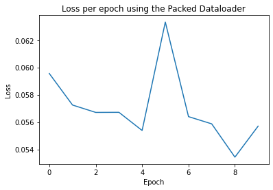

# Small graph batching on IPUs using packing

Batching small graphs is a crucial step to enable scaling GNNs to use large quantities of data and improve model performance.
Small graphs have a different structure to other data types so we have to take an alternative approach to batching them.

Typically, when forming a batch from images or text, the samples are usually concatenated along a new batch axis. However, when using PyTorch Geometric for small graphs, a new axis isn't created but instead graphs are stacked side by side. This produces a dynamic shape per batch which needs to be accounted for when using IPUs. It is possible to pad a batch of these graphs to a maximum size, as seen in the [Small Graph Batching with Padding tutorial](../3_small_graph_batching_with_padding/3_small_graph_batching_with_padding.ipynb), however this approach can result in a lot of wasted compute on the padded parts of the batch. There are other ways to improve this inefficiency which we will consider in this tutorial.

In this tutorial, you will learn how to:

- use a packing method to achieve data of fixed size in preparation for execution on the IPU,
- use masking in a model, which will enable you to correctly calculate the loss function on the relevant subgraphs,
- use PopTorch to transform and prepare a model for distributed training and inference on the IPU.

> This tutorial expects you to have familiarity with GNNs, PopTorch, the PyTorch Geometric library and to understand the IPU's requirement for fixed sized tensors. If this is not the case you may want to go through our introductory tutorials [At a glance](../1_at_a_glance/1_at_a_glance.ipynb) and [A worked example](../2_a_worked_example/2_a_worked_example.ipynb), as well as the first tutorial on [Small Graph Batching with Padding](../3_small_graph_batching_with_padding/3_small_graph_batching_with_padding.ipynb).
> For additional resources on PopTorch please consult the relative [User Guide](https://docs.graphcore.ai/projects/poptorch-user-guide/en/latest/index.html) and [Examples](https://docs.graphcore.ai/en/latest/examples.html#pytorch).

This tutorial will cover techniques applicable to small graphs. For methods suitable for large graphs, please see our example [Cluster-GCN](../../../../gnn/cluster_gcn/pytorch_geometric/node_classification_with_cluster_gcn.ipynb).

## Running on Paperspace

The Paperspace environment lets you run this notebook with no set up. To improve your experience we preload datasets and pre-install packages, this can take a few minutes, if you experience errors immediately after starting a session please try restarting the kernel before contacting support. If a problem persists or you want to give us feedback on the content of this notebook, please reach out to through our community of developers using our [slack channel](https://www.graphcore.ai/join-community) or raise a [GitHub issue](https://github.com/graphcore/examples).

Requirements:

* Python packages installed with `pip install -r ../requirements.txt`

```bash
pip install -r ../requirements.txt
```

And for compatibility with the Paperspace environment variables we will do the following:

```python
import os

executable_cache_dir = (
    os.getenv("POPLAR_EXECUTABLE_CACHE_DIR", "/tmp/exe_cache/") + "/pyg-packing"
)
dataset_directory = os.getenv("DATASET_DIR", "data")
```

Now we are ready to start!

## Introduction to small graph structures and the MUTAG dataset

A subset of GNN models focus on how to classify and predict properties related to molecules and chemical compounds.
These models have many applications within healthcare and chemistry which aim to use graph representations to solve problems within this space.
In this tutorial we use batching to generate efficient fixed size batches to accelerate model training on IPUs.

### Loading the MUTAG dataset in PyTorch Geometric

For this tutorial we will attempt a graph classification task. The PyTorch Geometric package comes bundled with a range of datasets, which we can easily pull and use to experiment with different GNN models. We will use the MUTAG dataset, a small dataset of graphs, each item representing a molecule. The task is to predict whether a molecule inhibits HIV virus replication.

We can inspect a molecule within the dataset, represented as an instance of a [torch_geometric.data.Data](https://pytorch-geometric.readthedocs.io/en/latest/modules/data.html#torch_geometric.data.Data) object:

```python
from torch_geometric.datasets import TUDataset

dataset = TUDataset(root=f"{dataset_directory}/TUDataset", name="MUTAG")

print(f"{len(dataset) = }")
print(f"{dataset.num_features = }")
print(f"{dataset.num_edge_features = }")
print(f"{dataset.num_classes = }")
```

```output
len(dataset) = 188
dataset.num_features = 7
dataset.num_edge_features = 4
dataset.num_classes = 2
```

The dataset consists of 188 molecules. In this tutorial we want to classify whether each molecule inhibits HIV virus replication or not, hence we have 2 classes. Each node and edge has 7 and 4 features respectively.

One key thing to notice is that each item in the dataset has a different number of nodes and edges. Lets take a look:

```python
first_molecule = dataset[0]

print(f"{first_molecule.num_nodes = }")
print(f"{first_molecule.num_edges = }")
print(f"{first_molecule.y = }")

second_molecule = dataset[1]

print(f"{second_molecule.num_nodes = }")
print(f"{second_molecule.num_edges = }")
print(f"{second_molecule.y = }")
```

```output
first_molecule.num_nodes = 17
first_molecule.num_edges = 38
first_molecule.y = tensor([1])
second_molecule.num_nodes = 13
second_molecule.num_edges = 28
second_molecule.y = tensor([0])
```

You can see that the first molecule contains a different number of nodes and edges to the second. As we begin to stack the molecules side by side, the resulting batch will have a different length in terms of nodes and edges for each batch. In order to run our model on IPUs we must make these fixed size. In the next section we explore an efficient

Before we start batching these items let's split the dataset into two - a training dataset and a test dataset. We use these two datasets in the rest of the tutorial.

```python
import torch

torch.manual_seed(12345)
dataset = dataset.shuffle()

train_dataset = dataset[:150]
test_dataset = dataset[150:]
```

## Batching small graphs using packing

In the [Small Graph Batching with Padding tutorial](../3_small_graph_batching_with_padding/3_small_graph_batching_with_padding.ipynb), a method to achieve fixed size mini-batches of small graphs is proposed. A limitation of this approach is that there may be a lot of compute wasted on nodes and edges used for padding.

An alternative and more efficient method is to use packing. This works simply by continuing to add graphs to each mini-batch without exceeding the limits of the mini-batch set by the user: the maximum number of nodes, edges, or graphs in a mini-batch. Once one of these limits is reached then we can add null graphs which can be used to pad at the end of the mini-batch to achieve a fixed size. By doing this we are lowering the ratio of padded to packed values. This means that the more valid subgraphs will be executed on at runtime, which improves efficiency.

Lets consider this approach in more detail.

### How to pack and pad a mini-batch of graphs

Lets consider an example, where we have these limits:
- Maximum number of graphs allowed in the mini-batch, `max_num_graphs`= 3,
- Maximum number of nodes allowed in the mini-batch, `max_num_nodes`= 6,
- Maximum number of edges allowed in the mini-batch, `max_num_edges`= 6,


Stacking together all of the subgraphs, leads us to having 4 subgraphs in total, which exceeds the `graphs_per_batch` limit.
If we batch together subgraphs 0, 1 and 2, this leads us to having 3 graphs, 7 nodes and 6 edges, as such:


The result of this is that we have exceeded the number of nodes which we set earlier, thus we must remove another subgraph.
In this instance we will remove subgraph 2, leaving us with 2 graphs, 5 nodes and 5 edges.


To ensure we fix the shapes of the tensors to the limits described above, we must add a "null graph" with at least 1 node and 1 edge to pad the batch up to the limits without exceeding them. To ensure that this `null graph` doesn't interfere with the other real graphs we attach the padded edges to the padded nodes only (in practice we typically add these padded edges to the final padded node, resulting in many self-loops on the final padded node):


By doing this we have met the conditions which we previously aimed to meet, as this batch now contains 3 graphs, 6 nodes and 6 edges.

For a larger dataset, it would be more effective to set higher limits to enable us to process higher volumes of data at each iteration.

Now lets do the above steps in code.

### Packing using the fixed size data loader in PopTorch Geometric

To process a dataset ready for IPUs, each mini-batch of graphs needs to have relative tensors of the same size.
To achieve that, we will use the approach described above in an attempt to reduce the amount of padding in our batches of data.
For this tutorial we will demonstrate how to use the `FixedSizeDataLoader` class available in [PopTorch Geometric](https://docs.graphcore.ai/projects/poptorch-geometric-user-guide/), the IPU-specific PyTorch Geometric library, which will help us achieve the steps above in very few lines of code.

First we must decide on the values for maximum number of graphs, nodes and edges in a batch. We can use the dataset summary functionality to help us choose:

```python
from torch_geometric.data.summary import Summary

dataset_summary = Summary.from_dataset(dataset)
dataset_summary
```

```output
TUDataset (#graphs=188):
+------------+----------+----------+
|            |   #nodes |   #edges |
|------------+----------+----------|
| mean       |     17.9 |     39.6 |
| std        |      4.6 |     11.4 |
| min        |     10   |     20   |
| quantile25 |     14   |     28   |
| median     |     17   |     38   |
| quantile75 |     22   |     50   |
| max        |     28   |     66   |
+------------+----------+----------+
```

We will set the maximum number of graphs in a batch to 10 and pick some values for the maximum number of nodes and edges in the batch.

We must ensure that for this approach to work, the specified maximum number of graphs, nodes, and edges is greater than the largest of each of those in our dataset. Lets pick some values:

```python
max_num_graphs_per_batch = 10
max_num_nodes_per_batch = 400
max_num_edges_per_batch = 800

print("Maximum number of graphs per mini-batch:", max_num_graphs_per_batch)
print("Maximum number of nodes per mini-batch:", max_num_nodes_per_batch)
print("Maximum number of edges per mini-batch:", max_num_edges_per_batch)
```

```output
Maximum number of graphs per mini-batch: 10
Maximum number of nodes per mini-batch: 400
Maximum number of edges per mini-batch: 800
```

We can now create a dataloader with these:

```python
from poptorch_geometric.dataloader import FixedSizeDataLoader

train_dataloader = FixedSizeDataLoader(
    train_dataset,
    batch_size=max_num_graphs_per_batch,
    num_nodes=max_num_nodes_per_batch,
    num_edges=max_num_edges_per_batch,
    collater_args=dict(add_masks_to_batch=True),
)
```

```output
[10:16:33.684] [poptorch::python] [warning] The `batch_sampler` __len__ method is not implemented and drop_last=False. The last tensor may be incomplete - batch size < 1. To avoid having to handle this special case switch to drop_last=True.
```

Now we have a dataloader ready to go that can pack our dataset and produce mini-batches of fixed size. Let's inspect the first two mini-batches produced:

```python
train_dataloader_iter = iter(train_dataloader)

first_sample = next(train_dataloader_iter)
second_sample = next(train_dataloader_iter)

print(f"{first_sample = }")
print(f"{second_sample = }")
```

```output
first_sample = DataBatch(x=[400, 7], edge_index=[2, 800], edge_attr=[800, 4], y=[10], batch=[400], edges_mask=[800], graphs_mask=[10], nodes_mask=[400], ptr=[11], num_nodes=400, num_edges=800)
second_sample = DataBatch(x=[400, 7], edge_index=[2, 800], edge_attr=[800, 4], y=[10], batch=[400], edges_mask=[800], graphs_mask=[10], nodes_mask=[400], ptr=[11], num_nodes=400, num_edges=800)
```

You can see that each item in the mini-batch is the same size between each mini-batch. But what does the data in the mini-batches now look like?

You may have noticed that when we created the dataloader above we set `add_masks_to_batch` to True. This ensures that mask tensors are produced and added to the batch during the packing. The `graphs_mask` variable represents which samples in each batch corresponds to real subgraphs if `True` and null subgraphs if `False`. Due to the packing method, there could be a variable number of null subgraphs per batch if we exceed the limits of the number of nodes, edges or graphs early, but one null graph will always be necessary to pad out the batch to the limit which we set. As such, the final graph in each mini-batch will always be a `null graph`.

We can access the graph masks of one of the samples and see this:

```python
print(first_sample.graphs_mask)
print(second_sample.graphs_mask)
```

```output
tensor([ True,  True,  True,  True,  True,  True,  True,  True,  True, False])
tensor([ True,  True,  True,  True,  True,  True,  True,  True,  True, False])
```

Similarly to the `graphs_mask`, the `nodes_mask` variable will tell us which nodes in our mini-batch are real and which are padded nodes.

```python
first_sample.nodes_mask
```

```output
tensor([ True,  True,  True,  True,  True,  True,  True,  True,  True,  True,
         True,  True,  True,  True,  True,  True,  True,  True,  True,  True,
         True,  True,  True,  True,  True,  True,  True,  True,  True,  True,
         True,  True,  True,  True,  True,  True,  True,  True,  True,  True,
         True,  True,  True,  True,  True,  True,  True,  True,  True,  True,
         True,  True,  True,  True,  True,  True,  True,  True,  True,  True,
         True,  True,  True,  True,  True,  True,  True,  True,  True,  True,
         True,  True,  True,  True,  True,  True,  True,  True,  True,  True,
         True,  True,  True,  True,  True,  True,  True,  True,  True,  True,
         True,  True,  True,  True,  True,  True,  True,  True,  True,  True,
         True,  True,  True,  True,  True,  True,  True,  True,  True,  True,
         True,  True,  True,  True,  True,  True,  True,  True,  True,  True,
         True,  True,  True,  True,  True,  True,  True,  True,  True,  True,
         True,  True,  True,  True,  True,  True,  True,  True,  True,  True,
         True,  True,  True,  True,  True,  True,  True,  True,  True,  True,
         True,  True,  True,  True,  True,  True,  True,  True,  True,  True,
         True,  True,  True,  True,  True,  True,  True,  True,  True,  True,
         True,  True,  True,  True,  True,  True,  True,  True,  True,  True,
         True,  True,  True,  True,  True,  True,  True,  True,  True,  True,
         True,  True,  True,  True,  True,  True,  True,  True, False, False,
        False, False, False, False, False, False, False, False, False, False,
        False, False, False, False, False, False, False, False, False, False,
        False, False, False, False, False, False, False, False, False, False,
        False, False, False, False, False, False, False, False, False, False,
        False, False, False, False, False, False, False, False, False, False,
        False, False, False, False, False, False, False, False, False, False,
        False, False, False, False, False, False, False, False, False, False,
        False, False, False, False, False, False, False, False, False, False,
        False, False, False, False, False, False, False, False, False, False,
        False, False, False, False, False, False, False, False, False, False,
        False, False, False, False, False, False, False, False, False, False,
        False, False, False, False, False, False, False, False, False, False,
        False, False, False, False, False, False, False, False, False, False,
        False, False, False, False, False, False, False, False, False, False,
        False, False, False, False, False, False, False, False, False, False,
        False, False, False, False, False, False, False, False, False, False,
        False, False, False, False, False, False, False, False, False, False,
        False, False, False, False, False, False, False, False, False, False,
        False, False, False, False, False, False, False, False, False, False,
        False, False, False, False, False, False, False, False, False, False])
```

We can see that many of the values here are False meaning those nodes in our mini-batch are padded null nodes. Any compute done on the mini-batch will be done on both the real and padded nodes and so we are wasting a lot of compute on padded nodes. In the next section we will attempt to reduce the number of padded null nodes that exist in our mini-batch and thus make our packing more efficient.

### Understanding packing efficiency

The aim of packing our samples is to achieve batches with less padded nodes and edges, but how well are we packing, what proportion of our mini-batches are still padded nodes and edges?

If we look at the first packed sample and, using `nodes_mask`, count the number of real nodes there are, we can get some idea of how much of our mini-batch is just padding.

```python
number_of_real_nodes_in_batch = int(first_sample.nodes_mask.sum())
print(f"{number_of_real_nodes_in_batch = }")
print(f"{max_num_nodes_per_batch = }")
```

```output
number_of_real_nodes_in_batch = 198
max_num_nodes_per_batch = 400
```

We can calculate the proportion of our nodes that are real nodes and not padded null nodes:

```python
number_of_real_nodes_in_batch / max_num_nodes_per_batch
```

```output
0.495
```

Now if we do the same operation on all the batches produced by our packed dataloader we can get an idea how much padding we have across the entire dataloader. We will call this packing efficiency.

```python
def get_node_packing_efficiency(train_dataloader, total_number_of_nodes_in_batch):
    packing_efficiency_per_pack = []

    for data in train_dataloader:
        number_of_real_nodes_in_batch = int(sum(data.nodes_mask))
        total_number_of_nodes_in_batch = len(data.nodes_mask)
        packing_efficiency_per_pack.append(
            number_of_real_nodes_in_batch / total_number_of_nodes_in_batch
        )

    return sum(packing_efficiency_per_pack) / len(packing_efficiency_per_pack)


packing_efficiency = get_node_packing_efficiency(
    train_dataloader, max_num_nodes_per_batch
)
print(f"{packing_efficiency = :.2%}")
```

```output
packing_efficiency = 39.91%
```

We can see that the packing efficiency for the nodes is quite low, in fact less than 50%. This means that any operations carried out on this mini-batch will include wasted compute on the null nodes. Let's see if we can improve the packing efficiency - instead of simply setting the maximum number of nodes and edges in a batch, let's base their values on the average number of nodes and edges within the total dataset.

```python
max_num_graphs_per_batch = 10

max_num_nodes_per_batch = int(dataset_summary.num_nodes.mean * max_num_graphs_per_batch)
max_num_edges_per_batch = int(dataset_summary.num_edges.mean * max_num_graphs_per_batch)

print("Maximum number of graphs per batch:", max_num_graphs_per_batch)
print("Maximum number of nodes per batch:", max_num_nodes_per_batch)
print("Maximum number of edges per batch:", max_num_edges_per_batch)
```

```output
Maximum number of graphs per batch: 10
Maximum number of nodes per batch: 179
Maximum number of edges per batch: 395
```

Now we have some new values, lets recreate a new dataloader and calculate the packing efficiency as before.

```python
train_dataloader = FixedSizeDataLoader(
    train_dataset,
    batch_size=max_num_graphs_per_batch,
    num_nodes=max_num_nodes_per_batch,
    num_edges=max_num_edges_per_batch,
    collater_args=dict(add_masks_to_batch=True),
)

packing_efficiency = get_node_packing_efficiency(
    train_dataloader, max_num_nodes_per_batch
)
print(f"{packing_efficiency = :.2%}")
```

```output
[10:16:33.802] [poptorch::python] [warning] The `batch_sampler` __len__ method is not implemented and drop_last=False. The last tensor may be incomplete - batch size < 1. To avoid having to handle this special case switch to drop_last=True.
packing_efficiency = 89.19%
```

This has improved the packing efficiency significantly. So now when we use this packed dataloader we will have much less wasted space, making our compute much more efficient.

But what do our packs now look like?

To understand the results of the packing method further, lets take a look at all of the batches and use the `graphs_mask` item to print the number of real graphs in each batch:

```python
for i, batch in enumerate(train_dataloader):
    num_of_real_graphs_in_batch = int(batch.graphs_mask.sum())
    print(f"Mini-batch {i}, number of real graphs {num_of_real_graphs_in_batch}")
```

```output
Mini-batch 0, number of real graphs 8
Mini-batch 1, number of real graphs 9
Mini-batch 2, number of real graphs 9
Mini-batch 3, number of real graphs 9
Mini-batch 4, number of real graphs 9
Mini-batch 5, number of real graphs 9
Mini-batch 6, number of real graphs 8
Mini-batch 7, number of real graphs 9
Mini-batch 8, number of real graphs 8
Mini-batch 9, number of real graphs 9
Mini-batch 10, number of real graphs 9
Mini-batch 11, number of real graphs 9
Mini-batch 12, number of real graphs 9
Mini-batch 13, number of real graphs 9
Mini-batch 14, number of real graphs 9
Mini-batch 15, number of real graphs 9
Mini-batch 16, number of real graphs 9
```

You can see that the number of real graphs varies between each mini-batch. This is a result of the packing method. We must bear this in mind when we construct our model, ensuring that this effect of having a none constant number of real graphs in each mini-batch doesn't effect training and inference. In the next section we will see how to do that.

### Training using a packed data loader

As mentioned earlier, the MUTAG dataset is a small dataset of graphs, each representing a molecule. The task is to predict whether a molecule inhibits HIV virus replication. We will construct a simple model that is suitable for this task.

The main operation for GNNs is message passing which aggregates connected nodes, information is not propagated across disconnected subgraphs in each mini-batch as the operation is only executed along connected edges. The pooling layers perform a final aggregation of the node embeddings, which enable us to flatten the subgraphs to a single value in order to calculate the loss. The 'batch' variable is used here which allows us to aggregate the appropriate embeddings for each subgraph, processing each subgraph as linearly separable samples.

```python
import torch
import torch.nn.functional as F
from torch.nn import Linear
from torch_geometric.nn import GCNConv, global_mean_pool


class GcnForPacking(torch.nn.Module):
    def __init__(self, hidden_channels, dataset, batch_size):
        super(GcnForPacking, self).__init__()
        self.conv = GCNConv(
            dataset.num_node_features, hidden_channels, add_self_loops=False
        )
        self.lin = Linear(hidden_channels, dataset.num_classes)
        self.batch_size = batch_size

    def forward(self, x, edge_index, batch, graphs_mask, y):
        # 1. Obtain node embeddings
        x = self.conv(x, edge_index).relu()
        # 2. Pooling layer
        x = global_mean_pool(x, batch, size=self.batch_size)
        # 3. Apply a final classifier
        x = F.dropout(x, p=0.5, training=self.training)
        x = self.lin(x)

        y = torch.where(graphs_mask, y, -100)

        if self.training:
            return F.cross_entropy(x, y, reduction="sum") / sum(graphs_mask)
        return x
```

We saw before that the mini-batches produced by the packed dataloader could have inconsistent batch sizes, as well as having at least one null graph used for padding.
To ensure that the null graph doesn't have any effect on the loss, we use the `graphs_mask` tensor to change the labels to `-100` in the places where the null graphs exist. This will be ignored by default in the following loss function.
The `F.cross_entropy` function is designed to calculate the mean of all of the inputs, however in this case the actual number of input samples is different each batch.
This means that we must set reduction='sum', and divide the output of the loss function by `sum(graphs_mask)`. This will calculate the mean loss of true samples for each given batch.

For this model, the loss function is the only place we must take special care but this can differ depending on the operations and layers used. The mask tensors added to the mini-batches by the dataloader can help mask operations and layers that require special attention.

Once we have accounted for these changes in the model, we can initialise the GCN packing model and convert it to a PopTorch model.

```python
import poptorch

# Initialise model and convert the model to a poptorch model
opts = poptorch.Options().enableExecutableCaching(executable_cache_dir)
model = GcnForPacking(
    hidden_channels=64, dataset=dataset, batch_size=max_num_graphs_per_batch
)
optim = poptorch.optim.Adam(model.parameters(), lr=0.01)
poptorch_model = poptorch.trainingModel(model, options=opts, optimizer=optim)
poptorch_model
```

```output
PoptorchGcnForPacking(
  (conv): GCNConv(
2  (aggr_module): SumAggregation()
2  (lin): Linear()
2)
  (lin): Linear(in_features=64, out_features=2, bias=True)
)
```

We are now ready to run training on our model using the packed data loader and PopTorch model.

We will set up and run a training loop:

```python
poptorch_model.train()
loss_per_epoch = []

for epoch in range(0, 10):
    total_loss = 0

    for data in train_dataloader:
        loss = poptorch_model(
            data.x, data.edge_index, data.batch, data.graphs_mask, data.y
        )  # Forward pass.
        total_loss += loss
        optim.zero_grad()  # Clear gradients.

    loss_this_epoch = total_loss / len(dataset)
    loss_per_epoch.append(loss_this_epoch)
    print("Epoch:", epoch, " Training Loss: ", loss_this_epoch)
```

```output
Graph compilation: 100%|██████████| 100/100 [00:13<00:00]
Epoch: 0  Training Loss:  tensor(0.0596)
Epoch: 1  Training Loss:  tensor(0.0572)
Epoch: 2  Training Loss:  tensor(0.0567)
Epoch: 3  Training Loss:  tensor(0.0567)
Epoch: 4  Training Loss:  tensor(0.0554)
Epoch: 5  Training Loss:  tensor(0.0633)
Epoch: 6  Training Loss:  tensor(0.0564)
Epoch: 7  Training Loss:  tensor(0.0559)
Epoch: 8  Training Loss:  tensor(0.0534)
Epoch: 9  Training Loss:  tensor(0.0557)
```

To understand how the training of our model is progressing per epoch, we can create a loss plot:

```python
import matplotlib.pyplot as plt

plt.figure()
plt.plot(loss_per_epoch)
plt.title("Loss per epoch using the Packed Dataloader")
plt.xlabel("Epoch")
plt.ylabel("Loss")
```

```output
Text(0, 0.5, 'Loss')
```



Now we can run inference, following many of the same steps as above. Note that we use the mask to not include any of the null graphs in the calculation of the number of correctly guessed samples.

```python
test_dataloader = FixedSizeDataLoader(
    test_dataset,
    batch_size=max_num_graphs_per_batch,
    num_nodes=max_num_nodes_per_batch,
    num_edges=max_num_edges_per_batch,
    collater_args=dict(add_masks_to_batch=True),
)

inf_model = poptorch.inferenceModel(
    model, options=poptorch.Options().enableExecutableCaching(executable_cache_dir)
)
inf_model.eval()

correct = 0

for data in test_dataloader:
    out = inf_model(
        data.x, data.edge_index, data.batch, data.graphs_mask, data.y
    )  # Forward pass.
    pred = out.argmax(dim=1)
    correct += int(((pred == data.y) * data.graphs_mask).sum())

accuracy = correct / len(train_dataset)
print(f"{accuracy = }")
```

```output
[10:16:50.080] [poptorch::python] [warning] The `batch_sampler` __len__ method is not implemented and drop_last=False. The last tensor may be incomplete - batch size < 1. To avoid having to handle this special case switch to drop_last=True.
/nethome/adams/venvs/3.2.0+1262/3.2.0+1262_poptorch/lib/python3.8/site-packages/torch/nn/modules/module.py:1432: UserWarning: Positional args are being deprecated, use kwargs instead. Refer to https://pytorch.org/docs/master/generated/torch.nn.Module.html#torch.nn.Module.state_dict for details.
  warnings.warn(
Graph compilation: 100%|██████████| 100/100 [00:06<00:00]
accuracy = 0.18666666666666668
```

This section has described how to use the `FixedSizeDataloader` class to batch and train GNNs on the IPU, using graph packing to reduce the amount of wasted space in our mini-batches. We have seen how we have to treat a model when using a data loader with packed mini-batches that can contain a differing number of real graphs per mini-batch.

## Conclusion

In this tutorial we have learnt about using a packing method to achieve fixed size inputs. This enabled us to train a GNN on IPUs, using the MUTAG dataset.

You should now have a good understanding of:
 - how graphs are packed together into a batch,
 - how to produce packed batches from a dataset ready for training on IPUs using the `FixedSizeDataloader class,
 - what you need to take into account when using packed batches with a GNN model so as not to affect training.

For next steps, you can check out some of our GNN examples which dive into more specific applications, for instance, take a look at our [GIN Notebook](../../../../gnn/message_passing/pytorch_geometric/) which uses packing as described here in an end-to-end example.
Additional resources which may help you understand batching for GNNs can be found in the PyTorch Geometric documentation through the section on [mini-batching techniques](https://pytorch-geometric.readthedocs.io/en/latest/notes/introduction.html#mini-batches) and through their [tutorial on batching](https://colab.research.google.com/drive/1I8a0DfQ3fI7Njc62__mVXUlcAleUclnb?usp=sharing#scrollTo=qeORu4Zrs8Zy).
