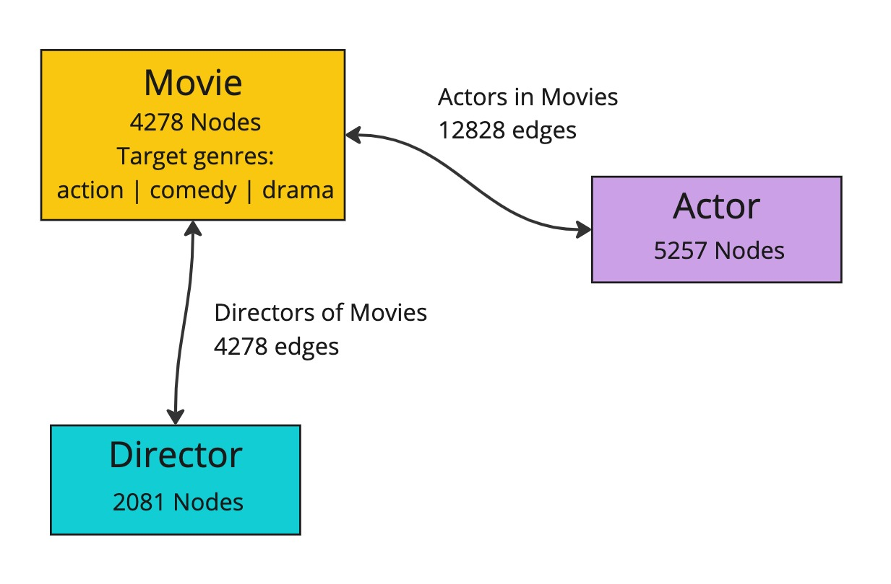

# Heterogeneous Graph Learning on IPUs

Many real-world graphs are heterogeneous, meaning single node types and edge types are insufficient to capture all the information in the graph, leading to graphs which have different node types and different edge types between those nodes. This comes with a few considerations, for example how do we construct a model suitable for training with heterogeneous graph data and how do we create mini-batches from this data. We will answer both of those questions, focussing on using Graphcore IPUs to enable accelerating heterogeneous graph learning workloads.

In this tutorial you will:

- Look at three approaches PyTorch Geometric (PyG) takes with heterogeneous graph learning and learn how to run each on the IPU.
- Understand how to sample heterogeneous graphs with a fixed size suitable for the IPU.

While this tutorial will cover enough of the basics of GNNs, PyTorch Geometric and PopTorch
for you to start developing and porting your GNN applications to the IPU;
the following resources can be used to complement your understanding:

- [ Tutorial introducing PopTorch that runs a simple model](https://github.com/graphcore/tutorials/tree/master/tutorials/pytorch/basics);
- [A Gentle Introduction to Graph Neural Networks](https://distill.pub/2021/gnn-intro/)
- [PyG Heterogeneous Graph Learning documentation](https://pytorch-geometric.readthedocs.io/en/latest/tutorial/heterogeneous.html)

## Running on Paperspace

The Paperspace environment lets you run this notebook with no set up. To improve your experience we preload datasets and pre-install packages, this can take a few minutes, if you experience errors immediately after starting a session please try restarting the kernel before contacting support. If a problem persists or you want to give us feedback on the content of this notebook, please reach out to through our community of developers using [Slack](https://www.graphcore.ai/join-community) or raise a [GitHub issue](https://github.com/graphcore/examples).

Requirements:

* Python packages installed with `pip install -r ../requirements.txt`

```shell
pip install -r ../requirements.txt
```

For compatibility with the Paperspace environment variables we need the following:

```python
import os

executable_cache_dir = (
    os.getenv("POPLAR_EXECUTABLE_CACHE_DIR", "/tmp/exe_cache/") + "/pyg-heterogeneous"
)
dataset_directory = os.getenv("DATASETS_DIR", "data")
```

Now we are ready to start!

## Introduction to heterogeneous graphs

Heterogeneous graphs are graphs with different types of nodes and edges. Such graphs are appropriate when having a single node or edge feature for the whole graph doesn't capture all the information of the graph, for example because different nodes have a different number of features. Let's first load a heterogeneous graph dataset from PyTorch Geometric and then you will see how the construction of the model differs when dealing with heterogeneous graph data.

### Loading a heterogeneous graph dataset

In this tutorial we will use the [IMDB dataset](https://pytorch-geometric.readthedocs.io/en/latest/generated/torch_geometric.datasets.IMDB.html) from PyG:

```python
from torch_geometric.datasets import IMDB

dataset = IMDB(root=f"{dataset_directory}/IMDB")
```

This dataset is a single large heterogeneous graph, made up of three node types, **movie**, **director** and **actor**, each with their own sets of features (`x`). These nodes are connected by two edge types, **movie to director** and **movie to actor**, with the reverse of these edges also present.



Let's look at it in PyG:

```python
data = dataset[0]
data
```

```output
HeteroData(
  movie={
    x=[4278, 3066],
    y=[4278],
    train_mask=[4278],
    val_mask=[4278],
    test_mask=[4278],
  },
  director={ x=[2081, 3066] },
  actor={ x=[5257, 3066] },
  (movie, to, director)={ edge_index=[2, 4278] },
  (movie, to, actor)={ edge_index=[2, 12828] },
  (director, to, movie)={ edge_index=[2, 4278] },
  (actor, to, movie)={ edge_index=[2, 12828] }
)
```

The **movie** node type is the target for any training we will do. Looking at the labels, you can see they are one of three classes corresponding to the genre of the movie: action, comedy or drama.

```python
import torch

classes = torch.unique(data["movie"].y)
num_classes = len(classes)
classes, num_classes
```

```output
(tensor([0, 1, 2]), 3)
```

For the purposes of this tutorial, we will select only a fraction of this dataset. We will cover proper sampling approaches in the [Fixed size heterogeneous data loading](#fixed-size-heterogeneous-data-loading) section.

```python
from torch_geometric.transforms import RemoveIsolatedNodes

data = data.subgraph({"movie": torch.arange(0, 1000)})
data = RemoveIsolatedNodes()(data)
data
```

```output
HeteroData(
  movie={
    x=[1000, 3066],
    y=[1000],
    train_mask=[1000],
    val_mask=[1000],
    test_mask=[1000],
  },
  director={ x=[482, 3066] },
  actor={ x=[1469, 3066] },
  (movie, to, director)={ edge_index=[2, 1000] },
  (movie, to, actor)={ edge_index=[2, 2998] },
  (director, to, movie)={ edge_index=[2, 1000] },
  (actor, to, movie)={ edge_index=[2, 2998] }
)
```

Now that you have some understanding of what a heterogeneous graph looks like in PyG, you are ready to look at how to would construct a model to be able to learn from a heterogeneous graph.

## Creating heterogeneous GNNs

PyTorch Geometric provides three ways to create a model for heterogeneous graph data:

- [Automatically converting a GNN model](#automatically-converting-a-gnn-model)
- [Using the heterogeneous convolution wrapper](#using-the-heterogeneous-convolution-wrapper)
- [Using heterogeneous operators](#using-heterogeneous-operators)

For more detail on the approaches themselves we recommend reading the [PyG documentation](https://pytorch-geometric.readthedocs.io/en/latest/tutorial/heterogeneous.html#creating-heterogeneous-gnns).

For each method, we will focus on the modifications we need to make to enable these models to run on the IPU. In summary, these modifications are:

- moving the loss inside the model
- wrapping the model in `poptorch.trainingModel`
- removing the call to the backward pass and optimizer step.

### Automatically converting a GNN model

The first approach we will look at is converting a PyG GNN model to a model for heterogeneous graphs using the `torch_geometric.nn.to_hetero()` transformation.

For more details about this approach, see the [PyG documentation](https://pytorch-geometric.readthedocs.io/en/latest/tutorial/heterogeneous.html#automatically-converting-gnn-models).

To begin with let's create a PyG GNN model, comprising of two convolution layers:

```python
import torch
from torch_geometric.nn import SAGEConv


class Model(torch.nn.Module):
    def __init__(self):
        super().__init__()
        self.conv1 = SAGEConv((-1, -1), 64)
        self.conv2 = SAGEConv((-1, -1), 64)

    def forward(self, x, edge_index):
        x = self.conv1(x, edge_index).relu()
        x = self.conv2(x, edge_index)
        return x
```

Now we can use the `to_hetero()` transformation to transform this GNN model into a heterogeneous model:

```python
from torch_geometric.nn import to_hetero

# Initialize the model
model = Model()
# Convert the model to a heterogeneous model
model = to_hetero(model, data.metadata(), aggr="sum")
model
```

```output
GraphModule(
  (conv1): ModuleDict(
    (movie__to__director): SAGEConv((-1, -1), 64, aggr=mean)
    (movie__to__actor): SAGEConv((-1, -1), 64, aggr=mean)
    (director__to__movie): SAGEConv((-1, -1), 64, aggr=mean)
    (actor__to__movie): SAGEConv((-1, -1), 64, aggr=mean)
  )
  (conv2): ModuleDict(
    (movie__to__director): SAGEConv((-1, -1), 64, aggr=mean)
    (movie__to__actor): SAGEConv((-1, -1), 64, aggr=mean)
    (director__to__movie): SAGEConv((-1, -1), 64, aggr=mean)
    (actor__to__movie): SAGEConv((-1, -1), 64, aggr=mean)
  )
)
```

You can now see that we have a convolution layer for each edge type, which has enabled this model to do message passing on a heterogeneous graph. The model will now expect a dictionary of node and edge types as inputs, instead of the individual tensors used in homogeneous graphs.

Notice how we set the convolution layer `in_channels` to `-1`. This allows PyG to use lazy initialization based on the input dimensions, which means we don't need to manually specify the dimensions for each node type. We can perform this lazy initialization on the CPU as follows:

```python
# Initialize lazy modules.
with torch.no_grad():
    out = model(data.x_dict, data.edge_index_dict)
```

To run your model using PyG on the IPU, the model will need to target PopTorch and will require a number of changes.

The first change is to move the loss function inside the `forward` method of the model. We can do this by creating a simple module that wraps the transformed heterogeneous model that includes the loss calculation:

```python
import torch.nn.functional as F


class ModelWithLoss(torch.nn.Module):
    def __init__(self, model):
        super().__init__()
        self.model = model

    def forward(self, x_dict, edge_index_dict, target=None, train_mask=None):
        out = self.model(x_dict, edge_index_dict)
        if self.training:
            target = torch.where(train_mask, target, -100)
            loss = F.cross_entropy(out["movie"], target)
            return out, loss
        return out


# Include loss in model
model = ModelWithLoss(model)
```

Now our model is ready for training with PopTorch on IPUs.

In the normal way for PopTorch we can wrap our model in `poptorch.trainingModel`:

```python
import poptorch

# Set up training
model.train()

# Initialise model and convert the model to a PopTorch model
opts = poptorch.Options().enableExecutableCaching(executable_cache_dir)
optim = poptorch.optim.Adam(model.parameters(), lr=0.01)
poptorch_model = poptorch.trainingModel(model, options=opts, optimizer=optim)
```

Now we can run the training loop. Note the backward pass and the optimizer step are handled by PopTorch automatically, so they do not need to be included in the loop.

```python
# Train
for _ in range(3):
    out, loss = poptorch_model(
        data.x_dict,
        data.edge_index_dict,
        target=data["movie"].y,
        train_mask=data["movie"].train_mask,
    )
    print(f"{loss = }")
```

```output
[10:07:13.661] [poptorch::python] [warning] Dicts as inputs only have partial support, they can be accessed using literal keys, but full Python functionality is not enabled. Consider changing dict inputs to tuple.
[10:07:13.662] [poptorch::python] [warning] Dicts as inputs only have partial support, they can be accessed using literal keys, but full Python functionality is not enabled. Consider changing dict inputs to tuple.
Graph compilation: 100%|██████████| 100/100 [00:01<00:00]
loss = tensor(4.0856)
loss = tensor(2.9789)
loss = tensor(1.3810)
```

Here we have seen how to create a heterogeneous GNN using the `to_hetero()` transformation and how to start training on the IPU.

### Using the heterogeneous convolution wrapper

Another approach to implementing heterogeneous graphs with PyG is to use the `torch_geometric.nn.HeteroConv` layer. This gives more flexibility than using the [`torch_geometric.nn.to_hetero()` transformation](#automatically-converting-a-gnn-model) and allows each edge type to use a different message passing layer.

For more details on this approach, see the [PyG documentation](https://pytorch-geometric.readthedocs.io/en/latest/tutorial/heterogeneous.html#using-the-heterogeneous-convolution-wrapper).

Now let's make the modifications needed to be able to use this approach for the IPU. We first move the loss function within the model, passing the mask and labels to the `forward` method. Below you can see a simple model using the `HeteroConv` layer with the loss function moved inside the `forward` method, ready for running on the IPU.

```python
from torch_geometric.nn import HeteroConv, SAGEConv, GATConv, Linear


class HeteroGNN(torch.nn.Module):
    def __init__(self, hidden_channels, out_channels, num_layers):
        super().__init__()

        self.convs = torch.nn.ModuleList()
        for _ in range(num_layers):
            conv = HeteroConv(
                {
                    ("movie", "to", "director"): SAGEConv((-1, -1), hidden_channels),
                    ("director", "to", "movie"): SAGEConv((-1, -1), hidden_channels),
                    ("movie", "to", "actor"): GATConv(
                        (-1, -1), hidden_channels, add_self_loops=False
                    ),
                    ("actor", "to", "movie"): GATConv(
                        (-1, -1), hidden_channels, add_self_loops=False
                    ),
                },
                aggr="sum",
            )
            self.convs.append(conv)

        self.lin = Linear(hidden_channels, out_channels)

    def forward(self, x_dict, edge_index_dict, target=None, train_mask=None):
        for conv in self.convs:
            x_dict = conv(x_dict, edge_index_dict)
            x_dict = {key: x.relu() for key, x in x_dict.items()}
        out = self.lin(x_dict["movie"])

        if self.training:
            target = torch.where(train_mask, target, -100)
            loss = F.cross_entropy(out, target)
            return out, loss
        return out


model = HeteroGNN(hidden_channels=64, out_channels=num_classes, num_layers=2)
```

We set the convolution layer `in_channels` to `-1`. We can then perform the lazy initialization on the CPU as follows:

```python
# Initialize lazy modules.
with torch.no_grad():
    out = model(
        data.x_dict,
        data.edge_index_dict,
        target=data["movie"].y,
        train_mask=data["movie"].train_mask,
    )
```

We wrap the model in `poptorch.trainingModel`:

```python
# Set up training
model.train()

# Initialise model and convert the model to a PopTorch model
opts = poptorch.Options().enableExecutableCaching(executable_cache_dir)
optim = poptorch.optim.Adam(model.parameters(), lr=0.01)
poptorch_model = poptorch.trainingModel(model, options=opts, optimizer=optim)
```

Then, we run the training loop:

```python
# Train
for _ in range(3):
    out, loss = poptorch_model(
        data.x_dict,
        data.edge_index_dict,
        target=data["movie"].y,
        train_mask=data["movie"].train_mask,
    )
    print(f"{loss = }")
```

```output
[10:07:17.416] [poptorch::python] [warning] Dicts as inputs only have partial support, they can be accessed using literal keys, but full Python functionality is not enabled. Consider changing dict inputs to tuple.
[10:07:17.417] [poptorch::python] [warning] Dicts as inputs only have partial support, they can be accessed using literal keys, but full Python functionality is not enabled. Consider changing dict inputs to tuple.
Graph compilation: 100%|██████████| 100/100 [00:01<00:00]
loss = tensor(1.1207)
loss = tensor(0.9569)
loss = tensor(0.7186)
```

### Using heterogeneous operators

The final approach PyG provides to create a heterogeneous GNN model is to use operators specifically designed for heterogeneous graphs. An example of such an operator is the [HGTConv layer](https://pytorch-geometric.readthedocs.io/en/latest/generated/torch_geometric.nn.conv.HGTConv.html#torch_geometric.nn.conv.HGTConv). These operators can be used as normal, taking care to make the modifications to enable running on IPUs.

See the [PyG documentation](https://pytorch-geometric.readthedocs.io/en/latest/tutorial/heterogeneous.html#deploy-existing-heterogeneous-operators) for more information on this approach.

## Fixed size heterogeneous data loading

As real-world heterogeneous graphs can be quite large, it may often be appropriate to move from full-batch training to mini-batch training using some form of sampling. PyTorch Geometric provides a range of samplers suitable for heterogeneous graphs, for example `NeighborLoader` which we will look at.

When moving from full-batch to mini-batch on the IPU, one must consider the sizes of the mini-batches. The IPU uses ahead-of-time compilation, which means all mini-batches must be the same size. In the homogeneous graph case, making our mini-batches a fixed size is relatively trivial, adding padding to make the nodes and edges up to a fixed size. This becomes more complex with heterogeneous graphs when there are different node and edge types.

Let's create an instance of the PyG `NeighborLoader` sampler with our dataset, and see what the first mini-batch looks like:

```python
from torch_geometric.loader import NeighborLoader

train_loader = NeighborLoader(
    data,
    num_neighbors=[5] * 2,
    batch_size=5,
    input_nodes=("movie", data["movie"].train_mask),
)

next(iter(train_loader))
```

```output
/nethome/adams/venvs/3.3.0+1401/3.3.0+1401_poptorch/lib/python3.8/site-packages/torch_geometric/sampler/neighbor_sampler.py:59: UserWarning: Using 'NeighborSampler' without a 'pyg-lib' installation is deprecated and will be removed soon. Please install 'pyg-lib' for accelerated neighborhood sampling
  warnings.warn(f"Using '{self.__class__.__name__}' without a "
```

```output
HeteroData(
  movie={
    x=[41, 3066],
    y=[41],
    train_mask=[41],
    val_mask=[41],
    test_mask=[41],
    n_id=[41],
    input_id=[5],
    batch_size=5,
  },
  director={
    x=[5, 3066],
    n_id=[5],
  },
  actor={
    x=[15, 3066],
    n_id=[15],
  },
  (movie, to, director)={
    edge_index=[2, 14],
    e_id=[14],
  },
  (movie, to, actor)={
    edge_index=[2, 44],
    e_id=[44],
  },
  (director, to, movie)={
    edge_index=[2, 5],
    e_id=[5],
  },
  (actor, to, movie)={
    edge_index=[2, 15],
    e_id=[15],
  }
)
```

To make up this mini-batch to a fixed size, we could simply pad the nodes and edges of each node and edge type to a particular value. We have seen in other tutorials how we can make a mini-batch fixed size for homogeneous graphs, for example in the case of neighbour loading see the tutorial [../5_large_graph_sampling](../5_large_graph_sampling). For heterogeneous graphs we must extend this idea and think about how to make each node and edge type a fixed size. The simplest approach would be to pad all node and edge types to the same value. To do this first we will create `FixedSizeOptions` specifying `num_nodes` and `num_edges` as in the homogeneous case.

```python
from poptorch_geometric import FixedSizeOptions

fixed_size_options = FixedSizeOptions(
    num_nodes=1000,
    num_edges=1000,
)
fixed_size_options
```

```output
FixedSizeOptions(num_nodes=1000 (At least one node reserved for padding), num_edges=1000 (At least one edge reserved for padding), num_graphs=2 (At least one graph reserved for padding), node_pad_value=0.0, edge_pad_value=0.0, graph_pad_value=0.0, pad_graph_defaults={})
```

Here you can see the fixed sizes that will be appropriate for the neighbour loading. Now we can use these sizes to create a fixed size version of `NeighborLoader` namely `poptorch_geometric.FixedSizeNeighborLoader` that will do the same sampling but produce fixed size mini-batches.

```python
from poptorch_geometric import OverSizeStrategy
from poptorch_geometric.neighbor_loader import FixedSizeNeighborLoader


fixed_size_train_loader = FixedSizeNeighborLoader(
    data,
    num_neighbors=[5] * 2,
    batch_size=5,
    input_nodes=("movie", data["movie"].train_mask),
    fixed_size_options=fixed_size_options,
    over_size_strategy=OverSizeStrategy.TrimNodesAndEdges,
)

next(iter(fixed_size_train_loader))
```

```output
HeteroDataBatch(
  graphs_mask=[2],
  num_nodes=3000,
  num_edges=4000,
  movie={
    x=[1000, 3066],
    y=[1000],
    train_mask=[1000],
    val_mask=[1000],
    test_mask=[1000],
    n_id=[1000],
    batch=[1000],
    ptr=[3],
    nodes_mask=[1000],
    batch_size=5,
    input_id=[5],
  },
  director={
    x=[1000, 3066],
    n_id=[1000],
    batch=[1000],
    ptr=[3],
    nodes_mask=[1000],
  },
  actor={
    x=[1000, 3066],
    n_id=[1000],
    batch=[1000],
    ptr=[3],
    nodes_mask=[1000],
  },
  (movie, to, director)={
    edge_index=[2, 1000],
    e_id=[1000],
    edges_mask=[1000],
  },
  (movie, to, actor)={
    edge_index=[2, 1000],
    e_id=[1000],
    edges_mask=[1000],
  },
  (director, to, movie)={
    edge_index=[2, 1000],
    e_id=[1000],
    edges_mask=[1000],
  },
  (actor, to, movie)={
    edge_index=[2, 1000],
    e_id=[1000],
    edges_mask=[1000],
  }
)
```

You can see that now the nodes and edges of each node and edge type are the same size and so are suitable for using on the IPU.

Note that we have set `over_size_behaviour=OverSizeBehaviour.TRIM_NODES_AND_EDGES`. In some cases, we don't know ahead of time whether we have allocated enough space for the padding. Therefore, we can enable trimming of any excess nodes and edges from our samples if the mini-batches are greater than our specified sizes.

There may be a lot of wasted space in this mini-batch as we have set the same number of nodes and edges to pad to for all node and edge types, respectively. We can be more specific and set a different number for each type.

```python
fixed_size_options = FixedSizeOptions(
    num_nodes={"movie": 500, "director": 100, "actor": 300},
    num_edges={
        ("movie", "to", "director"): 100,
        ("movie", "to", "actor"): 200,
        ("director", "to", "movie"): 100,
        ("actor", "to", "movie"): 200,
    },
)
fixed_size_options
```

```output
FixedSizeOptions(num_nodes={'movie': 500, 'director': 100, 'actor': 300} (At least one node reserved for padding), num_edges={('movie', 'to', 'director'): 100, ('movie', 'to', 'actor'): 200, ('director', 'to', 'movie'): 100, ('actor', 'to', 'movie'): 200} (At least one edge reserved for padding), num_graphs=2 (At least one graph reserved for padding), node_pad_value=0.0, edge_pad_value=0.0, graph_pad_value=0.0, pad_graph_defaults={})
```

This can become quite complex so instead we can use the original non-fixed-size neighbour loader to give us an estimate of the fixed size options suitable for this fixed-size loader. This will sample from the non-fixed-size loader, and produce fixed-size options which will have different numbers of nodes and edges to pad to for each node and edge type. This can help reduce the number of padded nodes and edges in the mini-batches.

```python
fixed_size_options = FixedSizeOptions.from_loader(train_loader)
fixed_size_options
```

```output
FixedSizeOptions(num_nodes={'movie': 64, 'director': 6, 'actor': 16} (At least one node reserved for padding), num_edges={('movie', 'to', 'director'): 22, ('movie', 'to', 'actor'): 56, ('director', 'to', 'movie'): 6, ('actor', 'to', 'movie'): 16} (At least one edge reserved for padding), num_graphs=2 (At least one graph reserved for padding), node_pad_value=0.0, edge_pad_value=0.0, graph_pad_value=0.0, pad_graph_defaults={})
```

Then, use this to create the `FixedSizeNeighborLoader`:

```python
fixed_size_train_loader = FixedSizeNeighborLoader(
    data,
    num_neighbors=[5] * 2,
    batch_size=5,
    input_nodes=("movie", data["movie"].train_mask),
    fixed_size_options=fixed_size_options,
    over_size_strategy=OverSizeStrategy.TrimNodesAndEdges,
)

next(iter(fixed_size_train_loader))
```

```output
HeteroDataBatch(
  graphs_mask=[2],
  num_nodes=86,
  num_edges=100,
  movie={
    x=[64, 3066],
    y=[64],
    train_mask=[64],
    val_mask=[64],
    test_mask=[64],
    n_id=[64],
    batch=[64],
    ptr=[3],
    nodes_mask=[64],
    batch_size=5,
    input_id=[5],
  },
  director={
    x=[6, 3066],
    n_id=[6],
    batch=[6],
    ptr=[3],
    nodes_mask=[6],
  },
  actor={
    x=[16, 3066],
    n_id=[16],
    batch=[16],
    ptr=[3],
    nodes_mask=[16],
  },
  (movie, to, director)={
    edge_index=[2, 22],
    e_id=[22],
    edges_mask=[22],
  },
  (movie, to, actor)={
    edge_index=[2, 56],
    e_id=[56],
    edges_mask=[56],
  },
  (director, to, movie)={
    edge_index=[2, 6],
    e_id=[6],
    edges_mask=[6],
  },
  (actor, to, movie)={
    edge_index=[2, 16],
    e_id=[16],
    edges_mask=[16],
  }
)
```

Again, you can see the mini-batches produced are of a fixed size and so are suitable for using on the IPU.

## Conclusion

In this tutorial we have learnt how to train heterogeneous GNNs on the IPU using PyTorch Geometric.

You should now have a good understanding of:
 - the approaches PyTorch Geometric provides to create heterogeneous GNN models
 - how to run the model produced by each approach on the IPU
 - how to achieve fixed size mini-batches of heterogeneous graphs suitable for the IPU.

Additional resources which may help you further understand heterogeneous graph learning can be found in the [PyTorch Geometric documentation](https://pytorch-geometric.readthedocs.io/en/latest/tutorial/heterogeneous.html)

Generated:2023-06-27T10:06 Source:6_heterogeneous_graphs.py SDK:3.3.0+1401 SST:0.0.10
