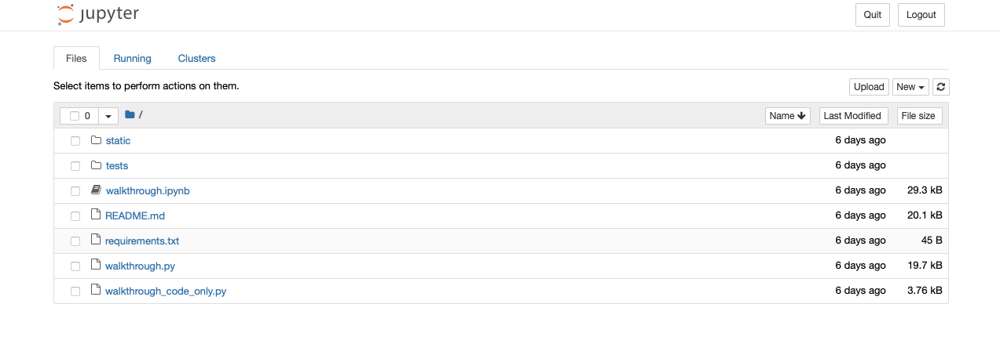
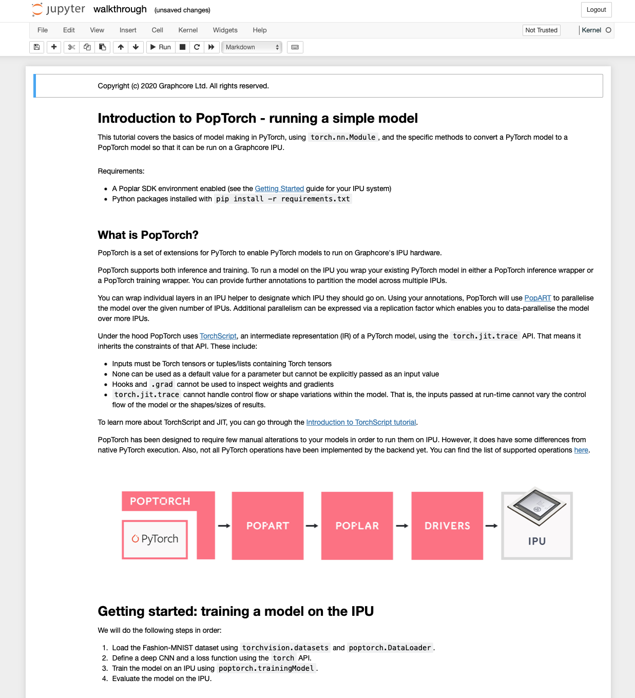
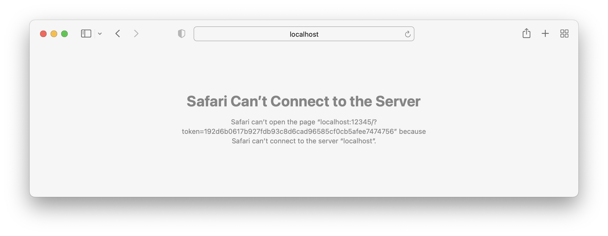
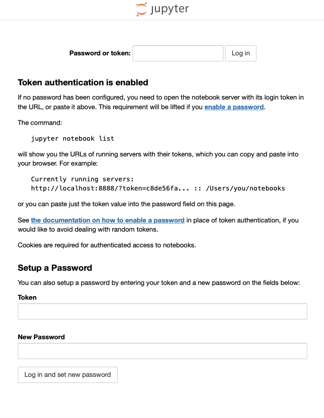

<!-- Copyright (c) 2022 Graphcore Ltd. All rights reserved. -->
# Using IPUs from Jupyter Notebooks

Jupyter notebooks are a popular web-based interactive computational environment.
This guide will help you set up and run Jupyter notebooks with IPU support.

A [troubleshooting section](#troubleshooting) is provided at the end of the tutorial to help resolve common issues.
If you would like to run Jupyter notebooks directly from VS Code, please refer to the [Using VS Code with the Poplar SDK and IPUs](../using_vscode/README.md) guide.

## Preparing your environment

Many of our tutorials are provided as Jupyter notebooks. In order to run them, you will need to execute the `jupyter-notebook` command on a machine with access to Graphcore IPUs and the Poplar SDK installed. To set up your environment you need:

- A Poplar SDK enabled (see the [Getting Started](https://docs.graphcore.ai/en/latest/getting-started.html) guide for your IPU system).
- TensorFlow 2, or PyTorch wheel installed (see the Setting up PyTorch/TensorFlow for the IPU sections of the [Software Installation](https://docs.graphcore.ai/projects/ipu-pod-getting-started/en/3.3.0/installation.html#) guide), we recommend using a virtual environment.

To check that the Poplar SDK and the Graphcore Python wheel you want to use have been correctly setup you can run the following commands:

- Poplar SDK (run both commands): `popc --version` and `python3 -c "import popart"`
- PyTorch installation: `python3 -c "import poptorch; print(poptorch.__version__)"`
- TensorFlow 2 installation: `python3 -c "from tensorflow.python import ipu; import tensorflow as tf; print('TensorFlow version: ', tf.__version__)"`

You should not encounter an error.

## Starting Jupyter with IPU support

### Installing Jupyter

After enabling the SDK and installing the desired wheel, you need to install
Jupyter Notebook and the IPython kernel:

```bash
python -m pip install jupyter ipykernel
```

### Starting a Jupyter server

Navigate in your command line to the directory you want to open in Jupyter,
this will be the top most directory that you can access from your Jupyter
server. To avoid needing to restart a notebook for every tutorial you do you may
want to only navigate to the folder containing tutorials targeting a specific
framework, for PyTorch:

```bash
cd tutorials/pytorch
```

Then, start a Jupyter server in "no browser" mode:

```bash
$ jupyter-notebook --no-browser --port 8075
[I 11:57:42.444 NotebookApp] Jupyter Notebook 6.4.4 is running at:
[I 11:57:42.444 NotebookApp] http://localhost:8075/?token=cb37a6b1ffb29dc99dea3d8e4153cef232b9f067ecd50f64
[I 11:57:42.444 NotebookApp]  or http://127.0.0.1:8075/?token=cb37a6b1ffb29dc99dea3d8e4153cef232b9f067ecd50f64
[I 11:57:42.444 NotebookApp] Use Control-C to stop this server and shut down all kernels (twice to skip confirmation).
[C 11:57:42.447 NotebookApp]

    To access the notebook, copy and paste one of these URLs:
        http://localhost:8075/?token=cb37a6b1ffb29dc99dea3d8e4153cef232b9f067ecd50f64
     or http://127.0.0.1:8075/?token=cb37a6b1ffb29dc99dea3d8e4153cef232b9f067ecd50f64
```

The URLs that appear are going to be used to connect to this server later.

At this point the server is running and will block your terminal. You will need
to keep it running while you want your sessions to remain active. For more
information on how to manage long running tasks on linux, check out this
[guide](https://www.howtogeek.com/440848/how-to-run-and-control-background-processes-on-linux/)
on how to run and control background processes on Linux.

### Connect your local machine to the Jupyter server

In order to connect to the Jupyter server we will need to connect via SSH with
port forwarding to your IPU system.

To do this you must add the `-NL 8075:localhost:8075` argument to the
usual SSH command you use to connect to the IPU system:

```bash
ssh -NL 8075:localhost:8075 <Your_IPU_system>
```

### Open the Jupyter notebook in the browser

The simplest way to access the Jupyter server is to paste either of the URLs obtained from the output of the `jupyter-notebook` command above into your browser.
Once that is done, you will see the following:



Here you will see the `.ipynb` file you want to open, among other files.
Clicking on it should open a page similar to the one below, except with the
tutorial you chose:



## Troubleshooting

### Installing additional Python packages from a notebook

You can use the [pip cell magic](https://ipython.readthedocs.io/en/stable/interactive/magics.html#magic-pip) to install Python packages from requirements files by adding a cell to a notebook with:

`%pip install -r path/to/requirements.txt`

### Encountering ImportErrors

If you encounter an import error, similar to the one below, when importing
one of the Python packages provided by the Poplar SDK:

```error
[1] from tensorflow.python import ipu

---------------------------------------------------------------------------
ImportError                               Traceback (most recent call last)
/localdata/alexandrep/sdk-envs/poplar_sdk-ubuntu_18_04-2.2.2+711-26aba6cf16/2.2.2+711_tf2/lib/python3.6/site-packages/tensorflow/python/pywrap_tensorflow.py in <module>
     63   try:
---> 64     from tensorflow.python._pywrap_tensorflow_internal import *
     65   # This try catch logic is because there is no bazel equivalent for py_extension.

ImportError: libgcl_ct.so: cannot open shared object file: No such file or directory

During handling of the above exception, another exception occurred:
...
```

Make sure that you followed the instructions in the "Preparing your environment"
section above.

If you have, make sure that Jupyter is using the same environment as the one in
which you installed the custom wheel files. You can do that by using the syntax
`python -m jupyter notebook` instead of `jupyter-notebook` when launching the
notebook server. Full command:

```bash
python -m jupyter notebook --no-browser --port 8075
```

### Can't connect to server

An error similar to the one below can happen when the port has not been
forwarded through `ssh`:

```bash
ssh -NL 8075:localhost:8075 <Your_IPU_system>
```



### Login page

If you are prompted to log in, make sure that you accessed the full URL you got
after starting the Jupyter server.


