<!-- Copyright (c) 2022 Graphcore Ltd. All rights reserved. -->
# Using VS Code with the Poplar SDK and IPUs

[Visual Studio Code](https://code.visualstudio.com) from Microsoft is a modern, extensible code editor which provides convenient functionality and ecosystem integrations which facilitate code development.
This guide will help you set up VS Code for development using the Poplar SDK and the associated Python libraries on a remote server.

## Goals

In this guide we will show how to:

- Use VS Code for remote code development
- Configure code completion (Intellisense) for PopTorch, PopART and TensorFlow in Python
- Start visual debugging of Python code using IPUs
- Edit and run Jupyter notebooks on IPUs from VS Code
- Use the debug menu in VS Code and create a custom `launch.json` file
- Debug C++ code called by Python libraries.

A [troubleshooting section](#troubleshooting) is provided at the end of the tutorial to help resolve common issues.

## Terminology

In this guide we make a distinction between the two hosts which you will need
to interact with, we refer to:

- the "local machine": this is the laptop or desktop which is running the graphical user interface, this may be running Windows, Linux or macOS.
- the "remote server": this is the server which is connected to the IPUs, it is a rack-mounted Linux machine.

## Installing extensions

VS Code and its ecosystem provide a number of extensions which make remote, Python and C++ development easier.
To benefit from this guide, you will need to install the following three extensions as indicated:

- on the local machine, install:
  - [Remote - SSH](http://marketplace.visualstudio.com/items?itemName=ms-vscode-remote.remote-ssh)
- on the remote server, install:
  - [Python](http://marketplace.visualstudio.com/items?itemName=ms-python.python)
  - [C++](http://marketplace.visualstudio.com/items?itemName=ms-vscode.cpptools)

These extensions will enable Python and C++ development on a remote server.

## Python development

The Python extension provides rich support for Python development. With no additional setup [it supports the following features](#features-of-the-python-extension-for-vs-code): code completion, documentation access, debugging and launching Jupyter notebooks.
You can set up your editor to support many types of [Python environments](https://code.visualstudio.com/docs/python/environments).

Unfortunately, it does not work out-of-the-box with the Poplar SDK. In order to connect to IPUs a number of environment variables need to be set.
The VS Code Python extension can be made aware of these environment variables though an `.env` file.

### Easily creating an `.env` file

Before you start, you should have completed the steps described in the [Getting Started guide](https://docs.graphcore.ai/en/latest/getting-started.html)
for your IPU system which includes setting the `IPUOF_VIPU_API_HOST` and
`IPUOF_VIPU_API_PARTITION_ID` environment variables.

To quickly create an `.env` file in the current directory and start using the Poplar SDK in VS Code:

```sh
source /path/to/sdk/enable  # Activate the Poplar SDK
source /path/to/python/virtualenv  # Activate any Python environment manager
env | grep -e "\(CMAKE_PREFIX_PATH\|PATH\|CPATH\|LIBRARY_PATH\|LD_LIBRARY_PATH\|OPAL_PREFIX\|PYTHONPATH\|IPUOF_VIPU.*\)=" > .env
```

Then click "Open Folder" in VS Code and select the folder where the `.env` file was created.
Generally you will want this folder to be the root directory of the project or repository you are working on.

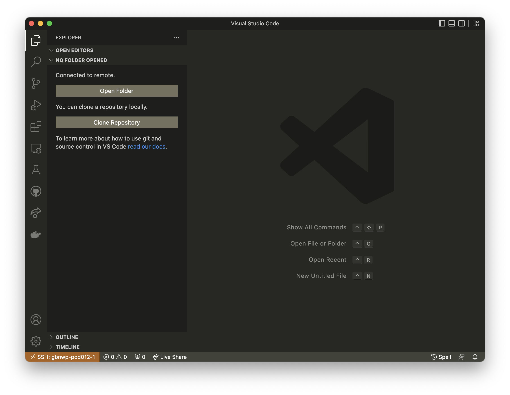

### Choosing VS Code's Python interpreter

To set up VS Code for Python development, you need to tell VS Code which Python executable it should use. The Python extension will then configure itself to identify the packages which have been installed.

First, identify the Python executable that you need to use. If you are in a terminal which is configured with the correct environment you can run:

```sh
(venv) $ which python
/path/to/some/venv/bin/python
```

Then, to tell VS Code which interpreter to use we need to bring up the appropriate menu.
There are two ways to bring up the selector menu for Python Interpreters:

- open the Command Palette (`Cmd/Ctrl + shift + p`) and enter "Python: Select Interpreter"

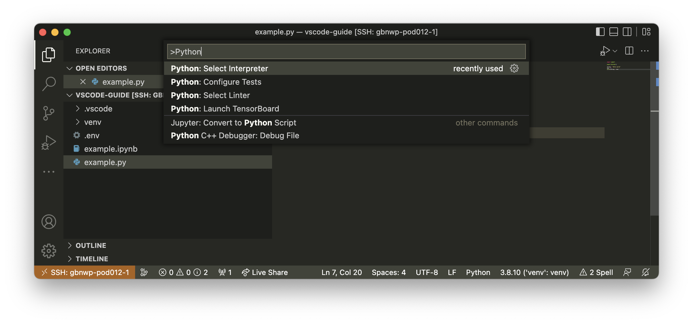

- if you are in a Python file and the Python extension is active, you can click in the GUI as shown below:

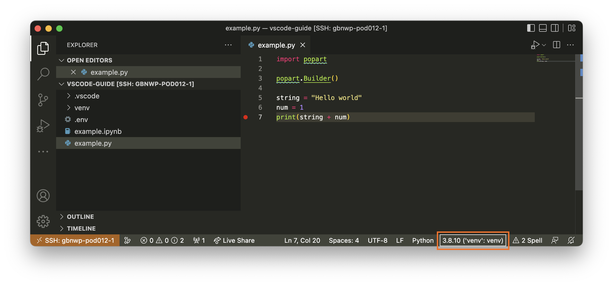

Either of these methods will bring up the menu for selecting a Python interpreter:

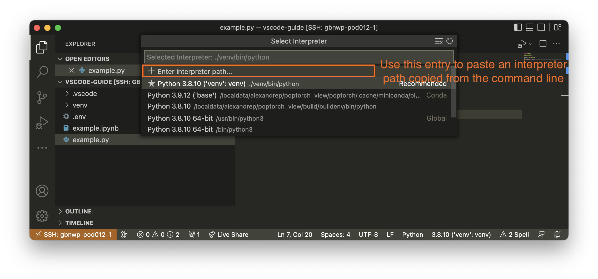

Select the interpreter of your choice:

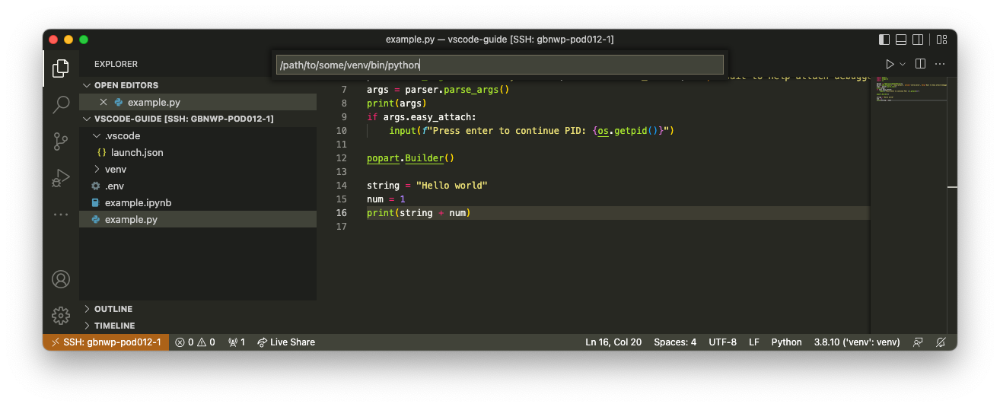

The Python extension will now use this Python interpreter to detect installed packages and execute linting and completion operations.

### Using the `.env` file to access IPUs

To use IPUs from the terminal of your remote server you would follow the [getting started guide corresponding to your system](https://docs.graphcore.ai/en/latest/getting-started.html).

The Poplar SDK is enabled by running `source <path/to/sdk>/enable`. This script modifies the following environment variables to the terminal it runs in:
`CMAKE_PREFIX_PATH`, `PYTHONPATH`, `LIBRARY_PATH`, `LD_LIBRARY_PATH`, `OPAL_PREFIX`, `PATH`, `CPATH`, `IPUOF_VIPU`.
In addition to the SDK a partition needs to be configured by setting the `IPUOF_VIPU_API` environment variables.

The `.env` file is simply a list of values for these environment variables after the SDK is enabled. For example if you are using the Ubuntu 20.04 release of version 3.0 of the Poplar SDK:

```sh
CMAKE_PREFIX_PATH=/path/to/sdk/popart-ubuntu_20_04-3.0.0:/path/to/sdk/poplar-ubuntu_20_04-3.0.0
PYTHONPATH=/path/to/sdk/popart-ubuntu_20_04-3.0.0/python:/path/to/sdk/poplar-ubuntu_20_04-3.0.0/python:/path/to/sdk/poplar-ubuntu_20_04-3.0.0/lib/python::/home/johns/pse_tools/popsdk/artifactory_api
LIBRARY_PATH=/path/to/sdk/popart-ubuntu_20_04-3.0.0/lib:/path/to/sdk/poplar-ubuntu_20_04-3.0.0/lib
LD_LIBRARY_PATH=/path/to/sdk/popart-ubuntu_20_04-3.0.0/lib:/path/to/sdk/poplar-ubuntu_20_04-3.0.0/lib
OPAL_PREFIX=/path/to/sdk/poplar-ubuntu_20_04-3.0.0
PATH=/path/to/python/virtualenv/bin:/path/to/sdk/poplar-ubuntu_20_04-3.0.0/bin:/path/to/sdk:/home/johns/.local/bin:/home/johns/.cargo/bin:/usr/local/sbin:/usr/local/bin:/usr/sbin:/usr/bin:/sbin:/bin:/usr/games:/opt/dell/srvadmin/bin:/home/johns/.local/bin
CPATH=/path/to/sdk/popart-ubuntu_20_04-3.0.0/include:/path/to/sdk/poplar-ubuntu_20_04-3.0.0/include
IPUOF_VIPU_API_HOST=<VIPU server host>
IPUOF_VIPU_API_PARTITION_ID=<VIPU partition>
```

Once the `.env` file is created, the editor will go from not recognising the `popart` module:

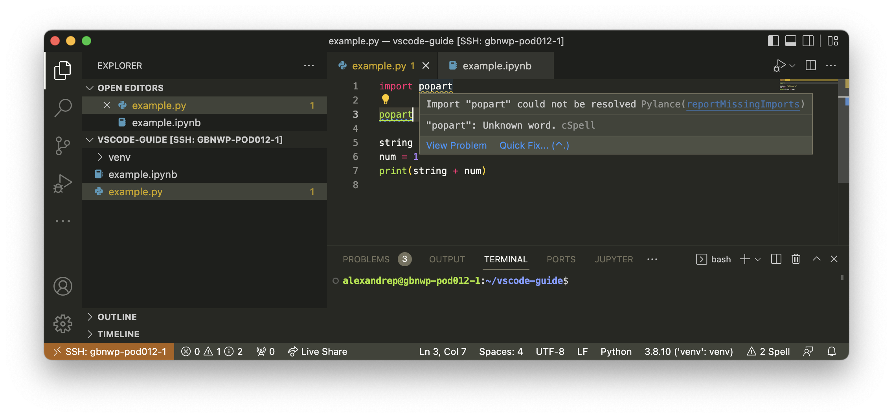

to autocomplete working:

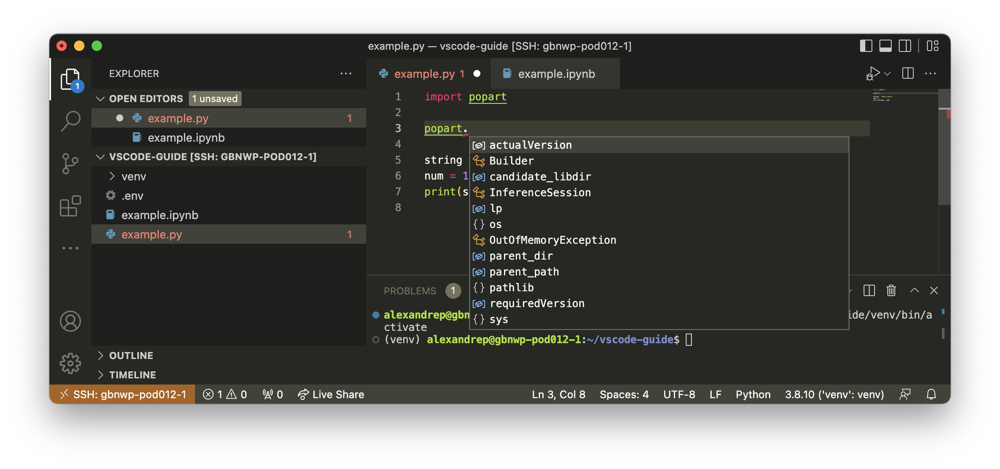

and displaying the documentation with Intellisense:

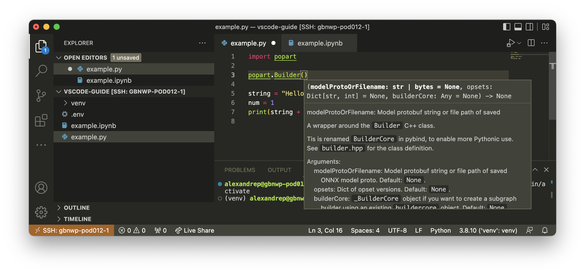

This method also lets you use Jupyter notebooks which use IPUs straight from VS Code. To create a new Jupyter notebook
simply open the Command Palette (`Cmd/Ctrl + shift + p`) and enter "New Jupyter notebook":

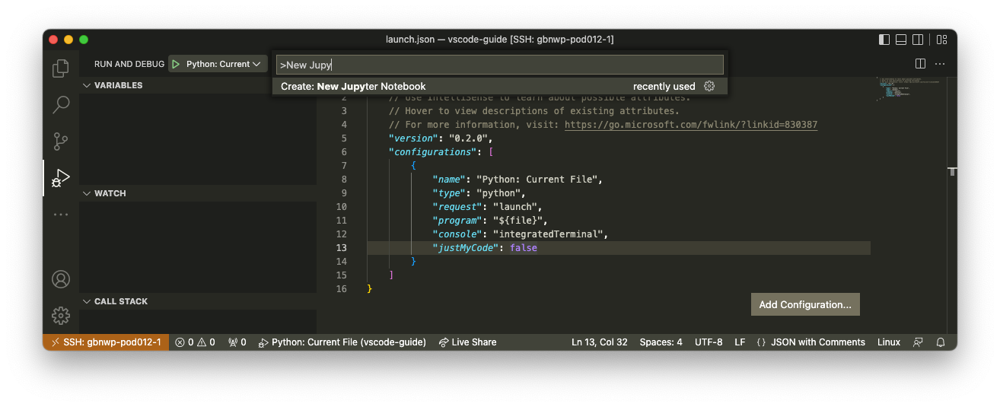

You can then execute code using the Poplar SDK from inside the notebook without any further setup:

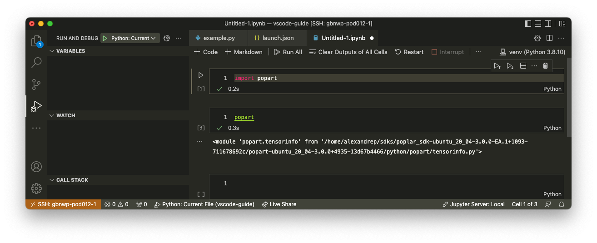

### Debugging code which requires IPUs

Once you have created the `.env` file you will be able to run the debugger:

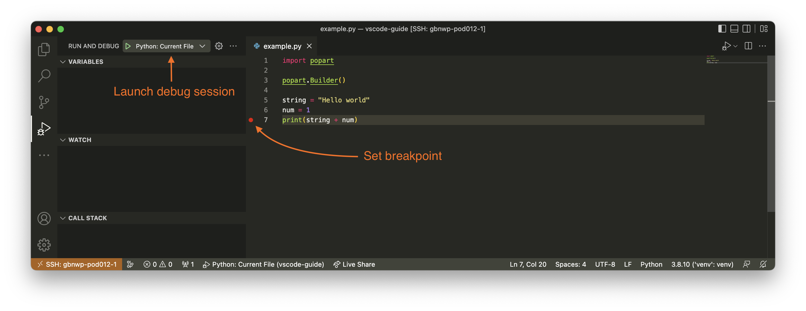

Set a breakpoint in your application that requires Poplar SDK code:

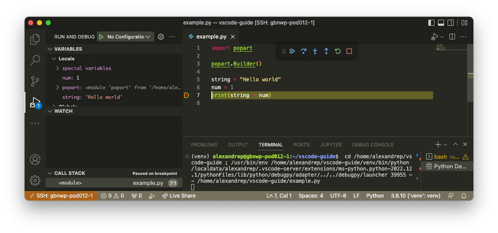

This works well for application code. To debug library code, for example packages installed with `pip`, you will need to create a `.vscode/launch.json` file. You can use the debug menu to create it:

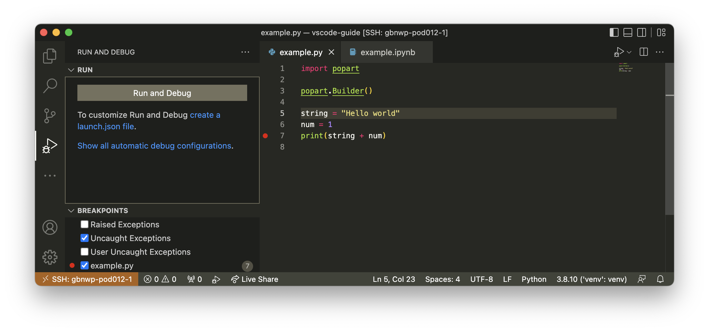

With `justMyCode` set to `false` in the new debug configuration you will be able to:

- set breakpoints
- step into functions
- and stop on errors

inside library code to inspect its behaviour.

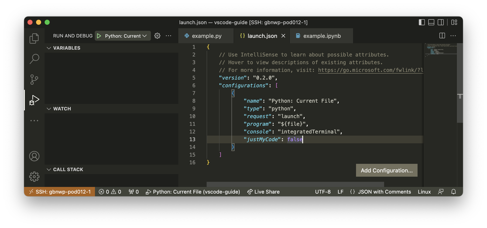

This can be very useful when trying to understand what happens inside a library, but it can also make debugging more difficult.
In the example below we show the difference between the stack traces using `justMyCode: true` and `justMyCode: false`, when stopping at
a breakpoint inside a [very simple PyTorch model](../../pytorch/basics/):

- Debug just your code (note the stack trace contains only two items):

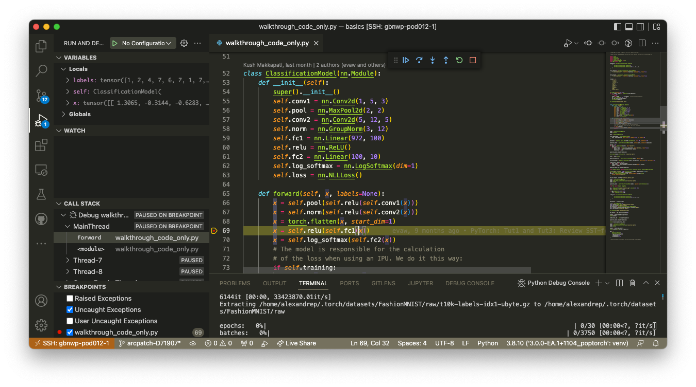

- Debug library code (note the stack trace contains all intermediate frames):

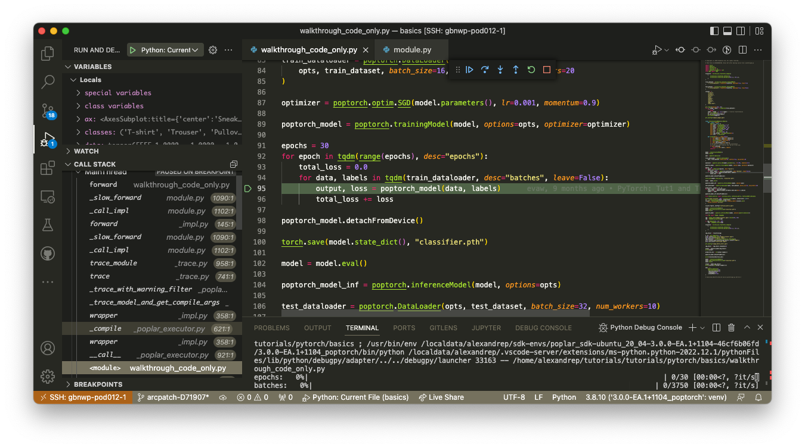

## Debugging C++ libraries and custom ops

Most Python libraries rely heavily on compiled C++ code and bindings to run fast. With VS Code it is also possible to
debug C++ code which has been launched from Python on an IPU Machine.

Debugging C++ from Python can be used when developing custom ops for use in your PopART, PyTorch and TensorFlow models.

### Difficulty

Debugging C++ libraries integrated with Python is trickier than debugging a simple Python project as it requires attaching to an already running program.
Attaching to a program often requires `sudo` privileges on the remote server.

In order to step through C++ code you will need to have built the custom op or library you are trying to debug with its debug flags. Refer to the user documentation of the custom op or library for details of how to do this.

### Outline

Debugging a C++ library will take the following steps:

0. Choose the C++ code to debug;
1. Set up `launch.json` for C++ debugging;
2. Set up your Python program to make debugging easy;
3. Attach `gdbserver` to your running process using the PID;
4. Connect VS Code to `gdbserver`.

### 0. Choose the C++ code to debug

The code that you choose to debug will need to be compiled with debug symbols (`-g` when using `g++` from the GNU Compiler Collection (gcc)). In this section the [PyTorch custom op](../../../feature_examples/pytorch/custom_op) is used as an example of C++ code called from Python that needs to be debugged.


VS Code provides different ways of setting breakpoints:

- click on the line
- specify a function or method name
- break on exceptions:

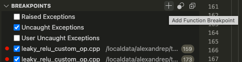

### 1. Set up `launch.json` for C++ debugging

You will need to create a new debug configuration in your `.vscode/launch.json` file:

```json
{
    "name": "(gdbserver) Attached",
    "type": "cppdbg",
    "request": "launch",
    "program": "/explicit/path/to/pythonexecutable/python",
    "miDebuggerServerAddress": "localhost:12345",
    "MIMode": "gdb",
    "cwd": "${workspaceFolder}",
    "setupCommands": [
        {
            "description": "Enable pretty-printing for gdb",
            "text": "-enable-pretty-printing",
            "ignoreFailures": true,
        }
    ]
}
```

Their are two elements in this configuration that can be customised:

- `"miDebuggerServerAddress"`: must be an open port on the remote server, ports above 10000 and below 40000 are usually available
- `"program"`: must the Python 3 executable you are using to run your program, do `which python3` on the command line to get the full path to that executable.

This new entry will appear as a 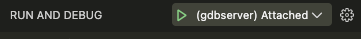 button in the debug menu.
Make sure you have installed the C++ extension for VS Code or the `cppdbg` type of launch configuration will not exist.

This debugging configuration looks to attach to a [`gdbserver` instance](https://en.wikipedia.org/wiki/Gdbserver) which exposes the GDB's debugging interface over a network interface.
Before the VS Code C++ debugger can be attached to the GDB server, the port of the server needs to be forwarded. You can do this in VS Code using the `Ports` interface:

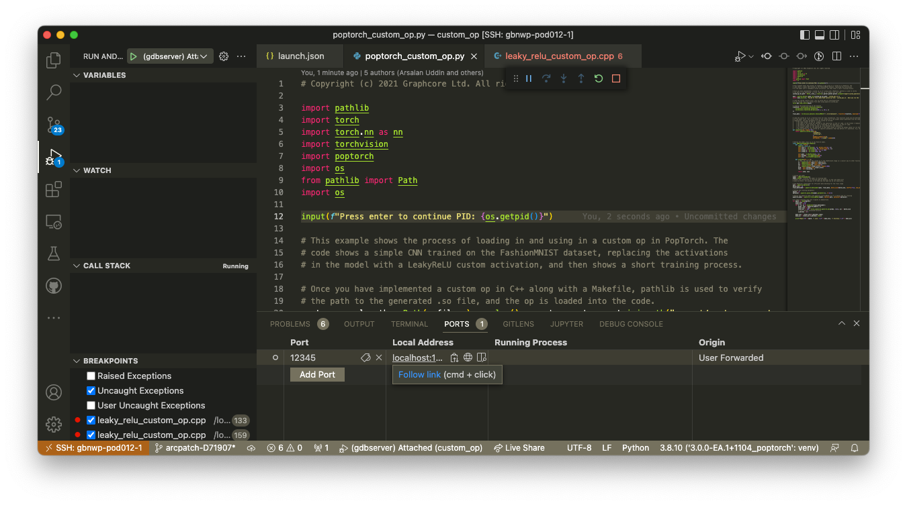

Make sure that the port you forward matches the port entered in the `launch.json` file in the `miDebuggerServerAddress` config entry.

### 2. Set up your Python program to make debugging easy

To make it easy to attach `gdbserver` to your Python program it is useful to pause your program and make it wait for a user input before continuing. Adding one of the snippets below will give you time to get the PID and attach the debugger to it:

```python
input(f"Press enter to continue PID: {os.getpid()}")
```

If the program cannot run interactively you may prefer:

```python
print(os.getpid())
time.sleep(some_amount_longer_than_it_takes_you_to_gdb_attach)
```

It can be quite inconvenient to have this behaviour happen by default so it can be useful to hide it behind a command line argument. In the snippet below we put the interactive wait behind an `--easy-attach` argument:

```python
import argparse
import os

parser = argparse.ArgumentParser()
parser.add_argument(
    "--easy-attach", action="store_true", help="Wait to help attach debugger"
)
args = parser.parse_args()
print(args)
if args.easy_attach:
    input(f"Press enter to continue PID: {os.getpid()}")
```

As an example this simple instrumentation stops the program and prints the PID:

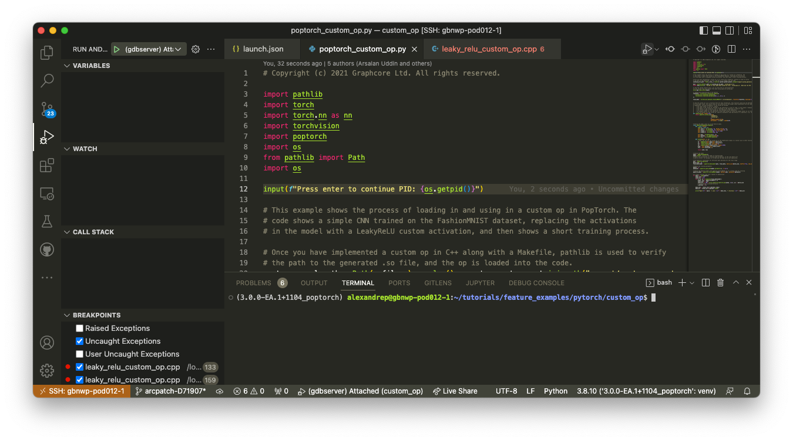

### 3. Attach `gdbserver` to your running process using the PID

Once your program has been instrumented to pause, you should activate the correct virtual environments and run the program.
If you have configured the Python debugger in VS Code, you can run the program from there by clicking on the
 button.

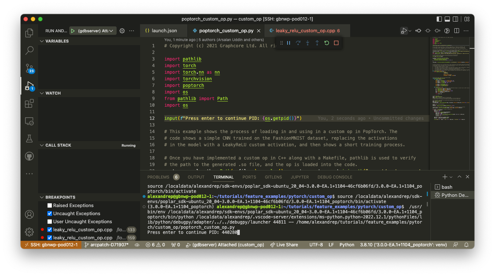

Alternatively you can run the program in a terminal with:

```sh
$ python poptorch_custom_op.py
Press enter to continue PID: <Prints-PID>
```

The program waits for user input, giving you time to attach the debugger to the program.
Write down the PID. Note: the PID will change with each execution of the program.

To attach to the program you need run `gdbserver` in attach mode, which often requires administrative privileges. From another terminal on the remote server, execute:

```sh
$ sudo gdbserver --attach localhost:12345 <PID-printed-in-previous-step>
[sudo] password for <username>:
Attached; pid = <PID>
Listening on port 12345
```

In this command `localhost:12345` must match the `miDebuggerServerAddress` config entry set in the `launch.json` file in the previous step.
This command can be run directly from a terminal in VS Code, there are no requirements for any environment to be activated for it to work:

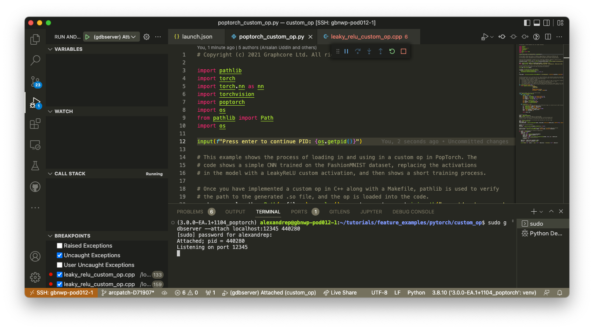

### 4. Connect VS Code to `gdbserver`

You are now ready to attach the C++ debugger to the GDB server by clicking the  button:

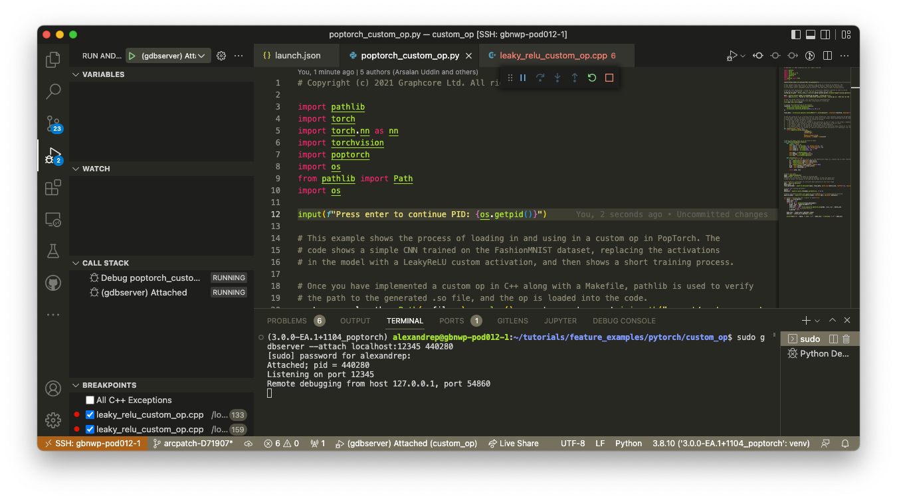

Once the debugger is attached you should see an additional line printed below the `gdbserver` command:

```sh
$ sudo gdbserver --attach localhost:12345 <PID-printed-in-previous-step>
[sudo] password for <username>:
Attached; pid = <PID>
Listening on port 12345
Remote debugging from host 127.0.0.1, port 54860
```

You can now return to the terminal which is running your Python application, you can hit `enter`
to unpause the execution of your program. The execution will pause when the breakpoint is reached:

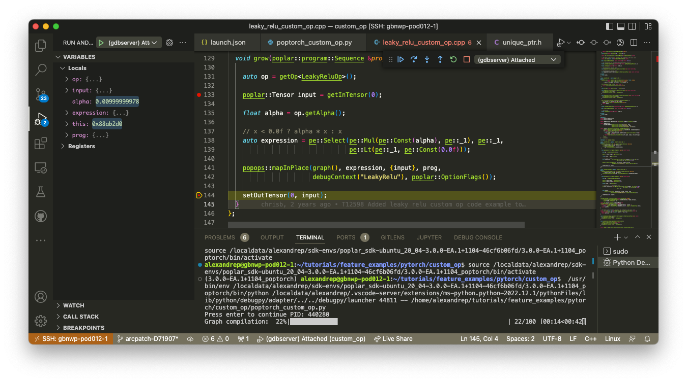

Note that in this example, we are stopping inside [leaky_relu_custom_op.cpp](../../../feature_examples/popart/custom_operators/leaky_relu_example/leaky_relu_custom_op.cpp), which is executed during compilation of the PyTorch model for the IPU.

## Troubleshooting

In this section we look at some of the common problems you might encounter when trying to use VS Code with IPUs on remote servers.

If you encounter an issue not described in this section, feel free to suggest it as an addition to this guide by raising an [issue](https://github.com/graphcore/tutorials/issues) or [contacting support](mailto:support@graphcore.ai?subject=VSCode%20Troubleshooting).

### `ImportError` and `ModuleNotFoundError` for PopTorch, PopART or TensorFlow

If the PopTorch, PopART or TensorFlow module cannot be found this means that your `.env` file either does not contain
the right information or it is not in the correct location.

#### Symptoms

Intellisense not working:

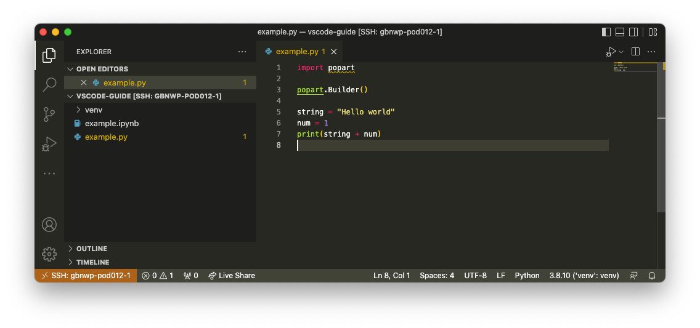

Debugging failing on import:

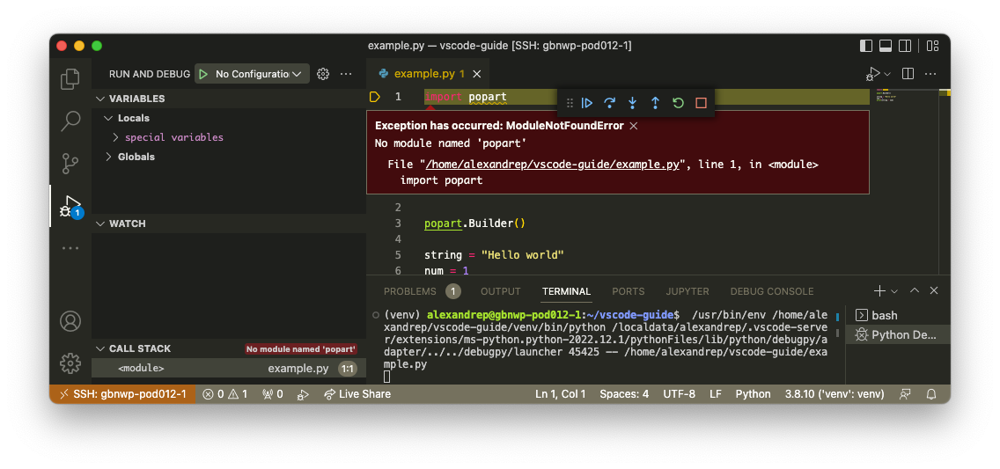

Error message when importing `poptorch`:

```error
Exception has occurred: ImportError
Unable to import PopTorch, this can be caused by attempting to import PopTorch without an active Poplar SDK
  The SDK can be enabled by running: `source /path/to/poplar-sdk/enable`

The above exception was the direct cause of the following exception:

  File "/home/johns/tutorials/tutorials/pytorch/basics/walkthrough_code_only.py", line 6, in <module>
    import poptorch
```

Error message when importing `tensorflow`:

```error
Traceback (most recent call last):
  File "/localdata/alexandrep/sdk-envs/poplar_sdk-ubuntu_20_04-3.1.0/3.1.0_tf2/lib/python3.8/site-packages/tensorflow/python/pywrap_tensorflow.py", line 64, in <module>
    from tensorflow.python._pywrap_tensorflow_internal import *
ImportError: libgcl.so: cannot open shared object file: No such file or directory

During handling of the above exception, another exception occurred:

Traceback (most recent call last):
  File "<string>", line 1, in <module>
  File "/localdata/alexandrep/sdk-envs/poplar_sdk-ubuntu_20_04-3.1.0/3.1.0_tf2/lib/python3.8/site-packages/tensorflow/__init__.py", line 41, in <module>
    from tensorflow.python.tools import module_util as _module_util
  File "/localdata/alexandrep/sdk-envs/poplar_sdk-ubuntu_20_04-3.1.0/3.1.0_tf2/lib/python3.8/site-packages/tensorflow/python/__init__.py", line 40, in <module>
    from tensorflow.python.eager import context
  File "/localdata/alexandrep/sdk-envs/poplar_sdk-ubuntu_20_04-3.1.0/3.1.0_tf2/lib/python3.8/site-packages/tensorflow/python/eager/context.py", line 35, in <module>
    from tensorflow.python import pywrap_tfe
  File "/localdata/alexandrep/sdk-envs/poplar_sdk-ubuntu_20_04-3.1.0/3.1.0_tf2/lib/python3.8/site-packages/tensorflow/python/pywrap_tfe.py", line 28, in <module>
    from tensorflow.python import pywrap_tensorflow
  File "/localdata/alexandrep/sdk-envs/poplar_sdk-ubuntu_20_04-3.1.0/3.1.0_tf2/lib/python3.8/site-packages/tensorflow/python/pywrap_tensorflow.py", line 83, in <module>
    raise ImportError(msg)
ImportError: Traceback (most recent call last):
  File "/localdata/alexandrep/sdk-envs/poplar_sdk-ubuntu_20_04-3.1.0/3.1.0_tf2/lib/python3.8/site-packages/tensorflow/python/pywrap_tensorflow.py", line 64, in <module>
    from tensorflow.python._pywrap_tensorflow_internal import *
ImportError: libgcl.so: cannot open shared object file: No such file or directory


Failed to load the native TensorFlow runtime.

See https://www.tensorflow.org/install/errors

for some common reasons and solutions.  Include the entire stack trace
above this error message when asking for help.
```

#### Solution

The solution will depend on how you are using your VS Code "Workspace":

- if you have opened a single folder (using: `File > Open Folder` or equivalent) the `.env` file is expected in the directory that was opened.
- if you have opened multiple folders in your workspace you can customise the location of your `.env` file through a `python.envFile` entry in your `.vscode/settings.json` settings interface:

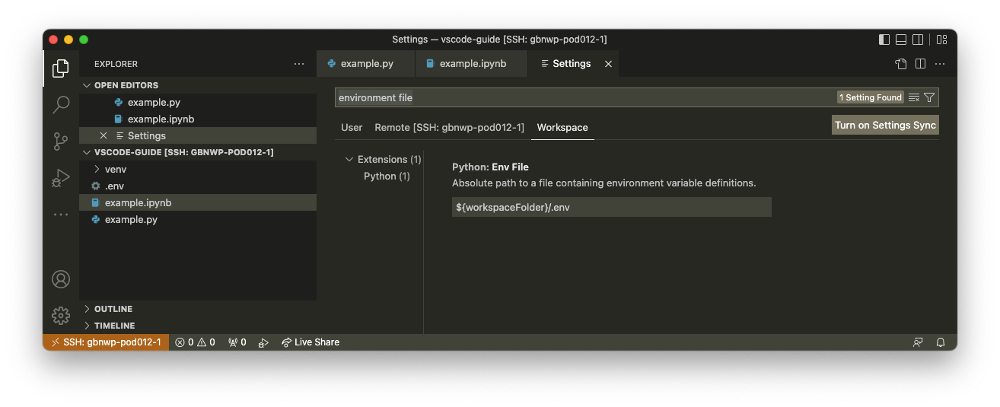

### Config settings in `launch.json` are ignored

If settings in your debug `launch.json` configuration are being ignored, make sure that the you use the 
in the debugging menu.

There seems to be some inconsistency in which debug configuration entry is used depending on:

- the 
- or the 

is used. It seems that the  will more reliably select a custom configuration.

## Features of the Python extension for VS Code

This section shows the features provided by the Python VS Code extension while developing on the "remote server". Note: all files and code execution are on the remote server.

Code completion:

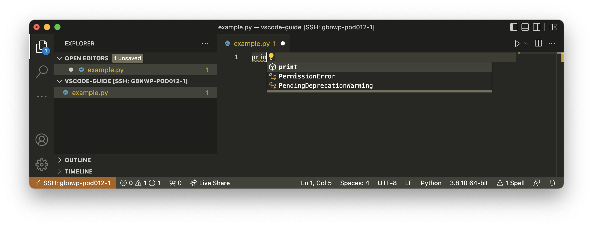

Intellisense providing quick access to documentation:

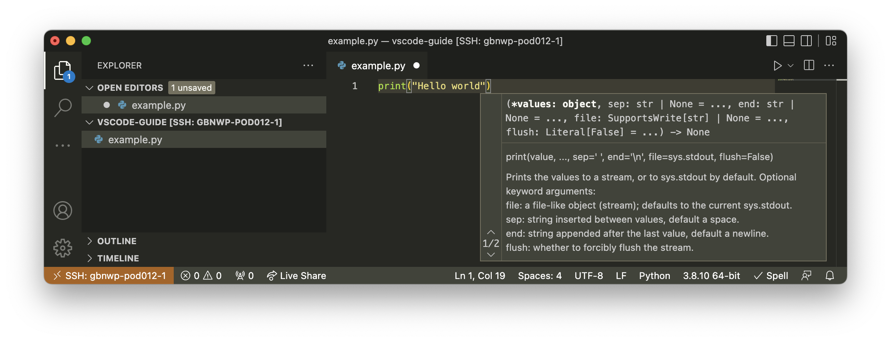

The visual debugger capturing a simple error:

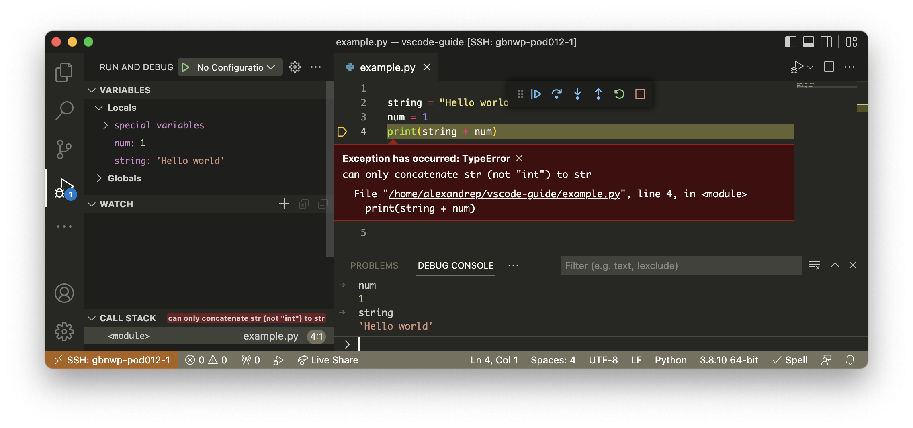

Jupyter notebook server started from VS Code:

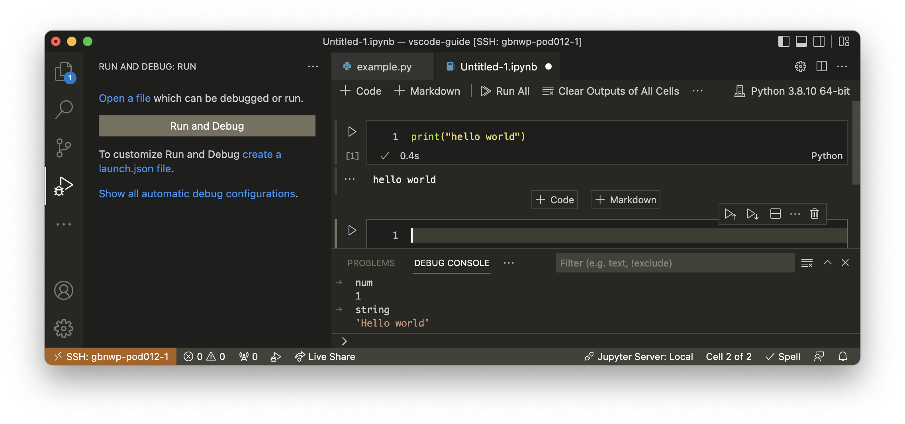
