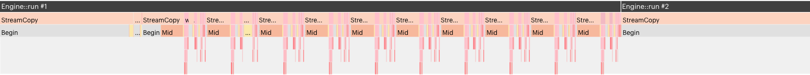
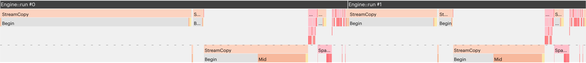

<!-- Copyright (c) 2021 Graphcore Ltd. All rights reserved. -->
# Using Infeed and Outfeed Queues in TensorFlow 2

In this tutorial, you will write code for training a simple fully connected network on the MNIST dataset to illustrate how to use infeed and outfeed queues with a custom training function.

If you are not familiar with how to run TensorFlow 2 models on the IPU, you may wish to read our [MNIST starter tutorial](../../../simple_applications/tensorflow2/mnist) .


Requirements:

* Installed and enabled Poplar
* Installed the Graphcore port of TensorFlow 2

Refer to the [Getting Started guide](https://docs.graphcore.ai/en/latest/getting-started.html) for your IPU system for instructions.

#### Directory Structure

* `completed_code`: Completed versions of the scripts described in this tutorial
* `execution_trace`: Execution traces of the scripts described in this tutorial
* `README.md`: This file
* `tests`: A directory that contains test scripts

#### Table of Contents

- [Introduction](#introduction)
- [Example](#example)
    - [Import the necessary APIs](#import-the-necessary-apis)
    - [Define hyperparameters](#define-hyperparameters)
    - [Prepare the dataset](#prepare-the-dataset)
    - [Define the model](#define-the-model)
    - [Define the custom training loop](#define-the-custom-training-loop)
    - [Configure the hardware](#configure-the-hardware)
    - [Create data pipeline and execute the training loop](#create-data-pipeline-and-execute-the-training-loop)
- [Additional Notes](#additional-notes)


## Introduction

The combination of TensorFlow, XLA and Poplar provides the ability to combine an entire training graph into a single operation in a TensorFlow graph. This accelerates training by removing the need to pass control to the IPU for each individual operation in the graph.

However, if the Python code with the training pass is called for each batch in the training dataset, then there is still the overhead of passing control to the IPU for each batch. You can deal with this by placing the training operations inside a loop, so that they can be executed multiple times on the IPU without returning control to the host.

Normally when TensorFlow runs, operations which are not inside a loop will take a fixed number of tensors as input. However, when a training operation is placed into a loop, the inputs need to take the form of streams of values. Standard TensorFlow Python feed dictionaries cannot provide data in this form, so when training in a loop, data must be fed from a TensorFlow dataset. Similarly, the outputs must be represented as a stream. TensorFlow for IPU provides two mechanisms, infeed queues and outfeed queues, for handling this when using the IPU.

You need to do the following in order to construct a system that trains in a loop:

* Create a TensorFlow dataset to provide data to the input queue
* Create a model
* Create a custom training loop
* Create an `IPUInfeedQueue` to feed the data to the loop
* Create an `IPUOutfeedQueue` to take results out of the loop

## Example

This example illustrates how to build pipelines manually with custom functions. However, the IPU-specific versions of the Keras Model and Sequential classes automatically add an infeed and outfeed to the model's `fit`, `evaluate` and `predict` methods. These methods call the `run` function internally.

In this tutorial, you will write code for training a simple fully connected network on the MNIST dataset to illustrate how to use infeed and outfeed queues with a custom training function. Copy the code snippets below into a new Python file. The completed code is available for comparison in the folder [completed_code](completed_code).

### Import the necessary APIs

First of all, you need to import APIs that will be used in the example.

```python
import time
import tensorflow as tf
from tensorflow import keras

from tensorflow.python.ipu import ipu_outfeed_queue
from tensorflow.python.ipu import config
from tensorflow.python.ipu import ipu_strategy
```

### Define hyperparameters

You need to define the number of steps to train the model.

```python
step_count = 10_000
steps_per_execution = 10
```

### Prepare the dataset

Next, you need to prepare the dataset:

```python
def create_dataset():
    mnist = keras.datasets.mnist

    (x_train, y_train), (_, _) = mnist.load_data()
    x_train = x_train / 255.0

    train_ds = tf.data.Dataset.from_tensor_slices((x_train, y_train))
    train_ds = train_ds.cache()
    train_ds = train_ds.shuffle(len(x_train)).batch(32, drop_remainder=True)
    train_ds = train_ds.map(lambda d, l: (tf.cast(d, tf.float32), tf.cast(l, tf.int32)))
    train_ds = train_ds.prefetch(tf.data.experimental.AUTOTUNE)

    return train_ds.repeat()


ds = create_dataset()
```

The TensorFlow documentation on optimizing input pipelines with the `tf.data` API describes how [caching](https://www.tensorflow.org/guide/data_performance#caching) and [prefetching](https://www.tensorflow.org/guide/data_performance#prefetching) work.


### Define the model

Now you need to define your model. The code example provided uses this simple fully connected network:

```python
# A simple fully-connected network model using the standard Keras Sequential API.
def create_model():
    m = keras.Sequential(
        [
            keras.layers.Flatten(),
            keras.layers.Dense(128, activation="relu"),
            keras.layers.Dense(10, activation="softmax"),
        ]
    )
    return m


model = create_model()
```

### Define the custom training loop

Now that you have the dataset and the model, you can construct the device-side part of the model. In the code example provided, the body of the loop is a function which takes MNIST images and their labels as input, performs a single step of a training loop, and returns the loss. The results are then inserted into the outfeed queue using the `enqueue` method.

```python
@tf.function(experimental_compile=True)
def training_loop(iterator, outfeed_queue, model, optimizer, num_iterations):
    for _ in tf.range(num_iterations):
        # Get the data for the step.
        features, labels = next(iterator)

        # Perform the training step.
        with tf.GradientTape() as tape:
            predictions = model(features, training=True)
            prediction_loss = keras.losses.sparse_categorical_crossentropy(
                labels, predictions
            )
            loss = tf.reduce_mean(prediction_loss)

        grads = tape.gradient(loss, model.trainable_variables)
        optimizer.apply_gradients(zip(grads, model.trainable_variables))

        # Store the loss in the outfeed queue.
        outfeed_queue.enqueue(loss)
```

The `tf.function` decorator compiles the Python function into a callable TensorFlow graph. We set `experimental_compile=True` because this means the function will be compiled with XLA, which is essential for running TensorFlow programs on the IPU.


### Configure the hardware

You must create an IPU configuration to use the IPU. You can use `cfg.auto_select_ipus = 1` to automatically select one IPU.

```python
cfg = config.IPUConfig()
cfg.auto_select_ipus = 1
cfg.configure_ipu_system()
```

### Create data pipeline and execute the training loop

`tf.distribute.Strategy` is a TensorFlow API for distributing training across multiple devices. `IPUStrategy` is a subclass which targets a system with one or more IPUs attached.

Creating variables within the scope of the `IPUStrategy` will ensure that they are placed on the IPU, but the initialization for the variables will be performed on the CPU device.

Before you execute the training loop, you need to create a data pipeline from the dataset into a training or inference loop on the IPU. This is done by creating an infeed queue and an outfeed queue.

You may notice that `IPUInfeedQueue` is not explicitly declared like `IPUOutfeedQueue`. This is because calling `iter` on a dataset inside an `IPUStrategy` creates an infeed queue internally.

An `IPUOutfeedQueue` is used to generate and add outfeed enqueue/dequeue operations to the graph. The infeed and outfeed queues together manage the transfer of data between the IPU graph and the host.

`IPUOutfeedQueue` objects have extra options to control how they collect and output the data sent to them. These options are not used in this example. Refer to the [IPUOutfeedQueue](https://docs.graphcore.ai/projects/tensorflow-user-guide/en/3.1.0/tensorflow/api.html#tensorflow.python.ipu.ipu_outfeed_queue.IPUOutfeedQueue) documentation for details.

To execute the training loop, you should do so within the scope of an `ipu_strategy.IPUStrategy` using `run` like so:

```python
strategy = ipu_strategy.IPUStrategy()

with strategy.scope():
    # An optimizer for updating the trainable variables.
    opt = keras.optimizers.SGD(0.01)

    # Create an instance of the model.
    model = create_model()

    # Create an iterator for the dataset.
    iterator = iter(create_dataset())

    # Create an IPUOutfeedQueue to collect results from each on device step.
    outfeed_queue = ipu_outfeed_queue.IPUOutfeedQueue()

    start_time = time.time()
    # Train the model
    for _ in range(0, step_count, steps_per_execution):

        # Run `steps_per_execution` at a time.
        strategy.run(
            training_loop,
            args=[iterator, outfeed_queue, model, opt, steps_per_execution],
        )
    result = outfeed_queue.dequeue()
    print(
        "Time taken using infeed/outfeed queues:", time.time() - start_time, "seconds"
    )
```

`steps_per_execution` refers to the total number of batches of data processed by each replica (if replication is enabled) each time an engine is executed. Usually, it is passed as an argument when compiling a model in TF2 (see [Keras with IPUs documentation](https://docs.graphcore.ai/projects/tensorflow-user-guide/en/3.1.0/tensorflow/keras_tf2.html#using-steps-per-execution)). In this example, `steps_per_execution` is used here to simulate the same behaviour with a custom training loop -- it essentially plays the same role as the known `steps_per_execution` parameter that is passed to `model.compile`.


## Additional notes

You can also use more than one outfeed queue. This can be useful for diagnosing numerical issues. See the [inspecting tensors example](../../../feature_examples/tensorflow2/inspecting_tensors) for details.

The same model without infeed or outfeed queues is used to train the model on the MNIST dataset in [mnist_without_feeds.py](completed_code/mnist_without_feeds.py), so you can run both examples and compare the difference in efficiency.

Both models are trained on 10,000 batches so that the difference in time efficiency is apparent.

Run the model that uses the infeed and outfeed queues:

```
python completed_code/mnist_with_feeds.py
```

Example output:

```
Time taken using infeed/outfeed: 14.621165752410889 seconds
```

Run the version without infeed and outfeed queues and compare the output:

```
python completed_code/mnist_without_feeds.py
```

Example output:

```
Time taken without infeed/outfeed: 23.766914129257202 seconds
```

You can see that training the model with infeed and outfeed queues is much more efficient. The difference in time is even larger when more epochs are needed to train a model.

Moreover, you can visualise the execution traces of both models with the PopVision Graph Analyser. You can run the following command to enable graph profiling while executing the program:

```
POPLAR_ENGINE_OPTIONS='{"autoReport.all":"true", "autoReport.directory":"with_feeds", "autoReport.executionProfileProgramRunCount":"10", "autoReport.outputDebugInfo":"true", "debug.allowOutOfMemory":"true", "autoReport.outputSerializedGraph":"false"}' python completed_code/mnist_with_feeds.py
```

The engine option `autoReport.directory` specifies where you would like to save the profile. You can download the PopVision Graph Analyser from the Graphcore [developer page](https://www.graphcore.ai/developer/popvision-tools#downloads) and view the profile you have saved with it. Similarly, you can save the profile of [mnist_without_feeds.py](completed_code/mnist_without_feeds.py) in a different folder for comparison.

The engine option `autoReport.executionProfileProgramRunCount` specifies how many runs of the Poplar program you would like to capture. If you increase the number of runs to be captured, the execution report gets larger and so takes longer to generate. For the purpose of illustration, this option is set to 10 in this case. The default value is 2. For more information on the available options, please visit [PopVision Graph Analyser User Guide](https://docs.graphcore.ai/projects/graph-analyser-userguide/en/3.11.2/user-guide.html#capturing-ipu-reports).

The execution traces for both [mnist_with_feeds.py](completed_code/mnist_with_feeds.py) and [mnist_without_feeds.py](completed_code/mnist_without_feeds.py) are shown below and can be found in the `execution_trace` folder as well. PopVision Graph Analyser 2.4.2 is used here to generate the images.





Note that each `Engine::run` call for [mnist_with_feeds.py](completed_code/mnist_with_feeds.py) contains multiple steps while each step takes one `Engine::run` call for [mnist_without_feeds.py](completed_code/mnist_without_feeds.py). This verifies that placing the training operations inside a loop, as you did using feeds, allows them to be executed multiple times on the IPU without returning control to the host.

### License

This example is licensed under the Apache License 2.0 - see the LICENSE file in this directory.

Copyright (c) 2021 Graphcore Ltd. All rights reserved.

It contains derived work licensed under the Apache License 2.0. See the headers in the source code for details.
