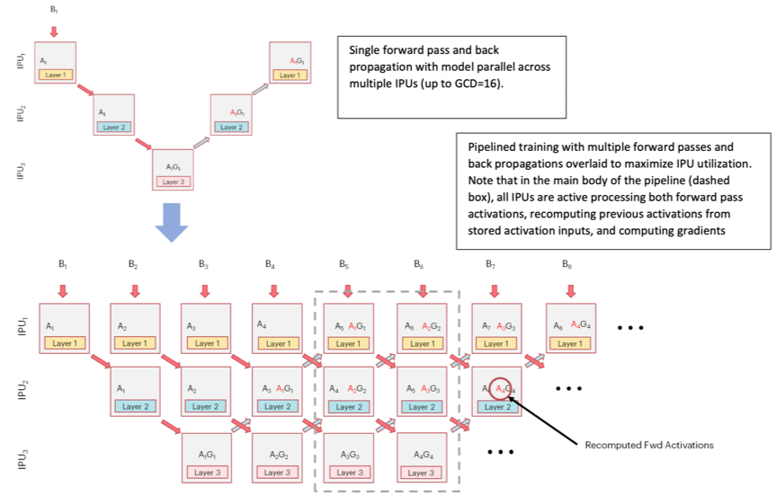

<!-- Copyright (c) 2021 Graphcore Ltd. All rights reserved. -->
<!-- THIS FILE IS AUTOGENERATED. Rerun SST after editing source file: demo.py -->

# Keras tutorial: How to run on IPU

This tutorial provides an introduction on how to run Keras models on IPUs, and
features that allow you to fully utilise the capability of the IPU. Please refer
to the [TensorFlow 2 documentation - Keras with
IPUs](https://docs.graphcore.ai/projects/tensorflow-user-guide/en/3.1.0/tensorflow/keras_tf2.html)
and the TensorFlow 2 Keras API reference sections on [IPU
extensions](https://docs.graphcore.ai/projects/tensorflow-user-guide/en/3.1.0/tensorflow/api.html#module-tensorflow.python.ipu.keras.extensions),
and IPU-specific [Keras
layers](https://docs.graphcore.ai/projects/tensorflow-user-guide/en/3.1.0/tensorflow/api.html#keras-layers),
[Keras
losses](https://docs.graphcore.ai/projects/tensorflow-user-guide/en/3.1.0/tensorflow/api.html#module-tensorflow.python.ipu.keras.losses)
and [Keras
optimizers](https://docs.graphcore.ai/projects/tensorflow-user-guide/en/3.1.0/tensorflow/api.html#module-tensorflow.python.ipu.keras.optimizers)
for full details of all available features.

Requirements:
- A Poplar SDK environment enabled
   (see the [Getting Started](https://docs.graphcore.ai/en/latest/getting-started.html) guide for your IPU system)
- Graphcore port of TensorFlow 2 installed

To run the Jupyter notebook version of this tutorial:
1. Enable a Poplar SDK environment
2. In the same environment, install the Jupyter notebook server: `python -m pip install jupyter`
3. Launch a Jupyter Server on a specific port: `jupyter-notebook --no-browser --port <port number>`
4. Connect via SSH to your remote machine, forwarding your chosen port:
`ssh -NL <port number>:localhost:<port number> <your username>@<remote machine>`

For more details about this process, or if you need troubleshooting, see our [guide on using IPUs from Jupyter notebooks](../../standard_tools/using_jupyter/README.md).

#### Keras MNIST example

The script below illustrates a simple example using the MNIST numeral dataset,
which consists of 60,000 images for training and 10,000 images for testing. The
images are of handwritten digits 0-9, and they must be classified according to
which digit they represent. MNIST classification is a toy example problem, but
is sufficient to outline the concepts introduced in this tutorial.

Without changes, the script will run the Keras model on the CPU. It is based on
the [original Keras tutorial](https://keras.io/examples/vision/mnist_convnet/)
and as such is vanilla Keras code. You can run this now to see its output. In
the following sections, we will go through the changes needed to make this run
on the IPU.

Running the code below will train the model on the CPU for 3 epochs:

```python
import tensorflow.keras as keras
import numpy as np

# Store class and shape information.
num_classes = 10
input_shape = (28, 28, 1)
batch_size = 64


def load_data():
    # Load the MNIST dataset from keras.datasets
    (x_train, y_train), (x_test, y_test) = keras.datasets.mnist.load_data()

    # Normalize the images.
    x_train = x_train.astype("float32") / 255
    x_test = x_test.astype("float32") / 255

    # When dealing with images, we usually want an explicit channel dimension,
    # even when it is 1.
    # Each sample thus has a shape of (28, 28, 1).
    x_train = np.expand_dims(x_train, -1)
    x_test = np.expand_dims(x_test, -1)

    # Finally, convert class assignments to a binary class matrix.
    # Each row can be seen as a rank-1 "one-hot" tensor.
    y_train = keras.utils.to_categorical(y_train, num_classes)
    y_test = keras.utils.to_categorical(y_test, num_classes)

    return (x_train, y_train), (x_test, y_test)


def model_fn():
    # Input layer - "entry point" / "source vertex".
    input_layer = keras.Input(shape=input_shape)

    # Add layers to the graph.
    x = keras.layers.Conv2D(32, kernel_size=(3, 3), activation="relu")(input_layer)
    x = keras.layers.MaxPooling2D(pool_size=(2, 2))(x)
    x = keras.layers.Conv2D(64, kernel_size=(3, 3), activation="relu")(x)
    x = keras.layers.MaxPooling2D(pool_size=(2, 2))(x)
    x = keras.layers.Flatten()(x)
    x = keras.layers.Dropout(0.5)(x)
    x = keras.layers.Dense(num_classes, activation="softmax")(x)

    return input_layer, x


(x_train, y_train), (x_test, y_test) = load_data()

print("Keras MNIST example, running on CPU")
# Model.__init__ takes two required arguments, inputs and outputs.
model = keras.Model(*model_fn())

# Compile our model with Stochastic Gradient Descent as an optimizer
# and Categorical Cross Entropy as a loss.
model.compile("sgd", "categorical_crossentropy", metrics=["accuracy"])
model.summary()

print("\nTraining")
model.fit(x_train, y_train, epochs=3, batch_size=batch_size)

print("\nEvaluation")
model.evaluate(x_test, y_test, batch_size=batch_size)
```

```output
Keras MNIST example, running on CPU
Model: "model"
_________________________________________________________________
Layer (type)                 Output Shape              Param #
=================================================================
input_1 (InputLayer)         [(None, 28, 28, 1)]       0
_________________________________________________________________
conv2d (Conv2D)              (None, 26, 26, 32)        320
_________________________________________________________________
max_pooling2d (MaxPooling2D) (None, 13, 13, 32)        0
_________________________________________________________________
conv2d_1 (Conv2D)            (None, 11, 11, 64)        18496
_________________________________________________________________
max_pooling2d_1 (MaxPooling2 (None, 5, 5, 64)          0
_________________________________________________________________
flatten (Flatten)            (None, 1600)              0
_________________________________________________________________
dropout (Dropout)            (None, 1600)              0
_________________________________________________________________
dense (Dense)                (None, 10)                16010
=================================================================
Total params: 34,826
Trainable params: 34,826
Non-trainable params: 0
_________________________________________________________________

Training
Epoch 1/3
938/938 [==============================] - 13s 13ms/step - loss: 1.0487 - accuracy: 0.6660
Epoch 2/3
938/938 [==============================] - 11s 11ms/step - loss: 0.3175 - accuracy: 0.9047
Epoch 3/3
938/938 [==============================] - 10s 11ms/step - loss: 0.2272 - accuracy: 0.9321

Evaluation
157/157 [==============================] - 1s 4ms/step - loss: 0.1376 - accuracy: 0.9609
```

```output
[0.13762961328029633, 0.9609000086784363]
```

#### Running the example on the IPU

In order to train the model using the IPU, the above code requires some
modification, which we will cover in this section.

##### 1. Import the TensorFlow IPU module

First, we import the TensorFlow IPU module.

Add the following import statement to the beginning of your script:

```python
from tensorflow.python import ipu
```

For the `ipu` module to function properly, we must import it directly rather
than accessing it through the top-level TensorFlow module.

##### 2. Preparing the dataset

Some extra care must be taken when preparing a dataset for training a Keras
model on the IPU. The Poplar software stack does not support using tensors with
shapes which are not known when the model is compiled, so we must make sure the
sizes of our datasets are divisible by the batch size. We introduce a utility
function, `make_divisible`, which computes the largest number, no larger than a
given number, which is divisible by a given divisor. This will be of further use
as we work through this tutorial.

```python
def make_divisible(number, divisor):
    return number - number % divisor
```

Using this utility function, we can then adjust dataset lengths to be divisible
by the batch size as follows:

```python
(x_train, y_train), (x_test, y_test) = load_data()

train_data_len = x_train.shape[0]
train_data_len = make_divisible(train_data_len, batch_size)
x_train, y_train = x_train[:train_data_len], y_train[:train_data_len]

test_data_len = x_test.shape[0]
test_data_len = make_divisible(test_data_len, batch_size)
x_test, y_test = x_test[:test_data_len], y_test[:test_data_len]
```

With a batch size of 64, we lose 32 training examples and 48 evaluation
examples, which is less than 0.2% of each dataset.

There are other ways to prepare a dataset for training on the IPU. You can
create a `tf.data.Dataset` object using your data, then use its `.repeat()`
method to create a looped version of the dataset. If you do not want to lose
any data, you can pad the datasets with tensors of zeros, then set
`sample_weight` to be a vector of 1’s and 0’s according to which values are
real so the extra values don’t affect the training process (though this may be
slower than using the other methods).

##### 3. Add IPU configuration

To use the IPU, you must create an IPU session configuration:

```python
ipu_config = ipu.config.IPUConfig()
ipu_config.device_connection.type = (
    ipu.config.DeviceConnectionType.ON_DEMAND
)  # Optional - allows parallel execution
ipu_config.auto_select_ipus = 1
ipu_config.configure_ipu_system()
```

This is all we need to get a small model up and running, though a full list of
configuration options is available in the [API
documentation](https://docs.graphcore.ai/projects/tensorflow-user-guide/en/3.1.0/tensorflow/api.html#tensorflow.python.ipu.config.IPUConfig).

##### 4. Specify IPU strategy

Next, add the following code:

```python
strategy = ipu.ipu_strategy.IPUStrategy()
```

The `tf.distribute.Strategy` is an API to distribute training and inference
across multiple devices. `IPUStrategy` is a subclass which targets a system
with one or more IPUs attached. For a multi-system configuration, the
[PopDistStrategy](https://docs.graphcore.ai/projects/tensorflow-user-guide/en/3.1.0/tensorflow/api.html#tensorflow.python.ipu.horovod.popdist_strategy.PopDistStrategy)
should be used, in conjunction with our PopDist library.

> To see an example of how to distribute training and inference over multiple
> instances with PopDist, head over to our [TensorFlow 2 PopDist
> example](../../../feature_examples/tensorflow2/popdist).

##### 5. Wrap the model within the IPU strategy scope

Creating variables and Keras models within the scope of the `IPUStrategy`
object will ensure that they are placed on the IPU. To do this, we create a
`strategy.scope()` context manager and move all the model code inside it:

```python
print("Keras MNIST example, running on IPU")
with strategy.scope():
    # Model.__init__ takes two required arguments, inputs and outputs.
    model = keras.Model(*model_fn())

    # Compile our model with Stochastic Gradient Descent as an optimizer
    # and Categorical Cross Entropy as a loss.
    model.compile("sgd", "categorical_crossentropy", metrics=["accuracy"])
    model.summary()

    print("\nTraining")
    model.fit(x_train, y_train, epochs=3, batch_size=batch_size)

    print("\nEvaluation")
    model.evaluate(x_test, y_test, batch_size=batch_size)
```

```output
Keras MNIST example, running on IPU
Model: "model_1"
_________________________________________________________________
Layer (type)                 Output Shape              Param #
=================================================================
input_2 (InputLayer)         [(None, 28, 28, 1)]       0
_________________________________________________________________
conv2d_2 (Conv2D)            (None, 26, 26, 32)        320
_________________________________________________________________
max_pooling2d_2 (MaxPooling2 (None, 13, 13, 32)        0
_________________________________________________________________
conv2d_3 (Conv2D)            (None, 11, 11, 64)        18496
_________________________________________________________________
max_pooling2d_3 (MaxPooling2 (None, 5, 5, 64)          0
_________________________________________________________________
flatten_1 (Flatten)          (None, 1600)              0
_________________________________________________________________
dropout_1 (Dropout)          (None, 1600)              0
_________________________________________________________________
dense_1 (Dense)              (None, 10)                16010
=================================================================
Total params: 34,826
Trainable params: 34,826
Non-trainable params: 0
_________________________________________________________________

Training
INFO:tensorflow:The provided set of data has an unknown size. This can result in runtime errors if not enough data is provided during execution.
INFO:tensorflow:The model `model_1` has been configured with only 1 steps per execution. Consider increasing the value for the `steps_per_execution` argument passed to the `compile()` method to improve performance.
Epoch 1/3
937/937 [==============================] - 35s 3ms/step - loss: 1.0539 - accuracy: 0.6629
INFO:tensorflow:The model `model_1` has been configured with only 1 steps per execution. Consider increasing the value for the `steps_per_execution` argument passed to the `compile()` method to improve performance.
Epoch 2/3
937/937 [==============================] - 3s 3ms/step - loss: 0.2998 - accuracy: 0.9098
INFO:tensorflow:The model `model_1` has been configured with only 1 steps per execution. Consider increasing the value for the `steps_per_execution` argument passed to the `compile()` method to improve performance.
Epoch 3/3
937/937 [==============================] - 3s 3ms/step - loss: 0.2170 - accuracy: 0.9358

Evaluation
WARNING:tensorflow:x is of type `np.ndarray`. This will be cast to `tf.Tensor` during every call to: `fit()`, `predict()` and `evaluate()`. If you plan to call any of these functions multiple times in your program, it is recommended to pre-emptively cast to `tf.Tensor` to avoid the repeated computation.
WARNING:tensorflow:y is of type `np.ndarray`. This will be cast to `tf.Tensor` during every call to: `fit()` and `evaluate()`. If you plan to call any of these functions multiple times in your program, it is recommended to pre-emptively cast to `tf.Tensor` to avoid the repeated computation.
INFO:tensorflow:The provided set of data has an unknown size. This can result in runtime errors if not enough data is provided during execution.
INFO:tensorflow:The model `model_1` has been configured with only 1 steps per execution. Consider increasing the value for the `steps_per_execution` argument passed to the `compile()` method to improve performance.
156/156 [==============================] - 14s 3ms/step - loss: 0.1307 - accuracy: 0.9629
```

Note that the function `model_fn()` can be readily reused, and all we really
need to do is move the code inside the context of `strategy.scope()`.

>Prior to the release of version 2.2.0 of the Poplar SDK, it would have been
>necessary to make the model an instance of the `ipu.keras.Model` class, which
>has been removed as of version 2.2.0.

While all computation will now be performed on the IPU, the initialisation of
variables will still be performed on the host.


##### 6. Results

Comparing the results from running on the IPU to our earlier CPU results, we can
conclude the training time has been significantly reduced by use of the IPU for
each epoch other than the initial one.

The first epoch appears to be much slower because this time includes the model's
compilation time. On a real-world example, the single overhead of model
compilation should be less significant.

>To avoid recompiling the same code every time a TensorFlow process is started,
>you can [turn on caching of the
>executable](https://docs.graphcore.ai/projects/tensorflow-user-guide/en/3.1.0/tensorflow/compiling.html#compiling-and-pre-compiling-executables).

When running the above code, you may also notice a warning regarding
`steps_per_execution`. This will be addressed in the next section.

The file `completed_demos/completed_demo_ipu.py` shows what the code looks like
after the above changes are made.

#### Going faster by setting `steps_per_execution`

The IPU implementation above is fast, but not as fast as it could be. This is
because, unless we specify otherwise, the program that runs on the IPU will
only process a single batch, so we cannot get a speed-up from loading the data
asynchronously and using a looped version of this program.

To change this, we must set the `steps_per_execution` argument in
`model.compile()`. This sets the number of batches processed in each execution
of the underlying IPU program.

The number of batches in the dataset must be divisible by the
`steps_per_execution`. Here, we calculate the number of steps per execution to
be `(length of dataset) // batch_size` (that is, the number of whole batches in the
dataset) for maximum throughput.

```python
(x_train, y_train), (x_test, y_test) = load_data()

train_data_len = x_train.shape[0]
train_steps_per_execution = train_data_len // batch_size
train_data_len = make_divisible(train_data_len, batch_size)
x_train, y_train = x_train[:train_data_len], y_train[:train_data_len]

test_data_len = x_test.shape[0]
test_steps_per_execution = test_data_len // batch_size
test_data_len = make_divisible(test_data_len, batch_size)
x_test, y_test = x_test[:test_data_len], y_test[:test_data_len]
```

Next we update the code from `with strategy.scope():` onwards by passing
`steps_per_execution` as an argument to `model.compile()`, and providing our
`batch_size` value to `model.fit()` and `model.evaluate()`. We can re-compile
the model with a different value of `steps_per_execution` between running
`model.fit()` and `model.evaluate()`. If `steps_per_execution` is larger than
the number of batches in the test dataset then a warning will be logged, but
the program will still run successfully because Keras will truncate
`steps_per_execution` to the length of the test dataset. If
`steps_per_execution` is incompatible with the number of batches in the test
dataset you must update its value, as we do here.

```python
print("Keras MNIST example, running on IPU with steps_per_execution")
with strategy.scope():
    # Model.__init__ takes two required arguments, inputs and outputs.
    model = keras.Model(*model_fn())

    # Compile our model with Stochastic Gradient Descent as an optimizer
    # and Categorical Cross Entropy as a loss.
    model.compile(
        "sgd",
        "categorical_crossentropy",
        metrics=["accuracy"],
        steps_per_execution=train_steps_per_execution,
    )
    model.summary()

    print("\nTraining")
    model.fit(x_train, y_train, epochs=3, batch_size=64)

    print("\nEvaluation")
    model.compile(
        "sgd",
        "categorical_crossentropy",
        metrics=["accuracy"],
        steps_per_execution=test_steps_per_execution,
    )
    model.evaluate(x_test, y_test, batch_size=batch_size)
```

```output
Keras MNIST example, running on IPU with steps_per_execution
Model: "model_2"
_________________________________________________________________
Layer (type)                 Output Shape              Param #
=================================================================
input_3 (InputLayer)         [(None, 28, 28, 1)]       0
_________________________________________________________________
conv2d_4 (Conv2D)            (None, 26, 26, 32)        320
_________________________________________________________________
max_pooling2d_4 (MaxPooling2 (None, 13, 13, 32)        0
_________________________________________________________________
conv2d_5 (Conv2D)            (None, 11, 11, 64)        18496
_________________________________________________________________
max_pooling2d_5 (MaxPooling2 (None, 5, 5, 64)          0
_________________________________________________________________
flatten_2 (Flatten)          (None, 1600)              0
_________________________________________________________________
dropout_2 (Dropout)          (None, 1600)              0
_________________________________________________________________
dense_2 (Dense)              (None, 10)                16010
=================================================================
Total params: 34,826
Trainable params: 34,826
Non-trainable params: 0
_________________________________________________________________

Training
INFO:tensorflow:The provided set of data has an unknown size. This can result in runtime errors if not enough data is provided during execution.
Epoch 1/3
937/937 [==============================] - 30s 32ms/step - loss: 0.9416 - accuracy: 0.7018
Epoch 2/3
937/937 [==============================] - 0s 175us/step - loss: 0.3100 - accuracy: 0.9070
Epoch 3/3
937/937 [==============================] - 0s 166us/step - loss: 0.2238 - accuracy: 0.9333

Evaluation
INFO:tensorflow:The provided set of data has an unknown size. This can result in runtime errors if not enough data is provided during execution.
156/156 [==============================] - 14s 92ms/step - loss: 0.1389 - accuracy: 0.9606
```

Running this code, the model trains much faster.

The file `completed_demos/completed_demo_faster.py` shows what the code looks
like after the above changes are made.

#### Replication

Another way to speed up the training of a model is to make a copy of the model
on each of multiple IPUs, updating the parameters of the model on all IPUs after
each forward and backward pass. This is called _replication_, and can be
done in Keras with very few code changes.

First, we'll add variables for the number of IPUs and the number of replicas:

```python
num_ipus = num_replicas = 2
```

Because our model is written for one IPU, the number of replicas will be equal
to the number of IPUs.

Since `steps_per_execution` refers to the execution of an IPU program its value
is per replica. This is because each replica has its own IPU program.
Therefore, the maximum, and optimal, value of `steps_per_execution` is now
`train_data_len // (batch_size * num_replicas)`:

```python
(x_train, y_train), (x_test, y_test) = load_data()

# Adjust dataset lengths to be divisible by the batch size
train_data_len = x_train.shape[0]
train_steps_per_execution = train_data_len // (batch_size * num_replicas)
train_data_len = make_divisible(train_data_len, batch_size * num_replicas)
x_train, y_train = x_train[:train_data_len], y_train[:train_data_len]

test_data_len = x_test.shape[0]
test_steps_per_execution = test_data_len // (batch_size * num_replicas)
test_data_len = make_divisible(test_data_len, batch_size * num_replicas)
x_test, y_test = x_test[:test_data_len], y_test[:test_data_len]
```

We'll need to acquire multiple IPUs, so we update the configuration step:

```python
ipu_config = ipu.config.IPUConfig()
ipu_config.auto_select_ipus = num_ipus
ipu_config.configure_ipu_system()
```

These are all the changes we need to make to replicate the model and train on
multiple IPUs. There is no need to explicitly copy the model or organise the
exchange of weight updates between the IPUs because all of these details are
handled automatically, as long as we select multiple IPUs and create and use
our model within the scope of an `IPUStrategy` object.

```python
print("Keras MNIST example, running on IPU with replication")
with strategy.scope():
    # Model.__init__ takes two required arguments, inputs and outputs.
    model = keras.Model(*model_fn())

    # Compile our model with Stochastic Gradient Descent as an optimizer
    # and Categorical Cross Entropy as a loss.
    model.compile(
        "sgd",
        "categorical_crossentropy",
        metrics=["accuracy"],
        steps_per_execution=train_steps_per_execution,
    )
    model.summary()

    print("\nTraining")
    model.fit(x_train, y_train, epochs=3, batch_size=64)

    print("\nEvaluation")
    model.compile(
        "sgd",
        "categorical_crossentropy",
        metrics=["accuracy"],
        steps_per_execution=test_steps_per_execution,
    )
    model.evaluate(x_test, y_test, batch_size=batch_size)
```

```output
Keras MNIST example, running on IPU with replication
Model: "model_3"
_________________________________________________________________
Layer (type)                 Output Shape              Param #
=================================================================
input_4 (InputLayer)         [(None, 28, 28, 1)]       0
_________________________________________________________________
conv2d_6 (Conv2D)            (None, 26, 26, 32)        320
_________________________________________________________________
max_pooling2d_6 (MaxPooling2 (None, 13, 13, 32)        0
_________________________________________________________________
conv2d_7 (Conv2D)            (None, 11, 11, 64)        18496
_________________________________________________________________
max_pooling2d_7 (MaxPooling2 (None, 5, 5, 64)          0
_________________________________________________________________
flatten_3 (Flatten)          (None, 1600)              0
_________________________________________________________________
dropout_3 (Dropout)          (None, 1600)              0
_________________________________________________________________
dense_3 (Dense)              (None, 10)                16010
=================================================================
Total params: 34,826
Trainable params: 34,826
Non-trainable params: 0
_________________________________________________________________

Training
INFO:tensorflow:The provided set of data has an unknown size. This can result in runtime errors if not enough data is provided during execution.
INFO:tensorflow:Training is distributed across 2 replicas, your effective batch size is 128.
Epoch 1/3
468/468 [==============================] - 31s 66ms/step - loss: 1.0123 - accuracy: 0.6814
Epoch 2/3
468/468 [==============================] - 0s 226us/step - loss: 0.3014 - accuracy: 0.9072
Epoch 3/3
468/468 [==============================] - 0s 219us/step - loss: 0.2333 - accuracy: 0.9297

Evaluation
INFO:tensorflow:The provided set of data has an unknown size. This can result in runtime errors if not enough data is provided during execution.
78/78 [==============================] - 14s 182ms/step - loss: 0.1419 - accuracy: 0.9581
```

With replication, the model trains even faster.

However, we do not get a perfect 2x speed-up because the gradients must be
exchanged between the IPUs before each weight update.

The file `completed_demos/completed_demo_replicated.py` shows what the code
looks like after the above changes are made.

#### Pipelining

For models that require multiple IPUs, for example due to their size,
pipelining can be used to maximise the use of the IPUs involved by executing
different parts of the model in parallel. A pipelined model assigns sections
(called _stages_) of the model to different IPUs, concurrently processing
different mini-batches of data through each stage.

Below, you can see a diagram of the pipelining process on 3 IPUs during
training:



In order to maximise the utilisation of IPUs during execution of a pipelined
model you should aim to increase the time spent in the _main execution phase_.
Pipelining has 3 phases: ramp up, main execution, and ramp down. During the ramp
up and down phases not all the IPUs are in use, by increasing the number of
mini-batches that are processed before performing a weight update, we increase
the amount of time spent in the main execution phase, improving the utilisation
of the IPUs and speeding up computation.

Another technique to help pipelining efficiency on the IPU is
[_gradient accumulation_](https://docs.graphcore.ai/projects/tensorflow-user-guide/en/3.1.0/tensorflow/perf_training.html#id3).
With gradient accumulation, instead of updating the weights between each
mini-batch, forward and backward passes are performed on several mini-batches,
while keeping a cumulative sum of the gradients. A weight update is applied
based on this accumulated gradient after the specified number of mini-batches
has been processed. This ensures consistency between the weights used in the
forward and backward passes while increasing the time spent in the main
execution phase. We call the processing of a mini-batch a _gradient accumulation
step_, and the number of mini-batches processed between weight updates is the
number of gradient accumulation steps.

By processing multiple mini-batches between weight updates, gradient
accumulation increases the effective batch size of our training process. With
gradient accumulation the _effective_ batch size is the size of the mini-batch
multiplied by the number of gradient accumulation steps. This allows us to train
models with batch sizes which would not fit directly in the memory of the IPU.

To learn more about about pipelining you may want to read [the relevant section
of the Technical Note on Model Parallelism in
TensorFlow](https://docs.graphcore.ai/projects/tf-model-parallelism/en/3.1.0/pipelining.html),
our [pipelining documentation specific to
TensorFlow](https://docs.graphcore.ai/projects/tensorflow-user-guide/en/3.1.0/tensorflow/perf_training.html#pipelined-training).

In this final part of the tutorial, we will pipeline our model over two stages.
We will need to change the value of `num_replicas`, and create a variable for
the number of gradient accumulation steps per replica:

```python
num_ipus = 2
num_replicas = num_ipus // 2
gradient_accumulation_steps_per_replica = 8
```

There are multiple ways to execute a pipeline, called _schedules_. The grouped
and interleaved schedules are the most efficient because they execute stages in
parallel, while the sequential schedule is mostly used for debugging. In this
tutorial, we will use the grouped schedule, which is the default.

When using the grouped schedule, `gradient_accumulation_steps_per_replica` must
be divisible by `(number of pipeline stages) * 2`. When using the interleaved
schedule, `gradient_accumulation_steps_per_replica` must be divisible by
`(number of pipeline stages)`. You can read more about the specifics of the
different pipeline schedules in [the relevant section of the technical note on
Model parallelism with TensorFlow](https://docs.graphcore.ai/projects/tf-model-parallelism/en/3.1.0/pipelining.html#pipeline-scheduling).

If we use more than two IPUs, the model will be automatically replicated to fill
up the requested number of IPUs. For example, if we select 8 IPUs for our 2-IPU
model, four replicas of the model will be produced.

We also need to adjust `steps_per_execution` to be divisible by the number of
gradient accumulation steps per replica, so we add some lines to the
dataset-adjusting code:

```python
(x_train, y_train), (x_test, y_test) = load_data()

# Adjust dataset lengths to be divisible by the batch size
train_data_len = x_train.shape[0]
train_steps_per_execution = train_data_len // (batch_size * num_replicas)
# `steps_per_execution` needs to be divisible by `gradient_accumulation_steps_per_replica`
train_steps_per_execution = make_divisible(
    train_steps_per_execution, gradient_accumulation_steps_per_replica
)
train_data_len = make_divisible(train_data_len, train_steps_per_execution * batch_size)
x_train, y_train = x_train[:train_data_len], y_train[:train_data_len]

test_data_len = x_test.shape[0]
test_steps_per_execution = test_data_len // (batch_size * num_replicas)
# `steps_per_execution` needs to be divisible by `gradient_accumulation_steps_per_replica`
test_steps_per_execution = make_divisible(
    test_steps_per_execution, gradient_accumulation_steps_per_replica
)
test_data_len = make_divisible(test_data_len, test_steps_per_execution * batch_size)
x_test, y_test = x_test[:test_data_len], y_test[:test_data_len]
```

When defining a model using the Keras Functional API, we control what parts of
the model go into which stages with the `PipelineStage` context manager.
Edit the model_fn to split the layers with PipelineStage:

```python
def model_fn():
    # Input layer - "entry point" / "source vertex".
    input_layer = keras.Input(shape=input_shape)

    # Add graph nodes for the first pipeline stage.
    with keras.ipu.PipelineStage(0):
        x = keras.layers.Conv2D(32, kernel_size=(3, 3), activation="relu")(input_layer)
        x = keras.layers.MaxPooling2D(pool_size=(2, 2))(x)
        x = keras.layers.Conv2D(64, kernel_size=(3, 3), activation="relu")(x)

    # Add graph nodes for the second pipeline stage.
    with keras.ipu.PipelineStage(1):
        x = keras.layers.MaxPooling2D(pool_size=(2, 2))(x)
        x = keras.layers.Flatten()(x)
        x = keras.layers.Dropout(0.5)(x)
        x = keras.layers.Dense(num_classes, activation="softmax")(x)

    return input_layer, x
```

Any operations created inside a `PipelineStage(x)` context manager will be
placed in the `x`th pipeline stage (where the stages are numbered starting from 0).
Here, the model has been divided into two pipeline stages that run concurrently.

If you define your model using the Keras Sequential API, you can use the
model's `set_pipeline_stage_assignment` method to assign pipeline stages to layers.

Now all we need to do is configure the pipelining-specific aspects of our model.
Add a call to `model.set_pipelining_options` just before the first call to `model.compile()`:

```python
print("Keras MNIST example, running on IPU with pipelining")
with strategy.scope():
    # Model.__init__ takes two required arguments, inputs and outputs.
    model = keras.Model(*model_fn())

    model.set_pipelining_options(
        gradient_accumulation_steps_per_replica=gradient_accumulation_steps_per_replica,
        pipeline_schedule=ipu.ops.pipelining_ops.PipelineSchedule.Grouped,
    )

    # Compile our model with Stochastic Gradient Descent as an optimizer
    # and Categorical Cross Entropy as a loss.
    model.compile(
        "sgd",
        "categorical_crossentropy",
        metrics=["accuracy"],
        steps_per_execution=train_steps_per_execution,
    )
    model.summary()

    print("\nTraining")
    model.fit(x_train, y_train, epochs=3, batch_size=batch_size)

    print("\nEvaluation")
    model.compile(
        "sgd",
        "categorical_crossentropy",
        metrics=["accuracy"],
        steps_per_execution=test_steps_per_execution,
    )
    model.evaluate(x_test, y_test, batch_size=batch_size)
```

```output
Keras MNIST example, running on IPU with pipelining
Model: "model_4"
_________________________________________________________________
Layer (type)                 Output Shape              Param #
=================================================================
input_5 (InputLayer)         [(None, 28, 28, 1)]       0
_________________________________________________________________
conv2d_8 (Conv2D)            (None, 26, 26, 32)        320
_________________________________________________________________
max_pooling2d_8 (MaxPooling2 (None, 13, 13, 32)        0
_________________________________________________________________
conv2d_9 (Conv2D)            (None, 11, 11, 64)        18496
_________________________________________________________________
max_pooling2d_9 (MaxPooling2 (None, 5, 5, 64)          0
_________________________________________________________________
flatten_4 (Flatten)          (None, 1600)              0
_________________________________________________________________
dropout_4 (Dropout)          (None, 1600)              0
_________________________________________________________________
dense_4 (Dense)              (None, 10)                16010
=================================================================
Total params: 34,826
Trainable params: 34,826
Non-trainable params: 0
_________________________________________________________________

Training
INFO:tensorflow:The provided set of data has an unknown size. This can result in runtime errors if not enough data is provided during execution.
INFO:tensorflow:Training is and accumulating 8 batches per optimizer step, your effective batch size is 512.
Epoch 1/3
936/936 [==============================] - 36s 39ms/step - loss: 1.1307 - accuracy: 0.6377
Epoch 2/3
936/936 [==============================] - 0s 212us/step - loss: 0.3103 - accuracy: 0.9044
Epoch 3/3
936/936 [==============================] - 0s 208us/step - loss: 0.2336 - accuracy: 0.9282

Evaluation
INFO:tensorflow:The provided set of data has an unknown size. This can result in runtime errors if not enough data is provided during execution.
WARNING:tensorflow:offload_weight_update_variables will have no effect since this pipeline is in inference.
WARNING:tensorflow:offload_weight_update_variables will have no effect since this pipeline is in inference.
152/152 [==============================] - 17s 113ms/step - loss: 0.1546 - accuracy: 0.9375
```

Within the scope of an `IPUStrategy`, IPU-specific methods such as
`set_pipelining_options` are dynamically added to the base `keras.Model` class,
which allows us to configure IPU-specific aspects of the model. We could use the
interleaved schedule here by changing `Grouped` to `Interleaved`.

The file `completed_demos/completed_demo_pipelining.py` shows what the code
looks like after the above changes are made.

Generated:2022-11-09T16:34 Source:demo.py SDK:3.1.0-EA.1+1177 SST:0.0.9
