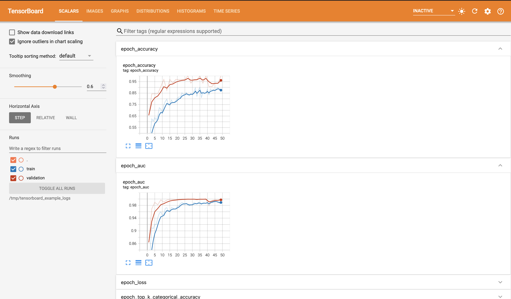
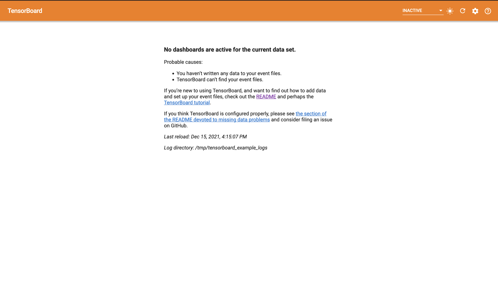
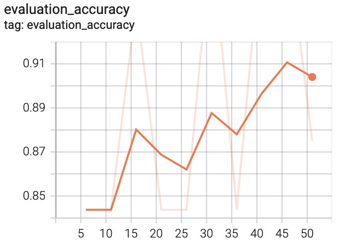
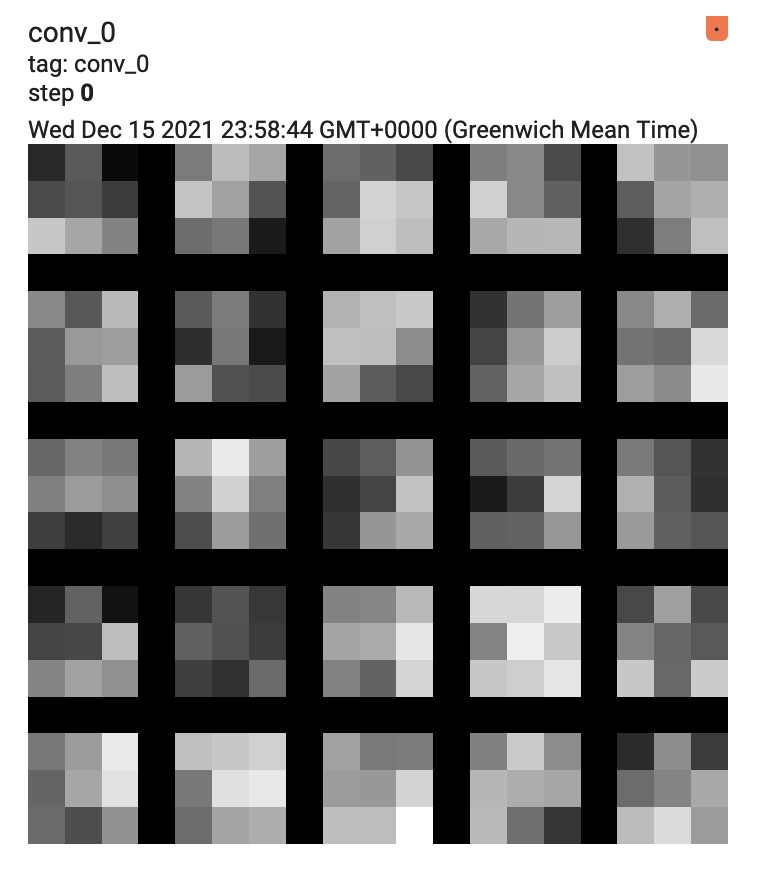
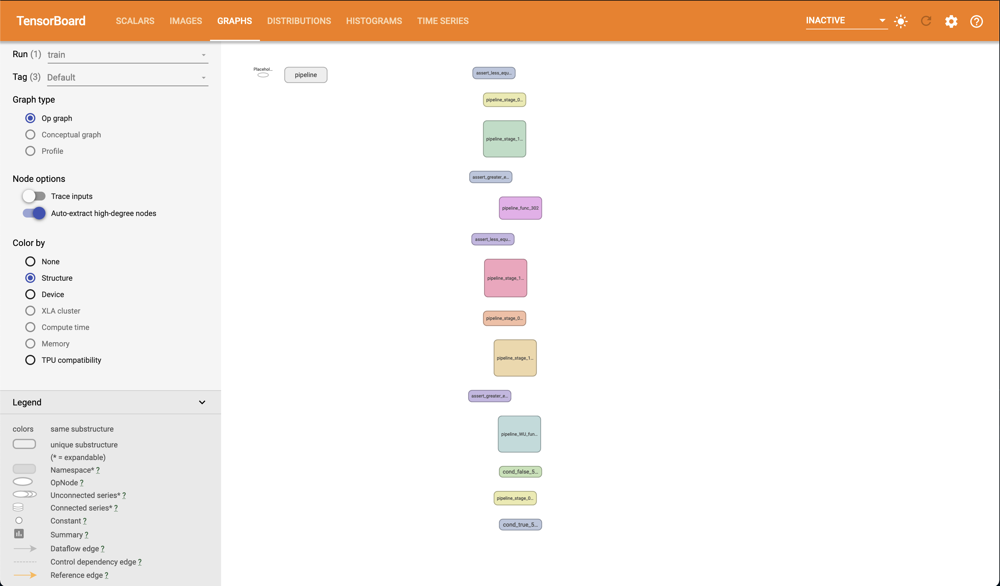
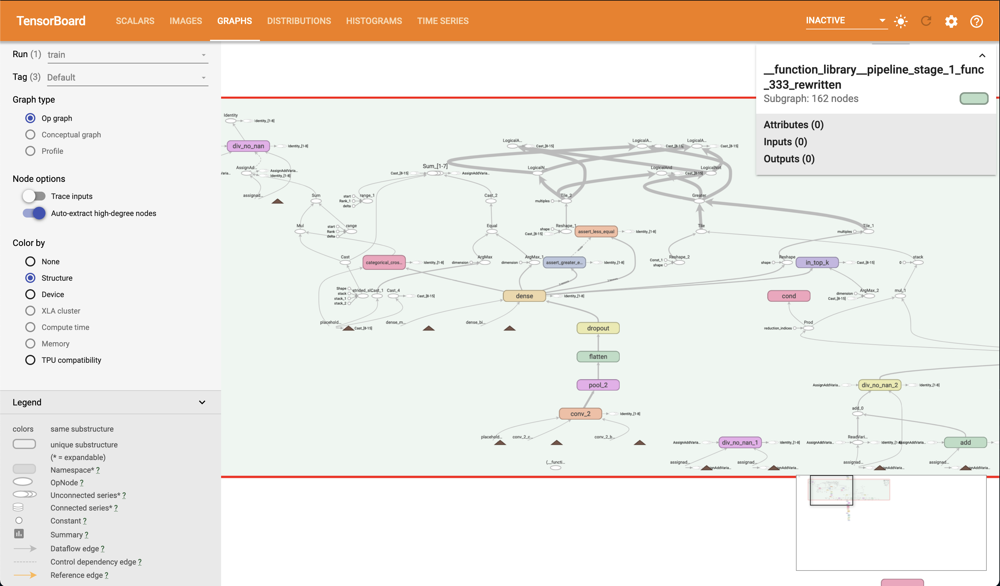
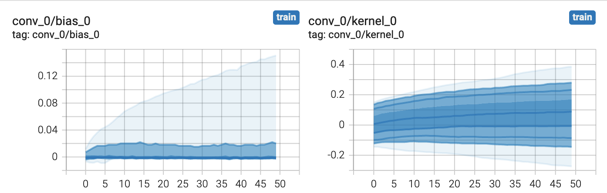
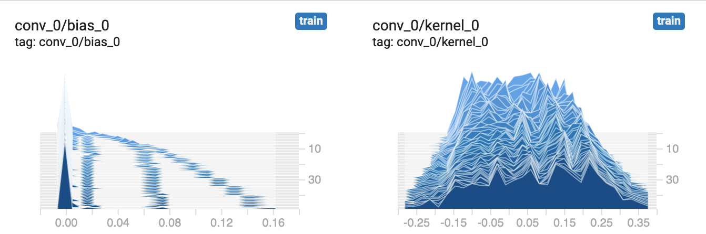
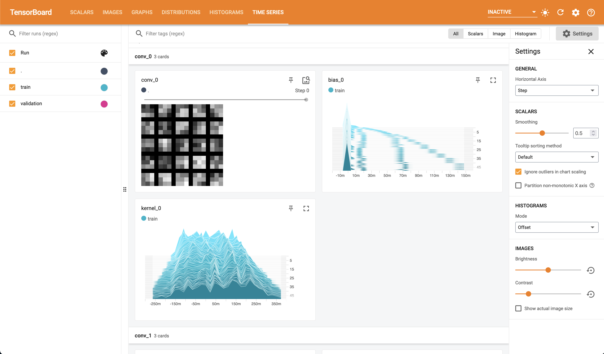

<!-- Copyright (c) 2022 Graphcore Ltd. All rights reserved. -->
<!-- THIS FILE IS AUTOGENERATED. Rerun SST after editing source file: demo.py -->

# Using TensorBoard in TensorFlow 2 on the IPU

TensorBoard is a visualization tool provided with TensorFlow that provides a
platform to view many aspects of model training and inference at near real-time
intervals (if so configured). Data that may be visualized includes, but is not
limited to:

  - Training losses and metrics
  - Images
  - Model graphs
  - Histograms/distributions of variables (such as model parameters,
  hyperparameters, etc.)

In fact, the data that may be displayed in TensorBoard is entirely customizable
by the use of custom callbacks (as we will see later in this tutorial). IPU
TensorFlow works with TensorBoard out of the box!



In this tutorial, we shall develop a very simple convolutional network to train
on the MNIST dataset for character recognition. This problem is purposely
selected for demonstration as it is rather straightforward and allows the focus
of this tutorial to be on the use of TensorBoard.

## Preliminary Setup
To run the code in this tutorial there are two basic requirements.

- A Poplar SDK environment enabled, with the Graphcore port of TensorFlow 2
  installed (see the [Getting Started
  guide](https://docs.graphcore.ai/en/latest/getting-started.html) for your IPU
  system)
- Python packages installed with `python -m pip install -r requirements.txt`

If you wish to follow along with the Jupyter notebook provided for this
tutorial, then some additional setup steps are required.

First, ensuring that you have a Poplar SDK environment enabled, install the
Jupyter Notebook server in that environment, as follows.

```
python -m pip install jupyter
```

Once the Jupyter Notebook server is installed in your environment, start
Jupyter as follows.

```
jupyter-notebook --no-browser --port 8888
```

On your local machine, you can now forward the port 8888 (chosen here) to
the remote machine running your Poplar environment. Note that the choice
of port is entirely up to you. Here, 8888 is simply an example.

```
ssh -NL 8888:localhost:8888 <your-username>@<your-machine>.<your-domain>
```

You can now navigate in your web browser to the Jupyter instance running on
your remote machine via the address `localhost:8888`.

For more details about this process, or if you need troubleshooting, see our
[guide on using IPUs from Jupyter
notebooks](../../standard_tools/using_jupyter/README.md).

## Introduction to TensorBoard and Data Logging
### How does TensorBoard work?
TensorBoard itself runs independently of any TensorFlow processes, so starting
and stopping TensorBoard does not affect any TensorFlow processes that may be
running. The reason that TensorBoard and TensorFlow are independent in this way
is due to the method of data transfer between them. Rather than a client/server
model as one might first expect, there is no direct communication between the
two packages.

Instead, TensorBoard monitors a **log directory** to which your TensorFlow
program writes data in a format that is parsable to TensorBoard. So, getting
TensorBoard running and ready to start displaying data from your TensorFlow
program is as simple as just starting the Daemon.

## How do I launch TensorBoard?
If we go ahead and enter `tensorboard` into a terminal (on a machine that has a
TensorFlow installation and `tensorboard` on your path), you will notice the
following error.

```
Error: A logdir or db must be specified. For example `tensorboard --logdir mylogdir` or `tensorboard --db sqlite:~/.tensorboard.db`. Run `tensorboard --helpful` for details and examples.
```

As we can see, TensorBoard will not start without a log directory (or,
alternatively a SQLite DB) being provided.

For the purpose of this tutorial, we shall be using the
`/tmp/tensorboard_example_logs` directory as our log directory. Let's go ahead
and launch TensorBoard.

```
tensorboard --logdir /tmp/tensorboard_example_logs
```

If all is well, then you should see output akin to the following on your terminal.

```
TensorBoard 2.7.0 at http://<your-machine>.<your-domain>:6006/ (Press CTRL+C to quit)
```

If you navigate to the address given in your terminal (in a browser of your
choice), you should see the blank (no logged data) TensorBoard interface.



### TensorBoard on a Remote Machine
If you use a remote machine for your TensorFlow development, then there are a
couple of options for accessing TensorBoard remotely.

#### SSH Tunnelling
The first (and more secure) approach is to setup an SSH tunnel to your remote
machine, binding the remote TensorBoard port to a local port on your machine.
For example, to setup a tunnel that binds the TensorBoard port `6006` to port
`6006` on your local machine, you would execute the following (on your local
machine).

```
ssh -L 6006:localhost:6006 <your-username>@<your-server>
```

In this example, navigating with your web browser to `localhost:6006` should
yield the screen shown above.

#### Exposing TensorBoard to the Network
Alternatively, if you are on a secure network, you may start TensorBoard with
the `--bind_all` argument, which will allow access on the port used (`6006` in
this example) from within the machines subnet.

### Automatically Handling Log Directory Cleansing
When developing a TensorFlow program it may sometimes be desirable to clear the
current data displayed by TensorBoard and start fresh. Below is a simple
function to handle this clean-up for us. The function
`create_tensorboard_log_dir` first checks that we have access to the `/tmp`
directory (recall, for this tutorial we are using the log directory
`/tmp/tensorboard_example_logs`), then it deletes the old log directory (if it
exists) and (re)creates the log directory.

```python
import os
import shutil


def create_tensorboard_log_dir():
    """Handles deletion and creation of the TensorBoard log directory."""
    # Ensure we have the top level /tmp directory first.
    path = "/tmp"
    if not os.path.isdir(path):
        raise RuntimeError(
            f"Unable to locate {path} directory. Are you running on a Unix-like OS?"
        )

    # Delete the log directory, if it exists.
    path += "/tensorboard_example_logs"
    if os.path.isdir(path):
        try:
            shutil.rmtree(path)
        except OSError as e:
            print(f"Unable to remove {e.filename} due to: {e.strerror}")

    # Create the log directory.
    try:
        os.mkdir(path)
    except OSError as e:
        print(f"Unable to create {e.filename} due to: {e.strerror}")

    return path
```

## Logging Data with `tf.keras.callbacks.Callback`
When using a `tf.keras.Model` or `tf.keras.Sequential` model (as we have above)
we have access to three main APIs: `fit`, `evaluate` and `predict`. These APIs
take an optional `callbacks` parameter, which is a list of
`tf.keras.callbacks.Callback` instances to be executed on the occurrence of
certain events, such as the end of a training epoch.

Continuing on with the development of our example, we shall define a simple
`tf.keras.callbacks.Callback` derived class to provide simple staggered
execution functionality.

```python
import tensorflow as tf


class StaggeredCallback(tf.keras.callbacks.Callback):
    """A simple `tf.keras.callbacks.Callback` derived class that
    provides a check to allow staggered execution every `period` batches.

    Args:
      period (int): The number of iterations that should elapse before
      `StaggeredCallback.should_run` returns `True`.
    """

    def __init__(self, period):
        self._period = period
        self._n = 1

    def should_run(self):
        self._n += 1
        return (self._n - 1) % self._period == 0
```

Note that the above class (`StaggeredCallback`) will not actually perform any
actions on any events as we have not overridden any event handlers. The
`tf.keras.callbacks.Callback` class provides the following event handlers to be
overridden.

  - `on_train_begin(self, logs=None)`
  - `on_train_end(self, logs=None)`
  - `on_test_begin(self, logs=None)`
  - `on_test_end(self, logs=None)`
  - `on_train_batch_begin(self, batch, logs=None)`
  - `on_train_batch_end(self, batch, logs=None)`
  - `on_epoch_begin(self, epoch, logs=None)`
  - `on_epoch_end(self, epoch, logs=None)`

### Running Evaluation at the end of an Epoch
We shall now write a simple callback to perform a full evaluation every $n$
training epochs. As we wish to perform an action at the end of an epoch, we
shall override the `on_epoch_end` handler.

```python
class EvaluateCallback(StaggeredCallback):
    """Runs an evaluation pass on the provided test dataset.

    Args:
      path (str): The directory to which evaluation logs will be written.
      model (tf.keras.Model): The Model on which to run evaluation.
      pred_dataset (tf.Dataset): A Dataset to use for prediction.
      period (int): The number of epochs to elapse before evaluating.
      steps (int): The number of steps to perform evaluation in.
    """

    def __init__(self, path, model, pred_dataset, period, steps=128):
        super().__init__(period)
        self._model = model
        self._ds = pred_dataset
        self._writer = tf.summary.create_file_writer(path)
        self._steps = steps

    def on_epoch_end(self, epoch, logs=None):
        if not self.should_run():
            return

        res = self._model.evaluate(self._ds, steps=self._steps, return_dict=True)

        with self._writer.as_default():
            for k, v in res.items():
                tf.summary.scalar(f"evaluation_{k}", v, step=self._n)
```

If we first turn our attention to `__init__`, you will see that
`PredictionCallback` takes the following initialization arguments.

  - `path`
    - The TensorBoard log path.
  - `model`
    - The `tf.keras.Model` instance on which we will run prediction.
  - `pred_dataset`
    - The `tf.Dataset` instance on which we will run prediction.
  - `period`
    - The period in epochs to run a prediction pass.
  - `steps`
    - The number of steps in which to evaluate. Simply passed to `Model.evaluate`.

The first thing to note is that `EvaluateCallback` derives from
`StaggeredCallback` (defined above), so we initialize the superclass with the
period at which the callback should perform an action. Thus, upon entry to
`on_epoch_end`, a check is made to determine if further execution should be
skipped (until reaching a number of epochs that is multiple of the `period`
parameter

The second important thing to note is the initialization of `self._writer`.
Here we are initializing a TensorFlow summary (`tf.summary`) file writer on the
TensorBoard log path. At this point, it is pertinent to introduce TensorFlow
summary ops (`tf.summary`) as the functionality provided is used extensively
when writing custom code to output data to TensorBoard. Within `tf.summary` are
many ops that are used to log out various types of data when invoked within the
context of a `tf.summary.SummaryWriter` (`self._writer` in our example).

With this in mind, we can turn our attention to the usage of `res`, the return
value of our call to `self._model.evaluate` (note the keyword argument
`return_dict=True`). Within the context of `self._writer.as_default()` we
iterate over each of the specified losses and metrics and write them out as
scalar data (note the call to `tf.summary.scalar`). This logged data is then
available within the TensorBoard log directory for the running TensorBoard
instance to display.

### Supported Data Types in `tf.summary`
Within `tf.summary` there are many ops supporting a variety of data types that
can be logged, including the following.

  - `generic` (tensor summary)
  - `scalar`
  - `histogram`
  - `image`
  - `audio`
  - `graph`

### Logging Custom Image Data at the end of an Epoch
Now that we have seen how to build a basic `tf.keras.callbacks.Callback`
derived class to run an evaluation pass at the end of every $n^{th}$ epoch, we
may move on to build an example of logging out image data. As we will be
training and analyzing a Convolutional Neural Network (as defined in
`create_model`), we will in this section be building a callback to render out
the filters of our convolution layers. The end result for a given convolution
layer (`conv_1` in the example image that follows) should look something like this.

<div>

</div>

As with our implementation of `EvaluateCallback`, `FilterRenderCallback` shall
also derive from our `StaggeredCallback` class to allow for the limiting of
rendering to be every $n^{th}$ epoch. The implementation of
`FilterRenderCallback` is as follows.

```python
import itertools
import math


class FilterRenderCallback(StaggeredCallback):
    """A `StaggeredCallback` derived class that renders the kernels of a
    given list of convolution layers.

    Args:
      path (string): The directory to which rendered filters will be written.
      model (tf.keras.Model): The Model from which to extract filters.
      layer_names (list(str)): A list of layer names from which filters should
      be extracted and rendered.
      period (int): The number of epochs to elapse before rendering filters.
    """

    def __init__(self, path, model, layer_names, period):
        super().__init__(period)
        self._model = model
        self._layer_names = layer_names
        self._writer = tf.summary.create_file_writer(path)

    def tile_filters(self, filters, name, step):
        # First normalize the filters.
        fmin = tf.reduce_min(filters)
        fmax = tf.reduce_max(filters)
        filters_norm = (filters - fmin) / (fmax - fmin)

        # Instead of providing each filter as a separate image to summary_ops.image
        # we here collapse the leading dimensions to yield a (D, D, N) tensor,
        # where D is the filter size and N the total number of filters.
        shape = (
            filters_norm.shape[0],
            filters_norm.shape[1],
            filters_norm.shape[2] * filters_norm.shape[3],
        )
        filters_collapsed = tf.reshape(filters_norm, shape)

        # Split into a list of N DxD filters.
        filters_split = tf.experimental.numpy.dsplit(
            filters_collapsed, filters_collapsed.shape[-1]
        )

        # Find the width and height of the resulting image, not in pixels but
        # in the number of filters to display in each dimension.
        WH = int(math.sqrt(len(filters_split)))

        # Generate each row of the output image.
        filter_num = 0
        rows = []
        for _ in range(WH):
            # Collect the filters for this row.
            row_images = [
                tf.squeeze(t) for t in filters_split[filter_num : filter_num + WH]
            ]

            # Generate vertical padding to be used between filters.
            col_padding = [tf.zeros((filters.shape[0], 1))] * WH

            # Interleave filters and padding.
            row = list(itertools.chain(*zip(row_images, col_padding)))

            # Stack, excluding the last padding tensor as there is no filter
            # to the right of it.
            rows.append(tf.experimental.numpy.hstack(row[:-1]))

            filter_num += WH

        # Find the width of the image.
        W = rows[-1].shape[1]

        # Generate horizontal padding.
        row_padding = [tf.zeros((1, W))] * WH
        padded_rows = list(itertools.chain(*zip(rows, row_padding)))

        # Stack and expand dims.
        img = tf.experimental.numpy.vstack(padded_rows[:-1])
        img = tf.expand_dims(tf.expand_dims(img, -1), 0)

        # Write out the resultant image.
        with self._writer.as_default():
            tf.summary.image(name, img, step=step)

    def on_epoch_end(self, epoch, logs=None):
        if not self.should_run():
            return

        for layer_name in self._layer_names:
            filters = self._model.get_layer(layer_name).get_weights()[0]
            self.tile_filters(filters, layer_name, epoch)
```

It can be seen that the `__init__` implementation of `FilterRenderCallback` is
rather similar to that of `EvaluateCallback`; we take a path to write data to,
a model to extract filter weights from, a list of layer names from which these
weights will be extracted and finally a period at which to produce a new
rendering.

Notice that the implementation of the event handling method `on_epoch_end` is
rather lightweight. It first checks if the computation should be skipped for
the current epoch (as per the specified period), akin to `EvaluateCallback`.
Then, for each specified layer (the list of names passed to `__init__`) we
extract the kernel weights for that convolutional layer and pass them with the
layer name to the `tile_filters` method which, as the name suggests tiles the
convolution filters to be rendered as the image you see above.

Take a moment to familiarise yourself with the logic in `tile_filters` if you
are interested, however the majority of the method is not essential to
demonstrate the use of TensorBoard and `tf.summary.image`. Most of it is just
to generate a pretty picture, so that we have something to log for TensorBoard
to display.

The crucial part to note is the following two lines.
```
with self._writer.as_default():
  tf.summary.image(name, img, step=step)
```

Notice that the process for logging image data is near identical to the
`tf.summary.scalar` case in `EvaluateCallback.on_epoch_end`.

### Using `tf.keras.callbacks.TensorBoard`
Now that we have seen how `tf.keras.callbacks.Callback` works and how we can
derive from it to define our own custom callbacks, we shall have a brief look
at `tf.keras.callbacks.TensorBoard`, which is a built in callback to allow
monitoring of basic information such as losses, metrics, parameter
distributions and our model graph with minimal setup required.

An impressive amount of information is available to us from simply creating an
instance of `tf.keras.callbacks.TensorBoard` and passing it in the callback
list to a Keras model. We shall see in a later section, once we have started
training our model the information generated by this callback.

## Model Setup & Data Preparation
For the example we shall develop in this tutorial, we wish to obtain three
MNIST datasets; training, validation and test datasets are extracted from
`tf.keras.datasets.mnist`. Below we define a function `create_datasets` that
loads the Keras MNIST dataset and processes it for our purpose here. The first
step is to split the MNIST training set into both training and validation sets,
as only two sets are provided (train and test) whereas here we require
training, validation and test datasets.

Following this split, the data is normalized, shuffled and placed into a
`tf.data.Dataset`. The last preprocessing step is to cast the data to
`tf.float32` and convert the targets (class labels) to `tf.int32` one-hot
encodings.

```python
import numpy as np


def create_datasets(train_validate_split=0.8, num_to_prefetch=16):
    """Create datasets for training, validation and evaluation.

    Args:
      train_validate_split (float): The proportion of data to use for training
      versus evaluation.
      num_to_prefetch (int): The number of dataset elements that
      should be prefetched.

    Returns:
      tuple(tf.Dataset): Training, validation and testing datasets.
    """

    def prepare_ds(x, y):
        # Normalize.
        x = np.expand_dims(x, -1) / 255.0

        # Shuffle and batch.
        ds = (
            tf.data.Dataset.from_tensor_slices((x, y))
            .shuffle(10000)
            .batch(32, drop_remainder=True)
        )

        # Cast and convert targets to one-hot representation.
        ds = ds.map(
            lambda d, l: (tf.cast(d, tf.float32), tf.cast(tf.one_hot(l, 10), tf.int32))
        )

        return ds

    # Load MNIST dataset. The training set is split into training and
    # validation sets.
    mnist = tf.keras.datasets.mnist
    (x_train, y_train), (x_test, y_test) = mnist.load_data()
    N = int(train_validate_split * x_train.shape[0])

    # Get the datasets.
    training_ds = prepare_ds(x_train[:N], y_train[:N])
    validation_ds = prepare_ds(x_train[N:], y_train[N:])
    test_ds = prepare_ds(x_test, y_test)

    # Repeat (for training), prefetch and return.
    return (
        training_ds.repeat().prefetch(num_to_prefetch),
        validation_ds.prefetch(num_to_prefetch),
        test_ds.prefetch(num_to_prefetch),
    )
```

The datasets generated by `create_datasets` consist of $(28 \times 28)$
greyscale images of handwritten numerical digits and their associated value
as a target, $[0, 1 \dots 9]$


So, we see that we have a very straightforward classification problem.

## Model Definition
As MNIST classification is a reasonably trivial task, only a modest complexity
model is required. The function that follows (`create_model`) will generate a
`tf.keras.Sequential` instance with the following layers. Note that the IPU
pipeline stage assignment does not occur until a later stage, it is merely
documented here for reference.

| Layer Type                 | Pipeline Stage |
|----------------------------|:--------------:|
| 28x28x1 Input              | N/A            |
| 32 Filter, 3x3 Convolution | 0              |
| 2x2 Max Pooling            | 0              |
| 64 Filter, 3x3 Convolution | 0              |
| 2x2 Max Pooling            | 0              |
| 32 Filter, 3x3 Convolution | 1              |
| 2x2 Max Pooling            | 1              |
| Flatten                    | 1              |
| Dropout (0.5 probability)  | 1              |
| 10 Unit Dense with Softmax | 1              |

```python
def create_model():
    """Create a simple CNN to be split into two pipeline stages."""
    return tf.keras.Sequential(
        [
            # Input layers do not get assigned an IPU pipeline stage.
            tf.keras.layers.Input((28, 28, 1)),
            # Pipeline stage 0.
            tf.keras.layers.Conv2D(
                32, kernel_size=(3, 3), activation="relu", name="conv_0"
            ),
            tf.keras.layers.MaxPooling2D(pool_size=(2, 2), name="pool_0"),
            tf.keras.layers.Conv2D(
                64, kernel_size=(3, 3), activation="relu", name="conv_1"
            ),
            tf.keras.layers.MaxPooling2D(pool_size=(2, 2), name="pool_1"),
            # Pipeline stage 1.
            tf.keras.layers.Conv2D(
                32, kernel_size=(3, 3), activation="relu", name="conv_2"
            ),
            tf.keras.layers.MaxPooling2D(pool_size=(2, 2), name="pool_2"),
            tf.keras.layers.Flatten(),
            tf.keras.layers.Dropout(0.5),
            tf.keras.layers.Dense(10, activation="softmax"),
        ]
    )
```

## Model Training
We shall now proceed to build and train our model so that we have some data to
view in TensorBoard. As a recap, we have so far implemented the following
"ingredients" of our example TensorFlow program.

  - `create_datasets`
    - A function to load the MNIST dataset and provide us with three splits of
    data for training, validation and testing.
  - `create_model`
    - A function to provide us with our Convolutional Neural Network with a 10
    class classifier (an instance of `tf.keras.Sequential`.
  - `create_tensorboard_log_dir`
    - A utility function to delete any existing data directory and create a
    clean directory to which TensorFlow will log data for TensorBoard to parse
    and display.
  - `StaggeredCallback`
    - A simple child class of `tf.keras.callbacks.Callback` with state and
    `should_run` method to allow child classes to perform staggered execution
    of their event handlers.
  - `EvaluateCallback`
    - A child class of `StaggeredCallback` to invoke
    `tf.keras.Sequential.evaluate` on our model instance every n completed
    epochs, writing out losses and metrics to the data log directory.
  - `FilterRenderCallback`
    - A child class of `StaggeredCallback` to render out the convolutional
    filters of a specified list of layer names every n completed epochs,
    logging the images to the data log directory.

The following code completes our example and performs the following tasks.
  - Create a TensorBoard log directory.
  - Configure IPU devices.
  - Create a model.
  - Create the datasets.
  - Define a list of metrics.
  - Compile the model.
  - Setup pipelining options.
  - Setup callbacks (note the use of our `FilterRenderCallback` and
  `EvaluateCallback` classes).
  - Start the training session.

```python
from tensorflow.python import ipu

# Setup log path.
log_path = create_tensorboard_log_dir()

# Configure the IPU device.
config = ipu.config.IPUConfig()
config.auto_select_ipus = 2
config.configure_ipu_system()

# Create a strategy for execution on the IPU.
strategy = ipu.ipu_strategy.IPUStrategy()
with strategy.scope():
    # Create a Keras model inside the strategy.
    m = create_model()
    training_dataset, validation_dataset, test_dataset = create_datasets()

    # Metrics.
    metrics = [
        "accuracy",
        tf.keras.metrics.AUC(),
        tf.keras.metrics.TopKCategoricalAccuracy(3),
    ]

    # Compile the model for training.
    m.compile(
        loss=tf.keras.losses.CategoricalCrossentropy(),
        optimizer=tf.keras.optimizers.RMSprop(),
        metrics=metrics,
        steps_per_execution=128,
    )

    # Setup pipelining.
    m.set_pipelining_options(gradient_accumulation_steps_per_replica=16)
    m.set_pipeline_stage_assignment([0] * 4 + [1] * 5)

    # Trigger callbacks every step (default behaviour is every steps_per_epoch steps).
    m.set_asynchronous_callbacks(True)

    # Create callbacks for the training session.
    callbacks = [
        FilterRenderCallback(log_path, m, [f"conv_{n}" for n in [0, 1, 2]], 2),
        EvaluateCallback(log_path, m, test_dataset, 5),
        tf.keras.callbacks.TensorBoard(log_path, histogram_freq=1),
    ]

    # Train.
    m.fit(
        training_dataset,
        epochs=50,
        steps_per_epoch=128,
        validation_data=validation_dataset,
        validation_freq=2,
        validation_steps=128,
        callbacks=callbacks,
        verbose=False,
    )
```

```output
INFO:tensorflow:Training is and accumulating 16 batches per optimizer step, your effective batch size is 512.
WARNING:tensorflow:Callback method `on_train_batch_end` is slow compared to the batch time (batch time: 0.0002s vs `on_train_batch_end` time: 0.0132s). Check your callbacks.
WARNING:tensorflow:offload_weight_update_variables will have no effect since this pipeline is in inference.
128/128 [==============================] - 3s 1ms/step - loss: 0.8498 - accuracy: 0.8125 - auc: 0.9883 - top_k_categorical_accuracy: 1.0000
128/128 [==============================] - 0s 841us/step - loss: 0.5837 - accuracy: 0.8438 - auc: 0.9848 - top_k_categorical_accuracy: 0.9375
128/128 [==============================] - 3s 642us/step - loss: 0.5994 - accuracy: 0.8438 - auc: 0.9803 - top_k_categorical_accuracy: 0.9375
128/128 [==============================] - 0s 631us/step - loss: 0.3755 - accuracy: 0.8438 - auc: 0.9939 - top_k_categorical_accuracy: 1.0000
128/128 [==============================] - 3s 620us/step - loss: 0.2998 - accuracy: 0.9062 - auc: 0.9952 - top_k_categorical_accuracy: 0.9688
128/128 [==============================] - 0s 963us/step - loss: 0.3344 - accuracy: 0.8750 - auc: 0.9944 - top_k_categorical_accuracy: 0.9688
128/128 [==============================] - 3s 602us/step - loss: 0.1431 - accuracy: 0.9688 - auc: 0.9992 - top_k_categorical_accuracy: 0.9688
128/128 [==============================] - 0s 556us/step - loss: 0.2213 - accuracy: 0.9375 - auc: 0.9982 - top_k_categorical_accuracy: 1.0000
128/128 [==============================] - 2s 742us/step - loss: 0.0543 - accuracy: 1.0000 - auc: 1.0000 - top_k_categorical_accuracy: 1.0000
128/128 [==============================] - 0s 627us/step - loss: 0.2011 - accuracy: 0.9375 - auc: 0.9975 - top_k_categorical_accuracy: 0.9688
```

All of the above setup and training code is standard IPU TensorFlow operation
and should be familiar to any user of
[IPU TensorFlow](https://docs.graphcore.ai/projects/tensorflow-user-guide/en/3.1.0/tensorflow/intro.html).
However, special attention should be paid to the
`set_asynchronous_callbacks(True)` call on our model `m`. This call allows the
model to asynchronously trigger callbacks at the end of an epoch, versus
queueing up callbacks to be executed at the end of the models execution.

## Exploring TensorBoard
At this point, we should have a wealth of information available to explore in
TensorBoard. So, go back to the previously empty TensorBoard dashboard we saw
at the beginning of the tutorial and refresh the page. You will notice that the
top navigation bar has changed and appears as follows.


We shall now look at the information available to us on each of the categories
visible on the left of the navigation bar.

### Scalars
The first and most immediately pertinent to training page we shall look at is
that for scalar data. Scalar data when written with a `step` provided is
plotted as a 2D graph (with `step` on the x axis). You should see a plot
similar to the following at the top of the page.


This is the training accuracy plot. Recall that we specified accuracy, AUC and
top-k ($k=3$) metrics for our model. There are two traces visible on the plot.
One is for training and the other for validation, recalling again that we
specified validation data in our call to `fit`. If you hover the cursor over
this plot, you will notice that the plot is interactive. Take a moment to play
with this.

You should also see the following training plots on this page.

  - epoch_auc
  - epoch_loss
  - epoch_top_k_categorical_accuracy

The training plots that you see on this page are the result of providing an
instance of `tf.keras.callbacks.TensorBoard` in our list of callbacks to `fit`.
The data logged for TensorBoard to generate these plots has been done so
automatically by this rather handy callback.

If we turn our attention to the remaining plots on this page, you should see
something like the following.



In addition to evaluation_accuracy, you should see the following additional
plots.

  - evaluation_auc
  - evaluation_loss
  - evaluation_top_k_categorical_accuracy

Unlike the training plots that were generated on data logged by our
`tf.keras.callbacks.TensorBoard` instance, these evaluation plots have been
generated by our custom `EvaluationCallback` class that we implemented earlier.
The first thing to notice about these plots is that they are far less smooth
than their training counterparts. This is not a bug! Recall that our custom
callbacks use staggered execution, so we are running an evaluation pass every
$n$ epochs, where in our case $n=5$ for our `EvaluationCallback` instance.

*Perhaps as an exercise, you could play with different frequencies to find an optimum information quality/performance trade-off?*

*If performance isn't a concern, perhaps the callback could be altered to compute a running mean over $n$ epochs? If not, take a moment to play with the smoothing coefficient in TensorBoard (slider to the left of the screen).*

### Images
We shall now turn our attention to the Images page in TensorBoard. When using
only the `tf.keras.callbacks.TensorBoard` callback, as will suffice in many
scenarios, there will be no images written out, so this page will not be
visible. However, recall that we have written our own callback
(`FilterRenderCallback`) to output images of our convolution layers filters.
There are many situations where one might wish to output image data to
TensorBoard during training, particularly in Computer Vision applications.
Semantic Segmentation for example would be one such application; one could
write out the original image with it's segmentation masks applied.

If we look at the Images page now, you should see an image similar to the
following.



Recall that every $n$ epochs (where $n=2$ in this case), the filters of our
three convolutional layers (`conv_0`, `conv_1` and `conv_2`) are tiled and
rendered out by our `FilterRenderCallback` instance. As such, you should see
the following additional images on this page.

  - conv_1
  - conv_2

*Take a minute to play with the brightness and contrast settings on the left of the screen. Does it help you to identify any kind of structure in the weights?*

### Graphs
The `tf.keras.callbacks.TensorBoard` callback provides a very useful data
output; the model graph. On this page, you will see some computation modules.
The Graphs page should look something like the following.



The Graphs page in TensorBoard provides an interactive graph explorer, in which
modules and nodes can be expanded and collapsed, so it is very convenient to
"drill down" into our model. For example, if we expand one of the pipeline
stage modules (stage 1 in this case), you should see something like the
following. Note that you can pan across the graph. Also note the view frustum
indicator in the lower right hand corner of the screen.



*As an exercise, can you identify the control dependencies that `conv_2` has in the graph, using the graph exploration interface?*

*Perhaps it would be useful to take a few minutes to familiarise yourself with the Graphs page and it's controls.*

### Distributions and Histograms
#### Distributions
The Distributions page in TensorBoard is another useful source of information
for inspecting your model. As with the model graph, the data displayed on the
Distributions page is generated by the `tf.keras.callbacks.TensorBoard`
callback we provided to our model. You should see two plots that look something
like the following.



The plots provided on the Distributions page provide statistical insight into
your models parameters. In the above example, we see how the distribution of
the weights and biases for our `conv_0` layer changes over time. Each line in
the plot represents a percentile. The
[TensorBoard Documentation](https://github.com/tensorflow/tensorboard#distribution-dashboard)
defines the percentiles as follows.

| As Percentage | As Standard Deviation          |
|---------------|--------------------------------|
| Maximum       | Maximum                        |
| $$ 93 \% $$   | $$ \mu + \frac{3 \sigma}{2} $$ |
| $$ 84 \% $$   | $$ \mu + \sigma $$             |
| $$ 69 \% $$   | $$ \mu + \frac{\sigma}{2} $$   |
| $$ 50 \% $$   | $$ \mu $$                      |
| $$ 31 \% $$   | $$ \mu - \frac{\sigma}{2} $$   |
| $$ 16 \% $$   | $$ \mu - \sigma $$             |
| $$ 7 \% $$    | $$ \mu - \frac{3 \sigma}{2} $$ |
| Minimum       | Minimum                        |

*Take a moment to see how the plots displayed correspond to the above table.*

This may be easier to do if you enlarge the plots (there is a button below each
plot). It may be worthwhile doing this for each remaining parameter in our
model, there should be plots for each remaining layer in our model.

  - conv_1
  - conv_2
  - dense

#### Histograms
The Histograms page provides an alternative view of the data presented in the
Distributions page. It is the same data, just presented differently. For
example, you should see two plots akin to the following, for our `conv_0`
layer.



As with the plots on the Distributions page, the plots on the Histograms page
allow us to inspect the statistical properties of our models parameters. You
will see that there are multiple histograms stacked for each parameter,
indexed by time-step. Similarly to the Distributions page, we can also here see
how our model parameters have evolved over time. Hover the cursor over one of
the plots to see the outline for a given time-step.

*Perhaps it would be useful to compare the data presented in these plots with those in the Distributions page? Do they correspond as one might expect?*

## Time Series
The final page in TensorBoard that we will cover in this tutorial is the Time
Series page. On this page you will see no new information or plots, however you
will find all of the plots we have seen already in one place with controls to
filter and move through time-steps. For example.



## Using TensorBoard Without Keras
Although in this tutorial we have focused on the use of TensorBoard with Keras,
it is entirely possible to log data out to TensorBoard without using Keras and
`tf.keras.callbacks.Callback` instances. It just may involve some extra
implementation as we won't have useful tools like
`tf.keras.callbacks.TensorBoard`. However, as we have seen, the actual logging
of data is achieved by the use of ops within `tf.summary`.

*As an exercise, try to de-Keras-ify this model whilst keeping the same level of TensorBoard insight.*

## To Conclude
In conclusion, we have looked at TensorBoard and how it may be used with IPU
TensorFlow. We have covered primarily the case in which we are using Keras,
including how to write our own custom data logging callbacks via TensorFlow's
summary ops (`tf.summary`). We have also seen the wealth of information
available to us by simply logging data using a built in callback
(`tf.keras.callbacks.TensorBoard`). Finally, we took a brief tour of the
TensorBoard interface and how to interpret some of the data presented to us
from the MNIST classifier we built for our experimentation.

Generated:2022-09-28T12:49 Source:demo.py SDK:3.0.0+1145 SST:0.0.8
