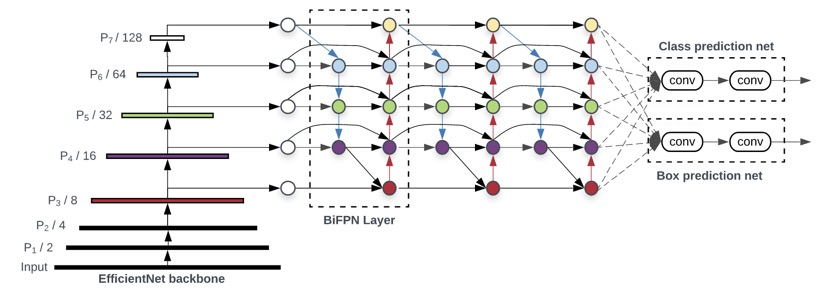

# Graphcore IPU EfficientDet Inference Benchmark

## Setup

This example shows an implementation of EfficientDet in TensorFlow 2 Keras for the IPU.
It was originally based on the [AutoML EfficientDet code](https://github.com/google/automl/tree/master/efficientdet),
 and some files are reproduced here verbatim, or with minor changes.

More details about how to use Keras on IPU can be found in the [Keras on the IPU tutorial](https://github.com/graphcore/tutorials/tree/master/tutorials/tensorflow2/keras).

The model is based on the paper ['EfficientDet: Scalable and Efficient Object Detection'](https://arxiv.org/abs/1911.09070) by Mingxing Tan, Ruoming Pang, Quoc V. Le (2020).



Image reproduced from the above paper.

## Folder structure

- `ipu_inference.py`: Throughput-focused inference benchmark script, which can also output predictions to disk.
- `ipu_embedded_runtime.py`: Low-latency benchmark script using the embedded application runtime.
- `ipu_nms.py`: A wrapper for the NMS custom operator with results pre- and post- processing.
- `ipu_automl_io.py`: A collection of pre- and post-processing functions modified from the AutoML model.
- `ipu_utils/*`: A collection of utility functions and classes used in the above applications.
- `ipu_configs/*`: YAML configs which define the different model optimisation parameters for throughput and latency.
- `NMS`: Directory containing code for the Non-Maximum Supression (NMS) IPU custom op, which should be built before running the application. This depends on boost json serializer.
- `Makefile`: Use this to make the NMS op.
- `tests` Directory containing PyTest tests for the application.
- `hparams_config.py`: Model configuration parameters taken from the AutoML EfficientDet repository (some minor changes for IPU).
- `dataloader.py`: Data preparation functions from the AutoML EfficientDet repository. Required by `ipu_automl_io.py`
- `nms_np.py`: Numpy implementation of NMS, taken from  the AutoML EfficientDet repository.
- `utils.py`: Helper functions, taken from  the AutoML EfficientDet repository.
- `backbone`: The EfficientNet backbone from the AutoML EfficientDet repository (some minor changes for IPU).
- `tf2`: Files from the AutoML EfficientDet repository containing the model definition (some minor changes for IPU).
- `object_detection`: Helper functions from the AutoML EfficientDet repository, used for post-processing model outputs (unchanged).
- `visualize`: Helper functions from the AutoML EfficientDet repository, used for visualising bounding boxes (unchanged).
- `README.md`: This file.


## Setup

### 1. Install the Poplar SDK

Download and install the Poplar SDK following the [Getting Started guide for your IPU system](https://docs.graphcore.ai/projects/ipu-pod-getting-started/en/latest/index.html).
Source the `enable.sh` script to install Poplar.

### 2. Setup a Virtual Environment

Create a virtual environment and install the appropriate Graphcore TensorFlow wheel from inside the SDK directory:

```shell
$ python3 -m venv effdet_venv
$ source effdet_venv/bin/activate
$ python3 -m pip install -r requirements.txt
$ python3 -m pip install <path to the tensorflow-2 wheel from the Poplar SDK>
```

To support Non-Maximal Suppression on IPU, we have implemented a custom TensorFlow operator. This needs to be build before running your application with the default configuration:

```shell
$ make
```

### Downloading weights and AutoML test image.

These instructions closely mirror those on the original [Google Brain AutoML](https://github.com/google/automl/tree/master/efficientdet) repository ([Inference for Images section](https://github.com/google/automl/tree/master/efficientdet#5-inference-for-images)).

By default the application expects to find weights in `tmp/<model-name>` to match the AutoML implementation. If you just want to benchmark, and don't need the predictions,
you can instead use random weights by adding the `--random-weights` argument.

Google hosts EfficientDet checkpoints, trained on MS COCO, which you can use to validate the application.

Our implementation, by default, expects the checkpoint to be in a directory called `tmp/efficientdet-d${MODEL_SIZE}` in application working directory. To change this, use the `--model-dir` to set the path to the checkpoint.

To download the model checkpoints, you can use the following snippet:

```shell
for i in $(seq 0 ${MAX_MODEL_SIZE}); do
    MODEL_NAME=efficientdet-d${i}
    wget https://storage.googleapis.com/cloud-tpu-checkpoints/efficientdet/coco/${MODEL_NAME}.tar.gz -O tmp/${MODEL_NAME}.tar.gz
    tar zxf tmp/${MODEL_NAME}.tar.gz -C tmp
done
```

The test image used below, and in the original [Google Brain AutoML](https://github.com/google/automl/tree/master/efficientdet) repository, can be downloaded using `wget`:

```shell
$ wget https://user-images.githubusercontent.com/11736571/77320690-099af300-6d37-11ea-9d86-24f14dc2d540.png -O tmp/img.png
```

## Running and benchmarking

To run a tested and optimised configuration and to reproduce the performance shown on our [performance results page](https://www.graphcore.ai/performance-results), please follow the setup instructions in this README to setup the environment, and then use the `examples_utils` module (installed automatically as part of the environment setup) to run one or more benchmarks. For example:

```python
python3 -m examples_utils benchmark --spec <path to benchmarks.yml file>
```

Or to run a specific benchmark in the `benchmarks.yml` file provided:

```python
python3 -m examples_utils benchmark --spec <path to benchmarks.yml file> --benchmark <name of benchmark>
```

For more information on using the examples-utils benchmarking module, please refer to [the README](https://github.com/graphcore/examples-utils/blob/master/examples_utils/benchmarks/README.md).

## EfficientDet for high throughput inference

In the simplest case, simply call the `ipu_inference.py` script, with the name of the model you'd like to run:

```shell
$ python ipu_inference.py --model-name efficientdet-d0
```

The script uses the model name to load a set of configuration options for the IPU - you can see the options
used in `ipu_configs/efficientdet.yml`. Currently configs for D0-D4 are supplied.

Any command-line arguments provided overwrite those given in the YAML config.

For descriptions of the various possible arguments, please see `ipu_utils.py` or run:

```shell
$ python ipu_inference.py --help
```

## EfficientDet for low latency inference

Using standard TensorFlow calls provides a simple programming interface run the model; however there are setup and tear-down costs that can increase latency in real-world applications.

In cases where minimising latency is vital, using the [embedded application runtime](https://docs.graphcore.ai/projects/tensorflow1-user-guide/en/latest/embedded_application_runtime.html#ipu-embedded-application-runtime)
allows us to save a	precompiled graph to a file, which can be run directly by the Poplar engine. To see this in action, run the `ipu_embedded_inference.py` benchmark:

```shell
$ python ipu_embedded_inference.py --model-name efficientdet-d0 --config efficientdet-low-latency
```

Please note that this script is provided as a benchmark only, and only supports random weights.

Note the inclusion of the `--config` argument, which switches the config to one optimised to low latency.

The `ipu_embedded_inference.py` script supports most of the arguments that can be provided to `ipu_inference.py`.

The embedded application runtime is currently supported in TF1, so to use the Keras model from AutoML we use TF2 in compatibility mode.

## Input datasets
There are several types of input dataset that have be configured for this application, which can be chosen using the `--dataset-type` flag.

In the following section `benchmark_repeats` refers to the number of times the input data are repeated to build up a large enough dataset for representative benchmarking.

* `generated` [default]: Uniform random data, generated to be `micro_batch_size * benchmark_repeats` long.
* `image-directory`: A directory of images. The number of images should be at least as large as the batch-size.
* `repeated-image`: A single imageargument, repeated for `micro_batch_size * benchmark_repeats` times. Useful to benchmark when you also want to confirm predictions are reasonable.
* `single-image`: Run inference on a single image. This will force the batch-size and `benchmark_repeats` to 1.

For all dataset types, except for `generated`, the input path is specified using the `--image-path` argument, e.g.:

```shell
$ python ipu_inference.py --model-name efficientdet-d0 --dataset-type single-image --image-path tmp/img.png
```

## Saving outputs to a file

To save the bounding boxes and class annotations to a file, use the `--output-predicitions` flag, along with the `--output-dir` argument, which will create a directory in which to store the annotated images.


## Post-processing

It is standard practice to run Non-Maximum Suppression (NMS) on the detections that come out of the model, as there are likely to be many overlapping bounding box candidates for the same class. The output tensors here reflect the 5 scales of the feature maps, the number of classes and the number of box candidate regions. These output tensors are relatively large; in the case of D0: 

```
(micro_batch_size, 64, 64, 810),  // Feature map 3 class scores per anchor
(micro_batch_size, 32, 32, 810),  // Feature map 4 class scores per anchor
(micro_batch_size, 16, 16, 810),  // Feature map 5 class scores per anchor
(micro_batch_size, 8, 8, 810),    // Feature map 6 class scores per anchor
(micro_batch_size, 4, 4, 810),    // Feature map 7 class scores per anchor
(micro_batch_size, 64, 64, 36),   // Feature map 3 bbox coords per anchor
(micro_batch_size, 32, 32, 36),   // Feature map 4 bbox coords per anchor
(micro_batch_size, 16, 16, 36),   // Feature map 5 bbox coords per anchor
(micro_batch_size, 8, 8, 36),     // Feature map 6 bbox coords per anchor
(micro_batch_size, 4, 4, 36)      // Feature map 7 bbox coords per anchor
```

In half-precision, this equates to a total size of 8.8 MB for batch-size 1. At 5.5GB/s bandwidth back to the host, via the gateway, this gives a total transmission latency of 3.1ms, against a compute time of about 1ms.

We can reduce this cost substantially by performing NMS on the IPU, then only passing back valid bounding box candidates. Since the IPU requires the nunber of boxes to be static, we cap this at a sensible number (e.g. 100), and then our output tensors become:

```
(micro_batch_size, 100, 4),  // Bounding box coordinates
(micro_batch_size, 100),     // Score per box
(micro_batch_size, 100),     // Class ID per box
(micro_batch_size, 100),     // NMS index per box
```

Now the total output size is reduced to 1.37KB, which equates to <0.5μs transmission time back to the host. The post-processing for D0 at batch-size 1 only adds 1ms to the compute time, giving a saving of 2ms - 50% of the previous round-trip time, which didn't include any time spent for host-side NMS. The following section will give advice on how to benchmark the difference in throughput for IPU NMS, host NMS and no NMS.

### IPU NMS Operator

Streaming these back to the host creates an IO bottleneck, so it is preferable to run NMS on the host and
This application includes a custom implementation of Non-Maximum Suppression, which is used to post-process the raw bounding box data from the model and remove overlapping detections.

There are two flavours of NMS included here, vanilla NMS, which assumes one class per bounding box, and multiclass-NMS, in which a bounding box may represent several classes. To follow the AutoML code, we use the vanilla implementation here, but this can be changed by enabling `multinms` in `ipu_nms.py`.

The NMS op must be built before running the model, by calling `make` in this directory. This will build both the vanilla and multiclass implementations. They can be built individually by calling `make` from within the `NMS/tf` and `NMS/tf_multi` directories respectively.

### NMS on the host

To remove the IPU NMS and post-processing from the graph, call the application with `--onchip-nms false`, e.g.:

```shell
$ python ipu_inference.py --model-name efficientdet-d0 --onchip-nms false
```

By default, no post-processing will be performed, and the benchmark will just include the time to stream the outputs back to the host. If you wish to also benchmark the time to perform NMS on the host, add the `--benchmark-host-postprocessing` flag:

```shell
$ python ipu_inference.py --model-name efficientdet-d0 --onchip-nms false --benchmark-host-postprocessing
```

## LICENSE

This example is licensed under the Apache License 2.0 - see the LICENSE file in this directory.

The following files are reproduced without modification from the [Brain AutoML](https://github.com/google/automl) EfficientDet example:

 * `backbone/*`, except where explicitly stated below.
 * `tf2/*`, except where explicitly stated below.
 * `visualize/*`
 * `dataloader*.py`

The following files are reproduced with modification from the [Brain AutoML](https://github.com/google/automl) EfficientDet example:

* `backbone/efficientnet_builder.py` (Line 262)
* `tf2/efficientdet_keras.py` (Lines 298 and 928)
* `tf2/postprocess.py` (Line 150)
* `hparams_config.py` (Lines 179, 244)
* `utils.py` (Lines 24, 45-46, 678)
